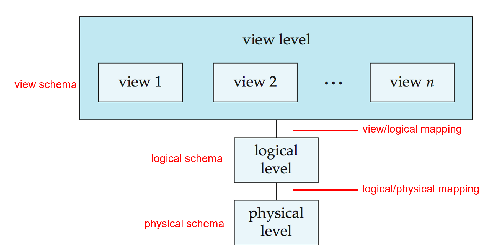
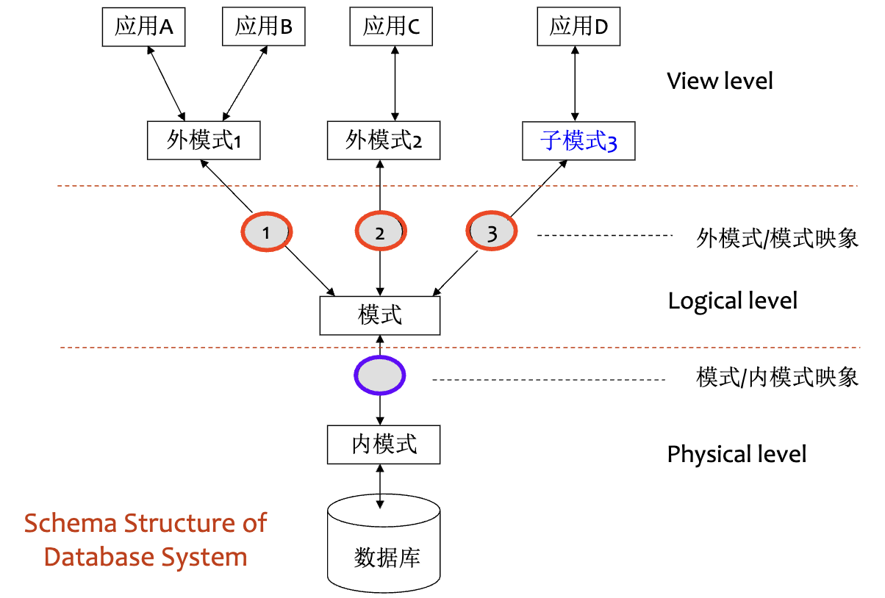
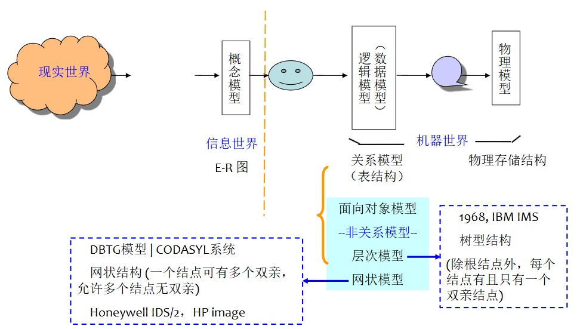
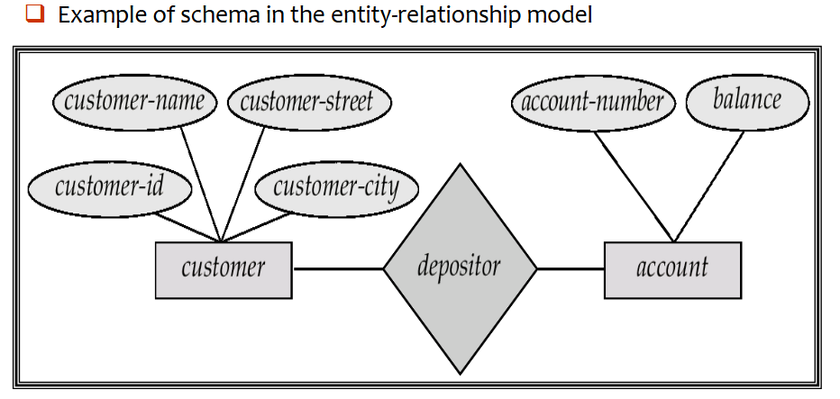
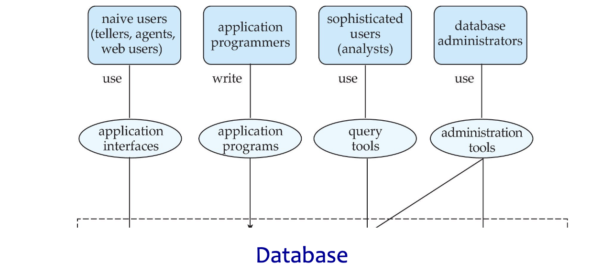
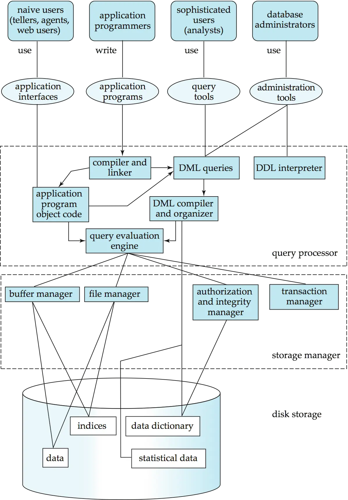
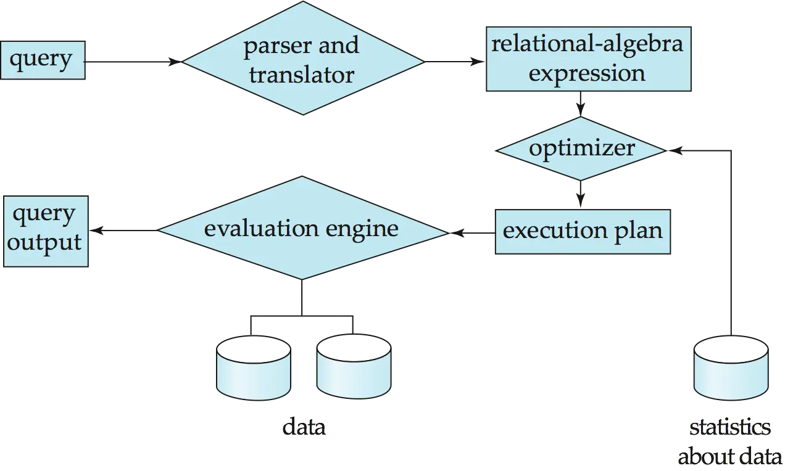

# Lec1.Introduction

## 1.1 Purpose of Database Systems

A ==Database Management System (DBMS)== is a software system designed to store, manage, and facilitate access to databases.

- Database + A set of programs to access, update and manage the data in the database

Characteristics of DBMS

- Efficiency and scalability in data access.
- Reduced application development time.
- Data independence (including physical data independence and logical data independence).
- Data integrity and security.
- Concurrent access and robustness (i.e., recovery).

**File-Processing System** is supported by a conventional Operating System (OS)

- New application programs must be written if necessary, and new data files are created as required.
- But over a long period of time, data files may be in different formats.
- Data files are independent each other.

!!! bug "Drawbacks of File-Processing System"

    此处同样是数据库解决的问题

    - Data redundancy(数据冗余) and inconsistency
    - Difficulty in accessing data
    - Data isolation - multiple files and multiple formats
    - Integrity problems（完整性问题）
    - No atomicity of updates （原子性问题，完全完成或完全没完成）
    - Difficult to concurrent access by multiple users（并发访问异常）
    - Security problems (i.e., Right person uses right data)

---

## 1.2 View of Data

### 1. Levels of Data Abstraction

Different usage needs different level of **abstraction**.

- ==Physical level==: describes how a record is stored
- ==Logical level==: describes data stored in database, and the relationships among the data on upper level.
- ==View level==: application programs hide details of data types. (Note that views can also hide information for security problems)

<div style="text-align: center"></div>

### 2. Schemas and Instances

!!! tip "How to understand schema and instance"

    Similar to types and variables in programming languages

    - Type → schema, variable → instance

**Schema(模式)** - the structure of the database on different level

- Analogous to type information of a variable in a program
- **Physical schema**: database structure design at the physical level
- **Logical schema**: database structure design at the logical level
- **Subschema**: schema at view level

**Instance(实例)** - the actual content of the database at a particular point in time

- Analogous to the value of a variable

<div style="text-align: center"></div>

### 3. Physical Independence v.s. Logical Independence

- Ability to modify a schema definition at one level without affecting a schema definition at a higher level.
  ==Physical data independence== 
  能够修改**物理模式**（更换存储设备、改变文件格式），而**不需要**改动逻辑模式或应用程序
- Applications depend on the **logical schema**.
- Applications are insulated from how data is structured and stored.
- One of the most important benefits of using a DBMS!
  ==Logical data independence==
  能够修改**逻辑模式**（比如增加一个新字段、拆分一张表、合并两张表），而**不破坏**现有的应用程序
- Logical data independence is hard to achieve as the application programs are heavily dependent on the logical structure of data.

### 4. Data Models

Data model is a collection of conceptual tools for describing:

- data structure（数据结构）
- data relationships（数据关系）
- data semantics（数据语义）
- data constraints（数据约束）
  Different level of data abstraction needs different data model to describe
- Entity-Relationship Model（实体 - 关系模型）
  - 用于概念设计，面向业务人员/分析师
  - 用 E-R 图表示实体、属性、关系
  - 不涉及具体技术实现，只关心“是什么样子”
- Relational Model（关系模型）
  - 用于逻辑设计，面向数据库设计师/开发者
  - 把 E-R 图转换成表（Table）、字段（Column）、主键外键等
  - SQL 数据库的基础
- Other models（其他模型）
  - Object-oriented model—— 用于 OODBMS 或与 OO 语言集成
  - Semi-structured data models (XML) —— 用于 JSON/XML 文档型数据库（如 MongoDB）
  - Older models：
    - Network model（网状模型）
    - Hierarchical model（层次模型）

---

## 1.3 Database Language

### Data Definition Language (DDL)

- <u>Specifies a database schema</u> as a set of definitions of <u>relational schema</u>.
- Also specifies storage structure, access methods, and consistency constraints.
- DDL statements are compiled, resulting in **a set of tables** stored in a special file called **data dictionary**.

```sql
CREATE TABLE account (
    Account_number char (10),
    Balance integer
);
```

Data Dictionary contains metadata (i.e., the data about data) about:

- Database schema
- Integrity constraints
  - Primary Key
  - Referential integrity
- Authorization

### Data Manipulation Language (DML)

- Retrieve data from the database
- **Insert / delete / update** data in the database
- DML also known as <u>query language</u>

Two Classes of DMLs

- **Procedural DML**
  - User specifies **what data is required** and **how to get those data**.
  - Examples: C, Pascal, Java, etc.
- **Nonprocedural DML**
  - User specifies **what data is required**, **without specifying how** to get it.
  - Examples: SQL, Prolog, etc.

 ==SQL==: The Most Widely Used Query Language

- Set-based, declarative 
- But procedural extensions are offered by different database systems.

### Data Control Language (DCL)

### SQL

- SQL = DDL + DML + DCL
- SQL is the most widely used non-procedural query language.
- Three classes of SQL usage
  - Use it directly in the interactive environment
  - Use it by host language through ODBC/JDBC
  - Use it by host language with embed-SQL

---

## 1.4 Database Design

### Steps of Database Design

<div style="text-align: center"></div>

1. Requirement analysis
2. Conceptual database design
3. Logical database design
4. Schema refinement
5. Physical database design
6. Create and initialize the database & Security design

### Entity-Relationship (E-R) Model

E-R model of real world

<div style="text-align: center"></div>

- **Entities** (objects)
  - E.g., customers, accounts, bank branch.
  - Entities are described by a set of attributes.
- **Relationships** between entities
  - E.g., Account A-101 is held by customer Johnson.
  - Relationship set depositor associates customers with accounts

### Relational Model

- Transfer E-R diagrams into relational schema
- Example of tabular data in the relational model

---

## 1.5 Database Users and Administrators

### Database Users

<div style="text-align: center"></div>

### Database Administrator

- **Database administrator (DBA)**: A special user having central control over database and programs accessing those data.
- DBA has the **highest privilege** for the database.
- DBA **coordinates** all the activities of the database system.
- DBA **controls all users authority** to the database.
- DBA has a good understanding of the enterprise’s information resources and requirements.

---

## 1.6 Transaction Management

数据库在交易管理系统中的应用

- **Concurrent use/access** is important, but causes problems/conflict.
- A ==transaction== is <u>a collection of operations</u> that performs a single logical function in a database application.
- **Transaction requirements** include atomicity, consistence, isolation, durability.
- Transaction-management component ensures that the database remains in a consistent (or correct) state, although system failures (e.g., power failures and operating system crashes) and transaction failures.
- **Concurrency-control manager** controls the interaction among the concurrent transactions.

---

## 1.7 Database Architecture

<div style="text-align: center"></div>

### Storage Manager

==Storage Manager== is a program module that provides the **interface** between <u>the low-level data stored in the database</u> and <u>the application programs and queries</u> submitted to the system.

- Storage Manager is responsible for the following tasks:
  - Interaction with the file manager
  - Efficient storing, retrieving and updating of data
- Storage Manager includes
  - Transaction manager
  - Authorization and integrity manger
  - File manager (interaction with the file system to process data files, data dictionary, and index files)
  - Buffer manager

### Query Processor

==Query Processor== includes DDL interpreter, DML compiler, and query processing.

- Parsing and translation
- Optimization
- Evaluation

<div style="text-align: center"></div>

---

## 1.8 History of Database Systems

- 1950s and early 1960s:
  - Data processing using magnetic tapes for storage
    - Tapes provided only sequential access
  - Punched cards for input
- Late 1960s and 1970s:
  - Hard disks allowed direct access to data
  - Network and hierarchical data models in widespread use
  - Ted Codd defines the relational data model
    - Would win the ACM Turing Award for this work
    - IBM Research begins System R prototype
    - UC Berkeley begins Ingres prototype
  - High-performance (for the era) transaction processing
- 1980s:
  - Research relational prototypes evolve into commercial systems
    - SQL becomes industrial standard
  - Parallel and distributed database systems
  - Object-oriented database systems
- 1990s:
  - Large decision support and data-mining applications
  - Large multi-terabyte data warehouses
  - Emergence of Web commerce
- Early 2000s:
  - XML and XQuery standards
  - Automated database administration
- Later 2000s:
  - Giant data storage systems
    - Google BigTable, Yahoo PNuts, Amazon, …
