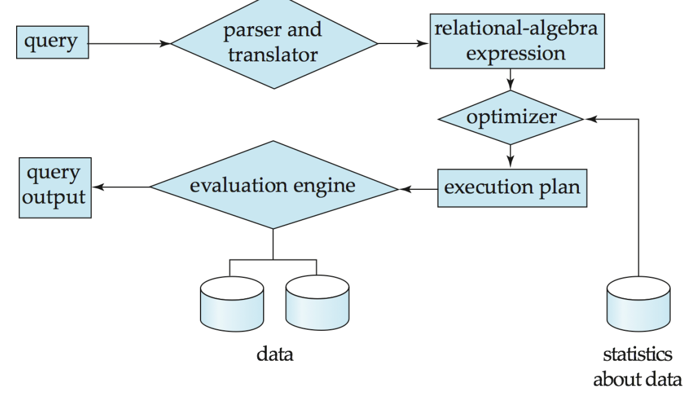
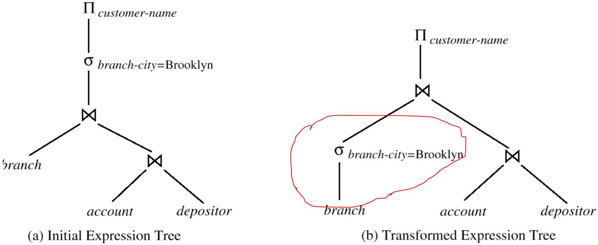
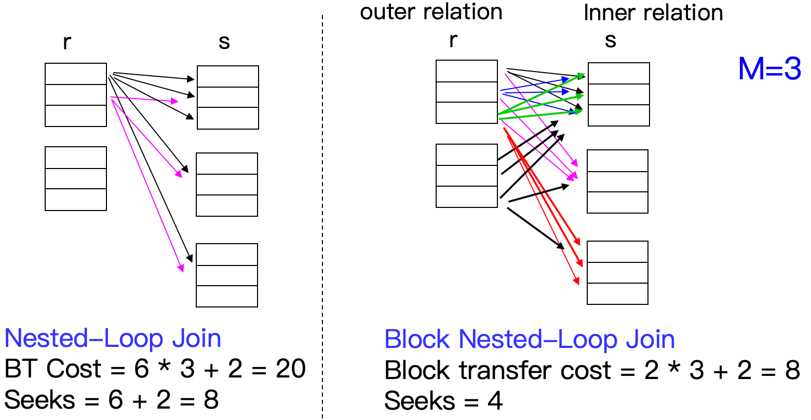
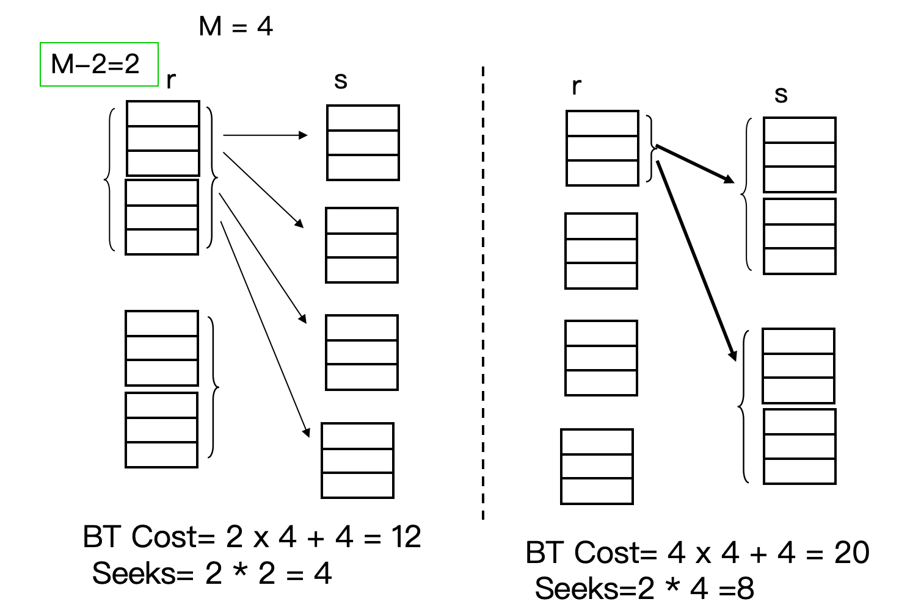
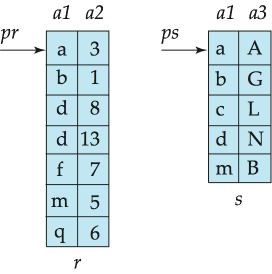
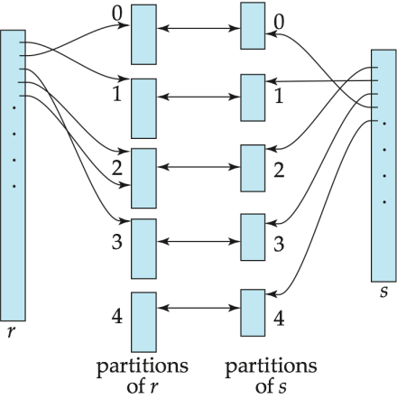

# Query Processing

## 10.1 Overview

本讲关注 **Query Processing**：给定一条 SQL 查询，DBMS 如何把它翻译成内部表达式，并选择具体算法执行。
需要先记住三个背景事实：

- CPU 不能直接操作磁盘上的数据，数据必须先被读入内存。
- 磁盘容量增长速度远快于磁盘读写速度增长速度。
    - 20 年内，磁盘容量可能增长约 $1000$ 倍，但读写速度只增长约 $40$ 倍。
- 磁盘寻道速度的提升又慢于数据传输速度的提升。

因此，查询处理的核心矛盾通常不是“CPU 算得快不快”，而是：

- <u>如何尽量减少磁盘 I/O，尤其是随机访问和 seek。</u>

### Basic Steps in Query Processing

<div style="text-align: center"></div>

查询处理的基本步骤：

1. **Parsing and translation（语法分析与翻译）**
    - Parser 检查 SQL 语法，并验证涉及的 relation / attribute 是否存在
    - 将 SQL 翻译成内部形式，通常是 **extended relational algebra（扩展关系代数, ERA）**
2. **Optimization（查询优化）**
    1. 对于同一个 SQL 查询，可能对应多个等价的关系代数表达式
    2. 同一个关系代数操作也可能有多种执行算法
    - 因此 Optimizer 需要在多个可行方案中选择估计**代价最低的方案**
3. **Evaluation（执行）**
    - Query-execution engine 根据 query-evaluation plan 执行查询，并返回结果

### Basic Steps: Optimization

==query-evaluation plan / query-execution plan==：

- 指定每个关系代数操作采用什么算法，各个操作之间如何协调执行

```sql
SELECT balance
FROM account
WHERE balance > 2500;
```

可能有两个等价表达式：

$$
\sigma_{\text{balance} > 2500}(\Pi_{\text{balance}}(\text{account}))
$$

或：

$$
\Pi_{\text{balance}}(\sigma_{\text{balance} > 2500}(\text{account}))
$$

后者通常更好，因为先选择可以减少后续投影处理的数据量。

!!! example

    <div style="text-align: center"></div>

    $$
    \Pi_{\text{customer-name}}(\sigma_{\text{branch-city=‘Brooklyn’}}(\text{branch} \bowtie\text{account} \bowtie \text{depositor}) )
    $$

优化器考虑的两个主要因素：

- **执行算法本身的代价**：例如 selection 用 linear scan 还是 index scan
- **数据库目录中的统计信息**
    - relation 的 tuple 数量，tuple 大小
    - relation 占用的 block 数
    - attribute value 的分布等

---

## 10.2 Measures of Query Cost

==Cost== is generally measured as **total elapsed time** for answering query.

- 查询代价一般可以理解为回答查询所需的总时间
- 影响查询时间的因素包括：<font color="#ff0000">Disk access</font> + CPU cost + Network communication

这里主要估计 **disk access cost**：磁盘 I/O 是主要瓶颈；磁盘访问代价相对容易估算

- 磁盘代价主要由三部分组成：
    1. Number of seek operations performed
    2. Number of blocks **read** $\times$ average-block-read-cost
    3. Number of blocks **written** $\times$ average-block-write-cost
- 写 block 通常比读 block 更贵：因为写入后可能需要重新读出来，确认写入成功

### Simplified Cost Model

为了简化，只考虑磁盘与内存之间传输了多少个 block，以及发生了多少次寻道

- $t_T$：transfer one block 的时间，约 $0.1\text{ms}$
- $t_S$：one seek 的时间，约 $4\text{ms}$

如果某个算法需要 $b$ 次 block transfer 和 $S$ 次 seek，则估计时间为：

$$
b \cdot t_T + S \cdot t_S
$$

- 此处不考虑 CPU cost，以及将最终结果写回磁盘的代价

### Buffer and Cost Estimation

查询代价依赖内存 buffer 大小：

- 内存越大，需要的磁盘访问越少
- 实际可用 buffer 受并发进程和 OS 状态影响，不一定能提前准确知道
因此常用两类估计：
1. **Worst case estimate**：假设只有该操作所需的最小内存
2. **Best case estimate**：假设相关数据已经在 buffer 中，或内存足够大

---

## 10.3 Selection Operation

Selection operation 形如：

$$
\sigma_\theta(r)
$$

- 其目标是从 relation $r$ 中找出满足条件 $\theta$ 的 tuple

!!! info "符号记录"

    - $b_r$：relation $r$ 占用的 block 数
    - $n_r$：relation $r$ 中 tuple 数
    - $f_r$：每个 block 中可容纳的 tuple 数
    - $h_i$：index tree 的高度
    - $sc(A,r)$：满足属性 $A$ 上选择条件的记录数

### 10.3.1 Basic Algorithms

==File scan==：一种搜索算法，用于定位和检索满足特定选择条件的记录

- 它**不使用索引**，系统必须直接查看数据文件本身，而不是通过辅助结构来查找

#### A1 Linear Search

Linear search（线性扫描）：

- 扫描 relation 的每个 block，对每条 record 测试是否满足 selection condition

$$
\text{Cost estimate}=b_r \text{ block transfers} + 1 \text{ seek}
$$

如果 selection condition 是 key attribute 上的等值查询（查询一个键属性）：

$$
\text{Average cost} = \frac{b_r}{2} \text{ block transfers} + 1 \text{ seek}
$$

!!! note "Linear search 的优点"

    - 不要求文件有序；不要求有索引；适用于任意 selection condition
    - 一般情况下，直接在数据文件上 binary search 意义不大，因为数据块在磁盘上未必连续，而且二分会带来更多随机 seek。除非文件确实按目标属性连续排序。

#### A2 Binary Search

Binary search（二分查找）适用条件：

- selection 是 equality comparison，文件按照该属性有序存储
- 假设 relation 的 blocks 在磁盘上**连续存放**

1. 如果查找 key attribute：

$$
\text{Cost}=\lceil \log_2(b_r) \rceil \text{ block transfers}
+
\lceil \log_2(b_r) \rceil \text{ seeks}
$$

    时间约为：

$$
\lceil \log_2(b_r) \rceil (t_S + t_T)
$$

2. 如果查找的是 non-key attribute：
    - 找到第一个满足条件的 tuple 后，还要继续读包含所有匹配记录的 blocks
    - 根据使用条件，匹配的记录的存储是连续的

$$
\text{Block transfer}=\lceil \log_2(b_r) \rceil + \left\lceil \frac{sc(A,r)}{f_r} \right\rceil - 1
$$

### 10.3.2 Selections Using Indices and Equality

==Index scan==：使用**索引**定位满足条件的记录

- selection condition 必须作用在该 index 的 search key 上

#### A3 Primary Index, Equality on Key

**适用场景**：primary index，equality condition，并且search key 是 key attribute

$$
\text{Cost}=(h_i + 1)(t_T + t_S)
$$

其中：

- $h_i$：索引树高度
- $+1$：找到叶子后，还需要访问实际数据记录所在 block

#### A4 Primary Index, Equality on Nonkey

**适用场景**：primary index，equality condition，并且search key 不是 key attribute

- 会返回多条记录，但因为是 primary / clustering index，匹配记录通常位于连续 blocks 中
若匹配记录占用 $b$ 个 blocks：$b = \left\lceil \dfrac{sc(A,r)}{f_r} \right\rceil$
- 先沿索引树定位到第一个匹配记录，然后顺序扫描连续的数据 blocks

$$
\text{Cost} = h_i(t_T + t_S) + t_S + b \cdot t_T
$$

#### A5 Secondary Index, Equality on Nonkey

**适用场景**：secondary index 并且 equality condition

1. 如果 search key 是 candidate key：
    - 最多返回一条记录，代价类似 A3

$$
\text{Cost}=(h_i + 1)(t_T + t_S)
$$

2. 如果 search key 不是 candidate key：
    - 可能返回 $n$ 条匹配记录，这些记录可能散布在不同的数据 block 中

$$
\text{Cost}=(h_i + n)(t_T + t_S)
$$

!!! warning

    Secondary index 在 non-key equality 上可能非常贵，因为每条匹配记录都可能触发一次随机 I/O。极端情况下甚至比 linear scan 更差。

### 10.3.3 Selections Involving Comparisons

比较查询包括：

$$
>,\quad \ge,\quad <,\quad \le,\quad \ne
$$

与等值查询的不同点：返回结果通常是一个范围，结果数量可能很大

#### A6 Primary Index, Comparison

**基于主索引的比较**，主要分两种情况

- 此时不一定要用 index，因为文件本身按 primary search key 排序
1. 对于 $\sigma_{A \ge V}(r)$：
   使用 primary index 找到第一个满足 $A \ge V$ 的 tuple，然后从那里开始顺序扫描 relation
2. 对于 $\sigma_{A \le V}(r)$：
   通常直接从 relation 开头顺序扫描，直到遇到第一个 $A > V$ 的 tuple

#### A7 Secondary Index, Comparison

基于辅助索引的比较，主要分两种情况

1. 对于 $\sigma_{A \ge V}(r)$：
   使用 secondary index 找到第一个 $A \ge V$ 的 index entry，然后顺序扫描 index leaf pages，获得记录指针。
2. 对于 $\sigma_{A \le V}(r)$：
   从 index leaf pages 开始扫描，直到遇到第一个 $A > V$ 的 entry
- 然后根据指针取回实际 records。

!!! tip

    Secondary index 的 range query 可能需要对每条结果记录做一次随机 I/O。如果返回结果很多，linear file scan 可能更便宜。

### 10.3.4 Complex Selections

#### Conjunction

$$
\sigma_{\theta_1 \land \theta_2 \land \cdots \land \theta_n}(r)
$$

**A8 Conjunctive selection using one index**

1. 从 $\theta_1,\dots,\theta_n$ 中选择一个代价最低、可用索引处理的条件 $\theta_i$
2. 用 A1-A7 中合适算法取出满足 $\theta_i$ 的 tuples
3. 把结果读入内存后，再检查其他条件

**A9 Conjunctive selection using composite index**

- 如果存在合适的 composite index / multiple-key index，直接使用
- 例如索引键为 $(A,B)$，查询条件为 $(A=a) \land (B=b)$ 时很有效

**A10 Conjunctive selection by intersection of identifiers**
**前提**：每个条件都有对应的 index，且 index entries 中包含 record pointers

- 分别用索引得到每个条件对应的 record pointer set，对这些 pointer sets 取交集
- 最后根据交集中的指针取回 records
- 若某些条件没有索引，则取回后在内存中检查

#### Disjunction

$$
\sigma_{\theta_1 \lor \theta_2 \lor \cdots \lor \theta_n}(r)
$$

**A10 disjunctive selection by union of identifiers**：
**前提**：所有条件都有可用索引

- 分别用索引得到各条件对应的 record pointer set，对这些 pointer sets 取并集，再根据指针取回 records
- 如果某个条件没有索引：退化为 linear scan。

#### Negation

$$
\sigma_{\neg \theta}(r)
$$

- 通常使用 linear scan
- 如果满足 $\neg \theta$ 的记录非常少，并且 $\theta$ 可用索引：
    - 可以先用索引找出满足目标的记录

---

## 10.4 \*Sorting

- Why：Sorting 的两个主要用途：
    - 用户显式要求排序输出
    - 某些 join 算法需要输入有序，例如 merge-join
- 可以通过索引按顺序读取 relation：
    - 逻辑上是有序的，但物理上 relation 未必按该顺序连续存放
    - 如果用 secondary index 顺序访问，可能每个 tuple 都要访问一个新的 disk block，代价很高
- How：
    - 如果 relation 能全部放入内存：可使用 quicksort 等内存排序算法
    - 如果 relation 放不进内存：使用 external sort-merge（外部排序归并）

### 10.4.1 External Sort-Merge

- $M$：可用内存大小，以 pages / blocks 为单位
- $b_b$：一次连续读/写的 block 数量
- $b_r$：relation $r$ 占用的 blocks 数

!!! info "Algorithm"

    - Step 1: Create Sorted Runs，令 $i=0$，重复执行：
        1. 读入 relation 的 $M$ 个 blocks 到内存
        2. 在内存中排序这些 blocks
        3. 将排序后的数据写入 run $R_i$
        4. $i \leftarrow i+1$
        - 最终生成 $N = \left\lceil \frac{b_r}{M} \right\rceil$ 个初始 runs
    - Step 2: Merge Runs
        - 如果 $N < M$：
            1. 使用 $N$ 个 input buffers
            2. 使用 $1$ 个 output buffer
            3. 对 $N$ 个 runs 做一次 $N$ -way merge
        - 如果 $N \ge M$：
            1. 一次最多合并 $M-1$ 个 runs，因为还需要 1 个 output buffer
            2. 每一轮 merge pass 会把 runs 数量减少约 $M-1$ 倍
            3. 重复 merge passes，直到所有 runs 合并为一个

### 10.4.2 Cost of External Merge Sort

==Block transfer==:

- 在 merge 阶段需要的轮数 $P$ 为：

$$
P = \left\lceil \log_{M-1}\left(\frac{b_r}{M}\right) \right\rceil
$$

- Initial run creation 和每一轮 merge pass 都需要**完整读+写一遍数据**：
    - 因此每轮大约 $2b_r$ block transfers
    - 但 final pass 的输出通常不计写回磁盘的代价，因为可以直接传给父操作
- 因此 block transfers：

$$
\text{Cost of block transfer}=b_r(2P + 1)
$$

==Seek cost==：

- Run generation 阶段： 
    - 每次：seek → 连续读 $M$ blocks → 内部排序 → seek → 连续写 $M$ blocks
    - 一共 $2 \lceil \dfrac{b_r}{M} \rceil$ 个 run，每个 run 读写各一次 seek

$$
\text{Seek}_{\text{run}}=2\left\lceil \frac{b_r}{M} \right\rceil
$$

- Merge 阶段，设一次连续读写 $b_b$ 个 blocks：
    - 每轮 merge 需要读全部 $b_r$ 个 blocks + 写全部 $b_r$ 个 blocks
    - 每个轮读写各一次 seek，但最后一轮不用写，省掉一轮 seek

$$
\left\lceil \frac{b_r}{b_b} \right\rceil(2P - 1)
$$

- 总 seek 数：

$$
\text{Cost of seek}=2\left\lceil \frac{b_r}{M} \right\rceil
+
\left\lceil \frac{b_r}{b_b} \right\rceil(2P - 1)
$$

---

## 10.5 Join Operation

Join 是查询处理中**代价最高、也最重要**的操作之一

!!! note "符号定义"

    - $r$：outer relation
    - $s$：inner relation
    - $b_r,b_s$：两个 relation 的 block 数
    - $n_r,n_s$：两个 relation 的 tuple 数
    - $M$：可用内存 blocks 数

### 10.5.1 Nested-Loop Join

用于计算 theta join：$r \bowtie_\theta s$

```text
for each tuple tr in r:
    for each tuple ts in s:
        if (tr, ts) satisfy theta:
            output tr concat ts
```

- 不需要索引，可以用于任意 join condition
- 代价很高，因为要检查所有 tuple pairs  

!!! info "Worst case："

    - 假设：
        - 内存<u>只能容纳每个 relation 的一个 block</u>
        - 对 $r$ 中每个 tuple，都需要扫描一次 $s$
    - 损失分析：
        - block transfers：$n_r \cdot b_s + b_r$
          外部自身需要 transfer $b_r$ 个 block，每个 tuple 去访问内部时进行 $b_s$ 次 tansfer
        - seeks：$n_r + b_r$
            - $b_r$：读外层的每个 block 需要 1 次 seek（内存只能装 1 个 block，逐 block 读）
            - $n_r$：对外层每条 tuple，要重新 seek 回的起始位置开始扫描

    ??? info "关于 seek 的分析"

        | |次数|原因|
        |---|---|---|
        |内层扫描|**每轮 1 次** seek|的 blocks **连续存放**，读完一个紧接着下一个，顺序 I/O|
        |外层读取|**每个 block 1 次** seek|每次读的下一个 block 之前，磁头已经被扫描带到了远处，必须 seek 回来|

        **本质**：不是"读几个 block 就要几次 seek"，而是**访问是否连续**。连续读 100 个 block 也只要 1 次 seek；但如果中间被打断（比如去扫描了别的东西），每次回来都要重新 seek。

    **Best case**：如果较小 relation 能全部放入内存，并作为 inner relation：

    $$
    (b_r + b_s) \text{ block transfers} + 2 \text{ seeks}
    $$

!!! tip

    Nested-loop join 的 **worst case** 中，通常让 tuple 数更少的 relation 作为 outer relation；
    如果某个 relation 能完整放入内存，则更适合作为 inner relation

### 10.5.2 Block Nested-Loop Join

<div style="text-align: center"></div>

Block nested-loop join 是 nested-loop join 的改进： 

- 对 outer relation 的每个 *block* 扫描 inner relation

```text
for each block Br of r:
    for each block Bs of s:
        for each tuple tr in Br:
            for each tuple ts in Bs:
                if (tr, ts) satisfy theta:
                    output tr concat ts
```

!!! info "Cost Analysis"

    - Worst Case
        - block transfers: $b_r \cdot b_s + b_r$
        - seeks：$2b_r$
    - Best Case ($s$ 始终在内存)
        - block transfers: $b_r + b_s$
        - seeks：$2$

    因此在 worst case 下，应让 block 数较小的 relation 作为 outer relation

#### Improvements

(1) when $M > 3$, but $M < b_s$ and $M < b_r$

- 可以用 $M-2$ 个 blocks 存放 ==outer relation 的一批 blocks==
- 剩下两个 block 分别作为 inner relation buffer 和 output buffer

<div style="text-align: center"></div>

!!! info "Cost Analysis"

    - block transfers：$\left\lceil \frac{b_r}{M-2} \right\rceil b_s + b_r$
    - seeks：$2\left\lceil \frac{b_r}{M-2} \right\rceil$

    这种做法能把读取 inner relation 的次数大约减少 $M-2$ 倍

(2) 如果等值连接（equi-join）属性在内层关系上构成键（key），则在第一次匹配时停止内层循环
(3) 内层扫描可以交替正向/反向进行，同时可以采取 LRU 策略利用仍留在 buffer 中的 blocks
(4) 如果 inner relation 的 join attribute 上有 index，可以改用 indexed nested-loop join（下面会具体介绍）

### 10.5.3 Indexed Nested-Loop Join

**适用条件**：

- 连接必须是等值连接（Equi-join）或自然连接
- 内层表（Inner Relation）的 join attribute 上必须有**索引**

对 outer relation $r$ 的每个 tuple $t_r$：

- 使用 inner relation $s$ 上的 index，找出所有与 $t_r$ 满足 join condition 的 $s$ tuples

!!! info "Worst Case Cost Analysis"

    - 假设：
        - buffer 只能容纳 outer relation 的一个 page
        - 每个 outer tuple 都要对 inner relation 做一次 index lookup
    - 开销：

    $$
    \text{Cost}=\underbrace{b_r(t_T + t_S)}_{\text{读取 outer relation }r} + \underbrace{n_r \cdot c}_{\text{对每个 tuple 做一次索引查找}}
    $$

        - 加号前的部分是针对 outer relation 的 tranfer 以及 seek 的开销
            - ⚠️索引查找完之后，磁头已经移动到 $s$ 的位置，再 transfer $r$ 时需要 seek
        - 其中 $c$ 是对 $s$ 执行一次基于 join condition 的 indexed selection 的代价
    - 如果 $r$ 和 $s$ 的 join attributes 上都有索引：选择 **tuple 数较少的 relation** 作为 outer relation

!!! example

    若 outer relation 有 $5000$ 个 tuples，inner relation 的 B+ tree 查找一次需要访问 $5$ 个 blocks，则 indexed nested-loop join 大约需要 $b_{\text{outer}} + 5000 \times 5$ 次 block access。它通常比普通 nested-loop join 少很多 I/O。

### 10.5.4 Merge-Join

**Merge-join（排序归并连接）** 适用于：<u>equi-join & natural join</u>

1. 如果两个 relation 尚未按 join attribute 排序，先排序
2. 对两个有序 relation 做类似 merge 的扫描
3. 对 join attribute 相同的 tuple group，输出所有匹配组合

<div style="text-align: center"></div>

假设对于 join 属性的任何一个给定值，所有与之匹配的 tuple 都能放入内存：

$$
\begin{align}
\text{ block transfers}&=b_r + b_s \\
\text{seek} &=
\left\lceil \frac{b_r}{b_b} \right\rceil
+
\left\lceil \frac{b_s}{b_b} \right\rceil \\
\text{cost} &= b_r + b_s+ \left\lceil \frac{b_r}{b_b} \right\rceil
+
\left\lceil \frac{b_s}{b_b} \right\rceil
\end{align}
$$

- 如果 relation 未排序，还要加上排序代价

#### Hybrid Merge-Join

假设：一个 relation 已经排序，另一个 relation 在 join attribute 上有 secondary B+ tree index
思路：

1. 将已排序 relation 与 B+ tree 的 leaf entries 合并（按值匹配）
2. 将合并结果按物理地址排序
3. 按**物理地址顺序**扫描未排序 relation，将地址替换为实际 tuple
    - 这样可以避免大量随机 lookup，尽量转化为顺序扫描

### 10.5.5 Hash-Join

**Hash-join（哈希连接）** 适用于：equi-join & natural join
**核心思想**：两个 relation 太大无法直接在内存中 join，那就**先用 hash 分区**，把大问题拆成多个小问题，每个小问题都能在内存中完成。

- 使用 hash function $h$ 按 join attribute 将两个 relation 分成多个 partition
    - 设：$h: \text{JoinAttrs} \rightarrow \{0,1,\dots,n\}$
    - 将 $r$ 分成：$r_0,r_1,\dots,r_n$，将 $s$ 分成：$s_0,s_1,\dots,s_n$
    - 若 $t_r$ 与 $t_s$ 满足 join condition，则它们 join attribute 值相同，因此一定被 hash 到同一个 $i$，只需比较 $r_i$ 与 $s_i$
- 只有落在同一个 partition 中的 tuples 才可能匹配

#### Hash-Join Algorithm

<div style="text-align: center"></div>

$s$ 被称为 **build input**，$r$ 被称为 **probe input**

1. 使用 hash function $h$ 对 build relation $s$ 分区
2. 使用同一个 $h$ 对 probe relation $r$ 分区
3. 对每个 partition $i$：
    - 将 $s_i$ 读入内存，在 $s_i$ 上基于 join attribute 建立内存 hash index
    - 顺序读取 $r_i$，对 $r_i$ 中每个 tuple，查刚刚建立的 hash index，输出匹配结果

!!! tip

    build input 的每个 partition $s_i$ 应该能够放入内存；
    probe input 的 partition $r_i$ 不要求放入内存。

通常 partition 数选择为：

$$
n = \left\lceil \frac{b_s}{M} \right\rceil \cdot f
$$

其中 $f$ 是 fudge factor，通常约为 $1.2$，用来降低分区溢出的概率

#### Recursive Partitioning

如果 partition 数 $n$ 大于内存页数 $M$：不能一次性为每个 partition 分配 output buffer

- 改为一次使用 $M-1$ 个 partitions
- 对分区继续用新的 hash function 递归分区
- 对 $r$ 和 $s$ 必须使用相同的分区方式

#### \*Handling of Overflows

Hash-table overflow 发生在 build partition $s_i$ 无法放入内存时，常见原因如下：

- join attribute 上大量 tuples 取相同值
- hash function 分布不好
- partitioning skewed，部分 partition 远大于其他 partition

解决方法：

- **Overflow resolution**
    - 对溢出的 partition 用另一个 hash function 继续分区
    - 对应的 probe partition 也必须相同方式分区
- **Overflow avoidance**
    - 在 build phase 更谨慎地分区，例如先分成更多 partitions，再合并合适的小 partitions
- 如果重复值极多，上述方法失败：
    - 对溢出部分退化使用 block nested-loop join

### 10.5.6 Cost of Hash-Join

如果不需要 recursive partitioning：

- 分区时读写 partition：
    - Transfer：读 + 写 =  $2(b_r+b_s)$
    - Seek：每次连续读/写 $b_b$ 个 blocks 需要 $1$ 次 seek，读写各 $\lceil \dfrac{b_r}{b_b} \rceil+ \lceil \dfrac{b_s}{b_b} \rceil$ 次
- 建立 hash table：$\text{Cost of transfer}= b_s$
- Probe (寻找匹配的值)：$\text{Cost of transfer}= b_r$

$$
[3(b_r + b_s) + 4n_h] \text{ block transfers}+
2\left(
\left\lceil \frac{b_r}{b_b} \right\rceil
+
\left\lceil \frac{b_s}{b_b} \right\rceil
\right)
\text{ seeks}
$$

- 其中：
    - $n_h$ 是 partition 数（修正项，partition 填不满的碎片 blocks）
    - $4n_h$ 近似表示 partially filled partition blocks 带来的额外 I/O

如果需要 recursive partitioning：

- build relation $s$ 的 partitioning passes 数为：$\left\lceil \log_{M-1}(b_s) - 1 \right\rceil$
- 总 block transfers：

$$
\text{Cost of transfer} =2(b_r+b_s)\left\lceil \log_{M-1}(b_s)-1 \right\rceil
+
b_r+b_s
$$

- seek 数：

$$
\text{Cost of seek} = 2\left(
\left\lceil \frac{b_r}{b_b} \right\rceil
+
\left\lceil \frac{b_s}{b_b} \right\rceil
\right)
\left\lceil \log_{M-1}(b_s)-1 \right\rceil
$$

如果整个 build input 都能放入内存（best case）：

$$
\text{Cost} = b_r+b_s
$$

### 10.5.7 \*Hybrid Hash-Join

Hybrid hash-join 适用于：内存相对较大，build input 仍然大于内存
普通的 Hash Join：

1. **分区阶段**：把表 R 和 S 分成 N 个小包，全部**写入磁盘**。
2. **构建/探测阶段**：再把这 N 个小包从磁盘**读回内存**进行匹配

Hybrid Hash-Join：

1. **分区阶段**（Partitioning Phase）
    - 对于哈希值为 **0** 的那部分数据，**直接留在内存里**，不写磁盘
    - 对于哈希值为 1 到 N-1 的数据，因为内存装不下了，所以**写入磁盘**
2. 探测阶段（Probing Phase）
   这时内存以及存在一个现成的 **Partition 0** 的哈希表
    - 开始扫描表 S（Probe Input）
    - 遇到属于 **Partition 0** 的元组：直接拿它跟内存里现成的表进行匹配（Probe）
    - 遇到属于 **1 到 N-1** 的元组：先**写入磁盘**，等后面再处理
因此可以减少一部分 partition 的写盘和读盘代价

### 10.5.8 Complex Joins

对于 conjunctive join：

$$
r \bowtie_{\theta_1 \land \theta_2 \land \cdots \land \theta_n} s
$$

可以：

- 使用 nested-loop / block nested-loop 直接检查完整条件
- 或先计算其中一个简单 join：$r \bowtie_{\theta_i} s$，再检查剩余条件： $\theta_1 \land \dots \land \theta_{i-1} \land \theta_{i+1} \land \cdots \land \theta_n$

对于 disjunctive join：

$$
r \bowtie_{\theta_1 \lor \theta_2 \lor \cdots \lor \theta_n} s
$$

可以：

- 使用 nested-loop / block nested-loop 直接检查完整条件
- 或分别计算：$(r \bowtie_{\theta_1} s)\cup(r \bowtie_{\theta_2} s)\cup\cdots\cup(r \bowtie_{\theta_n} s)$

---

## 10.6 \*Other Operations

### 10.6.1 Duplicate Elimination

Duplicate elimination 可以通过 sorting 或 hashing 实现

- Sorting 方法：
    - 排序后重复的 tuples 会相邻；保留一份，删除其余重复项
    - 优化：在 run generation 和 intermediate merge 阶段就可以提前删除重复项。
- Hashing 方法：
    - 重复 tuples 会进入同一个 bucket，在 bucket 内去重

### 10.6.2 Projection

Projection 的实现：

1. 对每个 tuple 执行投影
2. 如果关系代数语义要求集合结果，则执行 duplicate elimination

!!! note "SQL 中如果没有 `DISTINCT`"

    - `SELECT` 默认保留重复行
    - 不一定需要 duplicate elimination

### 10.6.3 Aggregation

Aggregation 与 duplicate elimination 类似：

- 使用 sorting 或 hashing 将同组 tuples 放在一起
- 对每个 group 应用 aggregate functions

可在 run generation 和 intermediate merge 阶段做 partial aggregation：

- 对 `count`：保存当前计数，合并时相加。
- 对 `sum`：保存部分和，合并时相加。
- 对 `min` / `max`：保存当前最小/最大值。
- 对 `avg`：保存 `sum` 和 `count`，最后再计算：$\text{avg} = \dfrac{\text{sum}}{\text{count}}$

### 10.6.4 Set Operations

集合操作包括：

$$
\cup,\quad \cap,\quad -
$$

可以通过：

- sorting 后使用 merge-join 的变体
- hashing 后使用 hash-join 的变体

Hashing 实现思路：

1. 用相同 hash function 分区两个 relation：$r_0,\dots,r_n$ 和 $s_0,\dots,s_n$
2. 对每个 partition $i$：
    - 将 $r_i$ 读入内存
    - 使用另一个 hash function 建立内存 hash index
    - 处理 $s_i$

对于 union：

- 若 $s_i$ 中 tuple 不在 hash index 中，则加入
- 最后输出 hash index 中所有 tuples

对于 intersection：

- 若 $s_i$ 中 tuple 已在 hash index 中，则输出

对于 difference $r-s$：

- 对每个 $s_i$ 中 tuple，若其在 hash index 中，则删除
- 最后输出 hash index 中剩余 tuples

### 10.6.5 Outer Join

Outer join 可以通过两类方式计算：

- 先做普通 join，再添加用 null padding 的未匹配 tuples
- 修改 join algorithm，使其在 join 过程中输出未匹配 tuples

以 left outer join 为例：

$$
r \;\text{left outer join}\; s
$$

如果修改 merge-join：

- 对每个来自 $r$、没有匹配 $s$ tuple 的 tuple $t_r$：输出 $t_r$ 并在 $s$ 的属性位置填充 null

如果修改 hash-join：

- 若 $r$ 是 probe relation：
    - probe 时发现没有匹配，就输出 null padded tuple
- 若 $r$ 是 build relation：
    - probing 时记录哪些 $r$ tuples 被匹配过
    - 最后输出未匹配的 $r$ tuples，并补 null

Right outer join 和 full outer join 可类似处理

---

## 10.7 \*Evaluation of Expressions

前面讨论的是单个关系代数操作的实现。实际查询通常是一棵 expression tree，例如：

$$
\Pi_{\text{customer-name}}
(
\sigma_{\text{balance}<2500}(\text{account})
\bowtie
\text{depositor}
)
$$

完整表达式的执行方式主要有两类：

- Materialization
- Pipelining

### 10.7.1 Materialization

Materialized evaluation（实体化执行）：

- 从表达式树的最低层开始，一次执行一个操作；
- 每个操作的中间结果都存储为临时 relation，上层操作再读取临时 relation 继续计算

优点：总是适用，实现简单
缺点：中间结果需要写入磁盘，再读回，代价可能很高

- 整体代价：$\text{sum of individual operation costs}+\text{cost of writing intermediate results to disk}$

!!! info "Improvement: Double Buffering"

    - 每个操作使用两个 output buffers：
        - 一个 buffer 满了就写磁盘
        - 另一个 buffer 继续接收输出
    - 这样可以重叠磁盘写入与计算，减少执行时间

### 10.7.2 Pipelining

Pipelined evaluation（流水线执行）：

- 多个操作**同时执行**，一个操作产生的 tuple 不写成临时 relation，而是直接传给父操作

优点：避免中间结果写盘，通常比 materialization 便宜
限制：并非所有操作都能流水线化；依赖父操作类型、输出是否需要排序、算法能否边读边产生输出等

流水线执行需要选择能逐步产生输出的算法：

- File scan 可以自然地产生 tuple stream
- Selection / projection 通常适合 pipeline
- Sort、merge join、hash join 等 blocking 操作则不总是适合

#### Demand-Driven Pipelining

==Demand-driven / lazy evaluation（需求驱动 / 惰性执行）==：

- 系统从顶层 operator 反复请求 next tuple
- 每个 operator 为了产生下一个 tuple，会向其 child operators 请求 tuple
- 每个 operator 需要维护自己的执行状态

通常用 iterator（迭代器） 模型实现：

- `Open()`：初始化 operator 状态，例如 file scan 将文件指针放到开头
- `Next()`：返回下一个输出 tuple，更新内部状态
- `Close()`：释放资源

#### Producer-Driven Pipelining

==Producer-driven / eager pipelining（生产者驱动 / 急切执行）==：

- child operator 主动产生 tuples，并放入父操作的 buffer
- parent operator 从 buffer 中取 tuples
- 如果 buffer 满，child operator 等待
- 系统调度那些 output buffer 有空间、且仍可处理输入的 operators

#### Evaluation Algorithms for Pipelining

有些算法不能一边接收输入一边输出结果：

- External sort 通常需要先读完并排序
- Merge join 通常需要有序输入
- Hash join 需要先构建 build input 的 hash table 或 partitions

但可使用变体产生部分流水线效果：

- Hybrid hash join 可以对保留在内存中的 partition 立即输出匹配结果
- Double-pipelined join 可以同时缓存两个 relation 的 partition 0：
    - 新的 $r_0$ tuple 到来时，与已有 $s_0$ tuples 匹配并输出
    - 新的 $s_0$ tuple 到来时，与已有 $r_0$ tuples 匹配并输出

### 10.7.3 Multiway Join and Example

#### Multiway Join

对于三个 relation 的 join：

$$
\text{loan} \bowtie \text{depositor} \bowtie \text{customer}
$$

可能策略：

1. 先计算：

$$
\text{depositor} \bowtie \text{customer}
$$

再与 `loan` join。

2. 先计算：

$$
\text{loan} \bowtie \text{depositor}
$$

再与 `customer` join。

3. 将多个 join 合成一个 special-purpose operation：
    - 在 `loan.loan-number` 上建索引。
    - 在 `customer.customer-name` 上建索引。
    - 对 `depositor` 中每个 tuple，分别查找对应的 `loan` 和 `customer` tuples。
    - 每个 `depositor` tuple 只检查一次。

第三种方法把两个二元 join 合并成一个更专用的操作，可能比逐个执行两个 join 更高效。

#### Example

给定：

```text
T1(bno, type, title, press, year)
T2(id, bno, date1, date2)
```

其中：

- `T2.bno` 是引用 `T1.bno` 的 foreign key。
- $T1$ 有 $20,000$ 个 tuples。
- $T2$ 有 $45,000$ 个 tuples。
- $T1$ 每 block 放 $25$ 个 tuples。
- $T2$ 每 block 放 $30$ 个 tuples。
- $T1$ 在 primary key `bno` 上有 primary B+ tree index。
- B+ tree 每个 index node 最多 $60$ 个 entries。
- 使用 worst case memory assumption。

先计算 block 数：

$$
b_1 = \frac{20000}{25} = 800
$$

$$
b_2 = \frac{45000}{30} = 1500
$$

B+ tree 高度近似：

$$
\log_{\lceil 60/2 \rceil}(20000) \approx 3
$$

##### Block Nested-Loop Join

让 $T1$ 作为 outer relation：

$$
800 \times 1500 + 800 = 1,200,800
$$

block transfers。

seeks：

$$
2 \times 800 = 1600
$$

##### Indexed Nested-Loop Join

让 $T2$ 作为 outer relation，$T1$ 作为 inner relation：

- 对 $T2$ 中每个 tuple，用 `bno` 查 $T1$ 的 primary B+ tree index。
- 每次索引查找需要约 $3+1$ 次 block access。

block transfers：

$$
45000 \times (3+1) + 1500 = 181,500
$$

seeks 约为：

$$
181,500
$$

!!! warning

    课件例子最后一行写作 `18150`，但按给定公式 $45000 \times 4 + 1500$ 应为 $181500$。另外 block nested-loop join 若按 $T1$ 作 outer relation，seek 数应为 $2 \times 800$。这里按公式保留正确数量级。
