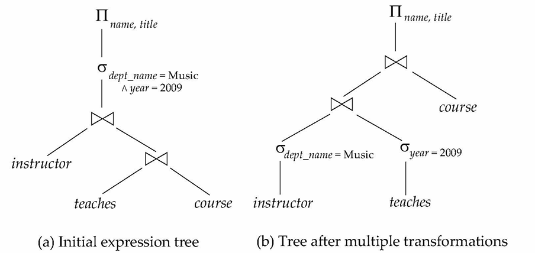
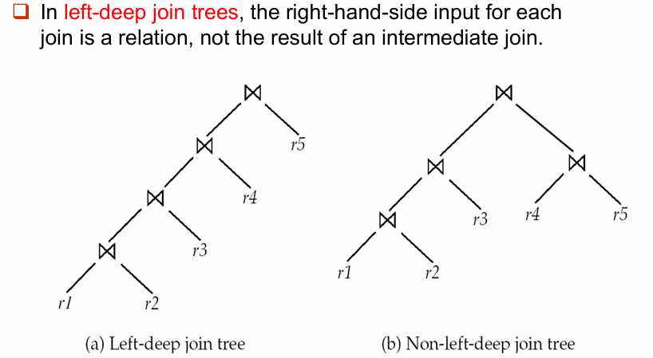

# Lec11.Query Optimization

## 11.1 Introduction

这一讲讨论 **Query Optimization（查询优化）**：

- 同一个 SQL 查询可能有多个逻辑等价的关系代数表达式
- 每个关系代数操作又可能有多个物理执行算法
- 不同执行计划的代价可能差别极大：有的计划几秒完成，有的计划可能跑上几天
  ==Query optimizer== 的目标：
- 在语义等价的候选执行计划中，选择估计代价最低的那个。

### Cost-Based Query Optimization

基于代价的查询优化通常分三步：

1. 使用 **equivalence rules** 生成逻辑等价表达式
2. 为这些表达式指定具体执行算法，形成多个候选 query plans
3. 根据**估计代价**选择最低成本的计划

计划代价的估计主要依赖：

- relation 的统计信息，例如：
  - tuple 数，block 数，某个属性的 distinct value 数
- 对中间结果统计信息的估计：
  - 用于估计复杂表达式的后续操作代价
- 各类算法的代价公式：
  - 例如上一讲中的 selection、join、sort 代价

!!! abstract

    Query Processing 关心“给定计划后如何执行”；
    Query Optimization 关心“在许多可行计划中如何挑出一个好计划”。

---

## 11.2 Transformation of Relational Expressions

### 11.2.1 Equivalence of Expressions

- 两个关系代数表达式等价，当且仅当：
  - 对每个合法数据库实例，它们<u>生成相同的 tuple 集合</u>（不考虑 tuple 的顺序）
  - 如果某个数据库实例违反完整性约束，则不要求两个表达式在该实例上的结果也相同
- 在 SQL 中：
  - 输入和输出通常是 **multisets of tuples**，而不是 set
  - 因此 SQL 语义下的等价要考虑 tuple 的**重复次数**
- **Equivalence rule**：说明两种表达式形式等价
  - 优化器可以在不改变查询语义的前提下，用一种形式替换另一种形式

### 11.2.2 Equivalence Rules

#### Rule 1: Cascade of Selections

由多个条件组成的 selection 可以拆成一串单条件 selection：

$$
\sigma_{\theta_1 \land \theta_2 \land \cdots \land \theta_n}(E)
=
\sigma_{\theta_1}(\sigma_{\theta_2}(\cdots\sigma_{\theta_n}(E)\cdots))
$$

#### Rule 2: Commutativity of Selections

Selection 操作可交换：

$$
\sigma_{\theta_1}(\sigma_{\theta_2}(E))
=
\sigma_{\theta_2}(\sigma_{\theta_1}(E))
$$

#### Rule 3: Cascade of Projections

连续 projection 中，如果只需要最后一个投影，那么其他的可以省略

- 若 $L_1 \subseteq L_n (n = 2,3,\dots)$：

$$
\Pi_{L_1}(\Pi_{L_2}(\dots(\Pi_{L_n}(E))\dots)) = \Pi_{L_1}(E)
$$

#### Rule 4: Selection with Product and Join

1. 对 Cartesian product 的 selection 可以合并成 theta join：

$$
\sigma_\theta(E_1 \times E_2)
=
E_1 \bowtie_\theta E_2
$$

2. Selection 也可以并入 theta join 的连接条件：

$$
\sigma_{\theta_1}(E_1 \bowtie_{\theta_2} E_2)
=
E_1 \bowtie_{\theta_1 \land \theta_2} E_2
$$

#### Rule 5: Commutativity of Joins

Theta join 和 natural join 可交换：

$$
E_1 \bowtie_\theta E_2
=
E_2 \bowtie_\theta E_1
$$

#### Rule 6: Associativity of Joins

1. Natural join 具有结合律：

$$
(E_1 \bowtie E_2) \bowtie E_3
=
E_1 \bowtie (E_2 \bowtie E_3)
$$

2. Theta join 在条件可拆分时也可做类似变换：

$$
(E_1 \bowtie_{\theta_1} E_2) \bowtie_{\theta_2 \land \theta_3} E_3
=
E_1 \bowtie_{\theta_1 \land \theta_3}(E_2 \bowtie_{\theta_2} E_3)
$$

- 其中 $\theta_2$ 只涉及 $E_2$ 和 $E_3$ 的属性。

#### Rule 7: Selection Distributes over Join

1. 如果 $\theta_0$ 只涉及 $E_1$ 的属性：

$$
\sigma_{\theta_0}(E_1 \bowtie_\theta E_2)
=
(\sigma_{\theta_0}(E_1)) \bowtie_\theta E_2
$$

2. 如果 $\theta_1$ 只涉及 $E_1$ 的属性，$\theta_2$ 只涉及 $E_2$ 的属性：

$$
\sigma_{\theta_1 \land \theta_2}(E_1 \bowtie_\theta E_2)
=
(\sigma_{\theta_1}(E_1)) \bowtie_\theta (\sigma_{\theta_2}(E_2))
$$

!!! tip

    这是 “perform selections early” 的理论基础：把 selection 尽量下推，先缩小输入 relation，再执行 join。

#### Rule 8: Projection Distributes over Join

考虑：

$$
\Pi_{L_1 \cup L_2}(E_1 \bowtie_\theta E_2)
$$

- 如果 join condition $\theta$ 只涉及 $L_1 \cup L_2$ 中的属性，则：

$$
\Pi_{L_1 \cup L_2}(E_1 \bowtie_\theta E_2)
=
\Pi_{L_1}(E_1) \bowtie_\theta \Pi_{L_2}(E_2)
$$

更一般地, 考虑：

$$
E_1 \bowtie_\theta E_2
$$

令：

- $L_1$ 和 $L_2$ 分别表示来自 $E_1$ 和 $E_2$ 的属性
- $L_3$ 表示来自 $E_1$ 且连接条件 $\theta$ 需要，但最终结果 $L_1 \cup L_2$ 中不需要的属性
- $L_4$ 表示来自 $E_2$ 且连接条件 $\theta$ 需要，但最终结果 $L_1 \cup L_2$ 中不需要的属性

也就是说，下推 projection 时不能把 join condition 需要的属性删掉；应先保留连接所需属性，再在 join 后做最终 projection：

$$
\Pi_{L_1 \cup L_2}(E_1 \bowtie_\theta E_2)
=
\Pi_{L_1 \cup L_2}
(
\Pi_{L_1 \cup L_3}(E_1)
\bowtie_\theta
\Pi_{L_2 \cup L_4}(E_2)
)
$$

#### Rule 9: Commutativity of Set Operations

Union 和 intersection 可交换：

$$
E_1 \cup E_2 = E_2 \cup E_1
$$

$$
E_1 \cap E_2 = E_2 \cap E_1
$$

但 set difference 不可交换：

$$
E_1 - E_2 \ne E_2 - E_1
$$

#### Rule 10: Associativity of Set Operations

Union 和 intersection 具有结合律：

$$
(E_1 \cup E_2) \cup E_3
=
E_1 \cup (E_2 \cup E_3)
$$

$$
(E_1 \cap E_2) \cap E_3
=
E_1 \cap (E_2 \cap E_3)
$$

#### Rule 11: Selection Distributes over Set Operations

Selection 可分配到 union、intersection、difference 上，对 $\cup$ 和 $\cap$ 也类似：

$$
\sigma_\theta(E_1 - E_2)
=
\sigma_\theta(E_1) - \sigma_\theta(E_2)
$$

此外还有如下性质，对 $\cap$ 也类似，但对 $\cup$ 不成立：

$$
\sigma_\theta(E_1 - E_2)
=
\sigma_\theta(E_1) - E_2
$$

#### Rule 12: Projection Distributes over Union

Projection 可分配到 union 上：

$$
\Pi_L(E_1 \cup E_2)
=
\Pi_L(E_1) \cup \Pi_L(E_2)
$$

### 11.2.3 Transformation Example

#### Pushing Selections

**例：查询 Music department 中所有 instructor 的名字，以及他们所教课程的 title。**

- 原表达式：

$$
\Pi_{\text{name},\text{title}}
(
\sigma_{\text{dept\_name}=\text{"Music"}}
(
\text{instructor}
\bowtie
(\text{teaches} \bowtie \Pi_{\text{course\_id},\text{title}}(\text{course}))
)
)
$$

- 根据 Rule 7a，可以把 selection 下推到 `instructor`：

$$
\Pi_{\text{name},\text{title}}
(
(\sigma_{\text{dept\_name}=\text{"Music"}}(\text{instructor}))
\bowtie
(\text{teaches} \bowtie \Pi_{\text{course\_id},\text{title}}(\text{course}))
)
$$

这样做的好处是：

- 先过滤出 Music department 的 instructor
- 再用更小的 relation 参与 join，从而减少中间结果规模

#### Multiple Transformations

**例：查询 Music department 中在 2009 年教过课的 instructor 名字，以及他们所教课程的 title。**
原表达式：

$$
\Pi_{\text{name},\text{title}}
(
\sigma_{\text{dept\_name}=\text{"Music"}\land\text{year}=2009} 
(
\text{instructor}
\bowtie
(\text{teaches} \bowtie \Pi_{\text{course\_id},\text{title}}(\text{course}))
)
)
$$

- 核心优化思路：
  1. 使用 join associativity 改变 join 顺序。
  2. 将 $\sigma_{\text{dept\_name}=\text{"Music"} \land \text{year}=2009}$ 拆分并下推。
- 最终可以先计算：

$$
\sigma_{\text{dept\_name}=\text{"Music"}}(\text{instructor})
\bowtie
\sigma_{\text{year}=2009}(\text{teaches})
$$

**Multiple Transformations**:

<div style="text-align: center"></div>

#### Pushing Projections

**Projection 下推的目的，是尽早丢弃后续不再需要的属性，从而减少中间结果的 tuple 宽度**
例如计算：

$$
\Pi_{\text{name},\text{title}}
(
(\sigma_{\text{dept\_name}=\text{"Music"}}(\text{instructor})
\bowtie
\text{teaches})
\bowtie
\Pi_{\text{course\_id},\text{title}}(\text{course})
)
$$

- 如果先计算：

$$
\sigma_{\text{dept\_name}=\text{"Music"}}(\text{instructor}) \bowtie \text{teaches}
$$

- 中间结果的 schema 可能包含：

$$
(\text{ID},\text{name},\text{dept\_name},\text{salary},\text{course\_id},\text{sec\_id},\text{semester},\text{year})
$$

- 但后续真正需要的只有：`name`， `course_id` 以及后续 join 所需属性，因此可以写成：

$$
\Pi_{\text{name},\text{title}}
(
\Pi_{\text{name},\text{course\_id}}
(
\sigma_{\text{dept\_name}=\text{"Music"}}(\text{instructor})
\bowtie
\text{teaches}
)
\bowtie
\Pi_{\text{course\_id},\text{title}}(\text{course})
)
$$

!!! tip

    Selection 下推主要减少 tuple 数；
    projection 下推主要减少 tuple 宽度。

#### Join Ordering

Join order 会直接影响中间结果的大小，因此也是查询优化中最关键的问题之一
对三个 relation：

$$
(r_1 \bowtie r_2) \bowtie r_3
=
r_1 \bowtie (r_2 \bowtie r_3)
$$

- 这两个表达式逻辑等价，但实际执行代价可能差别很大
- 如果 $r_1 \bowtie r_2$ 的结果很小， $r_2 \bowtie r_3$ 的结果很大，则应优先计算：$(r_1 \bowtie r_2) \bowtie r_3$

例：

- Music department 的 instructor 只占很小比例
- 因此先算 $\sigma_{\text{dept\_name}=\text{"Music"}}(\text{instructor}) \bowtie \text{teaches}$ 比先算  $\text{teaches}\bowtie\Pi_{\text{course\_id},\text{title}}(\text{course})$ 更合适

#### Enumeration of Equivalent Expressions

理论上，优化器可以通过反复应用 equivalence rules 来枚举所有等价表达式：

1. 对目前已发现的每个表达式的每个子表达式应用所有可用规则
2. 把新表达式加入集合
3. 重复直到不再生成新表达式

问题是这样做的**时间和空间开销都非常大**，常见解决方向：

- 基于 transformation rules 直接生成较优计划
- 对只包含 selection、projection、join 的常见查询采用专门的优化方法

---

## 11.3 Statistics for Cost Estimation

优化器要比较不同计划的代价，就必须估计每个操作的输入规模和输出规模。

### 11.3.1 Statistical Information

常用统计信息：

- $n_r$：relation $r$ 的 tuple 数
- $b_r$：包含 $r$ tuples 的 block 数
- $l_r$：$r$ 中一个 tuple 的大小
- $f_r$：blocking factor，即一个 block 可容纳多少个 $r$ 的 tuples
- $V(A,r)$：relation $r$ 中属性 $A$ 出现过的不同取值个数，等价于 $\Pi_A(r)$ 的大小
- 如果 $r$ 的 tuples 在文件中连续存放：

$$
b_r = \left\lceil \frac{n_r}{f_r} \right\rceil
$$

### 11.3.2 Selection Size Estimation

#### 1. Equality Selection

对于：$\sigma_{A=v}(r)$

- 如果假设 $A$ 的取值均匀分布，则满足条件的 tuple 数估计为 $\dfrac{n_r}{V(A,r)}$
- 如果 $A$ 是 key attribute，则等值查询最多命中一条记录：$\text{size}(\sigma_{A=v}(r)) = 1$

#### 2. Comparison Selection

- 对于：$\sigma_{A \le v}(r)$
  - 如果 catalog 中保存了 $\min(A,r)$ 和 $\max(A,r)$：
    - 如果 $v < \min(A,r)$，那么 $c = 0$
    - 如果 $z$，那么 $c = n_r$
    - 其他情况按均匀分布估计：$c = n_r \cdot \dfrac{v-\min(A,r)}{\max(A,r)-\min(A,r)}$
- 对于：$\sigma_{A \ge v}(r)$
  - 对称处理：$c =n_r \cdot \dfrac{\max(A,r)-v}{\max(A,r)-\min(A,r)}$
- 如果有直方图（histograms）：可以借助直方图进一步细化估计
- 如果完全没有可用统计信息，通常粗略估计为：$c \approx \frac{n_r}{2}$

#### 3. Complex Selection

==Selectivity（选择率）==：

- 条件 $\theta_i$ 的选择率表示 relation $r$ 中任意一个 tuple 满足该条件的概率
- 如果满足 $\theta_i$ 的 tuple 数是 $s_i$，则：$\text{selectivity}(\theta_i) = \dfrac{s_i}{n_r}$

##### Conjunction

对于 $\sigma_{\theta_1 \land \theta_2 \land \cdots \land \theta_n}(r)$，假设各条件相互独立，则结果 tuple 数估计为：

$$
n_r \cdot
\prod_{i=1}^{n}
\frac{s_i}{n_r}
$$

##### Disjunction

对于 $\sigma_{\theta_1 \lor \theta_2 \lor \cdots \lor \theta_n}(r)$，结果 tuple 数可估计为：

$$
n_r \cdot
\left(
1 -
\prod_{i=1}^{n}
\left(1-\frac{s_i}{n_r}\right)
\right)
$$

##### Negation

对于 $\sigma_{\neg \theta}(r)$，结果 tuple 数估计为：

$$
n_r - \text{size}(\sigma_\theta(r))
$$

#### 4. Join Size Estimation

设 $R$ 是 relation $r$ 的关系模式，$S$ 是 relation $s$ 的关系模式

##### Cartesian Product

如果 $R \cap S = \varnothing$，则 natural join 等价于 Cartesian product：

$$
r \bowtie s = r \times s
$$

- 结果 tuple 数为：$n_r \cdot n_s$
- 每个结果 tuple 的大小约为：$l_r + l_s$

##### Join Attribute Is Key

如果 $R \cap S$ 是 $R$ 的 key：

- $s$ 中的每个 tuple 最多只能与 $r$ 中的一个 tuple 匹配
- 因此：

$$
|r \bowtie s| \le n_s
$$

如果 $R \cap S$ 是 $S$ 中引用 $R$ 的外键（foreign key）：

- $s$ 中每个 tuple 都能在 $r$ 中匹配到一个 tuple
- 因此：

$$
|r \bowtie s| = n_s
$$

反向情况对称。

!!! example

    在 `student ⋈ takes` 中，`takes.ID` 是引用 `student.ID` 的外键，因此 join 结果大小正好等于 `takes` 的 tuple 数。

##### Join Attribute Is Not Key

若 $R \cap S = \{A\}$ 且 $A$ 不是 $R$ 或 $S$ 的 key

- 一种估计：

$$
\frac{n_r \cdot n_s}{V(A,s)}
$$

- 另一种对称估计：

$$
\frac{n_r \cdot n_s}{V(A,r)}
$$

- 通常认为较小的估计更可靠：

$$
|r \bowtie s|
\approx
\min
\left(
\frac{n_r n_s}{V(A,r)},
\frac{n_r n_s}{V(A,s)}
\right)
$$

- 如果有直方图（histograms）：可以对直方图中的每个 bucket 分别估计，再把结果相加

##### Running Example

Running example: $\text{student} \bowtie \text{takes}$
已知 catalog 信息：

- $n_{\text{student}}=5000$
- $f_{\text{student}}=50$, which implies that $b_{\text{student}}=5000/50=100$
- $n_{\text{takes}}=10000$
- $f_{\text{takes}}=25$, which implies that $b_{\text{takes}}=10000/25=400$
- $V(\text{ID}, \text{takes})=2500$：平均每个选过课的 student 选了 $4$ 门课
- $V(\text{ID}, \text{student})=5000$：`student.ID` 是 primary key
- `takes.ID` 是引用 `student.ID` 的外键

利用外键信息：

$$
|\text{student} \bowtie \text{takes}| = n_{\text{takes}} = 10000
$$

如果不使用外键信息，而只用不同取值数估计：

$$
\frac{5000 \times 10000}{2500} = 20000
$$

和：

$$
\frac{5000 \times 10000}{5000} = 10000
$$

取较小者：

$$
10000
$$

这与外键信息推导出的结果一致。

#### 5. Size Estimation for Other Operations

##### Projection

对于：

$$
\Pi_A(r)
$$

结果大小可估计为：

$$
V(A,r)
$$

##### Aggregation

对于按 $A$ 分组的 aggregation：

$$
{}_A\mathcal{G}_F(r)
$$

结果大小可估计为：

$$
V(A,r)
$$

##### Outer Join

Left outer join：

$$
|r \;\text{left outer join}\; s|
\le
|r \bowtie s| + |r|
$$

- Right outer join 对称

Full outer join：

$$
|r \;\text{full outer join}\; s|
\le
|r \bowtie s| + |r| + |s|
$$

##### Set Operations

对于同一 relation 上 selections 的 union / intersection：

- 可以先把表达式改写为一个 selection，再使用 selection 的结果大小估计方法
- 例如：$\sigma_{\theta_1}(r) \cup \sigma_{\theta_2}(r)=\sigma_{\theta_1 \lor \theta_2}(r)$

对不同 relations 的 set operations，可先使用下列粗略估计：

- Union：$|r \cup s| \le |r| + |s|$
- Intersection：$|r \cap s| \le \min(|r|, |s|)$
- Difference：$|r-s| \le |r|$
  这些估计可能不够准确，但通常能提供一个 upper bound

#### 6. Estimation of Number of Distinct Values

优化器还需要估计中间结果中各属性的 distinct value 数

##### Distinct Values after Selection

对于：$\sigma_\theta(r)$

- 如果 $\theta$ 强制 $A$ 只能取某个指定值：$V(A,\sigma_\theta(r)) = 1$
  - 例如：$A=3$
- 如果 $\theta$ 强制 $A$ 只能从某个指定集合中取值：$V(A,\sigma_\theta(r)) =\text{number of specified values}$
  - 例如：$A=1 \lor A=3 \lor A=4$
- 如果 $\theta$ 是一般选择条件，且选择率为 $s$：$V(A,\sigma_\theta(r)) \approx V(A,r)\cdot s$
- 其他情况可用下面的保守近似：$V(A,\sigma_\theta(r)) \approx \min(V(A,r), |\sigma_\theta(r)|)$

##### Distinct Values after Join

对于：$r \bowtie s$

- 如果属性集合 $A$ 全部来自 $r$：

$$
V(A,r \bowtie s)
\approx
\min(V(A,r), |r \bowtie s|)
$$

- 如果 $A$ 同时包含来自 $r$ 和 $s$ 的属性，可以使用下面的近似公式：
  - 设 $A=A_1 \cup A_2$，其中 $A_1$ 来自 $r$，$A_2$ 来自 $s$

$$
V(A,r \bowtie s)
\approx
\min(
V(A_1,r)\cdot V(A_2-A_1,s),
V(A_1-A_2,r)\cdot V(A_2,s),
|r \bowtie s|
)
$$

直观理解：

- distinct value 数不能超过结果 tuple 数
- join 条件会限制来自两边属性值的组合数量

##### Projection and Aggregation

Projection 中的 distinct value 数：

$$
V(A,\Pi_{\dots}(r))=V(A,r)
$$

- 投影只是去掉某些列，**不影响剩下列的 distinct value 数**。

Aggregation 的 grouping attributes：

- $\text{分组数}=V(G,r)$，产生的**分组数量**，等于原表 $r$ 中这些分组属性 $G$ 的不同值组合的数量

对于 aggregate values：

- `min(A)` 和 `max(A)`：

$$
\min(V(A,r), V(G,r))
$$

其中 $G$ 是 grouping attributes。

- 其他 aggregates：通常假设每组 aggregate value 不同，因此可使用 $V(G,r)$

### 11.3.3 Choice of Evaluation Plans

选择 evaluation plan 时，不能简单地为每个算子单独挑选当前最便宜的算法

- 某个算法在局部看起来更贵，但可能为上层操作提供有用的输出性质。
- 例如 merge-join 可能比 hash-join 贵，但它能产生有序输出，从而降低后续 aggregation / order by 的代价。
- Nested-loop join 可能提供 pipelining 机会。

实际优化器通常结合两类思路：

1. 在候选计划中做 cost-based search，选择估计代价最低的计划。
2. 使用 heuristics 缩小搜索空间，避免枚举过多计划。

---

## 11.4 \*Dynamic Programming for Choosing Evaluation Plans

### 11.4.1 Why Dynamic Programming

考虑为下面的多表 join 寻找最佳 join order：

$$
r_1 \bowtie r_2 \bowtie \cdots \bowtie r_n
$$

可选 join orders 的数量非常大：

$$
\frac{(2(n-1))!}{(n-1)!}
$$

- 当 $n=7$ 时，数量为 $665280$
- 当 $n=10$ 时，数量超过 $176$ billion
  因此不能简单枚举所有 join orders

==Dynamic programming== 的思想：

- 对任意 relation 子集 $S$，只计算一次它的最优 join plan
- 结果存入 `bestplan[S]`
- 之后遇到同一子问题时直接复用

### 11.4.2 Dynamic Programming Recurrence

要为 relation 集合 $S$ 找最优 plan，可以把最后一步 join 看作两个子结果的连接：

- 枚举 $S$ 的非空真子集 $S_1$
- 将 plan 写成：

$$
S_1 \bowtie (S-S_1)
$$

- 递归求：$\text{bestplan}[S_1]$ 和 $\text{bestplan}[S-S_1]$
- 选择连接这两个子结果的最佳 join algorithm，取总代价最低者

Base case：

- $S$ 只包含一个 relation $R_i$
- 结合该 relation 上的 selections 和可用索引，选择最佳 access plan

### 11.4.3 Join Order Optimization Algorithm

伪代码：

```c
procedure findbestplan(S):
    if bestplan[S].cost != infinity:
        return bestplan[S]

    if S contains only one relation:
        set bestplan[S] using the best access method
    else:
        for each non-empty subset S1 of S such that S1 != S:
            P1 = findbestplan(S1)
            P2 = findbestplan(S - S1)
            A = best algorithm for joining P1 and P2
            cost = P1.cost + P2.cost + cost(A)

            if cost < bestplan[S].cost:
                bestplan[S].cost = cost
                bestplan[S].plan =
                    execute P1.plan;
                    execute P2.plan;
                    join results using A

    return bestplan[S]
```

### 11.4.4 Cost of Optimization

如果允许 bushy trees：

- 时间复杂度：$O(3^n)$
- 空间复杂度：$O(2^n)$

当 $n=10$ 时：

- 动态规划约 $59000$ 级别，比 $176$ billion 小得多

如果只考虑 left-deep join trees：

- 每次 join 的右输入都限制为一个基表（base relation）
- 时间复杂度：$O(n2^n)$
- 空间复杂度仍为：$O(2^n)$

!!! info "Left-Deep Join Tree"

    在 left-deep join tree 中，每个 join 的右输入都是一个基表，而不是中间 join 结果。
    这类计划更适合流水线执行，也能显著降低优化复杂度。

### 11.4.5 Interesting Sort Orders

==Interesting sort order==：当前操作可能顺带产生、并且对后续操作有用的 tuple 排序顺序。

例：$(r_1 \bowtie r_2) \bowtie r_3$ 且三者公共属性为 $A$

- 使用 merge-join 计算：

$$
r_1 \bowtie r_2
$$

局部看可能比 hash-join 更贵，但它会产生按 $A$ 排序的结果，这个排序可能让后续：

$$
(r_1 \bowtie r_2) \bowtie r_3
$$

更便宜地继续使用 merge-join

- 排序顺序还可能对 `ORDER BY`，`GROUP BY`，aggregation 有用

因此，优化器不能只为每个 relation 子集保存一个最优 plan；它还可能需要为每种 interesting sort order 分别保存一个最优 plan。

### 11.4.6 Cost-Based Optimization with Equivalence Rules

Physical equivalence rules 可将逻辑查询计划（logical query plan）转换为物理查询计划（physical query plan）：

- 指定每个操作用什么算法
- 指定 access path、join algorithm、sort order 等

高效的优化器通常需要：

- 用空间高效的数据结构表示表达式，避免重复复制 subexpressions
- 能识别由不同规则路径推导出的重复表达式
- 使用 memoization 保存子表达式的最优计划
- 使用 cost-based pruning，提前剪掉明显不优的计划

这一类思想由 Volcano optimizer 开创，并影响了 SQL Server optimizer 等实际系统

### 11.4.7 Heuristic Optimization

即使用了动态规划，cost-based optimization 仍然可能很贵。因此，实际系统常用 heuristics optimization (启发式优化) 来减少需要比较的候选计划数量。

常见 heuristic rules：

- 尽早执行 selection：减少 tuple 数
- 尽早执行 projection：减少 attribute 数和 tuple 宽度
- 优先执行最 restrictive 的 selection / join，即优先执行估计结果最小的操作

有些系统主要依赖 heuristics，更多系统则会结合：

- heuristic rewriting
- partial cost-based optimization

### 11.4.8 Structure of Query Optimizers

- 许多优化器只考虑 left-deep join orders：
  - 降低优化复杂度，生成更适合流水线执行的计划
  - 同时会做：selections 下推，projections 下推
- 部分系统采用分阶段策略：
  - 先对 nested block structure 和 aggregation 做 heuristic rewriting
  - 再对每个 block 做 cost-based join-order optimization
- 另一些系统（如 SQL Server）会对整个 query 统一应用 transformations，而不是局限于原来的 block structure
- 实际系统还会用：
  - **Optimization cost budget**
    - 如果继续优化的成本超过潜在收益，就提前停止优化
  - **Plan caching**
    - 如果相同结构的 query 再次提交，可以复用之前算出的 plan
    - 即使 query 中的常量不同，也可能复用同一个 plan 模板

<div style="text-align: center"></div>

!!! abstract

    Optimizer 本身也会消耗时间。对于很便宜的查询，简单 heuristic 可能就够；对于昂贵查询，多花一点时间优化通常是值得的。

---

## 11.5 \*Additional Optimization Techniques

### 11.5.1 Optimizing Nested Subqueries

考虑下面的 nested query：

```sql
SELECT name
FROM instructor
WHERE EXISTS (
    SELECT *
    FROM teaches
    WHERE instructor.ID = teaches.ID
      AND teaches.year = 2007
);
```

从概念上看，SQL 会把 `WHERE` 子句中的 nested subquery 当成一个函数：

- 它接收外层查询中的变量作为参数，返回单个值或值集合
- 来自外层查询、并在 nested subquery 中被引用的变量称为：**correlation variables**

概念执行方式：

- 外层查询每产生一个 tuple，就执行一次 nested subquery
- 这种方式称为 **correlated evaluation**

问题：nested query 可能被调用大量次，可能导致大量随机 I/O，通常非常低效

### 11.5.2 Decorrelation

优化器会尽量把 nested subquery 转换为 join，这个过程称为**去相关化（decorrelation）**

上面的 query 可以改写为：

```sql
SELECT name
FROM instructor, teaches
WHERE instructor.ID = teaches.ID
  AND teaches.year = 2007;
```

但要注意：

- 两个 query 产生的重复 tuple 数可能不同
- 原因是 `teaches` 中可能出现重复的 `ID`

更通用的 `EXISTS` 查询：

```sql
SELECT ...
FROM L1
WHERE P1
  AND EXISTS (
      SELECT *
      FROM L2
      WHERE P2
  );
```

可改写为：

```sql
CREATE TABLE t1 AS
SELECT DISTINCT V
FROM L2
WHERE P21;

SELECT ...
FROM L1, t1
WHERE P1
  AND P22;
```

其中：

- $P21$：$P2$ 中不涉及 correlation variables 的 predicates。
- $P22$：把涉及 correlation variables 的 predicates 重新放回外层查询。
- $V$：correlation predicates 中需要使用的全部 attributes。

对前面的例子：

```sql
CREATE TABLE t1 AS
SELECT DISTINCT ID
FROM teaches
WHERE year = 2007;

SELECT name
FROM instructor, t1
WHERE t1.ID = instructor.ID;
```

**Decorrelation**：用 join 或带临时 relation 的 join 替换 nested query 的过程
以下情况会更复杂：

- Nested subquery 使用 aggregation。
- Nested subquery 的结果用于 equality test。
- subquery 与外层查询的连接方式不是 `EXISTS`。

### 11.5.3 Materialized Views

**Materialized view（物化视图）**：

- 普通 view 只保存定义，materialized view 会把 view 的查询结果预先计算出来并存储

```sql
CREATE VIEW department_total_salary(dept_name, total_salary) AS
SELECT dept_name, SUM(salary)
FROM instructor
GROUP BY dept_name;
```

如果经常需要查询每个 department 的 total salary：

- 将这个 view 物化后，就可以避免每次都重新扫描 `instructor` 并做聚合

### 11.5.4 Materialized View Maintenance

**Materialized view maintenance**：底层数据发生变化时，保持 materialized view 与之同步的过程

- 简单方法：每次底层 relation 更新时，重新计算整个 view
- 更好方法：**Incremental view maintenance**
  - 根据底层 relation 的变化量，计算 view 的变化量
  - 只更新 view 中受影响的部分

维护方式：

- 手动定义 triggers
- 手写代码在底层表更新时同步更新 view
- 定期重算，例如 nightly recomputation
- 许多 DBMS 会直接支持这些维护方式，避免手工实现带来的复杂性和正确性风险

### 11.5.5 Incremental View Maintenance

relation 或 expression 的变化量称为 **differential**
记：

- $i_r$：插入到 relation $r$ 的 tuple 集合
- $d_r$：从 relation $r$ 删除的 tuple 集合
  为了简化过程，update 可看成先删除旧 tuple，再插入新 tuple

#### Join Operation

考虑 materialized view：

$$
v = r \bowtie s
$$

如果向 $r$ 插入 $i_r$：

$$
r_{\text{new}} = r_{\text{old}} \cup i_r
$$

- 则：$r_{\text{new}} \bowtie s=(r_{\text{old}} \cup i_r) \bowtie s$，根据分配律：$(r_{\text{old}} \bowtie s) \cup (i_r \bowtie s)$
- 其中 $r_{\text{old}} \bowtie s$ 就是旧的 materialized view
- 因此 $v_{\text{new}} =v_{\text{old}} \cup (i_r \bowtie s)$

如果从 $r$ 删除 $d_r$：

$$
v_{\text{new}} =
v_{\text{old}} - (d_r \bowtie s)
$$

#### Selection Operation

若：

$$
v = \sigma_\theta(r)
$$

插入：

$$
v_{\text{new}} =
v_{\text{old}} \cup \sigma_\theta(i_r)
$$

删除：

$$
v_{\text{new}} =
v_{\text{old}} - \sigma_\theta(d_r)
$$

#### Projection Operation

Projection 的维护更复杂，因为多个输入 tuple 可能投影成同一个输出 tuple

例：

$$
R=(A,B), \quad r=\{(a,2),(a,3)\}
$$

则：

$$
\Pi_A(r)=\{(a)\}
$$

如果删除 $(a,2)$：

- 不能删除 $(a)$，因为 $(a,3)$ 仍然支持它。

解决方法：

- 对 projection 结果中的每个 tuple 维护一个 count，记录它由多少个原始 tuple 推导而来
- 插入时：
  - 若投影 tuple 已存在，count 加 1
  - 否则插入新 tuple，count 设为 1
- 删除时：
  - 对应 projection tuple 的 count 减 1
  - 若 count 变为 0，删除该 projection tuple

#### Aggregation Operation

对于：

$$
v = {}_A\mathcal{G}_{\text{count}(B)}(r)
$$

插入 $i_r$：

- 对每个新 tuple，根据 group-by attribute $A$ 找到对应 group
- 若 group 已存在，count 加 1
- 否则插入新 group，count 设为 1

删除 $d_r$：

- 对每个被删 tuple，将对应 group 的 count 减 1
- 若 count 变为 0，删除该 group

对于：

$$
v = {}_A\mathcal{G}_{\text{sum}(B)}(r)
$$

维护方式类似 count：

- 插入时加上 $B$ 的值，删除时减去 $B$ 的值
- 还需要额外维护 count，用于判断 group 是否已经没有 tuple

!!! warning

    不能仅凭 `sum = 0` 判断 group 是否为空，因为真实数据的和也可能刚好为 0。

对于 `avg`：

- 分别维护 `sum` 和 `count`
- 查询或输出时再计算：

$$
\text{avg} = \frac{\text{sum}}{\text{count}}
$$

对于 `min` / `max`：

- 插入容易维护
- 删除较麻烦：如果删掉的正好是当前最小/最大值，就必须查看同组其他 tuples，重新找新的 min / max

#### Set Operations

对于：

$$
v = r \cap s
$$

- 若向 $r$ 插入 tuple：检查该 tuple 是否存在于 $s$，若存在，则加入 $v$
- 若从 $r$ 删除 tuple：若该 tuple 在 intersection 中，则从 $v$ 删除

对 $s$ 的更新对称
Union 和 set difference 可类似处理
Outer join 与普通 join 类似，只是还需要额外处理未匹配 tuple 的 null padding。

#### Handling Full Expressions

对于完整表达式：

- 从最小的 subexpression 开始
- 先为每个 subexpression 推导 incremental change
- 再沿表达式树向上组合这些变化量

例如：

$$
E_1 \bowtie E_2
$$

若插入到 $E_1$ 的 differential 为 $\Delta_1$，则插入到 join 结果的部分为：

$$
\Delta_1 \bowtie E_2
$$

### 11.5.6 Query Optimization and Materialized Views

Materialized views 可以被优化器用于查询重写

#### Rewrite Query to Use Materialized View

如果已有：

$$
v = r \bowtie s
$$

用户提交：

$$
r \bowtie s \bowtie t
$$

可以改写为：

$$
v \bowtie t
$$

是否应该使用 materialized view，要由代价估计决定

#### Replace Materialized View by Definition

有时即使存在 materialized view，也不一定应该直接使用它
若已有：

$$
v = r \bowtie s
$$

用户查询：

$$
\sigma_{A=10}(v)
$$

如果：$v$ 上没有合适索引，$r$ 在属性 $A$ 上有索引，$s$ 在连接属性 $B$ 上有索引

- 更好的计划可能是展开 view 定义：

$$
\sigma_{A=10}(r) \bowtie s
$$

因此优化器应同时考虑：

- 使用 materialized view；展开 materialized view；选择总体代价最低者

### 11.5.7 Materialized View Selection

**Materialized view selection**：决定哪些 views 值得物化
**Index selection**：决定哪些索引值得创建

- 二者密切相关，但 index selection 通常更简单
  选择依据通常是：
- 典型 workload：
  - queries
  - updates
- 目标：
  - 在空间约束下最小化 workload 执行时间
  - 满足关键 queries / updates 的时间要求
    这是 database tuning 的一部分

商业数据库通常提供 tuning assistants，tuning wizards，助 DBA 选择合适的索引和 materialized views
