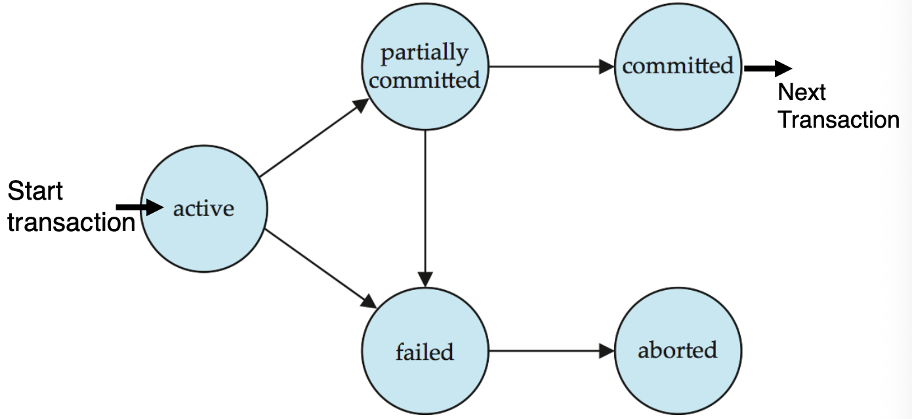
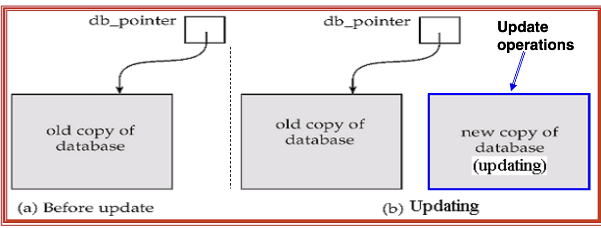
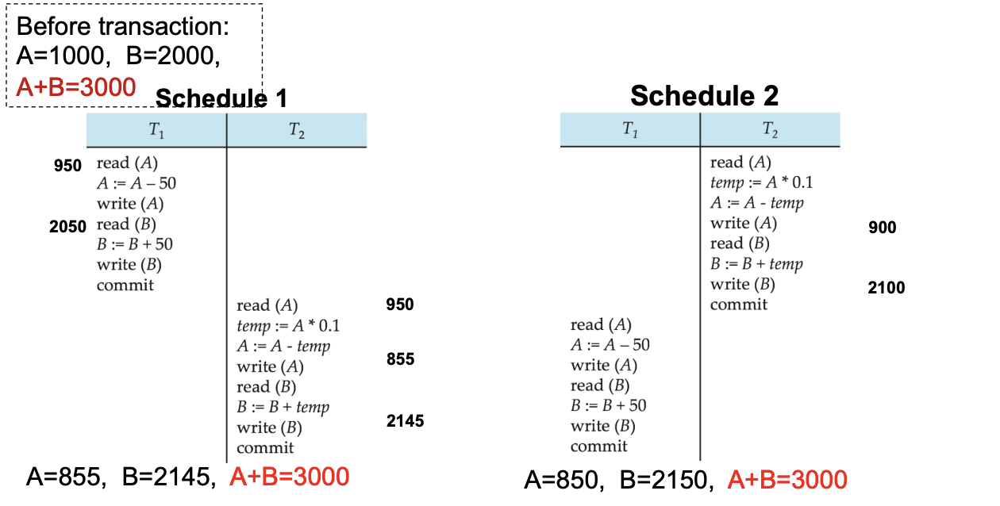
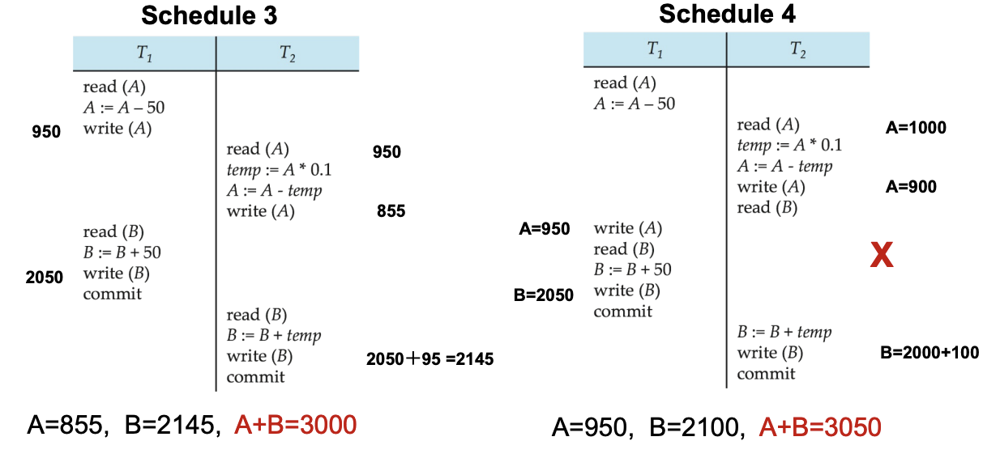
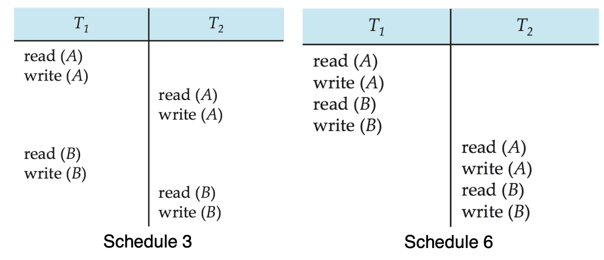
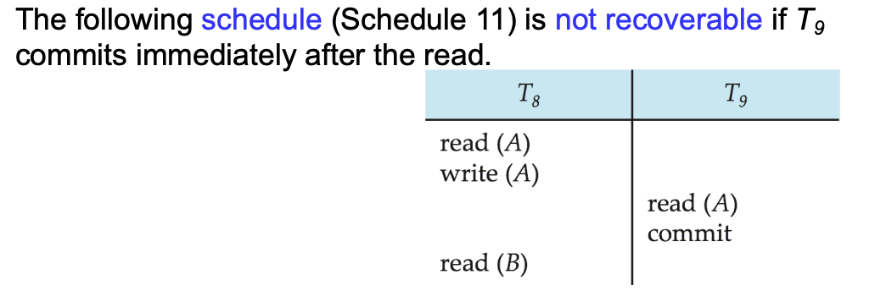
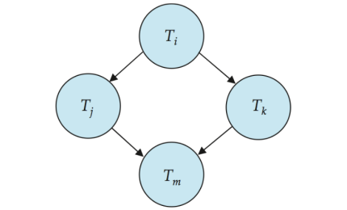

# Transactions

## 12.1 Transaction Concept

对于一个 DBMS，有两类问题必须被解决：

- 来自多个用户或者程序的指令需要并发执行
- 各种各样的异常，例如硬件损坏、系统崩溃

为了在系统并发执行时，维护系统的正确性、一致性以及完整性，引入了 Transaction 的概念。==Transaction（事务）==是数据库中的一个程序执行单元，它会访问并可能更新若干数据项

- 一个 transaction 通常由若干条 SQL 语句组成，并以 `COMMIT` 或 `ROLLBACK` 结束
- 事务开始时应看到一个 consistent database
- 事务执行过程中数据库可能暂时处于不一致状态，但成功提交后数据库必须重新回到一致状态。

!!! abstract

    Transaction 的意义是：
    把一组读写操作包装成一个可靠的逻辑单元，使数据库在故障和并发环境下仍能保持正确。

---

### 12.2 ACID Properties

!!! example "Example: Fund Transfer"

    考虑从账户 $A$ 向账户 $B$ 转账 $50$：

    ```text
    1. read(A)
    2. A := A - 50
    3. write(A)
    4. read(B)
    5. B := B + 50
    6. write(B)
    ```

    这个例子贯穿事务的四个重要性质：

    - Atomicity
    - Consistency
    - Isolation
    - Durability

事务必须满足 **ACID properties**：

| 性质          | 含义                        |
| ----------- | ------------------------- |
| Atomicity   | 事务的所有操作要么全部生效，要么全部不生效     |
| Consistency | 事务从一个一致的状态出发，提交后仍应保持数据库一致 |
| Isolation   | 并发执行时，每个事务应感觉自己像是在独占数据库   |
| Durability  | 事务一旦提交，其结果必须永久保存，即使之后发生故障 |

#### 12.2.1 Atomicity

**事务中的所有操作要么全部完成，要么事务对数据库的影响完全不反映出来。**
在转账例子中：

- 如果执行到 `write(A)` 之后、`write(B)` 之前系统崩溃。
- 账户 $A$ 已经减少 $50$，账户 $B$ 还没有增加 $50$。
- 此时数据库处于不一致状态。
系统必须保证：部分执行的事务不能留下可见结果，如果事务未能完成，应撤销已经执行的更新。

#### 12.2.2 Consistency

**如果事务开始时数据库是一致的且事务本身逻辑正确，那么事务成功提交后，数据库仍然一致。**
转账例子中，一致性要求 $A + B$ 在事务执行前后保持不变。

- 更一般地，一致性约束包括：
    - 显式指定的 integrity constraints：
        - primary key
        - foreign key
        - `CHECK` constraints
    - 隐式业务约束：例如所有账户余额总和、贷款总额与现金余额之间的关系

!!! warning

    错误的事务逻辑可能破坏 consistency。DBMS 只能保证事务机制本身可靠，不能自动修正应用层的错误业务逻辑。

#### 12.2.3 Isolation

**多个事务并发执行时，每个事务不应看到其他事务尚未完成的中间状态。**

在转账例子中：

- $T_1$ 执行完 `write(A)` 后，$A$ 已经减少。
- 但此时 $B$ 还没有增加。
- 如果另一个事务 $T_2$ 在这个时刻读取 $A$ 和 $B$，就会看到错误的总和。

```text
T1:
1. read(A)
2. A := A - 50
3. write(A)
4. read(B)
5. B := B + 50
6. write(B)

T2:
read(A)
read(B)
print(A+B)
```

如果 $T_2$ 在 $T_1$ 的步骤 3 和步骤 6 之间执行，就可能读到不一致状态。

最简单的隔离方式：**串行执行事务，即一个事务结束后再执行下一个**。但这样会牺牲并发带来的性能，因此实际 DBMS 会使用 concurrency control。

#### 12.2.4 Durability

一旦系统通知用户事务已经完成，事务对数据库的更新就必须**永久保存**。即使之后发生软件或硬件故障，提交结果也不能丢失。

在转账例子中：

- 如果系统已经告诉用户转账成功。
- 那么即使随后系统崩溃，$A$ 减少 $50$、$B$ 增加 $50$ 的结果也必须保留。

---

## 12.2 Transaction State

**一个 transaction 在生命周期中会经历若干状态**

<div style="text-align: center"></div>

1. **Active**：初始状态，事务正在执行中
2. **Partially Committed**：事务的最后一条语句已经执行完成，但系统还需要完成提交相关工作。
3. **Failed**：系统发现事务不能继续正常执行。
4. **Aborted**：事务已经回滚，数据库被恢复到该事务开始之前的状态。
    - 事务 abort 后有两个选择：
        1. Restart the transaction：仅当失败不是事务内部逻辑错误时才适用
        2. Kill the transaction：如果事务本身逻辑错误，就不应重启
5. **Committed**：事务成功完成，对数据库的更新已经被确认并持久保存。

---

## 12.3 Implementation of Atomicity and Durability

DBMS 中的 ==recovery-management component== 负责支持：Atomicity 以及 Durability

### Shadow-Database Scheme

一个简单但低效的方案：

- 系统维护一个指针 `db_pointer`，指针始终指向当前一致的数据库副本
- 所有更新都写入新创建的数据库副本，原来的数据库副本称为 **shadow copy**，保持不变
    - 如果事务 abort：直接删除新副本，`db_pointer` 仍然指向原来的 shadow copy
    - 如果事务 commit：
        1. 将新副本中所有内存页写入磁盘（在 Unix 中可用类似 `flush` 的操作确保写盘）
        2. 将 `db_pointer` 改为指向新副本，新副本成为当前数据库并删除旧副本

<div style="text-align: center"></div>

- 指针切换必须是**原子**的
    - 如果指针切换前崩溃，系统仍使用旧副本；如果指针切换后崩溃，系统使用新副本
- 每次事务都复制整个数据库，开销极大；难以支持多个事务并发更新。
- 实际系统更常用**日志恢复技术**（后续会介绍）

---

## 12.4 Concurrent Executions

多个事务可以在数据库系统中并发执行。

- **并发执行的优点**：
    1. **提高处理器和磁盘利用率**
        - 一个事务等待磁盘 I/O 时，另一个事务可以使用 CPU
        - 一个事务使用 CPU 时，另一个事务可以读写磁盘
    2. **提高事务吞吐量**：单位时间内完成更多事务
    3. **降低平均响应时间**：短事务不必一直排在长事务后面等待
- **并发执行的问题**：
    - 即使每个事务单独执行都能保持 consistency，它们交错执行时仍可能破坏 consistency
- 因此 DBMS 需要 ==concurrency control schemes（并发控制方案）==，控制并发事务之间的交互，实现 isolation，防止并发执行破坏数据库一致性。

!!! tip

    Concurrency control 是 DBMS 的重要职责之一。
    本讲先研究并发执行的正确性标准，如 serializability、recoverability 等；具体并发控制协议后续（Chapter15）再讲。

### Schedules

==Schedule（调度）==：多个并发事务中**各条指令实际执行的时间顺序**。
一个合法 schedule 必须满足：

- 包含这些事务的所有指令。
- 保持每个事务内部指令的原始顺序。

#### Serial Schedule

**串行调度**：每个事务完整执行完后，才开始执行下一个事务，不同事务之间**没有交错**

- 如果每个事务都能保持数据库一致性，则任意 serial schedule 都能保持数据库一致性。

<div style="text-align: center"></div>

#### Concurrent Schedule

**并发调度**：多个事务的操作交错执行，可能更高效，但不一定正确。

<div style="text-align: center"></div>

---

## 12.5 Serializability

**Serializability（可串行化）** 是判断并发调度正确性的核心标准

- 一个 schedule 如果与某个 serial schedule 等价，则称为 ==serializable==，不同的等价定义会产生不同的可串行化概念：
    1. Conflict serializability
    2. View serializability

!!! tip "Simplified View of Transactions"

    为了讨论 serializability，通常把事务简化为**对数据项的读写序列**，其他计算步骤只影响事务内部的局部变量，不直接影响数据库状态。

### 12.5.1 Conflict Serializability

#### Conflicting Instructions

设 $l_i$ 是事务 $T_i$ 的一条指令，$l_j$ 是事务 $T_j$ 的一条指令，并且 $i \ne j$。如果存在某个数据项 $Q$，满足 $l_i$ 和 $l_j$ 都访问 $Q$，且至少有一条指令写 $Q$，则称 $l_i$ 和 $l_j$ <font color="#ff0000">conflict</font>。

- 两个读操作可以交换顺序，不影响结果。
- 只要涉及写操作，顺序就可能影响读到的值或最终写入的值。

#### Conflict Equivalent

- 如果 schedule $S$ 可以通过一系列交换变成 schedule $S'$，并且每次交换的都是 non-conflicting instructions，则称：$S \equiv_c S'$
    - 即 $S$ 和 $S'$ ==conflict equivalent==
- 如果一个 schedule 与某个**串行调度**是 conflict equivalent 的，则称该 schedule 是 ==conflict serializable==

!!! example

    <div style="text-align: center"></div>

    - Schedule 3 can be transformed into Schedule 6, a serial schedule where $T_2$ follows $T_1$, by series of swaps of non-conflicting instructions. 
    - Therefore Schedule 3 is <font color="#ff0000">conflict serializable</font>.

### 12.5.2 \*View Serializability

View serializability 比 conflict serializability 更宽松

#### View Equivalent

两个 schedule $S$ 和 $S'$ 对同一组事务是 ==view equivalent==，当且仅当对每个数据项 $Q$ 都满足以下三个条件：

1. **Initial read 相同**
    - 如果在 $S$ 中，事务 $T_i$ 读取的是 $Q$ 的初始值；
    - 那么在 $S'$ 中，$T_i$ 也必须读取 $Q$ 的初始值。
2. **Reads-from 关系相同**
    - 如果在 $S$ 中，事务 $T_i$ 执行 `read(Q)` 时，读到的是事务 $T_j$ 写入的值；
    - 那么在 $S'$ 中，$T_i$ 也必须读到同一个 $T_j$ 写入的值。
3. **Final write 相同**
    - 如果在 $S$ 中，最终写入 $Q$ 的事务是 $T_i$；
    - 那么在 $S'$ 中，最终写入 $Q$ 的事务也必须是 $T_i$。

#### View Serializable

如果 schedule $S$ 与某个串行调度 view equivalent，则称 $S$ 是：
==view serializable==

- 每个 conflict-serializable schedule 都是 view-serializable
- 但并不是每个 view-serializable schedule 都是 conflict-serializable

View serializability 能接受一些 conflict serializability 排除的调度，特别是包含 **blind write（一个事务写某个数据项之前没有先读它）** 的情况。

### 12.5.3 Other Notions of Serializability

除了 conflict / view serializability，还可以定义其他等价标准，例如只要求最终数据库状态与某个 serial schedule 相同。但这种标准通常太弱，它可能忽略事务中读到的中间值，因此不能很好地保证事务语义。

---

## 12.6 Recoverability

Serializability 主要关注并发执行是否等价于串行执行，但还需要考虑故障恢复问题：如果某个事务 abort，其他读过它数据的事务怎么办？

### 12.6.1 Recoverable Schedule

==Recoverable schedule（可恢复调度）==：如果事务 $T_j$ 读取了事务 $T_i$ 之前写入的数据项，那么 $T_i$ 的 `commit` 必须出现在 $T_j$ 的 `commit` 之前。

- 否则会出现问题：$T_j$ 已经提交，但它读到的数据来自尚未提交的 $T_i$，如果 $T_i$ 后来 abort，$T_j$ 的提交结果就建立在无效数据上。

!!! bug

    <div style="text-align: center"></div>

    - 如果 $T_8$ 需要撤销，那么它关于 $A$ 的修改会无效，但是 $T_9$ 读取的是 $T_8$ 修改后的数值，因此它使用了一个**从未真正存在过**（或者说是错误的）的数据值完成了它的任务。

### 12.6.2 Cascading Rollbacks

==Cascading rollback（级联回滚）==：一个事务失败，导致一系列依赖它的事务也必须回滚。

```text
T10 写 X
T11 读 X
T12 读 T11 写出的某个值
T10 abort
```

如果 $T_{10}$ abort：

- $T_{11}$ 读过 $T_{10}$ 写的未提交数据，因此必须回滚
- $T_{12}$ 又依赖 $T_{11}$，也可能必须回滚

### 12.6.3 Cascadeless Schedules

==Cascadeless schedule（无级联调度）==：对任意事务 $T_i$ 和 $T_j$，如果 $T_j$ 要读取 $T_i$ 写过的数据项，那么 $T_i$ 必须已经提交。

- 也就是说只允许事务读取已经提交的数据：

$$
\text{commit}(T_i) < \text{read}_{T_j}(Q)
$$

性质：

- 每个 cascadeless schedule 都是 recoverable
- 但 recoverable schedule 不一定是 cascadeless

!!! abstract

    Recoverable schedule 要求“读了别人数据的事务，不能比写者先提交”；
    Cascadeless schedule 更严格，要求“只能读已经提交的数据”。

---

## 12.7 Implementation of Isolation

- **每次只允许执行一个事务**可以保证串行调度，但提供的并发度很差。
- 为了数据库的一致性，调度必须 **conflict serializable** 或 **view serializable**，并且是可恢复的，最好还是无级联的（cascadeless）
- 并发控制方案（Concurrency-control schemes）是在他们允许的并发程度和产生的开销之间进行权衡
- 一些方案只允许生成冲突可串行化的调度，而另一些方案则允许生成非冲突可串行化的视图可串行化调度。

---

## 12.8 Transaction Definition in SQL

- 数据操作语言（DML）必须包含一种用于指定构成事务的一组操作的构造
    - 即可以让多个指令（例如 `SELECT`、`INSERT`、`UPDATA`）同属于一个事务
- 在 SQL 中，事务隐式开始：执行某条 SQL 语句时，如果当前没有事务，就自动开始新事务
- 事务结束方式：
    1. `COMMIT`：当前事务成功结束，所有更新永久写入数据库，事务进入 committed 状态
    2. `ROLLBACK`：当前事务失败或被用户撤销，更新被撤销，数据库恢复到事务开始前的状态
- 在几乎所有的数据库系统中，默认情况下，如果每条 SQL 语句执行成功，它也会隐式地自动提交。
    - 隐式提交可以通过数据库指令关闭，例如在 JDBC 中使用 `connection.setAutoCommit(false)`

---

## 12.9 Testing for Serializability

### 12.9.1 Precedence Graph

测试 conflict serializability 的常用方法是构造 ==precedence graph（优先图）==
给定一个 schedule，构造有向图：

- 顶点：事务 $T_1,T_2,\dots,T_n$。
- 边：如果 $T_i$ 和 $T_j$ 的某些操作 conflict，且 $T_i$ 的冲突操作先于 $T_j$ 的冲突操作，则加入边 $T_i \rightarrow T_j$，边可以标注冲突的数据项：

### 12.9.2 Test for Conflict Serializability

**定理**：<u>一个 schedule 是 conflict serializable，当且仅当它的 precedence graph 是 acyclic 的</u>

<div style="text-align: center"></div>

- 如果 precedence graph 有环：
    - 不存在与之 conflict equivalent 的 serial schedule。
    - 因此 schedule 不是 conflict serializable。
- 如果 precedence graph 无环：
    - schedule 是 conflict serializable。
    - 可以对图做 topological sorting，得到一个等价的 serial order。

### 12.9.3 \*Test for View Serializability

View serializability 的测试比 conflict serializability 更复杂, 这是个 NP-c 问题

- 需要检查 reads-from 关系。
- 需要检查每个数据项的 final write。
- blind writes 会让等价关系更难判定。

一般来说：

- conflict serializability 容易测试。
- view serializability 更宽松但测试代价高。

### 12.9.4 Concurrency Control vs. Serializability Tests

- 并发控制协议允许并发调度，但能确保这些调度是冲突可串行化（或视图可串行化）的，并且是可恢复且无级联的。
- 并发控制协议通常不会在优先图（precedence graph）生成时去检查它。
    - 相反，协议会强制施加一种规则（纪律），从而避免产生非可串行化的调度。
    - 我们将在第15章学习这些协议。
- 不同的并发控制协议在“允许的并发程度”和“产生的开销”之间提供了不同的权衡。
- 可串行化测试（判定方法）有助于我们理解为什么一个并发控制协议是正确的。
