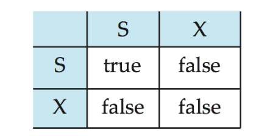
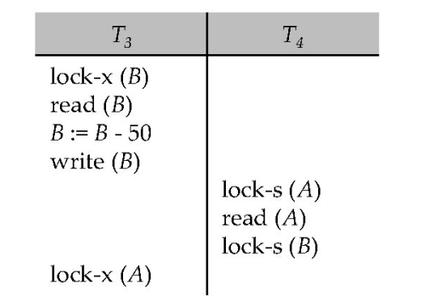
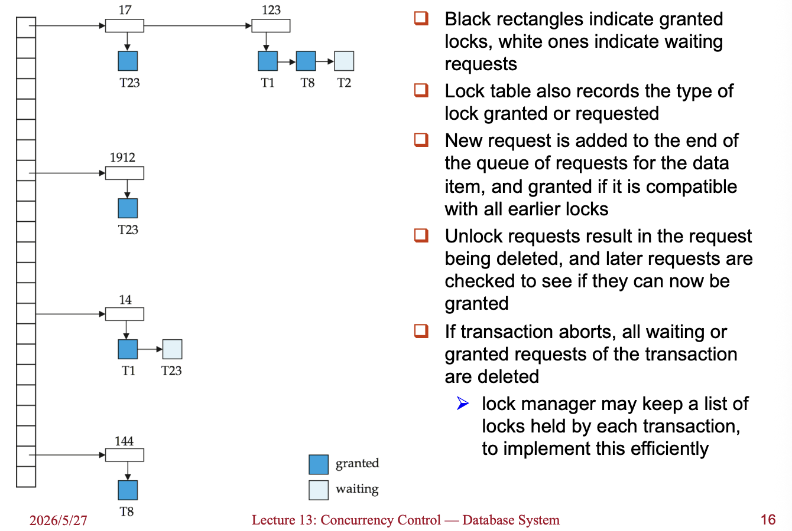
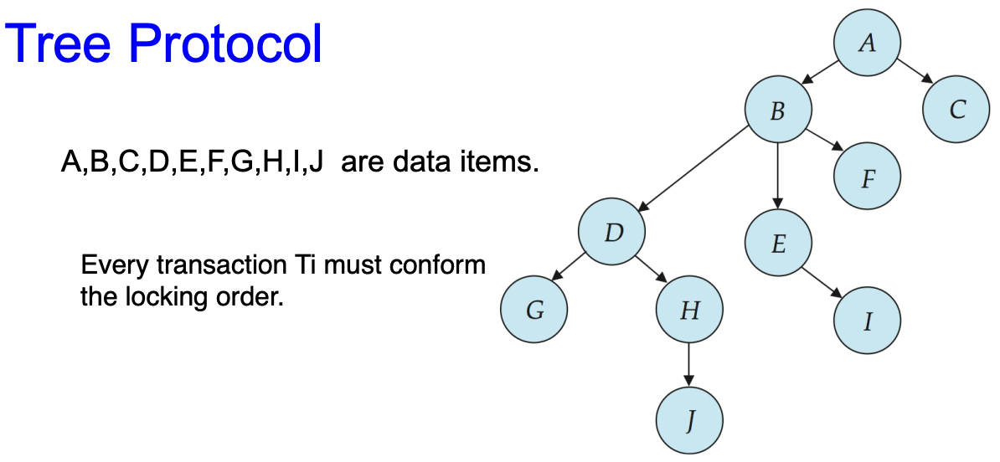
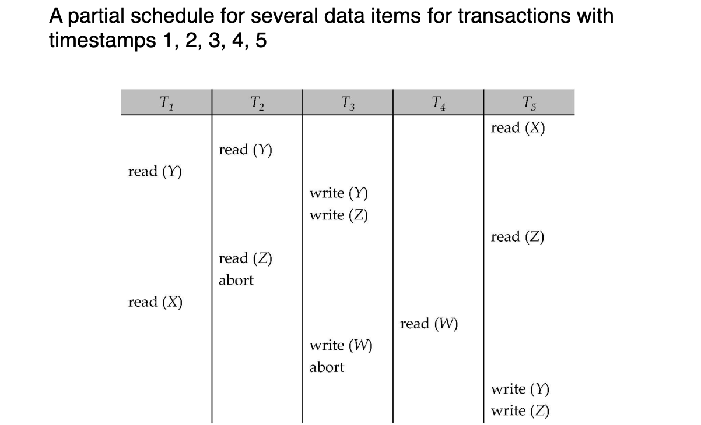
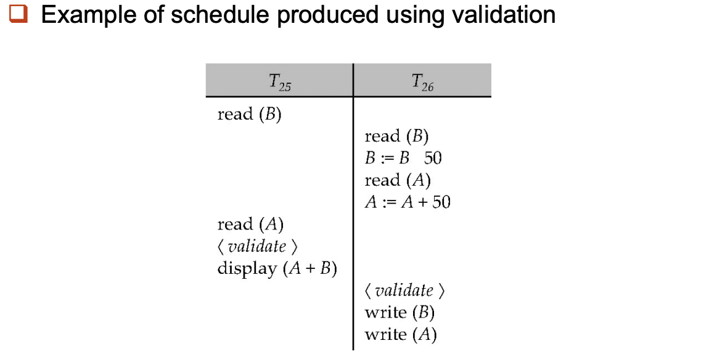
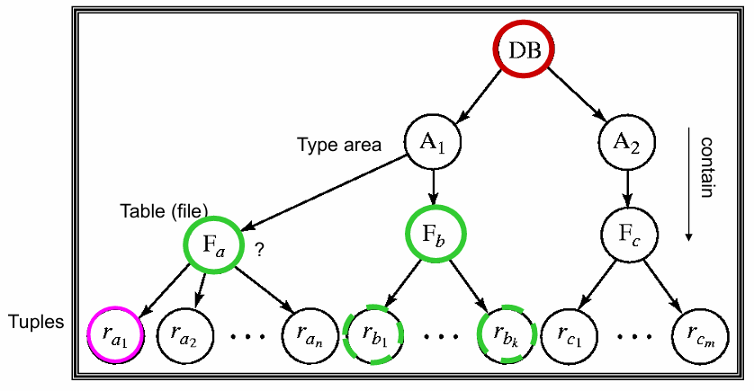
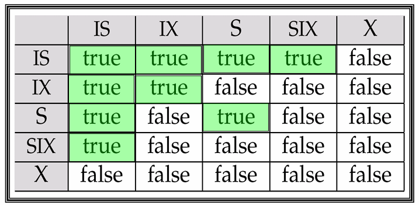
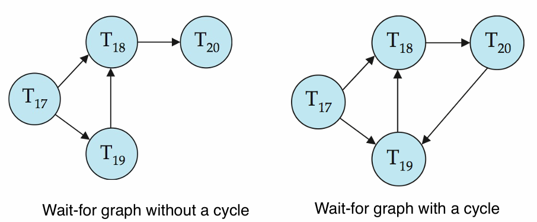

# Concurrency Control

!!! abstract

    Concurrency control 的目标是在多个 transaction 并发执行时，仍然保证数据库的 correctness。

    这一讲主要讨论不同的并发控制协议：lock-based protocols、graph-based protocols、timestamp-based protocols、validation-based protocols、multiple granularity、multiversion schemes，以及 deadlock handling。

---

## 13.1 Lock-Based Protocols

### 13.1.1 Lock-Based Protocols

Lock-based protocol 要求 transaction 在访问 data item 之前先获得对应的 lock。

1. **Shared lock**, `S` (共享锁)：只允许读，不允许写
2. **Exclusive lock**, `X`（排他锁）：同时允许读和写
锁请求向并发控制管理器（concurrency-control manager）发出，事务**在请求被批准后**才能执行。

!!! info "Lock compatibility matrix"

    <div style="text-align: center"></div>

    - 如果请求的锁与该数据项上其他事务已持有的锁**兼容**，则可以授予事务**在该数据项上的锁**。
    - 任意数量的事务可以持有**该数据项上的共享锁**，但如果任何事务持有该数据项上的**排他锁**，则其他任何事务都不能持有该数据项上的任何锁。
    - 如果**无法授予锁**，请求事务将被**强制等待**，直到所有不兼容锁都被释放，然后授予该锁。

也就是说：

- 多个 transaction 可以同时持有同一数据项的 `S` lock。
- 只要某个 transaction 持有 `X` lock，其他 transaction 不能再获得 `S` 或 `X` lock。

!!! example "Example of a transaction performing locking"

    ```text
    T2: lock-S(A)
    	 read(A)
    	 unlock(A)
    	 lock-S(B)
    	 read(B)
    	 unlock(B)
    	 display(A + B)
    ```

    如果在 $T_2$ 读完 $A$ 并且释放锁之后，有另外一个事务修改了 $A$ 的值，那么这时 $\text{display}(A + B)$ 可能既不是旧状态的和，也不是新状态的和，所以需要更严格的 locking protocol。

#### Pitfalls of Lock-Based Protocols

Lock-based protocol 可能带来两个典型问题：<u>Deadlock 和 Starvation</u>

##### Deadlock

**Deadlock (死锁)** 指多个 transaction 相互等待对方释放 lock，导致都无法继续执行。

<div style="text-align: center"></div>

此时 $T_3$ 持有 $B$ 的 lock 并等待 $T_4$ 释放 $A$ 的锁， $T_4$ 持有 $A$ 的 lock 并等待 $T_3$ 释放 $B$ 的锁，**两者形成循环等待**。

- 处理方法通常是 rollback 其中一个 transaction，释放它持有的 lock

##### Starvation

**Starvation (饥饿)** 指某个 transaction 长时间无法获得需要的 lock，这通常是因为<u>并发控制管理器</u>（Concurrency Control Manager）的设计存在缺陷
可能原因：

- 一个事务可能正在等待某个数据项上的排他锁，而此时一系列其他事务不断地请求并获得该数据项上的共享锁。
- 同一个事务因为死锁而被反复回滚，某一事务多次作为牺牲者被回滚
解决时通常需要公平的等待队列，或者记录 transaction 被 rollback 的次数。

#### The Two-Phase Locking Protocol

2PL 是一种确保**冲突可串行化调度**的协议，其要求每个 transaction 的 locking 行为分成两个阶段：

1. **Growing phase**：只能**申请**新的锁，**不能释放**任何锁
2. **Shrinking phase**：只能**释放**锁，不能再**申请**新的锁

只要事务遵守这个规则，2PL 可以保证产生的调度是 conflict-seriazable

- 把 transaction 获得最后一个 lock 的时刻称为 ==lock point==，把各个事务按照其 lock point 的顺序排序，可以得到等价的 *serial schedule*

!!! warning "Limitation"

    - 2PL 的问题：
        - 无法保证 deadlock 不发生
        - 可能发生 **cascading rollback（级联回滚）**
    - 因此实际系统通常使用 strict 2PL 或 rigorous 2PL 的变体。

**关于 2PL 的两种更严格的策略**：

- ==Strict Two-Phase Locking==：要求 transaction 持有所有 `X` locks 直到 commit 或 abort
    - 保证 strict schedule，避免 cascading rollback，恢复的过程更简单
- ==Rigorous 2PL==：要求 transaction 持有所有 locks，包括 `S` 和 `X` locks，直到 commit 或 abort
    - schedule 的 commit order 就是 serial order；实现简单，但并发度更低

!!! abstract "2PL & Conflict Serializability"

    2PL 是“可串行化”的**充分条件**，但不是必要条件
    但是，如果不使用 2PL，就无法保证在**任意情况下都能“可串行化”**

### 13.1.2 Lock Conversions

2PL 可以允许 lock mode conversion，但 conversion 也要遵守 two-phase 的限制
**Two-phase locking with lock conversions**:

1. Growing phase 中允许：
    - acquire `S` lock
    - acquire `X` lock
    - convert `S` lock to `X` lock（upgrade）
2. Shrinking phase 中允许：
    - release `S` lock
    - release `X` lock
    - convert `X` lock to `S` lock（downgrade）

#### Automatic Acquisition of Locks

实际数据库系统不要求程序员手动加锁和释放锁，系统会根据 transaction 自动加锁。

- 一种简单规则：

```text
read(Q):
  if Ti does not hold a lock on Q:
      lock-S(Q)
  read(Q)

write(Q):
  if Ti holds S lock on Q:
      upgrade Q to X
  else if Ti does not hold a lock on Q:
      lock-X(Q)
  write(Q)
```

释放 lock 的时机由**具体协议**决定。

- Basic 2PL：进入 shrinking phase 后释放
- Strict 2PL：X-lock 到 commit / abort 时释放
- Rigorous 2PL：所有 locks 到 commit / abort 时释放

#### Lock Manager

**锁管理器（lock manager）** 可以作为一个单独的进程来实现，事务会向它发送**加锁请求**和**解锁请求**。

- 收到加锁请求后，会回复**授予锁的消息（lock grant message）**；
  如果发生死锁，也可能回复一条消息，要求该事务进行**回滚（roll back）**。
- 发出请求的事务会一直等待，直到它的请求得到锁管理器的响应

!!! info "Lock Table"

    - 锁管理器会维护**锁表（lock table）**，用来记录已经授予的锁，以及正在等待处理的锁请求
    - 锁表通常为一个**内存中的哈希表（in-memory hash table）**，以被加锁的数据项名称作为索引

    <div style="text-align: center"></div>

### 13.1.3 Graph-Based Protocols

Graph-based protocol 是 2PL 的一种替代方法。
它对数据项集合 $D = {d_1, d_2, \dots, d_h}$ 定义一个 partial ordering：$\rightarrow$

- 如果一个 transaction 同时访问 $d_i$ 和 $d_j$，且存在 $d_i \rightarrow d_j$ ，那么它必须先访问 $d_i$，再访问 $d_j$。
- 所有数据项和偏序关系构成一个 directed acyclic graph，称为 ==database graph==

#### Tree Protocol

Tree protocol 是一种简单的 graph-based protocol，事务加锁时必须遵守树中的父子顺序

<div style="text-align: center"></div>

规则：

1. 在这个协议中，只允许使用 **exclusive lock**，也就是 X-lock
2. Transaction 的第一个 lock 可以加在任意 data item 上，之后只有在持有 parent 的 lock 时，才能 lock 某个 child
3. Data item 可以在任意时候 unlock
4. 一个 data item 一旦 unlock，之后不能被同一个 transaction 重新 lock

Tree protocol 的优点：

- Guarantees conflict serializability and deadlock freedom
- 不要求遵守 2PL，允许在之后继续申请别的 lock 前释放某些 lock
    - 缩短了等待时间，增强了并行性；没有死锁，不需要 rollback
但它也有缺点：
- 可能需要锁住一些本来不需要访问的数据项，只是为了到达目标节点
- 可能产生 cascading rollback，因为 release lock 比较早

---

## 13.2 \*Timestamp-Based Protocols

每个事务进入系统时都会被分配一个**时间戳（timestamp）**。如果一个较早进入系统的事务 $T_i$ 的时间戳为 $TS (T_i)$，那么后来进入系统的新事务 $T_j$ ​ 会被分配一个时间戳 $TS(T_j)$，满足：$TS(T_i)<TS(T_j)$

- 该协议通过管理事务的并发执行，使得**时间戳顺序决定事务的可串行化顺序（serializability order）**。
- 为了保证这一性质，协议会为每个数据项 $Q$ 维护两个时间戳：
    1. W-timestamp(Q)：所有成功执行过 `write(Q)` 的事务中，时间戳最大的那个事务的时间戳
    2. R-timestamp(Q)：所有成功执行过 `read(Q)` 的事务中，时间戳最大的那个事务的时间戳
- timestamp ordering protocol 确保了任何冲突的读写操作都按照<u>时间戳的顺序</u>执行

!!! info "具体操作"

    假设事务 $T_i$ 发出一个 `read(Q)` 操作

    - 如果：$TS (T_i) \leq \text{W-timestamp}(Q)$
      说明 $T_i$ 需要读取的 $Q$ 已经被后来的事务覆盖了。因此该操作会被拒绝，并且事务 $T_i$ 被回滚
    - 如果：$TS (T_i) \geq \text{W-timestamp}(Q)$
      那么该读操作可以执行，随后将 $\text{R-timestamp}(Q)$ 更新为 $\max (\text{R-timestamp}(Q), TS (T_i))$

    假设事务 $T_i$ 发出一个 `write(Q)` 操作

    - 如果：$TS (T_i) \leq \text{R-timestamp}(Q)$
      说明 $T_i$ 现在要产生的 $Q$ 的值，本应该在之前就已经产生，因为某个时间戳更大的事务已经成功读取过 $Q$。系统此前已经假定这个值不会再被产生，因此该写操作被拒绝，事务 $T_i$ 被回滚。
    - 如果：$TS (T_i) \leq \text{W-timestamp}(Q)$
      说明 $T_i$ 正试图写入一个已经过时的 $Q$ 值。也就是说，某个时间戳更大的事务已经成功写过 (Q)。因此该写操作被拒绝，事务 $T_i$ 被回滚。
    - 否则（即上述两个条件都不满足）：
      该写操作允许执行，并将 $\text{W-timestamp}(Q)$ 设置为 $TS (T_i)$
      即记录当前事务成为最近一次成功写入 $Q$ 的事务

<div style="text-align: center"></div>

### Correctness of the Protocol

Timestamp-ordering protocol 的正确性来自：

- 所有 conflicting operations 都按 timestamp order 执行，因此 precedence graph 中的边只会从 older transaction 指向 younger transaction。**不可能出现 cycle**
- 但是，basic timestamp ordering 不一定保证 recoverability 以及 cascade-free

### Recoverability and Cascade Freedom

**Problem** with timestamp-ordering protocol：

```text
Tj reads value written by Ti
Tj commits
Ti aborts
```

- 此时 $T_j$ 必须回滚；如果 $T_j$ ​在此之前已经 commit，那么该调度将不是**可恢复的（recoverable）**
- 此外，任何读取过由 $T_j$ ​ 写入数据项的事务，也都必须回滚，这可能导致**级联回滚**

 **Solutions**:

1. 将所有写操作放在事务末尾执行 (事务先完成所有计算，最后统一执行写操作)
2. 所有写操作作为**一个原子动作**执行
3. 回滚事务重新启动时获得新的时间戳
通过这种方式可以实现 **Strict Timestamp Ordering**，从而避免级联回滚并保证调度具有可恢复性。

### Thomas' Write Rule

Thomas' write rule 是 timestamp-ordering protocol 的一个优化

- 在 Basic timestamp ordering 中，如果 $TS(T_i) < \text{W-timestamp}(Q)$，则 $T_i$ rollback。
- 但在 Thomas' write rule 中，**对于已经过时（obsolete）的写操作，可以直接忽略这次写操作**
    - 如果 $T_i$ 的 write 已经 obsolete，就直接 ignore 这个 write，不需要 rollback $T_i$。

!!! tip

    Thomas 写规则能够提供更高的并发性。与之前的协议不同，它允许某些**视图可串行化（view-serializable）但不是冲突可串行化（conflict-serializable）**的调度存在。

---

## 13.3 \*Validation-Based Protocol

Validation-based protocol 也被称为 **optimistic concurrency control**（乐观并发控制），因为事务会完全执行，寄希望于在验证期间一切顺利

- 事务 $T_i$ 的执行分为三个阶段
    1. **Read and execution phase**：事务 $T_i$ ​仅写入临时局部变量
    2. **Validation phase**：事务 $T_i$ ​执行“验证测试”以确定是否可以在不违反可串行性的情况下写入局部变量。
    3. **Write phase**：如果 $T_i$ ​通过验证，则将更新应用到数据库；否则，$T_i$ ​回滚。
- 并发执行事务的三个阶段可以交错，但每个事务必须按顺序经历这三个阶段。
    - 为简单起见，假设验证和写阶段同时发生，具有原子性和串行性，即一次只有一个事务执行验证/写操作。

每一个事务 $T_i$ 都有三个特定的时间戳

- $\text{Start} (T_i)$：开始执行的时间
- $\text{Validation}(T_i)$：进入验证测试的时间
- $\text{Finish}(T_i)$：结束写入的时间

如何确定可串行化顺序
为了提高并发度，通常以 $\text{Validation}(T_i)$ 作为 transaction 的 timestamp

- 即 $TS (T_i)$ 采用的是 $\text{Validation}(T_i)$ 的值

当**冲突概率较低**时，这个协议非常有用，并且能提供更高的并发度。

1. **非预定义顺序**：可串行化的顺序不是预先定死的，这给了系统更多的灵活性。
2. **回滚少**：因为冲突少，所以很少有事务会在验证阶段失败，也就很少需要回滚（Rollback）。

### Validation Test

对 transaction $T_j$ 做 validation 时，需要检查所有 timestamp 更小的 transaction $T_i$

对每个这样的 $T_i$，必须满足以下条件之一：

1. **完全无重叠**

$$
\text{Finish}(T_i) < \text{Start}(T_j)
$$

    事务 $T_i$ 在 $T_j$ 开始前就已经彻底完成了

2. **有重叠但读写不冲突**

$$
\text{Start}(T_j) < \text{Finish}(T_i) < \text{Validation}(T_j)
$$

    并且

$$
\text{write-set}(T_i) \cap \text{read-set}(T_j)=\emptyset
$$

    虽然时间重叠，但 $T_i$ ​ 写的东西，$T_j$ ​ 并没有读。

- 如果所有的 $T_i$ 都满足上述条件，那么 $T_j$ 验证通过，可以提交；否则 $T_j$ 必须回滚

<div style="text-align: center"></div>

---

## 13.4 Multiple Granularity

前面的 locking protocol 往往默认 lock 的对象是单个 data item，但实际系统中，数据项的大小可以不同。允许 transaction 根据需要在不同的粒度上加锁，这就是 **multiple granularity（多粒度）**。

- 常见的 granularity hierarchy 可以组织成**一棵树**：

<div style="text-align: center"></div>

- 在这个 hierarchy 中，小粒度的数据项嵌套在大粒度的数据项中。
- 如果 transaction 显式锁住树中的一个节点，那么它也会以同样的形式**隐式锁住该节点的所有后代**

!!! warning

    这里的 tree 只是表示数据粒度的层次结构，不要和前面的 tree-locking protocol 混淆。

加锁粒度越细，并发度通常越高，但 lock overhead 也越高：

- 锁 tuple：允许更多 transaction 同时访问不同 tuple，但 lock 数量很多。
- 锁 table / file：lock 数量少，但会阻塞更多本来可以并发的操作。

### 13.4.1 Intention Lock

Multiple granularity 的主要问题是：
<u>高层 node 要加锁时，系统不应该每次都遍历整棵 subtree 去检查下面有没有冲突锁。</u>
以上图的 Tree 作为例子

- $T_1$ 已经在 $r_{a_1}$ 上加了 X-lock，$T_2$ 已经在 $F_b$ 上加了 S-lock
- 此时 $T_3$ 想在 $F_a$ 上加 S-lock，$T_4$ 想在整个 database 上加 S-lock
如果没有额外信息，$T_4$ 要判断能不能锁整个 database，就可能需要遍历整棵树。

!!! note "解决方法是使用 ==intention lock（意向锁）==："

    - 在显式锁住某个 node 之前，先在它的所有 ancestors 上加 intention locks
    - 这样高层 node 就能通过 ancestor 上的 intention locks 判断下面是否可能存在冲突锁
    - 因而对高层 node 加 S 或 X lock 时，不需要检查所有 descendants

##### Intention Lock Modes

Multiple granularity 中有三种 intention lock modes：

1. **Intention-shared**（$IS$，共享型意向锁）
    - 表明其后代存在 S 锁
2. **Intention-exclusive**（$IX$，排他型意向锁）
    - 表明其后代存在 X 锁
3. **Shared and intention-exclusive**（$SIX$，共享排他型意向锁）
    - 以该节点为根的子树（即整个表或该层级下的所有数据）被显式加了 S-lock
    - 同时，事务**意图**对较低层级进行显式的排他锁（X 锁）操作

!!! info "Intention locks 的作用"

    Intention locks 不是为了直接读写当前 node，而是为了告诉系统：这个 transaction 将在更低层的 node 上加共享锁或排他锁。

#### Compatibility Matrix

所有 lock modes 的 compatibility matrix 如下：

<div style="text-align: center"></div>

一些关键判断：

- $IS$ 与 $IS$ / $IX$ / $S$ / $SIX$ 都兼容，因为它只表示后代上可能有 shared lock
- $IX$ 与 $S$ 不兼容，因为一个事务想读整个 subtree，另一个事务可能在 subtree 内部写
- $SIX$ 只和 $IS$ 兼容，因为它已经包含了整个 subtree 的 S-lock 和 lower level 的 $IX$ 意图
- $X$ 与任何其他锁都不兼容

### 13.4.2 Multiple Granularity Locking Scheme

Transaction $T_i$ 可以按照下面的规则 lock 一个 node $Q$：

1. 必须遵守 lock compatibility matrix
2. 树的根节点必须最先被 lock，并且可以用任意 mode
3. 如果 $T_i$ 要以 $S$ 或 $IS$ 锁住 node $Q$，则 $T_i$ 必须已经以 $IX$ 或 $IS$ lock 住 $Q$ 的 parent
4. 如果 $T_i$ 要以 $X$、$SIX$ 或 $IX$ mode lock node $Q$，则 $T_i$ 必须已经以 $IX$ 或 $SIX$ mode lock 住 $Q$ 的 parent。
5. $T_i$ 只有在**没有 unlock 过任何 node** 时，才可以继续 lock 新 node，也就是仍然遵守 2PL。
6. $T_i$ 只有在没有 lock 住 $Q$ 的任何 child 时，才可以 unlock $Q$。

!!! abstract

    - 加锁自顶向下，解锁自下而上，且遵守2PL协议
    - 优势是既能在高层用 coarse-grained lock 降低加锁开销，也能在低层用 fine-grained lock 提高并发性。

---

## 13.5 \*Multiversion Schemes

Multiversion schemes 通过保存 data item 的旧版本来提高并发度。

- 主要有两类：
    1. **Multiversion Timestamp Ordering**
    2. **Multiversion Two-Phase Locking**
- 核心思想：
    - 每次 successful write 都会创建被写 data item 的一个新版本。
    - 使用 timestamps 给不同版本做标记。
    - 当执行 `read(Q)` 时，根据 transaction 的 timestamp 选择一个合适版本返回。
    - 因为系统总能返回某个合适版本，所以 **reads never have to wait**

### 13.5.1 Timestamp Ordering

对每个 data item $Q$，系统维护一组版本：

$$
\langle Q_1, Q_2, \dots, Q_m \rangle
$$

每个版本 $Q_k$ 包含三个 fields：

1. Content：版本 $Q_k$ 的具体值
2. $\text{W-timestamp}(Q_k)$：创建 / 写入该版本的 transaction timestamp
3. $\text{R-timestamp}(Q_k)$：成功读过该版本的最大 transaction timestamp

当 transaction $T_i$ 创建一个新版本 $Q_k$ 时：

$$
\text{W-timestamp}(Q_k)=\text{R-timestamp}(Q_k)=TS(T_i)
$$

之后如果 transaction $T_j$ 读取了 $Q_k$，且：

$$
TS(T_j)>\text{R-timestamp}(Q_k)
$$

则更新：

$$
\text{R-timestamp}(Q_k)=TS(T_j)
$$

#### Read and Write Rules

假设 transaction $T_i$ 发出 `read(Q)` 或 `write(Q)`，
令 $Q_k$ 表示满足下面条件的版本：

$$
\text{W-timestamp}(Q_k)\le TS(T_i)
$$

并且在所有满足条件的版本中，$\text{W-timestamp}(Q_k)$ 最大。也就是说，$Q_k$ 是 $T_i$ 按 timestamp 应该看到的最新版本。

1. 如果 $T_i$ 执行 `read(Q)`：
    - 系统直接返回 $Q_k$ 的 content
    - 因此 read 总是可以成功，不需要等待
2. 如果 $T_i$ 执行 `write(Q)`：
    - 如果 $TS(T_i)<\text{R-timestamp}(Q_k)$，则 $T_i$ rollback
    - 如果 $TS(T_i)=\text{W-timestamp}(Q_k)$，则直接 overwrite $Q_k$ 的 content
    - 否则，创建 $Q$ 的一个新版本

### 13.5.2 Two-Phase Locking

Multiversion 2PL 区分两类 transaction：

- read-only transactions
- update transactions

#### Update Transactions

**Update Transactions**：在执行读操作时获取共享锁，写操作时获取排他锁，并持有所有 lock 直到 transaction 结束。因此 update transactions 遵守 ==rigorous 2PL==

- 每次更新事务成功执行写操作，都会创建该数据项的一个**新版本**
- 每个版本有一个 timestamp，只有在事务正式提交时，系统才会从全局计数器 ts-counter 中获取一个递增的值，将其作为该新版本的时间戳。

!!! info "Operations"

    - 当 update transaction 要 `read(Q)` 时，先获得 `S-lock`，然后读取 $Q$ 的 latest version
    - 当 update transaction 要 `write(Q)` 时，先获得 `X-lock`，然后创建一个新版本，并把这个版本的 timestamp 暂时设为 $\infty$。
    - 当 update transaction $T_i$ completes 时，进入 commit processing：
        1. 把 $T_i$ 创建的所有版本的 timestamp 设为 $\text{ts-counter}+1$
        2. 将 $\text{ts-counter}$ 加 1

#### Read-Only Transactions

Read-only transaction 在开始执行之前，会读取当前的 `ts-counter` 值作为自己的 timestamp，之后它按照 multiversion timestamp-ordering protocol 来执行 reads：

- 如果它在 $T_i$ 递增 `ts-counter` 之后开始，就能看到 $T_i$ 更新后的值。
- 如果它在 $T_i$ 递增 `ts-counter` 之前开始，就只能看到 $T_i$ 更新前的值。

!!! abstract

    Multiversion 2PL 的效果是：update transaction 之间用 rigorous 2PL 保证正确性，而 read-only transaction 通过读旧版本避免等待。该协议**只产生 serializable schedules**。

---

## 13.6 Deadlock Handling

考虑两个 transaction：

- 如果 $T_1$ 已经锁住 $X$，$T_2$ 已经锁住 $Y$，然后 $T_1$ 等 $Y$、$T_2$ 等 $X$，就会形成 deadlock

```text
T1: write(X)        T2: write(Y)
    write(Y)            write(X)
```

- 系统处于 **deadlock state** 的定义是：存在一个 transaction 集合，使得集合中的每个 transaction 都在等待集合中的另一个 transaction。
- 处理 deadlock 有两类方法：
    1. **Deadlock prevention**
    2. **Deadlock detection and deadlock recovery**

### 13.6.1 Deadlock Prevention

Deadlock prevention protocols 保证系统永远不会进入 deadlock state
常见策略：

1. **Predeclaration / Conservative 2PL**
    - 要求每个 transaction 在开始执行之前锁住所有需要的数据项
    - 要么所有 locks 都获得，要么一个都不获得
    - 缺点是 concurrency 差，而且很难提前预测所有需要的数据项
2. **Ordering of data items**
    - 对所有 data items 施加一个 partial ordering
    - Transaction 只能按照这个 order 加锁
    - 这样 wait-for graph 中不会形成 cycle（Graph-based protocol）

!!! tip "Starvation Prevention"

    在 Wait-Die 和 Wound-Wait 这两种策略中，系统会根据事务的时间戳来决定是等待还是回滚。

    - **保留原始时间戳重启**：当一个事务因为死锁预防机制被回滚后，它在重新启动时会**保留其最初的时间戳**
    - **避免饥饿的原理**：因为保留了原始时间戳，老事务的优先级始终高于新事务。
        - 即使一个老事务在获取锁时频繁发生冲突并回滚，随着系统中不断有新事务加入，这个老事务的相对年龄会越来越大，优先级越来越高，最终它一定能成功获取到锁并完成执行。

#### Timeout-Based Schemes

Timeout-based scheme 的规则很简单：事务在请求锁时，只允许等待一段指定的时间。如果在这个时间内未能成功获取锁，系统就会判定等待超时，并直接将该事务回滚。

- **优点**：
    - **绝对避免死锁**：没有任何事务会无限期地等待，循环等待的条件被彻底打破
    - **实现简单**：不需要像时间戳方案那样维护复杂的优先级和回滚逻辑，只需要一个计时器即可
- **缺点**：
    - **饥饿问题**：超时机制不区分事务的年龄。一个事务可能因为运气不好，每次都在超时前一刻被别人抢走锁，导致它被反复回滚，永远无法推进。
    - **超时阈值难以设定**：很难确定一个完美的超时时间

#### More Deadlock Prevention Strategies

下面两种方法只把 timestamp 用于 deadlock prevention，而不是用于决定 serializability order。

##### Wait-die Scheme

Wait-die 是 **non-preemptive** 的

- Older transaction 可以等待 younger transaction 释放 data item
- Younger transaction 不能等待 older transaction，而是 rollback
特点：
- 一个 transaction 可能 die several times，才能获得需要的数据项。
- 被 rollback 的 transaction 重新启动时使用原来的 timestamp。

##### Wound-wait Scheme

Wound-wait 是 **preemptive** 的

- 规则：
    - Older transaction 不等待 younger transaction，而是 wound younger transaction，即强制 younger rollback
    - Younger transaction 可以等待 older transaction。
- 特点：
    - 相比 wait-die，wound-wait 可能产生更少的 rollbacks
    - rollback 后重新启动时同样使用原 timestamp

!!! tip

    在 wait-die 和 wound-wait 中，被 rollback 的 transaction 都以原来的 timestamp 重启。因此 older transactions 始终优先于 newer transactions，可以避免 starvation。

### 13.6.2 Deadlock Detection

如果系统允许 deadlock 发生，就需要定期检测 deadlock。

Deadlock 可以用一个 **wait-for graph** 描述：

$$
G=(V,E)
$$

其中：

- $V$ 是系统中所有 transactions 的集合
- $E$ 是 directed edges 的集合
- 如果 $T_i \rightarrow T_j \in E$，表示 $T_i$ 正在等待 $T_j$ 释放某个 data item

当 $T_i$ 请求的数据项正在被 $T_j$ 持有时，系统在 wait-for graph 中插入：

$$
T_i \rightarrow T_j
$$

当 $T_j$ 不再持有 $T_i$ 需要的数据项时，删除这条 edge

!!! tip

    The system is in a deadlock state iff the wait-for graph has a cycle.

    <div style="text-align: center"></div>

### 13.6.3 Deadlock Recovery

一旦检测到 deadlock，就必须 rollback 某些 transaction 来打破 deadlock，具体包括三件事：

1. **Victim selection**
    - 选择一个 transaction 作为 victim
    - 通常选择 rollback cost 最小的 transaction
2. **Rollback**
    - Total rollback：abort 整个 transaction，然后 restart
    - Partial rollback：只回滚到足以打破 deadlock 的位置，通常更有效，但实现更复杂
3. **Starvation prevention**
    - 如果总是选择同一个 transaction 作为 victim，它可能一直无法完成
    - 因此 victim selection 的 cost factor 中应该包含 rollback 次数

---

## 13.7 Insert and Delete Operations

如果使用 2PL，insert 和 delete 也需要遵守 locking rules

1. Delete operation
    - 只有当 transaction 对要删除的 tuple 持有 `X-lock` 时，才能删除该 tuple
2. Insert operation
    - 当 transaction 插入一个新 tuple 时，系统会给它这个 tuple 上的 `X-mode lock`

但 insertions 和 deletions 会引出一个额外问题：==phantom phenomenon==。

### Phantom Phenomenon

例子：

- 一个 transaction 扫描 relation，例如计算 Perryridge 分行所有 accounts 的 balance 总和；另一个 transaction 同时向该 relation 中插入一个新的 Perryridge account。
- 这两个 transaction 即使没有访问任何共同的 tuple，也在概念上发生了冲突。

如果只使用 tuple locks，可能出现 non-serializable schedule：

- scan transaction 没有看到新插入的 account。
- 但它又读到了 update transaction 写过的其他 tuple。

!!! tip

    Phantom 的核心是：扫描 relation 的 transaction 读的不只是已有 tuples，还读了“哪些 tuples 属于这个 relation / 满足这个条件”这一类信息。

### Locking the Relation-Membership Information

扫描 relation 的 transaction 读取了“relation 中包含哪些 tuples”的信息，而插入 tuple 的 transaction 会更新这个信息。

- 因此这个信息也应该被 lock。

一种解决方法：

- 给 relation 关联一个额外 data item，用来表示“这个 relation 包含哪些 tuples”。
- 扫描 relation 的 transaction 在这个 data item 上加 `S-lock`。
- 插入或删除 tuple 的 transaction 在这个 data item 上加 `X-lock`。

注意：

- 这个 data item 上的 locks 不和单个 tuple 上的 locks 冲突。
- 但它会让 insertions / deletions 的并发度很低。

所以进一步引入 index locking protocol，通过锁定 certain index buckets 来防止 phantom，同时保留更高的并发性。

### Index Locking Protocol

Index locking protocol 的规则：

1. 每个 relation 必须至少有一个 index。
2. 对 relation 的访问必须通过该 relation 的某个 index 进行。
3. 如果 transaction $T_i$ 执行 lookup，则必须对访问到的所有 index buckets 加 `S-mode lock`。
4. 如果 transaction $T_i$ 要向 relation $r$ 插入 tuple $t_i$，则必须更新 $r$ 上的所有 indices。
5. 在插入前，$T_i$ 必须对每个 index 执行 lookup，找到所有“如果 $t_i$ 已经存在，则可能包含指向 $t_i$ 的 pointer”的 index buckets，并对这些 buckets 加 `X-mode lock`。
6. $T_i$ 还必须对它实际修改的所有 index buckets 加 `X-mode lock`。
7. 整个过程仍然必须遵守 2PL。

!!! abstract

    Index locking 的目的不是保护 index 本身的物理结构，而是通过锁定相关 index buckets，防止满足查询条件的新 tuple 在扫描期间突然出现。

---

## 13.8 \*Concurrency in Index Structures

- Index structures 和普通 database items 不太一样，因为它们的作用只是帮助访问数据。
- 并且 index structures 被访问得非常频繁，远多于普通 data items。
- 如果把 index nodes 当作普通数据项，用普通 2PL 去锁：
    - 会导致 very low concurrency。
    - 尤其是在 B+ tree 这样的结构中，root 和 internal nodes 会成为热点。
- 因此可以使用更专门的 index concurrency protocols。

### Key Idea

许多 index concurrency protocols 会让 internal nodes 上的 locks 提前释放，并且不严格遵守 two-phase fashion。这是可以接受的，因为：

- index 的目标是帮助定位数据，而不是作为 transaction 的逻辑数据结果。
- 只要 index 的准确性被维护，就可以允许 index 上的 concurrent access 本身不是 serializable 的。
- 对 B+ tree 来说，internal node 中读到的 exact values 不重要；重要的是最后能到达正确的 leaf node。

### Crabbing Protocol

在 search / insertion / deletion 过程中：

1. 先以 shared mode lock root node
2. 对某个 node 的所有 required children 加 shared locks 后，释放该 node 的 lock
3. 在 insertion / deletion 时，把 leaf node locks upgrade 为 exclusive mode。
4. 如果 splitting 或 coalescing 需要修改 parent，则以 exclusive mode lock parent。

这种协议的问题是可能造成 excessive deadlocks：

- searches 是从 root 往 leaf 走。
- updates 可能因为 split / coalesce 从 leaf 往 parent 走。
- 一个向下、一个向上，就可能互相等待。

如果 search 因此出问题，可以 abort and restart search，而不影响整个 transaction。初次之外还有更好的协议，例如 B-link tree protocol，其直觉是：

- release lock on parent before acquiring lock on child
- 然后处理 lock release 和 acquire 之间可能发生的结构变化

!!! abstract

    Index concurrency control 的目标是保持 index 结构准确，同时尽量不要让高层 index nodes 成为并发瓶颈。
