# Recovery System

!!! abstract

    Recovery system 的目标是在 transaction failure、system crash、disk failure 等故障发生后，把数据库恢复到满足 **atomicity、consistency、durability** 的状态。

    本讲主线是：先记录足够的恢复信息，再在故障后根据 log / checkpoint / backup 执行 undo、redo 或 restore。

---

## 14.1 Failure Classification

数据库系统需要处理的 failure 大致分为三类：

1. **Transaction failure**：
    - Logical errors：事务因为内部错误而无法完成（overflow, bad input, ...）
    - System errors：数据库系统因为某些错误主动终止一个活跃事务（e.g., deadlock）
2. **System crash**：电源故障，或者硬件/软件的故障导致系统崩溃
    - Fail-stop assumption：系统整体崩溃，但 nonvolatile storage 未损坏
3. **Disk failure**：磁盘内容被破坏或丢失
    - 磁盘数据的破坏被假定为是**可检测的**：磁盘驱动器使用 checksum（校验和）来检测故障

### Recovery Algorithms

考虑一个转账 transaction $T_i$：从 $A$ 账户转给 $B$ 账户 $\$50$

- 它需要对 $A$ 和 $B$ 做两个更新：从 account $A$ 中减去 50；向 account $B$ 中加上 50
- 如果系统在只完成其中一个更新后 crash，就会破坏 consistency
- 如果 transaction 已经 commit 后系统没有把结果保存下来，也会导致 lost update，破坏 durability

因此 recovery algorithm 通常包含两个部分：

1. **Normal transaction processing 中的动作**
    - 在正常执行时写 log、force log、checkpoint
    - 目的是保证故障后有足够信息可以恢复
2. **Failure 后的恢复动作**
    - 根据 log / checkpoint / backup 执行 undo、redo、restore
    - 目标是恢复到满足 atomicity、consistency、durability 的状态

---

## 14.2 \*Storage Structure

### 14.2.1 Storage Types

| Storage type | 是否能 survive system crash | Example |
| --- | --- | --- |
| Volatile storage | 不能 | main memory, cache memory |
| Nonvolatile storage | 通常可以，但仍可能损坏 | disk, tape, flash memory, battery-backed RAM |
| Stable storage | 理论上 survives all failures | 用多个 nonvolatile copies 近似实现 |

### 14.2.2 Stable-Storage Implementation

为了接近 stable storage，系统可以在不同磁盘上保存每个 block 的多个副本。这些副本甚至可以放在 remote sites 上，用来防止火灾、洪水等灾难。

但是 data transfer 本身也可能失败。一次 block transfer 可能有三种结果：

1. **Successful completion**：destination block 正确写入
2. **Partial failure**：destination block 被写坏，内容不正确
3. **Total failure**：destination block 根本没有被更新

在传输数据时保护存储媒介的方法：执行 output operation 时遵循如下步骤

1. 先把信息写入第一个 physical block
2. 第一次写成功后，再把同样的信息写入第二个 physical block
3. 只有第二次写也成功后，整个 output 才算完成

!!! failure "如果 failure 导致两个 copies 不一致，恢复时需要："

    1. 找出 inconsistent blocks
        - 昂贵方法：比较每个 disk block 的两个 copies
        - 更好的方法：在 nonvolatile RAM 或磁盘特殊区域记录正在进行的 disk writes，恢复时只检查这些可能不一致的 blocks
    2. 修复 inconsistent copies
        - 如果某个 copy checksum 错误，用另一个 copy 覆盖它
        - 如果两个 copy checksum 都没错但内容不同，用第一个 copy 覆盖第二个 copy

---

### 14.2.3 Data Access

数据库中的 block 有两个层次：

1. ==Physical block==：位于 disk 上的 block          
2. ==Buffer block==：临时位于 main memory 中的 block 

<u>Disk 和 memory 之间的数据</u>移动通过两个操作完成：

-  `input(B)`：把 disk 上的 physical block $B$ 读入 main memory
- `output(B)`：把 main memory 中的 buffer block $B$ 写回 disk，替换对应的 physical block

每个 transaction $T_i$ 有自己的 private work-area，用来保存它访问和更新的数据项的 local copies。如果 $T_i$ 访问数据项 $X$，它的 local copy 记作：$x_i$

<u>Transaction 和 buffer block 之间的数据</u>传递通过：

- `read(X)`：将 data item $X$ 的值赋给 local variable $x_i$
- `write(X)`：将 local variable $x_i$ 的值写回 buffer block 中的 data item $X$
- 注意：`write(X)` 只把值写到 buffer block；`output(B_X)` 不一定紧跟在 `write(X)` 后面；系统可以在合适的时候再把 block $B_X$ 写回 disk。

!!! example "Example of Data Access"

    
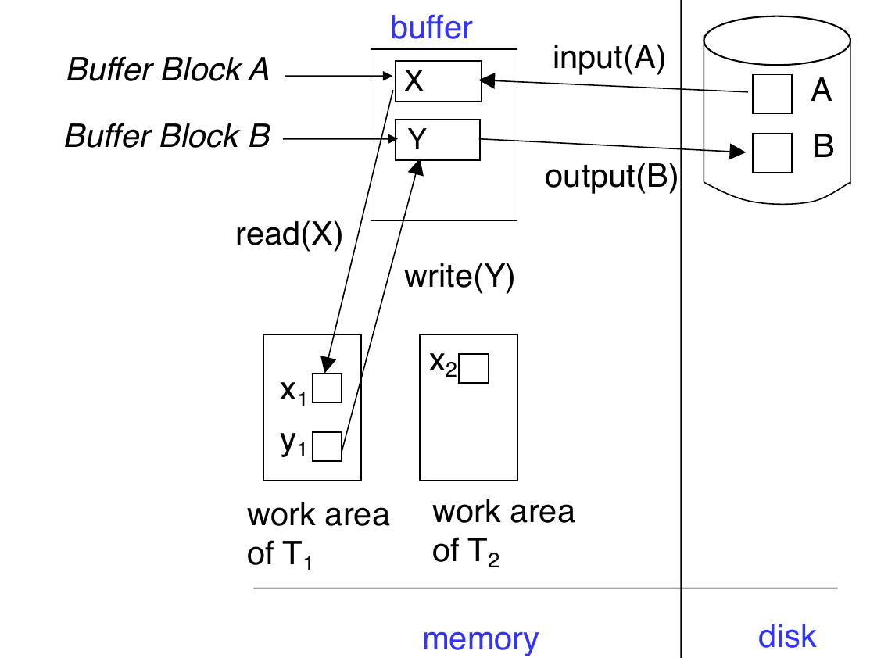

    图中的含义：

    - disk 上有 physical blocks，例如 block $A$、block $B$
    - `input(A)` 把 disk block 读入 buffer
    - transaction 在 private work-area 中操作 local copy
    - `write(Y)` 只更新 buffer block 中的 $Y$
    - `output(B)` 才把 buffer block 写回 disk

---

## 14.3 \*Recovery and Atomicity

- 为了在 failure 后保证 atomicity，系统不能直接修改数据库而不留下任何恢复信息。在真正修改 database 之前，需要**先把描述修改的信息写到 stable storage**。
- 本讲重点研究 ==log-based recovery mechanisms==（日志恢复机制）
- 另一种较少使用的替代方案是 <u>shadow paging</u>（适合一些串行的事务）

---

## 14.4 Log-Based Recovery

Log 保存在 stable storage 上，日志是一组 log records 的序列，用来记录数据库上的 update activities。

| Log record        | Meaning                                                                      |
| ----------------- | ---------------------------------------------------------------------------- |
| `<Ti start>`      | transaction $T_i$ 开始                                                         |
| `<Ti, X, V1, V2>` | $T_i$ 将 $X$ 从 old value $V_1$ 改为 new value $V_2$（在 $T_i$ 执行 `write(X)` 之前写入） |
| `<Ti commit>`     | transaction $T_i$ 成功完成                                                       |
| `<Ti abort>`      | transaction $T_i$ 被回滚                                                        |

两类使用 log 的恢复方法：

1. **Deferred database modification**：
   `write(X)` 时只写 log，延迟到 transaction commit 之后才写入 database
2. **Immediate database modification**：
   `write(X)` 时可以立即写 buffer / disk，可以在 commit 之前就写入 database

---

### 14.4.1 Deferred Database Modification

核心思想：

- **先把所有修改记录到 log 中，database write 延迟到事务 partial commit 之后**
假设 transactions 串行执行，执行流程如下：
1. Transaction $T_i$ 开始时把 `<Ti start>` 写入 log
2. 执行 `write(X)` 时，写入 log record `<Ti, X, V>`，这里 $V$ 是 $X$ 的 new value
3. `write(X)` 暂时不真正写 $X$
4. 当 $T_i$ partially commits，写：`<Ti commit>`
5. 最后读取 log records，执行之前 deferred writes

!!! info

    Deferred scheme 中不需要 old value，因为未提交 transaction 不会真正修改 database，所以 crash 后不需要 undo 它。

#### Recovery Rule

Crash 后只需要 redo 已经 commit 的 transaction

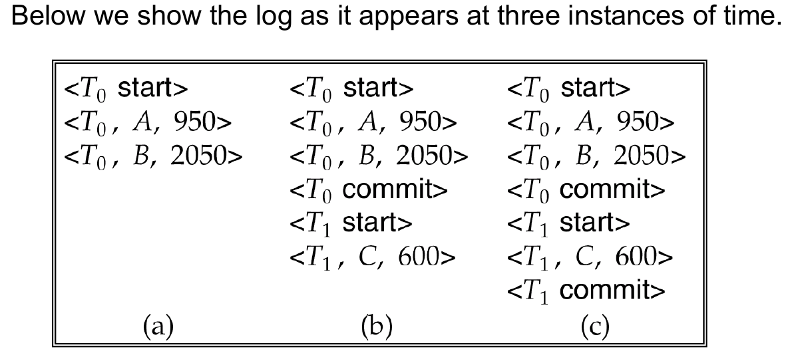

图中三个时刻的含义：

- case (a)：没有 transaction commit，故障后不需要 redo
- case (b)：`T0` 已经 commit，需要 `redo(T0)`
- case (c)：`T0` 和 `T1` 都已经 commit，需要依次 redo

!!! abstract

    Deferred modification 的恢复简单，因为未提交事务没有写过 database；缺点是 commit 前修改不能真正落盘。

---

### 14.4.2 Immediate Database Modification

**允许 uncommitted transaction 的更新在 commit 前写入 buffer，甚至写到 disk。**
因此它必须保存 old value 和 new value，才能支持：

- undo 未提交事务的影响
- redo 已提交事务的影响

核心规则：

- **Update log record 必须在 database item 被写入之前写入**
    - 我们假设 log record 会被直接输出到 stable storage
- Updated blocks output 到 stable storage 可以在事务提交之前或之后任何时间进行
- Block 的 output 顺序可以与它们被写入的顺序不同
这正是 ==write-ahead logging, WAL== 的基础。

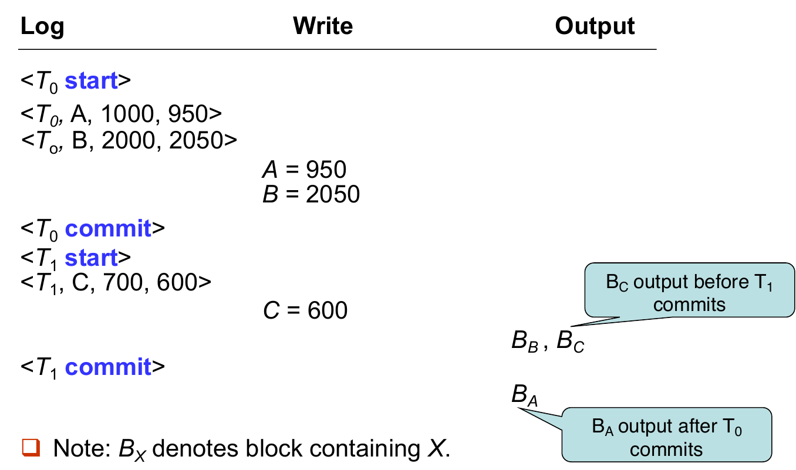

图中 $B_X$ 表示包含 data item $X$ 的 block：

- $B_C$ 可以在 $T_1$ commit 前输出到 disk
- $B_A$ 可以在 $T_0$ commit 后才输出到 disk
- 因此 recovery 不能简单假设 commit 前一定没写盘、commit 后一定已写盘

#### Recovery Rule

!!! info "Undo and Redo"

    Immediate modification 的 recovery procedure 有两个基本操作。

    | Operation | Meaning | Scan direction |
    | --- | --- | --- |
    | `undo(Ti)` | 将 $T_i$ 更新过的数据项恢复为 old values | 从 $T_i$ 的最后一条 log record 向前 |
    | `redo(Ti)` | 将 $T_i$ 更新过的数据项设置为 new values | 从 $T_i$ 的第一条 log record 向后 |

    这两个操作必须是**idempotent（幂等）** 的：即使重复执行多次，效果也和执行一次相同。
    原因是 recovery 本身也可能中途 crash，重启后同一个 undo / redo 可能再次执行。

- Crash 后：
    - 如果 log 中有 `<Ti start>`，但没有 `<Ti commit>`，则需要 `undo(Ti)`。
    - 如果 log 中同时有 `<Ti start>` 和 `<Ti commit>`，则需要 `redo(Ti)`。
- 执行顺序：
    1. 先执行所有 undo 操作
    2. 再执行所有 redo 操作

!!! example "Immediate DB Modification Recovery Example"

    
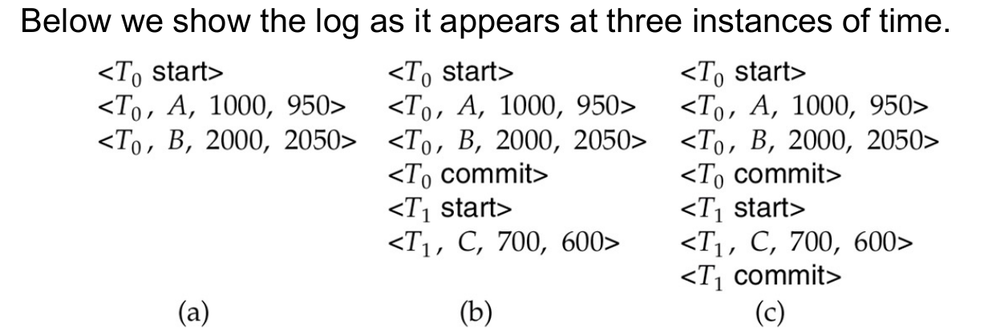

    图中三个 recovery cases：

    1. case (a)：$T_0$ 未 commit，需要 `undo(T0)`
    2. case (b)：$T_0$ 已 commit，$T_1$ 未 commit，需要 `redo(T0)` 和 `undo(T1)`
    3. case (c)：$T_0$ 和 $T_1$ 都已 commit，需要 `redo(T0)` 和 `redo(T1)`

---

### 14.4.3 Checkpoints

如果恢复时从 log 开头开始 undo / redo，会非常慢：

1. 系统运行时间越久，log 越长
2. 很多已经完成并写盘的 transaction 被不必要地 redo

因此系统周期性执行 ==checkpointing==，Checkpoint 的步骤如下：

1. 将 main memory 中当前所有 log records 输出到 stable storage。
2. 将所有 modified buffer blocks 输出到 disk。
3. 向 stable storage 写入 checkpoint record：`<checkpoint L>`，其中 $L$ 是 checkpoint 时仍 active 的 transaction 列表
    - 假设 checkpoint 时所有 updates 都暂停

#### Recovery with Checkpoints

恢复时不需要考虑整个 log，只需要考虑 <u>checkpoint 前最新发生的 transaction 以及这个事务之后发生的 transactions</u>。

1. 从 log 末尾向前扫描，找到最近的 `<checkpoint L>`
2. 只考虑 $L$ 中的 transactions，以及 checkpoint 之后开始的 transactions
3. checkpoint 之前已经 commit 或 abort 的 transactions 可以忽略，
    - 因为它们的 updates 已经输出到 stable storage（checkpoint 写入时会写盘）
4. 对 $L$ 中的每个 transaction，可能还需要继续向前扫描，直到找到对应的 `<Ti start>`
    - 早于这些 `<Ti start>` 的 log 部分不再需要用于 recovery，可以在适当时候删除。

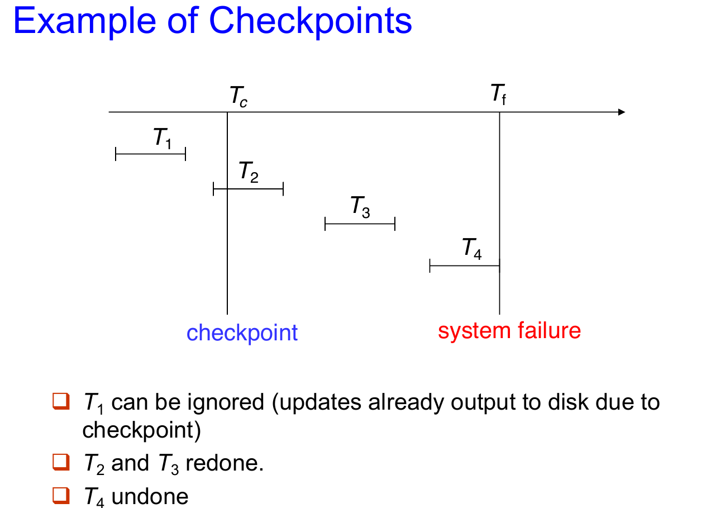

---

## 14.5 \*Shadow Paging

Shadow paging 是 log-based recovery 的替代方案，它适用于 transactions 串行执行的情形。它的核心思想是在一个 transaction 执行期间**维护两张 page tables**：current page table 和 shadow page table。

- **Shadow page table**：
  transaction 开始前的数据库状态，保存在 nonvolatile storage 中，执行期间不修改。
- **Current page table**：
  transaction 执行过程中实际使用的 page table，用于修改数据。

一开始，两张 page tables 完全相同，在执行过程中：

1. 访问数据时只使用 current page table
2. 当某个 page 第一次被写入时：
    - 先把该 page 复制到一个 unused page
    - current page table 指向这个 copy，更新在 copy 上进行
3. shadow page table 仍然指向旧 page，因此保留 transaction 执行前的状态

!!! example "Example of Shadow Paging"

    
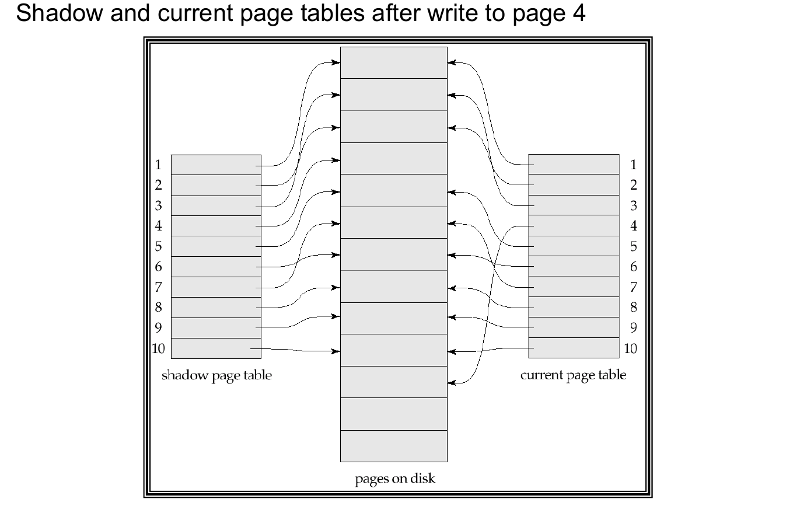

    图中写 page 4 后：

    - shadow page table 仍然指向原来的 page 4。
    - current page table 指向 page 4 的新副本。
    - 如果 transaction abort 或 crash，只要继续使用 shadow page table，就能回到旧状态。

### Commit Procedure

- Commit 一个 transaction 的过程：
    1. 将 main memory 中所有 modified pages flush 到 disk
    2. 将 current page table 输出到 disk
    3. 把 fixed disk location 中的 shadow page table pointer 改为指向 current page table
- 一旦 pointer 更新完成，transaction 就 commit
- Crash 后不需要复杂恢复：
    - 如果 pointer 还没切换，使用旧 shadow page table
    - 如果 pointer 已经切换，使用新 shadow page table
- 未被 current / shadow page table 指向的 pages 应该被 garbage collected

### Advantages and Disadvantages

优点：

- 不需要写 log records。
- recovery 很简单。
缺点：
- 复制整个 page table 很昂贵。
    - 可以用类似 B+ tree 的 page table 结构，只复制通向更新 leaf nodes 的路径。
- 即使优化后，commit overhead 仍然高。
    - 需要 flush every updated page 和 page table。
- 容易导致 data fragmentation。
    - 相关 pages 可能被分散到磁盘不同位置。
- 每个 transaction 完成后，需要 garbage collect old versions。
- 很难扩展到 concurrent transactions。
    - log-based schemes 更容易支持并发。

---

## 14.6 Recovery With Concurrent Transactions

为了支持多个 transactions 并发执行，需要修改前面的 log-based recovery

基本假设：

- 所有 transactions 共享同一个 disk buffer 以及 log file
- 一个 buffer block 可以包含多个 transactions 更新过的数据项
- 并发控制使用 strict 2PL
    - 即 `X-locks` 一直持有到 transaction 结束
    - uncommitted transaction 的 updates 不应被其他 transactions 看到
- Log 写法和之前一样，但不同 transactions 的 log records 会穿插在同一个 log file 中
- 并发场景下，checkpoint record 的形式是：`<checkpoint L>`
    - 其中 $L$ 是 checkpoint 时仍 active 的 transactions 列表
    - 假设 checkpoint 进行时没有 updates 正在执行

### Recovery Algorithm

- 当系统从 crash 中恢复时，首先要做的部分如下：
    1. 初始化列表 undo-list 和 redo-list 为空
    2. 从 log 末尾<u>从后向前扫描</u>，直到遇到第一个 `<checkpoint L>` 时停止
       在此之前的扫描过程中：
        1. 遇到 `<Ti commit>`，将 $T_i$ 加入 `redo-list`
        2. 遇到 `<Ti start>`，且 $T_i$ 不在 `redo-list` 中，将 $T_i$ 加入 `undo-list`
        3. 遇到 `<Ti abort>`，将 $T_i$ 加入 `undo-list`
    3. 对 checkpoint list $L$ 中的每个 $T_i$：如果 $T_i$ 不在 `redo-list` 中，将它加入 `undo-list`
        - 此时 undo-list 中是未充分完成的事务，redo-list 中是完成了的事务
- 具体的恢复操作如下（先执行 undo，后执行 redo）：
    1. 从 log 末尾<u>从后向前扫描</u>，直到 undo-list 中每个 $T_i$ 的 `<Ti start>` 都被找到后停止
        - 在 scan 的过程中，对 undo-list 中事务相关的 log record 执行 undo
    2. 找到最近的 `<checkpoint L>`
    3. 从该 checkpoint <u>从前向后</u>扫描到 log 末尾
        - 在 scan 的过程中，对 redo-list 中每个事务相关的 log record 执行 redo

!!! example

    
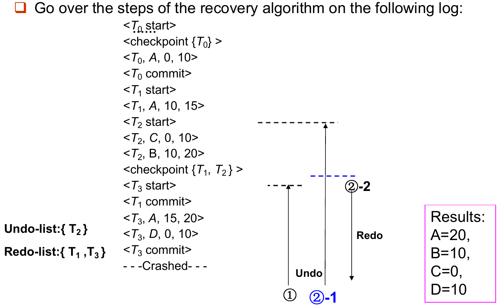

!!! warning

    并发恢复时，不能只看某个 transaction 是否出现在 checkpoint 之前或之后；还要看它是否在 checkpoint 时 active，以及 crash 前是否 commit。

---

## 14.7 Buffer Management

### 14.7.1 Log Record Buffering

- 通常 stable storage 的输出单位是 block，而 log record 的大小远小于 block。因此系统会把 log records 先缓存在 main memory 中，而不是每条 log record 都立刻写到 stable storage。
    - Log records 会在以下情况写出：
        1. log buffer 中的 block 满了
        2. 执行 log force operation（例如 checkpoint 发生）
- ==Log force（强制日志）== 是指强制把某个 transaction 的所有 log records，包括 `<Ti commit>`，写到 stable storage，这样多个 log records 可以通过一次 output 写出，降低 I/O cost

### 14.7.2 Rules for Log Record Buffering

如果 log records 被缓存（buffered）在 main memory 中，必须遵守以下四个规则：

1. Log records 必须按照创建顺序输出到 stable storage。
2. 只有当 `<Ti commit>` 已经输出到 stable storage 后，$T_i$ 才能进入 commit state。
3. 在 `<Ti commit>` 输出之前，$T_i$ 的所有 log records 必须已经输出到 stable storage。
4. 在 main memory 中的 data block 输出到 database 之前，所有与该 block 中数据相关的 log records 必须已经输出到 stable storage
    - 这条规则也称为 ==write-ahead logging rule, WAL（先写日志规则）==

### 14.7.3 Database Buffering

DBMS 会维护一个 in-memory buffer of data blocks

- 当 buffer 满了，新 block 需要进入 buffer 时，系统必须选择某个已有 block 移出
- 如果被移出的 block 已经被修改，就必须 output to disk

Recovery algorithm 支持两种重要策略：

1. No-force policy：transaction commit 时不要求 updated blocks 立刻写 disk
    - commit 快，但 crash 后 committed 的修改可能需要 redo
    - Force policy 要求 updated blocks 在 commit 时写盘，commit cost 高
2. Steal policy：包含 uncommitted updates 的 blocks 可以在 commit 前写 disk
    - buffer 使用灵活，但 crash 后 uncommitted updates 可能需要 undo

### 14.7.4 Latches and Output Procedure

- 如果包含 uncommitted updates 的 block 被输出到 disk，必须先把对应 undo information 写入 stable log（也就是遵守 WAL）。
- 此外，block 输出时不能有 update 正在进行，系统通过 ==latches== 保证这一点
    - transaction 修改某个 block 前，先获得该 block 的 exclusive latch
    - 写完后立刻释放 latch，latch 持有时间很短，不等同于 transaction-level lock
- 输出一个 block 到 disk 的流程：
    1. acquire exclusive latch on the block
    2. Perform a *log flush*
    3. Output the block to disk
    4. Release the latch

!!! warning

    Lock 主要用于 isolation，持续时间可能到 transaction 结束；latch 主要保护内存数据结构或 block 写出过程，持续时间很短。

### 14.7.5 Real Memory vs Virtual Memory

Database buffer 可以放在：

- DBMS 预留的一块 real main memory 中
- virtual memory 中

预留 real memory 的问题：

- 需要提前在 database buffer 和 applications 之间划分内存，灵活性差。
- 系统运行期间需求变化时，OS 虽然最清楚内存该如何分配，却无法动态改变这块划分。
因此很多数据库 buffer 会使用 virtual memory，但这会带来 ==dual paging problem==。

!!! bug "Dual Paging Problem"

    如果 OS 要 evict 一个被修改过的 buffer page：

    1. OS 可能先把它写到 swap space。
    2. 之后 DBMS 又决定把该 buffer page 写到 database disk
    3. 如果 page 已经在 swap space 中，DBMS 可能需要先从 swap space 读回，再写到 database disk。

    **这就产生了额外 I/O。**

理想情况是 OS 想 evict buffer page 时，把控制权交给 DBMS：

1. 如果 page modified，DBMS 先确保 log 写出，再把 page 输出到 database
2. 然后释放该 page 给 OS 使用

---

## 14.8 Failure with Loss of Nonvolatile Storage

到目前为止，前面的恢复讨论大多假设 nonvolatile storage 没有丢失。如果发生 disk failure，就需要更强的机制：==database dump==。

### Dump Procedure

- 系统周期性地把整个 database 内容 dump 到 stable storage
- 简单 dump 要求 dump 时没有 active transaction，过程类似 checkpoint：
    1. 将 main memory 中所有 log records 输出到 stable storage
    2. 将所有 buffer blocks 输出到 disk
    3. 将 database 内容复制到 stable storage
    4. 在 stable log 中写入：`<dump>`

### Recovery from Disk Failure

Disk failure 后：

1. 从最近的 dump 恢复 database
2. 查阅 log 并 redo 所有在 dump 之后 commit 的 transactions

也可以扩展为允许 dump 时仍有 active transactions，这称为：

- fuzzy dump
- online dump
商业 DBMS 通常还会结合 replication、backup tools、security and reliability methods 来完成恢复。

---

## 14.9 \*Advanced Recovery Techniques

前面的恢复算法主要适合一般 data item 更新，但高并发结构，例如 B+ tree，并不总能用简单的 physical undo

### 14.9.1 Logical Undo

**B+ tree insertion / deletion 可能会提前释放 locks**

- 如果某个操作释放 lock 后，其他 transactions 又修改了 B+ tree，那么恢复时不能简单把 old value 写回去。
    - old physical value 可能已经不再适合当前 B+ tree 状态
    - 强行 physical undo 可能破坏后来 transactions 的正确更新
- 因此 insertion 的 undo 应该执行 deletion，deletion 的 undo 应该执行 insertion，这种方法被称为 ==logical undo==。
- 对应地，undo log record 应该包含要执行的 undo operation，这叫 **logical undo logging**。与之相对的是 **physical undo logging**，即记录 old value；但 redo 仍然通常使用 physical redo。

!!! warning

    Logical redo 很复杂，因为 crash 后 disk 上的 database state 可能不是 operation-consistent 的。

### 14.9.2 Operation Logging

> 对于“**operation 没完成**”和“**operation 已完成但 transaction 要 rollback**”两种情况，需要分别用不同的 undo 策略。

对一个 operation instance $O_j$，logging 的三个时间段：

1. **开始时**：写 `<Ti, Oj, operation-begin>`，其中 $O_j$ 是该 operation instance 的唯一 identifier
2. **执行中**：正常记录 physical redo 和 physical undo information（和之前一样）
3. **完成时**：写 `<Ti, Oj, operation-end, U>`，其中 $U$ 包含 logical undo 所需的信息

Crash / rollback 发生时，关键在于**找到 operation-begin 和 operation-end 之间的配对关系**：

- 如果没有找到 `operation-end` record，说明 operation 没完成，<u>使用 physical undo information</u>
- 如果找到了 `operation-end` record，说明 operation 已完成，使用 $U$ <u>执行 logical undo</u>
- <u>Crash 后 redo 仍然使用 physical redo information</u>

### 14.9.3 Rollback with Operation Logging

**Rollback 过程本身也可能 crash，如何避免重复 undo？**
Rollback transaction $T_i$ 时，从 log 从后向前扫描

1. 如果找到普通 update log record：`<Ti, X, V1, V2>`
    - 执行 undo，并写一个特殊的 redo-only log record：`<Ti, X, V1>`
2. 如果找到：`<Ti, Oj, operation-end, U>`
    - 使用 $U$ 执行 logical rollback
    - Rollback 过程中产生的 updates 也要像普通 operation 一样记录 log
    - operation rollback 结束时，不写 operation-end，而是写：`<Ti, Oj, operation-abort>`，然后跳过 $T_i$ 之前属于同一个 operation 的所有 log records，直到找到：`<Ti, Oj, operation-begin>`
3. 如果遇到 redo-only record，忽略它
4. 如果遇到：`<Ti, Oj, operation-abort>`，同样跳过前面属于该 operation 的所有 log records，直到 operation-begin
5. 遇到 `<Ti start>` 时停止扫描，并写：`<Ti abort>`

!!! tip

    跳过已经 rollback 过的 operation log records 很重要，否则 crash 后重新恢复时可能对同一 operation 重复 rollback。

### 14.9.4 System Crash Recovery with Advanced Logging

!!! question "为什么先 redo 再 undo？"

    - Crash 时磁盘上的状态：
        - 某些 committed transactions 的 updates 可能没写盘（需要 redo）
        - 某些 uncommitted transactions 的 updates 可能已经写盘（需要 undo）
    - 不同磁盘上的状态是不一致的，而 Logical Undo 需要一致的数据库状态

System crash 后的恢复可以概括为两阶段：

1. 从最近的 `<checkpoint L>` 向前扫描
    1. 通过 physically redo 所有事务的所有更新来恢复历史
    2. 建立 `undo-list`
        - 初始时 `undo-list = L`
        - 遇到 `<Ti start>`，把 $T_i$ 加入 `undo-list`
        - 遇到 `<Ti commit>` 或 `<Ti abort>`，把 $T_i$ 从 `undo-list` 中删除
2. 从 log 末尾向后扫描
    - 对 `undo-list` 中 transactions 的 log records 执行 undo
    - 当遇到某个 $T_i$ 的 `<Ti start>` 时，写 `<Ti abort>`
    - 当所有 `undo-list` 中 transactions 的 start records 都找到后，停止
- 这样会先把 database 恢复到 crash moment 的状态，然后撤销 incomplete transactions

### 14.9.5 Fuzzy Checkpointing

**普通 checkpoint 的问题是 checkpoint 期间 transaction 不能继续执行**

- ==Fuzzy checkpointing== 允许 transactions 在 checkpoint 的耗时部分继续执行：
    1. 临时停止所有 transaction updates
    2. 写入 `<checkpoint L>` log record，并 force log 到 stable storage
    3. 记录 modified buffer blocks 列表 $M$
    4. 允许 transactions 继续执行
    5. 将 $M$ 中的 modified buffer blocks 输出到 disk
        - 输出 block 时不能继续更新该 block
        - 必须遵守 WAL
    6. 在 disk 上固定位置 `last_checkpoint` 存储 checkpoint record 的指针
- 恢复时从 `last_checkpoint` 指向的 checkpoint record 开始扫描
    - `last_checkpoint` 之前的 log records，其 updates 已经反映到 disk 上，不需要 redo
    - 如果系统在 checkpoint 过程中 crash，incomplete checkpoints 也能被安全处理

---

## 14.10 \*ARIES Recovery Algorithm

==ARIES==（Algorithm for Recovery and Isolation Exploiting Semantics）是 IBM 研发的恢复算法，被几乎所有现代数据库采用（DB2、SQL Server、PostgreSQL等）。

- 目标是降低 normal processing 的开销、加快 recovery 速度，支持更复杂的并发和恢复场景。
- 前面学习的恢复算法可以看作 ARIES 的简化版本。

!!! info "ARIES 的几个核心优化："

    1. 使用 ==log sequence number, LSN== 标识 log records
    2. 在 page 中存储 PageLSN（最后一个反应在该 page 上的 log record 的 LSN）
        - 可以用来判断某个 update 是否已经反映到 page 上
    3. 使用 physiological redo
    4. 使用 dirty page table，避免不必要的 redo
    5. 使用 fuzzy checkpointing
        - checkpoint 只记录 dirty pages 信息，不要求 checkpoint 时把 dirty pages 写出

### 14.10.1 Physiological Redo

假设要删除 page 里的一条 record：

- pure physical redo：记录 page 中大量 old/new values，**精确但冗长**
- physiological redo：只记录“删除某条 record”这个动作，**简洁但不安全**
- ==physiological redo==：物理地标识 affected page，在 page 内部用逻辑动作描述修改

前提：

- page output to disk 必须是 atomic 的
- 如果 page output 不完整，需要 checksum 检测，并进行额外恢复
- 不完整 page output 通常被当作 media failure

### 14.10.2 ARIES Data Structures

**ARIES 使用几个核心数据结构：**

1. ==LSN==(log sequence number) 用来识别每条 log record
    - Sequentially increasing
    - 通常是 log file 起始位置的 offset，便于快速访问以及扩展到多个 log files
2. ==PageLSN==：最后一个已经反映在该 page 上的 log record 的 LSN
    - 更新 page 时：
        1. X-latch page，写 log record
        2. 更新 page
        3. 将 log record 的 LSN 写入 PageLSN
        4. Unlatch page
    - Flush page to disk 时：需要先 S-latch page，这样 disk 上的 page state 是 operation-consistent，这是 physiological redo 的前提。
    - PageLSN 在 recovery 中用于避免重复 redo，从而保证 idempotence（幂等）。
3. ==Log Record==
    - 每条 log record 记录同一个 transaction 的前一条 log record 的 LSN：==PrevLSN==
        - `|-- LSN --|-- TransID --|-- PrevLSN --|-- RedoInfo --|-- UndoInfo --| `
    - ARIES 还使用一种特殊的 redo-only log record，称为 **CLR, Compensation Log Record**
        - CLR 用来记录 recovery 或 rollback 中已经执行的 undo actions
    - CLR 中有一个字段：`UndoNextLSN`，它表示下一条还需要 undo 的更早 log record
        - 避免重复 undo 已经 undo 过的 actions
        - Recovery 再次 crash 后，可以从 CLR 中知道应该跳到哪里继续 undo
4. ==Dirty Page Table==
    - 记录 buffer 中已经被更新但可能还没写回 disk 的 pages
    - 对每个 dirty page，记录：
        - PageLSN：该 page 最新被修改时的 LSN
        - RecLSN：该 page 第一次变 dirty 时的 LSN 
            - RecLSN 会被记录在 checkpoint 中，帮助减少 redo work
5. ==Checkpoint Log Record==
    - 包含：
        - DirtyPageTable 以及 Active transaction list
        - 每个 active transaction 的 LastLSN
    - Disk 上固定位置记录最后一个 completed checkpoint log record 的 LSN
    - ARIES checkpoint 时不要求 dirty pages 写出，而是让 dirty pages 在后台持续 flush。因此 checkpoint overhead 很低，可以频繁执行

!!! example "ARIES Data Structures"

    
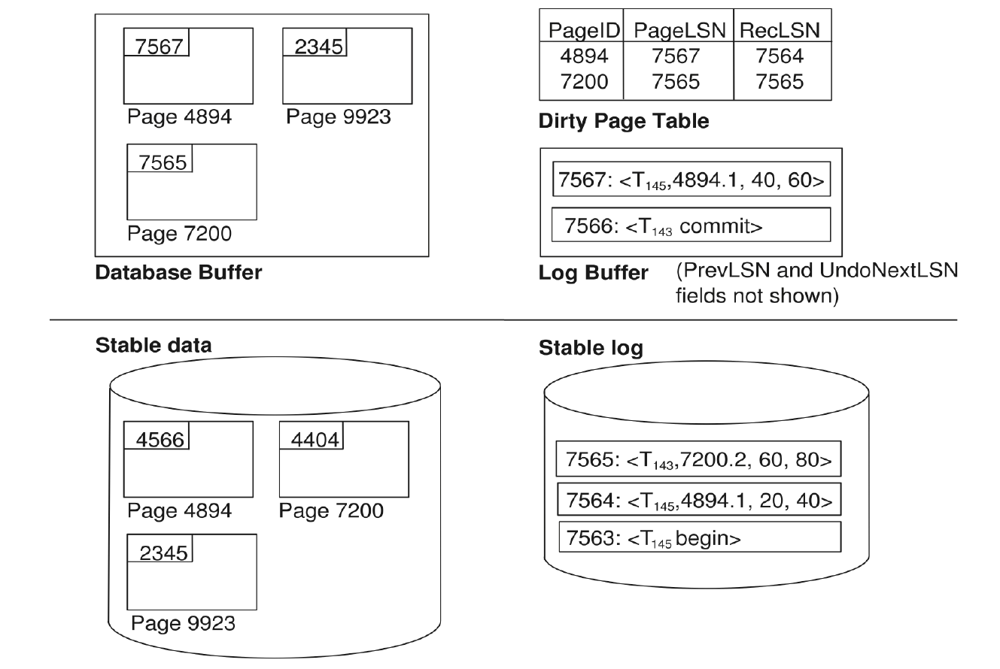

    图中体现了几个关系：

    - database buffer 中每个 dirty page 有 PageLSN。
    - stable data 中 page 的 PageLSN 可能更旧。
    - dirty page table 记录 PageID、PageLSN、RecLSN。
    - stable log 中保存已经写出的 log records。
    - log buffer 中可能还有尚未写出的 log records。

### 14.10.3 ARIES Recovery

!!! abstract "3 Passes"

    ARIES recovery 包含三趟扫描：

    1. Analysis pass
    2. Redo pass
    3. Undo pass

    
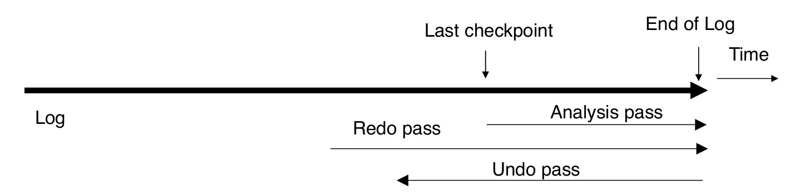

    三趟扫描的方向：

    - Analysis 从 last checkpoint 开始向前到 end of log
    - Redo 从 RedoLSN 开始向前到 end of log
    - Undo 从 end of log 向后，直到所有 incomplete transactions 被撤销

#### Analysis Pass

!!! tip "目标"

    1. 判断哪些 transactions 需要 undo
    2. 判断 crash 时哪些 pages 是 dirty 的
    3. 计算 redo 应从哪个 LSN 开始，即 RedoLSN

**具体操作从最后一个 complete checkpoint log record 开始**：

1. 从 checkpoint log record 中读入 DirtyPageTable
2. 设置：$\text{RedoLSN}=\min(\text{RecLSN of all dirty pages})$
   如果没有 dirty pages，则：$\text{RedoLSN}=\text{checkpoint record's LSN}$
3. 设置 `undo-list` 为 checkpoint log record 中的 active transactions
4. 记录每个 active transaction 的 LastLSN
5. 从 checkpoint 向前扫描到 end of log：
    - 如果发现某 transaction 的 log record 但它不在 `undo-list`，加入 `undo-list`
    - 如果发现 update log record，且对应 page 不在 DirtyPageTable 中，则加入该 page，并把 `RecLSN` 设为该 update log record 的 LSN
    - 如果发现 transaction end log record，将该 transaction 从 `undo-list` 中删除
    - 持续维护每个 transaction 的 last log record

**Analysis pass 结束后：**

- `RedoLSN` 决定 redo pass 从哪里开始
- DirtyPageTable 中每个 page 的 `RecLSN` 用于减少 redo work
- `undo-list` 中的 transactions 都需要 rollback

#### Redo Pass

Redo pass 的目标是 ==repeat history==：
从 RedoLSN 开始向前扫描，遇到 update log record 时

1. 如果该 page 不在 DirtyPageTable 中，或者 log record 的 LSN 小于该 page 的 RecLSN，跳过
2. 否则，从 disk 读取该 page。如果 disk page 的 PageLSN 小于 log record 的 LSN，则 redo 该 log record。否则直接跳过。

#### Undo Actions

当 ARIES 对某个 update log record 执行 undo 时，会生成一条 CLR(Compensation Log Record)。CLR 包含 undo action 本身和 UndoNextLSN，其中 UndoNextLSN 指向这条 update log record 的 PrevLSN。

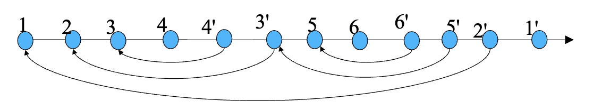

ARIES 支持 partial rollback

- 例如 deadlock recovery 中，只需要 rollback 到释放所需 locks 的位置，而不一定 abort 整个 transaction。
- 如上图所示，可以先 rollback 3 和 4，然后接着执行 5 和 6，最后完全回滚

#### Undo Pass

Undo pass 对 `undo-list` 中的 transactions 执行回滚：

1. 对每个 transaction，把下一条需要 undo 的 LSN 设为 analysis pass 中找到的 LastLSN
2. 每一步选择这些 LSN 中最大的一个
3. 跳到对应 log record 并 undo
4. 如果是 ordinary log record：
    - 进行撤销操作，并追加一条 CLR 记录
    - 把该事务下一条要 undo 的 LSN 设为该 log record 中的 `PrevLSN`
5. 如果是 CLR：
    - 把该事务下一条要 undo 的 LSN 设为该 CLR 中的 `UndoNextLSN`
    - 中间 log records 跳过，因为它们已经被 undo 过
6. 当事务回退到它的 `begin` 记录时，系统会追加一条 `<T, end>` 日志，并将其从 `undo-list` 中删除。

Undo pass 结束后，所有 incomplete transactions 的影响都被撤销。

!!! example

    
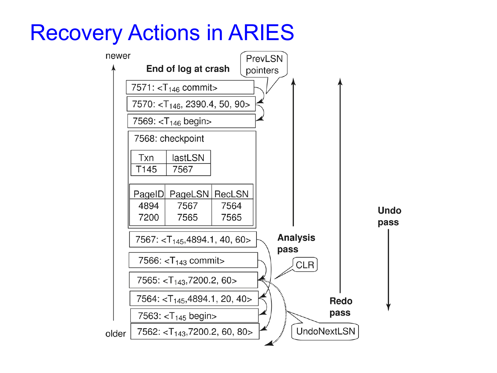

    图中的含义：

    - log records 通过 PrevLSN 串成 transaction log chain。
    - CLR 通过 UndoNextLSN 指向下一条应该继续 undo 的记录。
    - Analysis / Redo 向前扫描，Undo 向后扫描。
    - 如果 rollback 过程中 crash，恢复时可以通过 CLR 跳过已经 undo 的区间。

### 14.10.4 Other ARIES Features

ARIES 还有一些重要特性：

1. **Recovery independence**
    - pages 可以独立恢复。
    - 例如某些 disk pages 损坏时，可以从 backup 恢复这些 pages，同时其他 pages 仍可使用。
2. **Savepoints**
    - transaction 可以设置 savepoint，并 rollback 到某个 savepoint。
    - 适合复杂事务。
    - deadlock 时也可以只 rollback 到足以释放 locks 的位置。
3. **Fine-grained locking**
    - 支持 tuple-level locking on indices。
    - 这通常需要 logical undo。
4. **Recovery optimizations**
    - dirty page table 可用于 redo 时 prefetch pages。
    - 可以 out-of-order redo。
    - 如果某个 page 正在 fetch，可以先处理其他 log records。

---

## 14.11 \*Remote Backup Systems

Remote backup systems 通过 remote backup site 提供 high availability。

### Failure Detection

Backup site 必须检测 primary site 是否失败
难点是区分：

- primary site 真的失败
- communication link 失败
常见方法：
- primary 和 backup 之间维护多条 communication links
- 使用 heart-beat messages

### Transfer of Control

当 backup site 接管时：

1. backup site 先用自己的 database copy 和从 primary 收到的 log records 执行 recovery。
2. committed transactions 被 redo。
3. incomplete transactions 被 rollback。
4. backup site 接管处理，成为新的 primary。

如果旧 primary 恢复后要重新接管：

- 旧 primary 必须从旧 backup 接收 redo logs。
- 在本地应用所有更新。
- 然后才能重新成为 primary。

### Time to Recover and Hot-Spare

为了减少 takeover delay，backup site 可以周期性处理 redo log records。这相当于 backup 不断从之前的 database state 开始做 recovery，并定期 checkpoint，这样旧 log 可以删除。

==Hot-Spare configuration== 可以实现很快接管：

- backup 持续处理 primary 传来的 redo log records。
- updates 会不断在 backup 本地应用。
- 一旦检测到 primary failure，backup 只需要 rollback incomplete transactions，就能开始处理新 transactions。

Remote backup 的替代方案是 distributed database with replicated data。

比较：

- Remote backup 更快、更便宜。
- 但对 failure 的容忍度不如完整的 replicated distributed database。

### Durability Levels

为了确保 update durability，可以延迟 transaction commit，直到 update 也被 logged at backup，但这会增加 commit latency。

| Strategy | Commit condition | Advantage | Problem |
| --- | --- | --- | --- |
| One-safe | commit log record 写到 primary 就 commit | 延迟低 | update 可能还没到 backup，backup 接管后丢失 |
| Two-very-safe | commit log record 写到 primary 和 backup 后才 commit | durability 强 | primary 或 backup 任一失败时 transaction 不能 commit，可用性低 |
| Two-safe | primary 和 backup 都 active 时按 two-very-safe；只有 primary active 时按 one-safe | 比 two-very-safe 可用性好，也避免 one-safe 的 lost transaction 问题 | 语义更复杂 |

!!! abstract

    Remote backup 的核心 trade-off 是 commit latency、durability 和 availability 之间的取舍。
