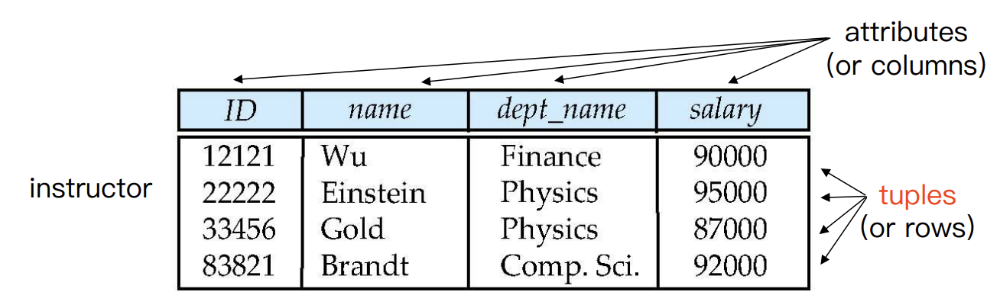
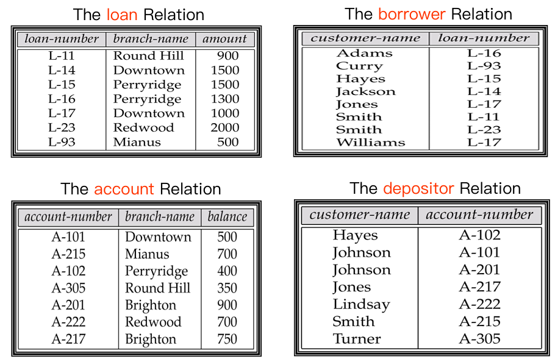
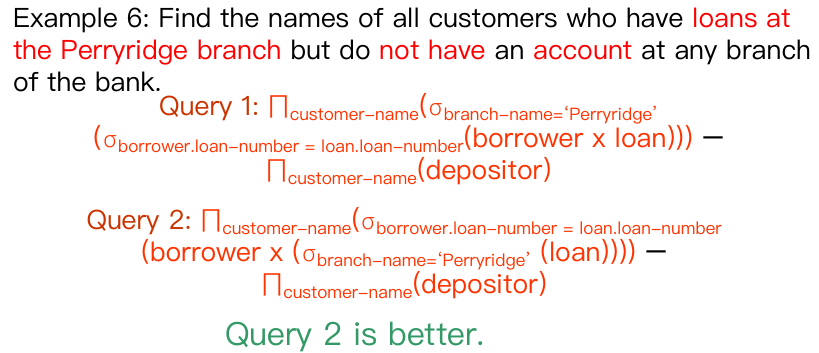
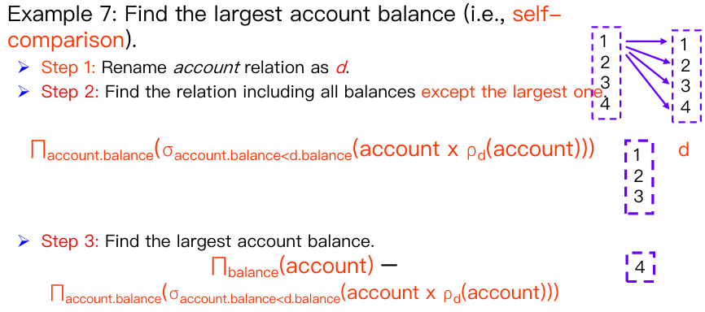
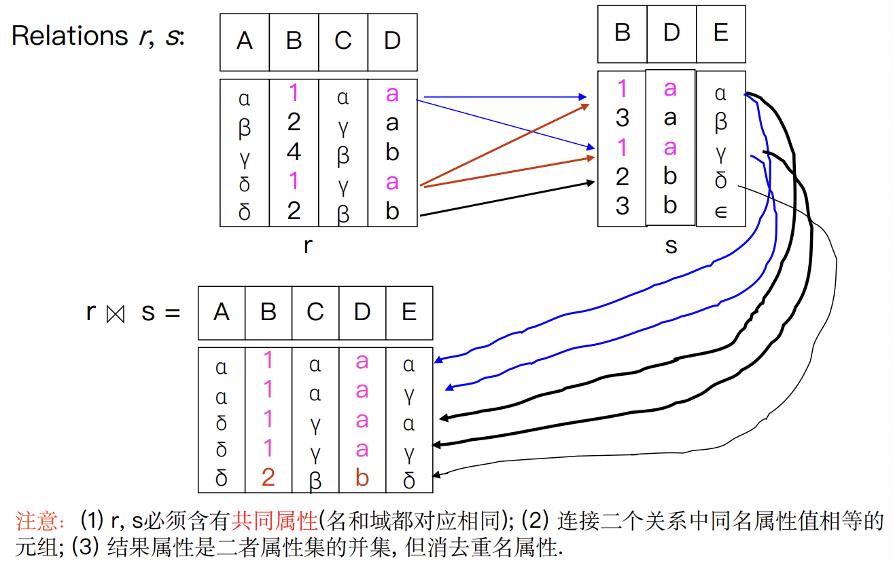
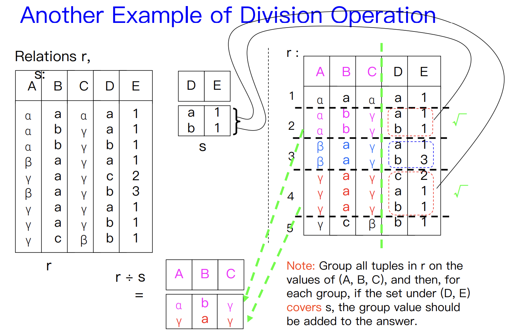

# Lec2.Relational Model

!!! info "What is rational model"

    - The relational model is <u>very simple and elegant</u>.
    - A **relational database** is a collection of one or more **relations**, which are based on the relational model.
    - A relation is a table with rows and columns.
    - The major advantages of the relational model are its ==straightforward data representation== and the ease with which even ==complex queries can be expressed==.
    - Owing to the great language SQL, the most widely used language for creating, manipulating, and querying relational database.

!!! tip

    - Relationship
        - A relationship is an association among several entities.
        - 指的是现实世界中多个**实体集（entity sets）** 之间的关联
    - Relation
        - A relation is the mathematical concept, referred to as a table.
        - 是关系模型中的正式术语，指的就是看到的“表”

---

## 2.1 Structure of Relational Databases

### 1. Basic Structure

- Formally, given sets $D_1,D_2,\dots,D_n(D_i=a_{ij}|_{i=1,\dots,k})$, a relation $r$ is a ==subset== of $D_1 \times D_2 \times \dots \times D_n$ (a Cartesian product of a list of domain $D_i$)
- Thus, a ==relation== is a **set** of n-tuples $(a_{1j}, a_{2j}, \dots, a_{nj})$, where each $a_{ij} \in D_i  (i \in [1, n])$.

### 2. Attribute Types

- Each attribute of a relation has a name.
- The set of allowed values for each attribute is called the **domain(域)** of the attribute.
- Attribute values are (normally) required to be **atomic 原子性**, i.e., indivisible (1st NF, 关系理论第一范式)
  - multivalued attribute多值属性 values are not atomic.
    `phones: ["123-4567", "987-6543"]`
  - composite attribute复合属性 values are not atomic.
    `address: "Zhejiang, Hangzhou, Xihu District"`
- The special value null is a member of every domain.
- The null value causes complications in the definition of many operations.
  - 暂时忽略 null 带来的影响，后续章节会专门讨论

### 3. Concepts about Relation

A relation is concerned with two concepts: **relation schema** and **relation instance**.

- The <u>relation schema</u> describes the structure of the relation.
  `Student-schema = (sid: string, name: string, sex: string, age: int, dept:string)`
  `Student-schema = (sid, name, sex, age, dept)`
- The <u>relation instance</u> corresponds to the **snapshot** of the data in the relation at a given instant in time.

| 编程概念              | 对应数据库概念            | 说明               |
| --------------------- | ------------------------- | ------------------ |
| Variable（变量）      | Relation（关系）          | 整体容器           |
| Variable type（类型） | Relation schema（模式）   | 定义结构和数据类型 |
| Variable value（值）  | Relation instance（实例） | 当前存储的实际数据 |

#### Relation Schema

- Assume $A_1, A_2 , \dots, A_n$ are **attributes**
- Formally expressed: $R = (A_1, A_2 , \dots, A_n )$ is a ==relation schema==
  - E.g., `instructor = (ID, name, dept_name, salary)`
- $r(R)$ is a **relation** on the relation schema $R$（具体实例）
  - E.g., `instructor(instructor-schema) = instructor(ID, name, dept_name, salary)`

#### Relation Instance

- The current values (i.e., ==relation instance==) of a relation are specified by a table.
- An element $t$ of $r$ is a tuple, represented by a row in a table.
- Let a tuple variable $t$ be a tuple, then `t[name]` denotes the value of $t$ on the name attribute.

#### The Properties of Relation

- The order of tuples is **irrelevant** (i.e., tuples may be stored in an arbitrary).
- **No duplicated** tuples in a relation.
- Attribute values are **atomic**.

### 4. Key

- Let $K \subseteq R$
- $K$ is a ==superkey (超码)== of $R$ if values for $K$ are sufficient to identify a **unique** tuple of each possible relation $r(R)$
  - E.g., both {ID} and {ID, name} are superkeys of the relation instructor.
- $K$ is a ==candidate key (候选码)== if $K$ is <u>minimal superkey</u>.
  - E.g., {ID} is a candidate key for the relation instructor, since it is a superkey and no any subset.
- $K$ is a ==primary key (主码)==, if $K$ is a candidate key and is <u>defined by user explicitly</u>.
  - Primary key is usually marked by underline
- Assume there exists relations $r$ and $s$: $r(A, B, C)$, $s(B, D)$, we can say that attribute $B$ in relation $r$ is ==foreign key (外码)== referencing $s$, and $r$ is a <u>referencing relation (参照关系)</u>, and $s$ is a <u>referenced relation (被参照关系)</u>.

!!! example "Schema Diagram"

    

---

## 2.2 Fundamental Relational-Algebra Operations

Six basic operations

- Select 选择
- Project 投影
- Union 并
- set difference 差（集合差）
- Cartesian product 笛卡儿积
- Rename 改名（重命名）

### 1. Select Operation

- Notation: $\sigma_p (r)$, where $p$ is called the *selection predicate*
- Defined as: $\sigma_p (r) = \{t | t \in r \text{ and } p(t)\}$
  where $p$ is a formula in *propositional calculus* consisting of terms connected by : $\land$ (and), $\lor$ (or), $\lnot$ (not)
- Each term is one of: `<attribute> op <attribute> or <constant>`, where op is one of $=,\ne,>,\geq,<,\leq$

### 2. Project Operation

- Notation: $\Pi_{A_1, A_2, \dots, A_k}(r)$
  where $A_1, ... A_k$ are *attribute names* and $r$ is a *relation name*.
- The result is defined as the relation of $k$ columns obtained by erasing the columns that are not listed.
- Duplicate rows removed from result, since relations are sets.
- E.g., To eliminate the branch-name attribute of account

$$
\Pi_{\text{account-number}, \text{balance}} (\text{account})
$$

### 3. Union Operation

- Notation: $r \cup s$
- Defined as: $r \cup s = \{t \mid t \in r \text{ or } t \in s\}$
- For $r \cup s$ to be valid:
  - $r$ and $s$ must have the same arity (i.e., the same number of attributes)
  - The attribute domains must be compatible
- E.g., Find all customers with either an account or a loan

$$
\Pi_{\text{customer-name}}(\text{depositor}) \cup \Pi_{\text{customer-name}}(\text{borrower})
$$

### 4. Set Difference Operation

- Notation: $r – s$
- Defined as: $r – s = \{t | t \in r \text{ and } t \notin s\}$
- Set differences must be taken between compatible relations.
  - $r$ and $s$ must have **the same arity**（元数，即参数的数量）.
  - Attribute domains of $r$ and $s$ must be compatible.

### 5. Cartesian-Product Operation

- Notation: $r \times s$
- Defined as: $r \times s = \{\{t q\} | t \in r \text{ and } q \in s\}$
- Assume that attributes of $r(R)$ and $s(S)$ are *disjoint* (i.e., $R\cap S=\emptyset$).
- If attributes of $r(R)$ and $s(S)$ are not disjoint, then *renaming for attributes* must be used.

### 6. Rename Operation

- Allows us to name, and therefore to refer to, the results of relational-algebra expressions. (procedural)
- Allows us to refer to a relation by more than one name.
  - $\rho_x(E)$ returns the expression $E$ under the name $X$
- If a relational-algebra expression $E$ has arity $n$, then
  - $\rho_{x(A_1, A_2, \dots, A_n)}(E)$ （对 $E$ 及其 attributes 都重命名）returns the result of expression $E$

### Example Queries

---

## 2.3 Additional Relational-Algebra Operations

Four basic operators

- Set intersection 交
- Natural join 自然连接
- Division 除
- Assignment 赋值

!!! tip

    We define additional operations that do not add any power to the relational algebra, but that simplify common queries.

### Set-Intersection Operation

- Notation: $r \cap s$
- Defined as: $r \cap s = \{t | t \in r \text{ and } t \in s\}$
- Assume:
  - $r$ and $s$ must have **the same arity**.
  - Attribute domains of $r$ and $s$ must be compatible.
- Note: $r \cap s = r - (r-s)$

### Natural Join Operation

- Notation: $r \bowtie s$
- Example:  $R = (A, B, C, D)$, $S = (B, D, E)$
  - Result schema of the natural-join of $r$ and $s = (A, B, C, D, E)$
  - $r \bowtie s = \Pi_{r.A,\ r.B,\ r.C,\ r.D,\ s.E}(\sigma_{r.B = s.B\ \land\ r.D = s.D}(r \times s))$

- Let $r$ and $s$ be relations on schemas $R$ and $S$, respectively. Then,$r \bowtie s$ is a relation on schema $R \cup S$ obtained as follows:
  - Consider each pair of tuples $t_r$ from $r$ and $t_s$ from $s$.
  - If $t_r$ and $t_s$ have the same value on each of the attributes in $R \cap S$, add a tuple $t$ to the result, where
    - $t$ has the same value as $t_r$ on $r$.
    - $t$ has the same value as $t_s$ on $s$.

### Theta Join Operation

- Notation: $r \bowtie_{\theta} s$, where $\theta$ is the predicate on attributes in the schema.
- Theta join: $r \bowtie_{\theta} s =\bowtie_{\theta} (r \times s)$
- Theta join is the extension to the Nature join.

### Division Operation

- Notation: $r \div s$
- Let $r$ and $s$ be relations on schemas $R$ and $S$, respectively, where $R = (A_1, \dots, A_m, B_1, \dots, B_n )$ and $S = (B_1, \dots, B_n )$. Then, the result of $r \div s$ is a relation on the schema $R –S = (A_1, \dots, A_m)$ and $r \div s = \{t|t \in |\Pi_{R-S}(r)\land \forall u\in s(tu\in r)\}$

#### Division Operation Characteristic

- Property/Characteristic
  - Let $q = r \div s$, then $q$ is the **largest** relation satisfying $q \times s \subseteq r$.
- Definition in terms of the basic algebra operation:
  Let $r (R)$ and $s (S)$ be relations, and let $S \subseteq R$, then

$$
r \div s = \Pi_{R-S}(r) - \Pi_{R-S}\left( (\Pi_{R-S}(r) \times s) - \Pi_{R-S,S}(r) \right)
$$

!!! tip "双重否定的思想"

    

    1. 构建理想全集：利用**笛卡尔积**，将所有学生与所有课程组合，生成一个<u>每位学生都选了每门课</u>的理想状态表
    2. 找出缺失记录：用这个理想全集减去真实的选课记录，剩下的就是<u>本该选却没选</u>的缺失记录。
    3. 定位不合格学生：从这些缺失记录中提取出学生ID，这就是**没选全所有课**的学生集合。
    4. 得出最终结果：最后，用所有学生减去上述不合格学生，剩下的就是**选修了所有课程的学生**。

### Assignment Operation

The assignment operation ($\leftarrow$) provides a convenient way to express complex queries.

- Write query as a sequential program consisting of
  - A series of assignments.
  - Followed by an expression whose value is displayed as a result of thequery.
- Assignment must always be made to a **temporary relation** variable.

??? example

    1. 找出所有可能的候选者

$$
temp1 \leftarrow \Pi_{R-S}(r)
$$

        - **含义**：从关系 $r$ 中提取出所有在 $R$ 中但不在 $S$ 中的属性（即 $R-S$）
        - **目的**：找出所有潜在的答案。例如，如果 $r$ 是“学生选课表”，$s$ 是“某专业所有课程”，那么 $temp1$ 就是学生名单

    2. 找出“不合格”的候选者

$$
temp2 \leftarrow \Pi_{R-S}((temp1 \times s) - \Pi_{R-S, S}(r))
$$

        - **$temp1 \times s$**：将所有候选人与 $s$ 中的所有项进行组合，代表了“如果每个学生都选了所有课，应该产生的完整记录”
        - **$\Pi_{R-S, S}(r)$**：$r$ 关系本身（包含了学生和他们实际选的课）
        - **$(temp1 \times s) - \Pi_{R-S, S}(r)$**：哪些学生原本应该选哪门课，但实际上没选
        - **$\Pi_{R-S}(\dots)$**：最后再投影到候选人属性上。这时得到的 $temp2$ 就是不合格的人

    3. 排除不合格者，得到结果

$$
result = temp1 - temp2
$$

    More examples

       

       

---

## 2.4 Extended Relational-Algebra Operations

### 1. Generalized Projection

Extends the projection operation by allowing **arithmetic functions** to be used in the projection list.

$$
\Pi_{F_1, F_2, \dots, F_n}(E)
$$

where $E$ is any relational-algebra expression, and each of $F_1, F_2, \dots, F_n$ are arithmetic expressions involving constants and attributes in the schema of $E$.

!!! example

    **关系**：`instructor(ID, name, dept, salary)`

    **普通投影**：只选列 $\Pi_{\text{name, salary}}(\text{instructor})$

    **广义投影**：选列 + 算新值 $\Pi_{\text{name, salary} \times 1.1}(\text{instructor})$→ 输出 name 和**涨薪 10%后的 salary**

### 2. Aggregate Functions

- Aggregation function takes a collection of values and returns a single value as a result.
  - avg: average value
  - min: minimum value
  - max: maximum value
  - sum: sum of values
  - count: number of values
- Aggregate operation in relational algebra

$$
G_1, G_2, \dots, G_n g_{F_1(A_1), F_2(A_2), \dots, F_n (A_n)}(E)
$$

    where $E$ is any relational-algebra expression,
    $G_1, G_2, \dots, G_n$ is a list of <u>attributes</u> on which to group (can be empty),
    each $F_i$ is an <u>aggregate function</u>,
    and each $A_i$ is an <u>attribute name</u>.

- result of aggregation does not have a name
  - Can use <u>rename</u> operation to give it a name
  - For convenience, we permit <u>renaming as part of aggregate operation</u>

$$
\text{branch-name} g_{\text{sum(balance) as sum-balance}}(\text{account})
$$

---

## 2.5 Modification of the Database

The content of the database may be modified using the following operations:

- Deletion
- Insertion
- Updating
  All these operations are expressed using the <u>assignment operator</u>.

### Deletion

- A delete request is expressed similarly to a query, except instead of displaying tuples to the user, the selected tuples are removed from the database.
- It can delete **only whole tuples**; cannot delete values on some particular attributes.
- A deletion is expressed in relational algebra by:

$$
r \leftarrow r – E
$$

    - where $r$ is a relation and $E$ is a relational algebra query.

!!! example

    Delete all accounts at branches located in Needham.

$$
\begin{align}
    &r_1 \leftarrow \sigma_{\text{branch-city = 'Needham'}}(\text{account} \bowtie \text{branch}) \\
    &r_2 \leftarrow \Pi_{\text{branch-name, account-number, balance}}(r_1)\\
    &r_3 \leftarrow \Pi_{\text{customer-name, account-number}}(r_2 \bowtie \text{depositor}) \\
    &\text{account} \leftarrow \text{account} – r_2 \\
    &\text{depositor} \leftarrow \text{depositor} – r_3
    \end{align}
$$

### Insertion

- To insert data into a relation, we either:
  - Specify a tuple to be inserted.
  - Write a query whose result is a set of tuples to be inserted.
- In relational algebra, an insertion is expressed by:

$$
r \leftarrow r \cup E
$$

    where $r$ is a relation and $E$ is a relational algebra expression.

- The insertion of a single tuple is expressed by letting $E$ be a constant relation containing one tuple.

!!! example

    E.g.1: Insert information in the database specifying that Smith has $1200 in account A-973 at the Perryridge branch.

$$
\begin{align}
    &account \leftarrow account \cup \{('Perryridge', A-973, 1200)\}\\
    &depositor \leftarrow depositor \cup \{('Smith', A-973)\}
    \end{align}
$$

    E.g.2: Provide as a gift for all loan customers in the Perryridge branch, a $200 savings account. Let the loan number serve as the account number for the new savings account.

$$
\begin{align}
    &r_1 \leftarrow (\sigma_{branch-name = 'Perryridge'}(borrower \bowtie loan))\\
    &account \leftarrow account \cup \Pi_{branch-name, account-number, 200}(r_1)\\
    &depositor \leftarrow depositor \cup \Pi_{customer-name, loan-number}(r_1)
    \end{align}
$$

### Update

- A mechanism to change a value in a tuple without charging **all** values in the tuple.
- Use the generalized projection operator to do this task

$$
r \leftarrow \Pi_{F_1, F_2, \dots, F_I}(r)
$$

    where each $F_i$ is either the ith attribute of $r$, if the ith attribute is not updated, **or**, if the attribute is to be updated Fi is an expression, involving only constants and the attributes of r, which gives the new value for the attribute.

!!! example

    E.g.1: Make interest payments by increasing all balances by 5 percent.

$$
account \leftarrow \Pi_{account\text{-}number, branch\text{-}name, balance * 1.05}(account)
$$

    E.g.2: Pay all accounts with balances over \$10,000 6 percent interest and pay all others 5 percent.

$$
\begin{aligned} account \leftarrow & \Pi_{account\text{-}number, branch\text{-}name, balance * 1.06}(\sigma_{balance > 10000}(account)) \\ & \cup \Pi_{account\text{-}number, branch\text{-}name, balance * 1.05}(\sigma_{balance \leq 10000}(account)) \end{aligned}
$$
