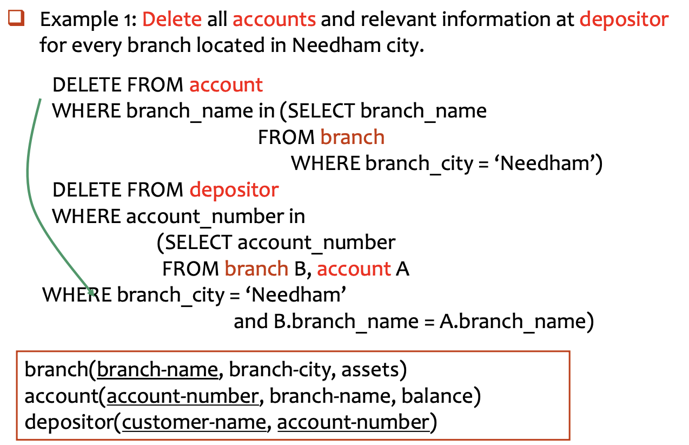
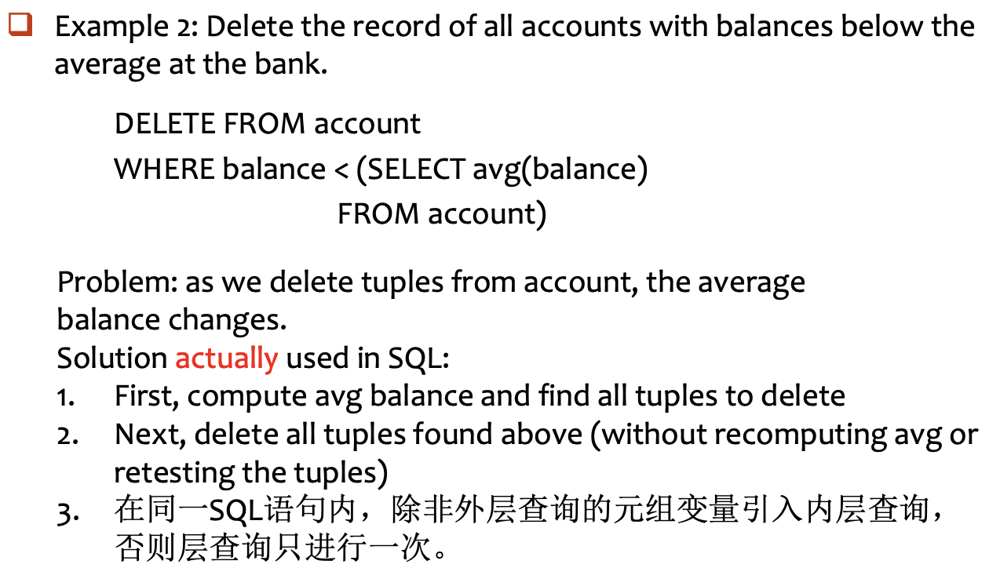
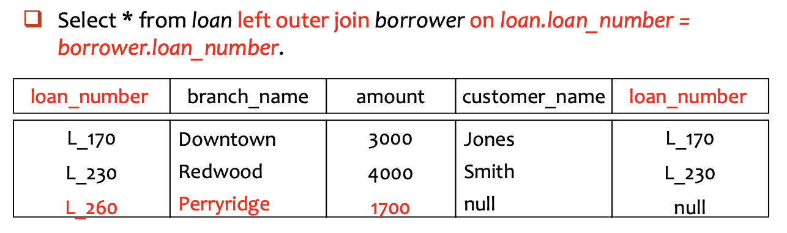
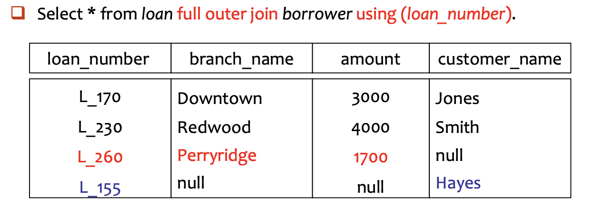

# SQL

!!! info "SQL includes several parts:"

    - Data-Definition Language (DDL)
    - Data-Manipulation Language (DML)
    - Data-Control Language (DCL)

---

## 3.1 Data Definition Language

Example

```sql
CREATE TABLE branch
   (branch_name char(15) not null,
	branch_city varchar(30),
	assets      numeric(8,2),
	primary key (branch_name));
```

### Domain Types in SQL

1. 字符串类型
    - `char(n)`: **定长**字符串
        - 用户指定长度 $n$
        - 如果存储的内容不足 $n$ 个字符，系统通常会用空格填充至 $n$ 位  
        - 适用于长度非常固定的数据（如：身份证号、邮编）
    - `varchar(n)`: **变长**字符串
        - 用户指定最大长度 $n$
        - 实际存储多少个字符就占用多少空间（外加少量开销记录长度）
        - 更具灵活性，是存储姓名、地址等最常用的类型
2. 整数类型
    - **`int`**: 整数
        - 机器相关的（machine-dependent），通常指 32 位整数
        - 数学整数集的一个**有限子集**
    - **`smallint`**: 短整数
        - 比 `int` 占用的存储空间更小，范围也更窄（通常为 16 位）。
        - 当确定数值范围很小时，使用它可以节省内存。
3. 精确数值类型
    - **`numeric(p, d)`**: 定点数
        - 用于需要**绝对精确**的场景（如：财务数据、货币）
        - $p$ (precision): 总位数（精度）
        - $d$ (scale): 小数点后的位数
4. 近似数值类型
    - **`real`, `double precision`**: 浮点数
        - 精度取决于机器的具体实现
        - `double precision`（双精度）比 `real` 提供更高的精度
    - **`float(n)`**: 指定精度的浮点数
        - 参数 $n$ 指定了至少要保留的精度位数（二进制位）
5. 日期与时间类型
    - **`date`**: 仅包含日期（年、月、日）
        - **格式**：`YYYY-MM-DD`（4位年-2位月-2位日）（`date '2007-02-27'`）
    - **`time`**: 仅包含时间（时、分、秒）
        - 格式：`HH:MM:SS`，秒可以包含小数（`time '11:18:16'` 或 `time '11:18:16.28'`）
    - **`timestamp`**: 日期 **+** 时间的结合体。
        - 包含：年、月、日、时、分、秒（`timestamp '2011-03-17 11:18:16.28'`）

### Create Table

```sql
CREATE TABLE r (A_1 D_1, A_2 D_2, ..., A_n D_n, 
				  	  (integrity constraint_1),
				  	  ...,
				  	  (integrity constraint_k));
```

- **$r$**：关系名（表名）
- **$A_i$**：属性名（列名）
- **$D_i$**：数据类型（即该列存放什么样的数据，如 `int`, `varchar` 等）。
- **完整性约束**：用于确保数据库中的数据是准确、可靠的

### Integrity Constraints 

- Not null：强制该列不允许出现空值（NULL）。
- Primary key ($A_1, \dots, A_n$)：**主键**
    - 唯一标识表中的每一行
    - 主键列的值必须唯一，且自动包含 `not null` 属性（SQL-92 标准及以后）
- Check ($P$)：自定义检查
    - $P$ 是一个谓词，只有满足条件的记录才能被存入表中
    - `check (assets >= 0)` 确保银行分行的资产不能为负数

!!! example

    Declare <u>branch_name</u> as the primary key for branch and ensure that the values of assets are non-negative.

Method 1 (表级定义)

```sql
CREATE TABLE branch (
    branch_name char(20) not null,
    branch_city char(30),
    assets integer,
    primary key (branch_name), -- 显式声明主键
    check (assets >= 0)        -- 显式声明检查逻辑
);
```

- 适合定义**复合主键**（即主键由多个列共同组成，如 `primary key (ID, Name)`）

Method 2（列级定义）

```sql
CREATE TABLE branch2 (
    branch_name char(20) primary key, -- 简洁
    branch_city char(30),
    assets integer,
    check (assets >= 0)
);
```

- **优点**：语法更简洁，一眼就能看出哪一列是核心主键。

### Drop and Alter Table

```sql
DROP TABLE r
```

- The ==drop table command== deletes **all information** about the dropped relation from the database

```sql
ALTER TABLE r ADD A D;
ALTER TABLE r ADD (A_1 D_1, ..., A_n D_n);
ALTER TABLE loan ADD loan_date date;
```

- The ==alter table command== is used to **add attributes** to an existing relation.
- All tuples in the relation are assigned *null* as the value for the new attribute.

```sql
ALTER TABLE r DROP A
ALTER TABLE branch MODIFY (branch_name char(30), assets not null);
```

- The ==alter table command== can also be used to <u>drop attributes of a relation</u>.
- The alter table command can also be used to <u>modify attributes of a relation</u>.

### Create Index

**创建索引的语法**：`CREATE INDEX <索引名> ON <表名> (<属性列表>);`

```sql
CREATE INDEX b_index ON branch (branch_name);
CREATE INDEX cust_strt_city_index ON customer (customer_city, customer_street);
```

- 在 branch 表的 branch_name 列上建索引，加速按分行名查找；同时在城市和街道上建索引
- 注意：复合索引的列顺序很重要，通常把过滤性最强的列放在前面

**创建唯一索引的语法**：`CREATE UNIQUE INDEX <i-name> ON <table-name> (<attribute-list>)`

- **功能**：加速查询, 并要求索引列的值**不能重复**    
- **用途**：用于指定**候选键**（Candidate Key）

```sql
CREATE UNIQUE INDEX uni_acnt_index ON account (account_number);
```

- 确保账号（account_number）不会出现重复，起到了数据校验的作用

**删除索引的语法**：`DROP INDEX <索引名>`

---

## 3.2 Basic Structure

### The Select Clause

```sql
SELECT branch_name FROM loan; --默认保留重复 
SELECT distinct branch_name FROM loan; --强制去重
SELECT all branch_name FROM loan; --保留重复
```

- SQL names are *case insensitive*, i.e., you can use capital or small letters.
- SQL allows *duplicates* in relations as well as in query results. (**default**)

```sql
SELECT * FROM loan;
```

An asterisk `*` in the select clause denotes <u>all attributes</u>. 

`SELECT` 不仅仅能读取原始数据，还能在读取的过程中进行实时计算

```sql
SELECT loan_number, branch_name, amount * 100
FROM loan;
```

- 查询结果会展示原有的 `loan_number` 和 `branch_name`，但第三列展示的是 `amount` **放大 100 倍**后的结果

### The Where Clause

- The `WHERE` clause specifies conditions that the result must satisfy.

$$
\Pi_{\text{loan\_number}}(\sigma_{\text{branch\_name=‘Perryridge’}\land\text{amount}>1200}(\text{loan}))
$$

```sql
SELECT loan_number
FROM loan
WHERE branch_name = 'Perryridge' AND mount >1200;
```

### The From Clause

- The `FROM` clause lists the ralations involved in the query.
Find the Cartesian product: $\text{borrower}\times\text{loan}$

```sql
SELECT * FROM borrower, loan;
```

$$
\Pi_{customer\_name, loan\_number, amount}(\sigma_{branch\_name='Perryridge'}(borrower \bowtie loan))
$$

```sql
SELECT customer_name, borrower.loan_number, amount
FROM borrower, loan
WHERE borrower.loan_number = loan.loan_number 
  AND branch_name = 'Perryridge';
```

### The Rename Operation

- Tuple variables are defined in the `FROM` clause via the use of the `as` clause
    - For simplification
    - For discrimination

```sql
SELECT customer_name, T.loan_number, S.amount
FROM borrower as T, loan as S
WHERE T.loan_number = S.loan_number;
```

### String Operations

- 字符串匹配（string matching）
    - `%` : 匹配**任意长度**的字符串
        - 查找名字中包含“泽”字的客户：`WHERE customer_name LIKE '%泽%'`
        - 查找名字正好就是 "Main%" 的用户：`LIKE 'Main\%' escape '\'`
    - `_` : 匹配**单个**任意字符
- 字符串拼接 (Concatenation)
    - 双竖线 `||`，将多个字符串“粘”在一起形成新的字符串    
    - `SELECT '客户名=' || customer_name FROM customer`
- 大小写转换 (Case Conversion)
    - `lower(s)`：将字符串 `s` 中的所有字母转为**小写**。
    - `upper(s)`：将字符串 `s` 中的所有字母转为**大写**。
    - 用于“大小写不敏感”的搜索，例如 `WHERE upper(name) = 'APPLE'`
- 计算字符串长度 (String Length)
- 提取子串 (Extracting Substrings)

### Ordering the Display of Tuples

`ORDER BY` 通常放在 SQL 语句的最后面，用来指定根据哪一列（或哪几列）进行排序

```sql
SELECT * FROM customer
ORDER BY customer_city, customer_street desc, customer_name;
```

排序遵循**优先级原则**：

1. 第一优先级：先按 `customer_city` 升序排列（默认 ASC）
2. 第二优先级：如果在同一城市，则按 `customer_street` **降序**排列 (desc)
3. 第三优先级：如果城市和街道都一样，再按 `customer_name` 升序排列

### Duplicates

- **Multiset多重集** versions of some relational algebra operators, including $\sigma_{\theta},\Pi_A,\times$, which support the multiset.
- 选择、投影、笛卡尔积都默认不会进行去重操作

---

## 3.3 Set Operations

以下操作会**自动去重**，如果要保留重复的行，需要加上 **`ALL`**

- `UNION` ($\cup$)：合并两个查询结果
- `INTERSECT` ($\cap$)：只保留同时存在于两个查询结果中的行
- `EXCEPT` ($-$)：从第一个查询结果中减去第二个查询结果中也存在的行

**Example 1:** Find all customers who have a loan or an account **or both**.

```sql
(SELECT customer_name FROM depositor) 
 UNION 
(SELECT customer_name FROM borrower)
```

**Example 2:** Find all customers who have **both** a loan and an account.

```sql
(SELECT customer_name FROM depositor) 
 INTERSECT 
(SELECT customer_name FROM borrower)
```

**Example 3**: Find all customers who have an account **but no** loan.

```sql
(SELECT customer_name FROM depositor) 
 EXCEPT
(SELECT customer_name FROM borrower)
```

---

## 3.4 Aggregate Functions

- `avg(col) `: average value 
- `min(col)`: minimum value 	
- `max(col)`: maximum value 	
- `sum(col)`: sum of values 
- `count(col)`: number of values

### Example1

$$
\mathcal{G}_{avg(balance)} (\sigma_{branch\_name='Perryridge'}(account))
$$

```sql
SELECT avg(balance) avg_bal
FROM account
WHERE branch_name = 'Perryridge'
```

常见错误：

```sql
SELECT branch_name, avg(balance) avg_bal
FROM account
WHERE branch_name = 'Perryridge'
```

- `avg(balance)` 返回的是**一个数值**（符合条件的所有行的平均值）        
- `branch_name` 在这里是一个**属性列**，它包含多行数据
- 数据库无法在一行结果里既显示一个单一的平均值，又显示多行原始的支行名称

### Example2

Find the average account balance for each branch

```sql
SELECT branch_name, avg(balance) avg_bal
FROM account
GROUP BY branch_name;
```

### Example3

Find the number of depositors for each branch.

```sql
SELECT branch_name, count(customer_name) tot_num
FROM depositor, account
WHERE depositor.account_number = account.account_number
GROUP BY branch_name
```

### Example4 - Having Clause

Find the names of all branches located in city Brooklyn where the average account balance is more than $\$1200$.

```sql
SELECT A.branch_name, avg (balance)
FROM account A, branch B
WHERE A.branch_name = B.branch_name 
  AND branch_city = 'Brooklyn'  -- 先过滤出布鲁克林的支行
GROUP BY A.branch_name          -- 按支行分组
HAVING avg (balance) > 1200;    -- 再过滤出平均余额大于 1200 的组
```

### Summary

The execution order of SELECT:
<u>From -> where -> group (aggregate) -> having -> select -> distinct -> order by</u>

---

## 3.5 Null Values

- The result of any arithmetic expression involving "*null*" is ==null==.
- Any comparison with *null* returns "==unknown==".
- Result of where clause predicate is treated as *false* if it evaluates to unknown.

!!! info "Three-valued Logic: true, false, unknown"

    OR :

    - unknown OR true = true
    - unknown OR false = unknown
    - unknown OR unknown = unknown

    AND :

    - true AND unknown = unknown
    - false AND unknown = false
        - unknown AND unknown = unknown

    NOT :

    - NOT unknown = unknown

The predicate `is null`, `is not null` can be used to check for null values.

- **错误示范**：`WHERE amount = null`
    - **原因**：任何值与 NULL 进行比较，结果都是 unknown。根据三值逻辑，WHERE 会过滤掉 unknown，所以该语句**查不到任何结果**
Null values and Aggregates
- **基本规则：直接忽略**
    - `SUM(amount)` 会自动跳过那些 `amount` 为 `NULL` 的行
    - 如果表里所有的 `amount` 都是 `NULL`，那么结果是 **`NULL`**
- **例外：`COUNT(*)`**
    - `COUNT(*)` 统计的是**行数**。即使某一行全是 `NULL`，它也会被算作一行

---

## 3.6 Nested Queries

### Nested Subqueries

- A subquery is a `select_from_where` expression that is nested within another query.

Example 1: Find all customers who have both an account and a loan at the bank.

```sql
SELECT distinct customer_name
FROM borrower
WHERE customer_name in (SELECT customer_name
						FROM depositor);
```

Example 2: Find all customers who have loans at a bank <font color="#ff0000">but do not</font> have an account at the bank.

```sql
SELECT distinct customer_name
FROM borrower
WHERE customer_name not in (SELECT customer_name
							FROM depositor);
```

Example 3: Find all customers who have <font color="#ff0000">both</font> an account and a loan at the Perryridge branch.

```sql
-- Query1
SELECT distinct customer_name
FROM borrower B, loan L
WHERE B.loan_number = L.loan_number and
	  branch_name = "Perryridge" and
	  (branch_name, customer_name) in
	  (SELECT branch_name, customer_name
	   FROM depositor D, account A
	   WHERE D.account_number = A.account_number);
	   
-- Query2
SELECT distinct customer_name
FROM borrower B, loan L
WHERE B.loan_number = L.loan_number and
	  branch_name = "Perryridge" and
	  customer_name in
	  	(SELECT customer_name
	  	 FROM depositor D, account A
	     WHERE D.account_number = A.account_number and branch_name = "Perryridge");
	     
-- Query3
SELECT distinct customer_name
FROM borrower B, loan as t
WHERE B.loan_number = t.loan_number and
	  branch_name = "Perryridge" and
	  customer_name in
	  	(SELECT customer_name
	  	 FROM depositor D, account A
	     WHERE D.account_number = A.account_number 
	     	   and branch_name = t.branch_name);
```

Example 4: Find the account_number with the maximum balance for every branch.

```sql
SELECT account_number, balance
FROM account
WHERE (branch_name, balance) IN (
    SELECT branch_name, max(balance)
    FROM account
    GROUP BY branch_name
);
```

### Set Comparison

#### Some Clause

$$
C <comp> \text{some } r \iff \exists t \in r, C <comp> t \text{ holds}
$$

- $C$：你要比较的值
- $<comp>$：比较操作符（如 $<, \le, >, =, \ne$）
- $r$：子查询返回的结果集合
- **含义**：在集合 $r$ 中，**存在**至少一个元组 $t$，使得比较成立

#### All Clause

$$
C <comp> \text{all } r \iff \forall t \in r, C <comp> t \text{ holds}
$$

**Example**: Find the names of all branches that have greater assets than all branches located in Brooklyn.

```sql
-- Query1
SELECT branch_name
FROM branch
WHERE assets > all
		(SELECT assets FROM branch WHERE branch_city = "Brooklyn");
		
-- Query2
SELECT branch_name
FROM branch
WHERE assets > 
		(SELECT max(assets) FROM branch WHERE branch_city = "Brooklyn");
```

#### Test for Empty Relations

- The ==exists== construct returns the value true if the argument subquery is non-empty.

**Example**: Find all customers who have accounts <font color="#ff0000">at all</font> branches located in city Brooklyn.

$$
\Pi _ { \text {customer-name,branch-name} } ( \text {depositor} \bowtie \text{account} ) \div \Pi _ { \text {branch-name}} ( \sigma _ { \text {branch-city} = \text {'Brooklyn'} } ( \text {branch} ) ) 
$$

```sql
SELECT distinct S.customer_name
FROM depositor as S
WHERE not exists (
	SELECT branch_name
	FROM branch
	WHERE branch_city = "Brooklyn"
	EXCEPT 
	(SELECT distinct R.branch_name
	 FROM depositor as T, account as R
	 WHERE T.account_number = R.account_number
	 	   and S.customer_name = T.customer_name));
```

#### Test for Absence of Duplicate Tuples

- The ==unique== construct tests whether a subquery has any duplicate tuples in its result.
Find all customers who have **at most one** account at the Perryridge branch.

```sql
SELECT customer_name
FROM depositor as T
WHERE unique 
   (SELECT R.customer_name
    FROM account, depositor as R
    WHERE T.customer_name = R.customer_name and
    	  R.account_number = account.account_number
    	  and account.branch_name = 'Perryridge');
```

---

## 3.7 Views

Privide a mechanism to **hide certain data** from the view of certain users.

- Security
- Easy to use, support logical independent

```sql
-- 方式一（直接使用查询中的列名）
CREATE VIEW <v_name> AS
SELECT c1, c2, ... FROM ...

-- 方式二（自定义视图列名）
CREATE VIEW <v_name> (c1, c2, ...) AS
SELECT e1, e2, ... FROM ...

-- 删除视图
DROP VIEW <V_NAME>
```

!!! example

    ```sql
    CREAT view all_customer as 
    	((SELECT branch_name, customer_name 
    	FROM depositor, account 
    	WHERE depositor.account_number = account.account_number) 
    	union 
    	(SELECT branch_name, customer_name 
    	FROM borrower, loan 
    	WHERE borrower.loan_number = loan.loan_number))
    ```

    - Then we get view: `all_customer (branch_name, customer_name)`

---

## 3.8 Derived Relations

**派生关系（Derived Relations）**：在 `FROM` 子句中嵌套子查询
Example: Find the average account balance of those branches where the average account balance is greater than $\$500$.

- Query 1

```sql
SELECT branch_name, avg_bal
FROM (SELECT branch_name, avg(balance)
 	  FROM account
 	  GROUP BY branch_name)
 	  as result(branch_name, avg_bal)
WHERE avg_bal > 500;
```

- Query 2

```sql
SELECT branch_name, avg(balance)
FROM account
GROUP BY branch_name
HAVING avg(balance) > 500;
```

不管是否被引用，导出表（或称嵌套表）必须给出别名

```sql
SELECT TT.sno, sname, c_num
FROM (SELECT sno, count(cno) as c_num
      FROM enroll
      GROUP BY sno) as TT, student S
WHERE TT.sno = S.sno and c_num >10;
```

### With Clause

- The ==WITH== clause allows views to be defined l<u>ocally for a query</u>, rather than globally

!!! example

    Find all accounts with the maximum balance.

    ```sql
    -- Define a local view
    WITH max_balance(value) as
    	 SELECT max(balance)
    	 FROM account
    -- Use the local view
    SELECT account_number
    FROM account, max_balance
    WHERE account.balance = max_balance.value
    ```

    Find all branches where the total account deposit is greater than the average of the total account deposits at all branches.

    ```sql
    WITH branch_total(branch_name, a_bra_total) as 
    	SELECT branch_name, sum(balance) 
    	FROM account 
    	GROUP BY branch_name 
    	
    WITH total_avg(value) as 
    	SELECT avg(a_bra_total) 
    	FROM branch_total 
    	
    SELECT branch_name, a_bra_total 
    FROM branch_total A, total_avg B 
    WHERE A.a_bra_total >= B.value
    ```

---

## 3.9 Modification of the Database

### 3.9.1 Deletion

Formal form:

```sql
DELETE FROM <table | view>
[ WHERE <condition> ] 
```

Example Queries

<div style="text-align: center"></div>

<div style="text-align: center"></div>

### 3.9.2 Insertion

Format:

```sql
INSERT INTO <table|view>[(c1, c2,…)] 
VALUES (e1, e2, …) 

INSERT INTO <table|view>[(c1, c2,…)] 
SELECT e1, e2, … 
FROM …
```

- The "select from where" statement is fully evaluated *before* any of its results are inserted into the relation.

!!! example

    **Example 1**: Add a new tuple to account with balance set to null.

    ```sql
    INSERT INTO account 
    VALUES (‘A_777’, ‘Perryridge’, null) 
    -- or equivalently 
    INSERT INTO account (account_number, branch_name) 
    VALUES (‘A_777’, ‘Perryridge’)
    ```

    **Example 2**: Provide as a gift for all loan customers of the Perryridge branch, a $200 savings account. Let the loan number serve as the account number for the new savings account.

    - Add one record to account and depositor.

    ```sql
    -- Step 1: insert into account 
    INSERT INTO account
    SELECT loan_number, branch_name, 200 
    FROM loan 
    WHERE branch_name = ‘Perryridge’ 

    -- Step 2: insert into depositor 
    INSERT INTO depositor
    SELECT customer_name, A.loan_number 
    FROM loan A, borrower B 
    WHERE A.branch_name = ‘Perryridge’ and A.loan_number = B.loan_number
    ```

### 3.9.3 Updates

Format of update statement:

 ```sql
 UPDATE <table | view>
 SET <c1 = e1 [, c2 = e2, …]> [WHERE <condition>]
 ```

#### Case Statement for Conditional Updates

Increase all accounts with balances over $10,000 by 6%, and all other accounts receive 5%

```sql
UPDATE account 
SET balance = case 
				when balance <= 10000 
					then balance * 1.05 
				else balance * 1.06 
			  end
```

#### Update of a View

Create a view of all loan data in loan relation, hiding the amount attribute. 

```sql
CREATE VIEW branch_loan as 
	SELECT branch_name, loan_number 
	FROM loan
```

- 建立在单个基本表上的视图，且视图的列对应表的列，称为“==行列视图==”

Add a new tuple to branch_loan. 

```sql
INSERT INTO branch_loan 
VALUES (‘Perryridge’, ‘L-307’) 
-- This insertion will be translated into: 
INSERT INTO loan 
VALUES (‘L-307’, ‘Perryridge’, null)
```

- Updates on more complex views are difficult or impossible to translate, and hence are *disallowed*（只有**行列视图**，可更新数据）
- View 是虚表，对其进行的所有操作都将转化为对基表的操作

### Transactions

A transaction is a sequence of queries and data update statements executed as <u>a single logical unit</u>.

- Transactions are started implicitly and terminated by one of 
    - *COMMIT WORK*: makes all updates of the transaction permanent in the database. 
    - *ROLLBACK WORK*: undoes all updates performed by the transaction.
The four properties of transaction are required: *atomicity, isolation, consistency, durability*

---

## 3.10 Joined Relations

- Join operations take as input two relations and return as a result another relation. 
- **Join condition** – defines <u>which tuples</u> in the two relations <font color="#ff0000">match</font>, and what attributes are present in the result of the join. 
    - natural : 查找两张表中**所有同名的列**，并用这些列进行等值匹配
    - on \<predicate\>
    - using (A1, A2, ..., An) : 用这些同名列来进行等值匹配
- **Join type** – defines how tuples in each relation that <font color="#ff0000">do not match any tuple</font> in the other relation (based on the join condition) are treated.
    - inner join ($\bowtie$):
      只保留那些在两张表中都能找到匹配的行，没有匹配项的行会被完全丢弃。
    - left outer join :
      保留左表的所有行。如果左表的某一行没有找到匹配，那么结果中该行的右表部分用NULL填充。
    - right outer join :
      与左外连接相反，保留右表的所有行。如果右表的某一行在左表中没有匹配，那么结果中这一行的左表部分就用NULL填充。
    - full outer join :
      保留两张表的所有行，没有匹配的部分用NULL填充。

### Format

自然连接：R <font color="#ff0000">natural</font> {inner join, left join, right join, full join} S 
非自然连接：

1. R {inner join, left join, right join, full join} S <font color="#ff0000">on</font> <连接条件判别式> 
2. R {inner join, left join, right join, full join} S <font color="#ff0000">using</font> (<同名的等值连接 属性名>)

Key word `inner, outer` is optional.

- Natural join: 以同名属性相等作为连接条件 
- Inner join：只输出匹配成功的元组 
- Outer join：还要考虑不能匹配的元组

### Joined Relations in SQL

<div style="text-align: center"></div>

<div style="text-align: center"></div>

Example: Find all customers who have either an account or a loan (but not both) at the bank.

```sql
ELECT customer_name 
FROM (depositor natural full outer join borrower) 
WHERE account_number is null or loan_number is null
```

### Synthetic examples

#### Example1

Consider the following relational schema: `part (id, name, color, weight, sub_part) `, transfer the following SQL query into the relational algebra expression: 

```sql
SELECT part2.id 
FROM part as part1, part as part2 
WHERE part1.id = part2.sub_part AND part1.color = ‘red’ AND part2.color = ‘blue’ AND part1.weight – part2.weight >100
```

$$
\Pi_{\text{p2.id}} \left( \sigma_{\text{p1.weight - p2.weight > 100}} \left( \sigma_{\text{p1.id = p2.sub\_part}} \left( \left( \sigma_{\text{p1.color = 'red'}} (\rho_{\text{p1}}(\text{part1})) \right) \times \left( \sigma_{\text{p2.color = 'blue'}} (\rho_{\text{p2}}(\text{part2})) \right) \right) \right) \right)
$$

#### Example2

Consider the student database below: 

```
student (student-no, student-name, sex, age, dept-name) 
course (course-no, course-name, credit) 
study (student-no, course-no, score) 
```

Please give the SQL statements for each of the following requirements: 
(1) Find the names of students who have studied course ‘Database System’ and sort results by ascending score. 

```sql
SELECT student_name 
FROM student S, study T, course C 
WHERE S.student_no = T.student_no and 
	  T.course_no = C.course_no and
	    course_name = 'Database System'
ORDER BY score
```

(2) Find the names of students who get the best score in course ‘Database System’. 

```sql
SELECT student_name 
FROM student S, study T, course C 
WHERE S.student_no = T.student_no and 
	  T.course_no = C.course_no and 
	  course_name = ‘Database System’ and 
	  T.score >= (SELECT max(score) 
	  			  FROM study T, course C 
	  			  WHERE T.course_no = C.course_no and 
	  			  		course_name = ‘Database System’)
```

(3) Find the names of courses that have maximum average score.

- Method 1:

```sql
SELECT course_name 
FROM course 
WHERE course_no in 
	(SELECT course_no 
	 FROM study 
	 GROUP BY course_no 
	 HAVING avg(score) >= all 
	 			(SELECT avg(score) 
	 			 FROM study 
	 			 GROUP BY course_no))
```

- Method 2

```sql
WITH course_avg(course_no, score_avg) as 
SELECT course_no, avg(score) 
FROM study 
GROUP BY course_no 

SELECT course_name 
FROM course 
WHERE course_no in 
(SELECT course_no 
 FROM course_avg 
 WHERE score_avg = 
 	(SELECT max(score_avg) 
 	 FROM course_avg))
```
