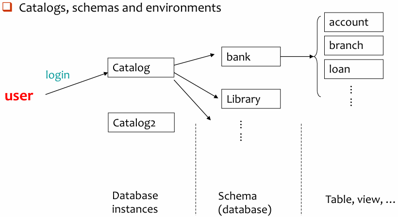
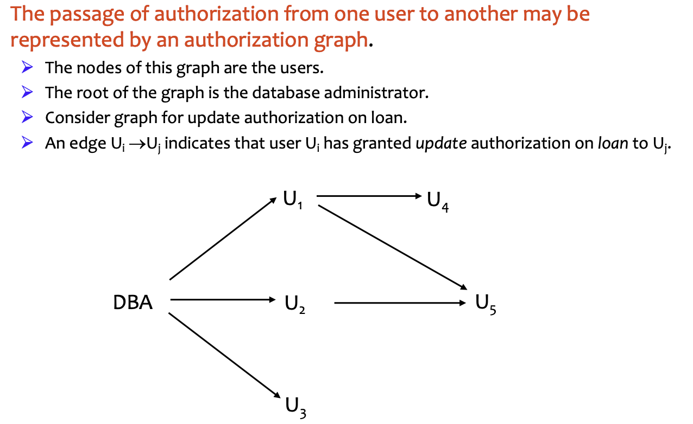
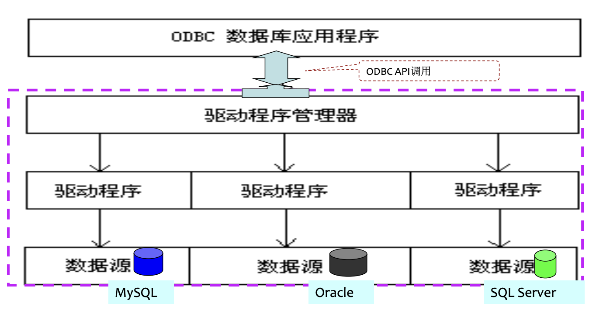

# Advanced SQL

## 4.1 SQL Data Types and Schemas

### 1. Type & Domain

**Type**

1. **内置数据类型 (Built-in data types)**
    - SQL 预定义好的类型，比如 `int`, `char(n)`, `varchar(n)`, `date`, `numeric(p, d)` 等
2. **用户自定义类型 (User-defined types)**
    - 结构化数据类型 (Structured data types)： 类似“结构体”，可以包含多个属性
    - 特殊类型 (Distinct types)： 基于已有的内置类型创建一个新类型

```sql
-- 新建type
Create type person_name as varchar (20)
-- 调用type
Create table student (
	sno char(10) primary key,
	sname person_name, 
	ssex char(1), 
	birthday date) 
-- 删除type
Drop type person_name
```

**Domain**

- 创建新域 (Create new domain)：“域”是在现有类型的基础上，添加**约束 (Constraints)** 形成的

```sql
Create domain Dollars as numeric(12, 2) not null; 
Create domain Pounds as numeric(12,2); 
Create table employee (
	eno char(10) primary key, 
	ename varchar(15), 
	job varchar(10), 
	salary Dollars, 
	comm Pounds);
```

| **特性**    | **自定义类型 (Distinct Type)** | **域 (Domain)**              |
| --------- | ------------------------- | --------------------------- |
| **底层基础**  | 基于内置类型                    | 基于内置类型                      |
| **主要目的**  | 创建逻辑上独立的新类型，强调安全性         | 封装“类型+约束”，方便重复使用            |
| **约束支持**  | 不支持直接在定义时加复杂约束            | 支持（如 `NOT NULL`, `CHECK` 等） |
| **检查严格度** | **强类型**（不同类型间不可直接操作）      | **弱类型**（底层类型相同时可操作）         |

### 2. Large-object types

- Large objects (e.g., photos, videos, CAD files, etc.) are stored as a **large object**:
    - **BLOB (Binary Large Object)：**
        - 存储二进制位流
        - 数据库只负责存取，解析工作交给外部应用程序
    - **CLOB (Character Large Object)：**
        - 存储字符数据
        - 专门用于存储超长文本，比如整本书的内容、长篇论文或 XML/JSON 文档。
- When a query returns a large object, ==a pointer== is returned rather than the large object itself. 
    - 执行 `SELECT` 时，数据库只返回一个**指针**
    - 防止程序和网络崩溃

```sql
Create table students (
    sid char(10) primary key,
    name varchar(10),
    gender char(1),
    photo blob(20MB),   -- 预留 20MB 空间存储二进制图片
    cv clob(10KB)       -- 预留 10KB 空间存储文本格式的简历
)
```

### 3. Catalogs, schemas and environments

<div style="text-align: center"></div>

---

## 4.2 Integrity Constraints

==完整性约束（Integrity Constraints）==是为了防止对数据库的“误伤”（accidental damage）。即使是拥有权限的用户，也可能因为操作失误录入错误数据。它具有三大基本类型：

1. **实体完整性 (Entity Integrity)：**
    - 保证每一行（每一个实体）都是唯一的
    - 通常通过主键 (Primary Key)来实现，要求主键不能为空且不能重复
2. **参照完整性 (Referential Integrity)：** 
    - 保证表与表之间的关系是有效的，通常通过外键 (Foreign Key) 实现
    - 比如“学生表”里的“班级编号”必须在“班级表”里真实存在
3. **用户定义的完整性 (User-defined Integrity)：** 
    - 针对具体业务的需求，比如“年龄必须在 0 到 150 之间”，“性别只能是男或女”
完整性约束是数据库实例 (Instance) 必须遵循的，由 **DBMS** 自动维护

**针对单个 relation 的约束**：

- Not null 
- Primary key 
- Unique 
- Check (P), where P is a predicate

```sql
Create table branch2 (
    branch_name varchar(30) primary key,  -- 主键：支行名称唯一且不准为空
    branch_city varchar(30),
    assets integer not null,              -- 资产列：不准为空
    check (assets >= 100)                 -- 检查约束：资产必须大于等于 100
)
```

### 1. Domain Constraints 

SQL-92 允许通过 `check` 子句来限制域的取值范围

```sql
-- 创建一个名为 hourly-wage 的新域，其基础类型是精度为5、小数位为2的数字
Create domain hourly-wage numeric(5, 2)
-- 给这个约束起一个名字，叫 value-test，并要求该类型的数值都必须大于或等于4.00
Constraint value-test check(value >= 4.00)
```

- 子句 `constraint value-test` 是可选的；用于指示更新违反了哪个约束

### 2. Referential Integrity 

#### Formal Definition

Let $r_1 (R_1)$ and $r_2 (R_2)$ be the relations with primary keys $K_1$ and $K_2$, respectively. 

- The subset $\alpha$ of $R_2$ is a ==foreign key== referencing $K_1$ in relation $r_1$, if for every $t_2$ in $r_2$ there must be a tuple $t_1$ in $r_1$ such that $t_1[K_1] = t_2[\alpha]$. 
- Referential integrity constraint also called <font color="#ff0000">subset dependency</font>, since its can be written as 

$$
\Pi_\alpha(r_2) \subseteq \Pi_{K_1}(r_1)
$$

Assume there exists relations $r$ and $s$: $r (\underline{A}, B, C)$, $s (\underline{B}, D)$, we say attribute $B$ in $r$ is a ==foreign key== from relation $r$, and $r$ is called <font color="#ff0000">referencing relation (参照关系)</font>, and $s$ is called <font color="#ff0000">referenced relation (被参照关系)</font>. 

```sql
Account(account-number, branch-name, balance) 
-- 参照关系 
Branch(branch-name, branch-city, assets) 
-- 被参照关系 q 参照关系中外码的值必须在被参照关系中实际存在，或为null.
```

- 参照关系中外码的值**必须在被参照关系中实际存在**，或为 null.

#### Checking

假设 $r_1$ 是被参照表， $r_2$ 是参照表，$\alpha$ 是外键

##### Insert

向子表 $r_2$ 插入一条新记录时：

- 插入的数据中，Foreign Key 的值 $\alpha$ 必须在 $r_1$ 的 Primary Key中**已经存在**
- 系统会执行 $t_2[\alpha] \in \Pi_K(r_1)$ 的验证

##### Delete

尝试从父表 $r_1$ 删除一条记录 $t_1$ 时，如果子表 $r_2$ 中还有记录在引用它，就会出问题

- 系统会搜索子表中是否有元组匹配要删除的主码，即执行 $\sigma_{\alpha=t_1[K]}(r_2)$
- 处理方式（如果发现匹配项）：
    1. Reject：最常见的做法，报错并禁止删除
    2. Cascading Delete：系统不仅删掉父表的那一行，还会**自动**把子表中所有引用这一行的记录全都删掉

##### Update

修改子表 $r_2$ 中的外码值时：

- 本质上和 insert 逻辑是一样的
- 修改后的新值 $t_2'[\alpha]$ 必须在父表 $r_1$ 的主码中能找到。

#### Integrity in SQL

在创建表时，可以定义的几种核心约束：

- **primary key (主键)**： 用于唯一标识表中的每一行。一个表只能有一个主键，且主键列不能为空（NOT NULL）
- **unique (唯一键/候选键)**： 用于确保某一列（或多列组合）的值是唯一的。它与主键类似，但一个表可以有多个 `unique` 约束，且允许存在 null
- **foreign key (外键)**： 它指明了本表中的某些属性是引用自另一个表的。它必须包含两个要素：
    1. 本表的属性列表（哪些列是外键）
    2. 被参照表的名称（引用了哪个表）

!!! tip

    - 如果只写了被参照表的名称，而没有指定具体的列名，SQL 默认会引用该表的**主键**
        - **例子**：`foreign key (account-number) references account`
        - 这里默认引用 `account` 表的主键
    - 如果只想为**单个列**定义外键，可以直接写在列定义后面，不需要单独写一行 `foreign key` 子句
        - **例子**：`account-number char(10) references account`
    - 显式指定引用列
        - 可以明确指出引用对方表的哪一列。
        - 被引用的那一列在对方表中必须被声明为 `primary key` 或 `unique`，不能引用一个非唯一值的列，否则逻辑会乱套。

!!! example

    ```sql
    Create table customer 
    	(customer-name char(20), 
    	customer-street varchar(30), 
    	customer-city varchar(30), 
    	primary key (customer-name)); 
    	
    Create table branch 
    	(branch-name varchar(15), 
    	branch-city varchar(30), 
    	assets integer, 
    	primary key (branch-name));
    	
    Create table account 
    	(account-number char(10), 
    	branch-name char(15), 
    	balance integer, 
    	primary key (account-number), 
    	foreign key (branch-name) references branch); 
    	
    Create table depositor 
    	(customer-name char(20), 
    	account-number char(10), 
    	primary key (customer-name, account-number), 
    	foreign key (account-number) references account, 
    	foreign key (customer-name) references customer);
    ```

#### Cascading

##### The Basics

```sql
Create table account ( 
		...
	foreign key (branch-name) references branch 
		[ on delete cascade] 
		[ on update cascade ] 
		...);
```

- on delete cascade (级联删除)：
  如果删除了 branch 中的一个支行，那么 account 中所有属于该支行的记录都会被**自动删除
- on update cascade (级联更新)：
  如果某个支行的名称变了，子表中引用该名称的所有记录也会同步更新

##### Propagation and Aborts

- **级联链** (Chain of dependencies)： 
    - 如果 A 表引用 B 表，B 表引用 C 表，且都设置了 `cascade`。那么删除 C 表的一条记录，这个操作会像多米诺骨牌一样一直传递到 A 表。
- **事务中止** (Abort)：如果在级联过程中，某个操作违反了数据库的其他约束，那么**整个事务会中止**
    - 数据库会回滚（Undo）到操作之前的状态
    - 数据库的原子性原则：<u>要么全做，要么全不做</u>

##### Alternatives to Cascading

- **`on delete set null`：** 父条目删了，子条目的外键字段设为 `NULL`
- **`on delete set default`：** 设为预定义的默认值
如果外键允许为 NULL，那么这条记录就自动“满足”了约束，即使它不指向任何实际存在的父项。
- 除非有特殊需求，否则通常对外键使用 `NOT NULL`

!!! note "Referential integrity is only checked at the end of a transaction!"

    **参照完整性是在事务结束时才进行最终检查的。**

    - 为什么不实时检查？
        - 为了支持**循环引用**（Mutual references）
        - 例子： “已婚人士”表，丈夫的 spouse 列指向妻子，妻子的 spouse 列指向丈夫。如果实时检查，先插入丈夫时，妻子还没存进去，就会报错
    - **中间态：** 事务执行过程中，允许出现暂时的“违规”。只要在点击 `commit`（提交）之前，你把所有缺失的数据都补齐，数据库就会允许这一组操作成功

### 3. Assertions 

==Assertion==是一个谓词（即返回真或假的逻辑表达式），数据库必须始终满足它。

```sql
CREATE ASSERTION <assertion-name> CHECK <predicate>;
```

- 每当相关表发生 `UPDATE`、`INSERT` 或 `DELETE` 时，系统都会去检查一遍
- 性能开销（Overhead）非常大，很多主流商业数据库对断言的支持并不完善，开发者更倾向于使用触发器

SQL 没有提供 `FOR ALL` 这种直接的语法，为了表达“所有的 $X$ 都必须满足条件 $P$”，需要利用逻辑等价进行转换：

$$
\forall x P(x) \equiv \neg \exists x \neg P(x)
$$

即：**“所有人都及格” $\iff$ “不存在不及格的人”**，寻找的就是那个“破坏规则的人”

!!! example

    The sum of all loan amounts for each branch must be less than the sum of all account balances at the branch.

    ```sql
    CREATE ASSERTION sum-constraint CHECK
      (not exists (select * from branch B  -- 寻找是否存在这样的支行 B
        where (select sum(amount) from loan 
               where loan.branch-name = B.branch-name) -- 支行 B 的总贷款
               > 
              (select sum(balance) from account 
               where account.branch-name = B.branch-name) -- 支行 B 的总存款
      ))
    ```

    - **内部查询：** 针对每一个支行 B，分别计算它的贷款总和和存款总和。

    - **比较逻辑：** 寻找“贷款 > 存款”的异常支行。

    - **外部包装：** NOT EXISTS 如果没有找到任何异常支行，说明数据库目前是健康的，断言返回 True；如果找到了，操作就会被拒绝并报错。

    Every loan has at least one borrower who maintains an account with a minimum balance of $1000.

    ```sql
    CREATE ASSERTION balance-constraint CHECK 
    	(not exists (select * from loan L 
    		where not exists (select * from borrower B, depositor D, account A 
    						where L.loan-number = B.loan-number 
    						and B.customer-name = D.customer-name 
    						and D.account-number = A.account-number 
    						and A.balance >= 1000)))
    ```

### 4. Triggers

- A trigger is a statement that is executed **automatically** by the system **as a side-effect of a modification** to the database.
- 设计触发器的机制需要考虑两点：
    1. Conditions：必须明确指定在什么情况下触发器会被触发
    2. Actions：必须指定当触发器被激活时，系统需要执行的具体操作

!!! example

    Suppose that instead of allowing negative account balances, the bank <font color="#ff0000">deals with overdrafts</font> by (the **actions**): 

    - Setting the account balance to zero 
    - Creating a loan in the amount of the overdraft, giving this loan a loan number identical to the account number of the overdrawn account 

    The **condition** for executing the trigger is an **update** to the account relation that results in a **negative balance** value.

#### Trigger Example in SQL

- Triggering event can be <u>insert, delete or update</u>. 
- Triggers on update can be restricted to **specific attributes**： 
    - E.g., `Create trigger overdraft-trigger after update of balance on account`
- Values of attributes *before* and *after* an update can be referenced: 
    - `referencing old row as`: for deletes and updates 
    - `referencing new row as`: for inserts and update

```sql
CREATE TRIGGER overdraft-trigger after update on account 
	referencing new row as nrow for each row 
	when nrow.balance < 0 
		begin atomic 
			insert into borrower 
				(select customer-name, account-number from depositor 
				where nrow.account-number = depositor.account-number) 
			insert into loan values 
				(nrow.account-number, nrow.branch-name, – nrow.balance)
			update account set balance = 0 
				where account.account-number = nrow.account-number 
		end
```

#### Statement Level Triggers 

语句级触发器不是为每一行受影响的数据执行一次操作，而是针对整个事务或语句**只执行一次**操作

- Use **for each statement** instead of **for each row**
- Use **referencing old table** or **referencing new table** to refer to temporary tables (called transition tables) containing the affected rows 
- Can be more efficient when dealing with SQL statements that update a large number of rows

#### External World Actions

有时需要在数据库更新时触发外部世界动作，但触发器不能直接实现外部世界动作

- **记录动作**：触发器可以在一个单独的表中记录需要采取的动作 (actions-to-be-taken)
- **外部进程**：有一个外部进程会重复扫描该表，执行**外部世界动作**并从表中删除动作记录

!!! example

    Suppose a warehouse has the following tables 

    - inventory(item, level): How much of each item is in the warehouse presently 
    - minlevel(item, level): What is the minimum desired level of each item 
    - reorder(item, amount): What quantity should we re-order at a time 
    - orders(item, quantity): Orders to be placed (to be read by external process)

    ```sql
    CREATE TRIGGER reorder-trigger after update of level ON inventory 
    referencing old row as orow, new row as nrow
    for each row 
    	when nrow.level <= (SELECT level 
    					    FROM minlevel 
    					    WHERE minlevel.item = nrow.item) 
    	and orow.level > (SELECT level 
    					  FROM minlevel 
    					  WHERE minlevel.item = orow.item) 
    begin
    	INSERT INTO orders 
    	(SELECT item, amount 
    	  FROM reorder 
    	  WHERE reorder.item = orow.item); 
    end;
    ```

#### When Not To Use Triggers 

过去，开发人员经常使用触发器来处理以下两类任务：

- 维护汇总数据：
    - 例如，为了实时知道每个部门的工资总额，开发人员可能会写一个触发器：每当员工表中插入或更新工资时，触发器自动更新“部门总工资表”
    - 方式可行，但代码复杂且容易出错
- 数据库复制：
    - 将数据变更记录到特殊的表中（“变更表”或“增量表”），然后由另一个进程读取这些表并将变更应用到副本数据库
    - 早期实现主从同步或数据仓库 ETL 的一种手段
现代更好的替代方案
- 物化视图(built in materialized view)：
    - 现在的数据库提供了内置的物化视图功能
    - 自动维护汇总数据，无需手动编写触发器代码
- 内置复制支持(built-in support for replication)：
    - 现代数据库系统都提供了原生的复制支持。
    - 直接支持主从复制、集群同步等功能，不再需要开发者手动去写触发器记录变更日志

---

## 4.3 Authorization

Authorization & Authentication

- Authorization：授权，决定了你能做什么
- Authentication：认证，确定了你的身份（你是谁）

!!! info "Security"

    Security - protection from malicious attempts to steal or modify data. 

    - Database system level 
        - <u>Authentication and authorization mechanisms</u> allow specific users access only to <font color="#ff0000">required data</font>. 
        - We concentrate on authorization in the rest of this chapter. 
    - Operating system level
        - Operating system super-users can do anything they want to the database! 
        - Good operating system level security is required.
    - Network level: must use encryption to prevent 
        - Eavesdropping (unauthorized reading of messages) 
        - Masquerading (pretending to be an authorized user or sending messages supposedly from authorized users) 
    - Physical level 
        - Physical access to computers allows destruction of data by intruders; traditional lock-and key security is needed 
        - Computers must also be protected from floods, fire, etc. -- (Recovery) 
    - Human level 
        - Users must be screened to ensure that an authorized users do not give access to intruders 
        - Users should be trained on password selection and secrecy

|授权类型|说明|
|:--|:--|
|读取授权 (Read authorization)|允许读取数据，但不允许修改数据。|
|插入授权 (Insert authorization)|允许插入新数据，但不允许修改现有数据。|
|更新授权 (Update authorization)|允许修改数据，但不允许删除数据。|
|删除授权 (Delete authorization)|允许删除数据。|
| 索引授权 (Index authorization)      | 允许创建和删除索引。           |
| 资源授权 (Resources authorization)  | 允许创建新的关系（表）。         |
| 修改授权 (Alteration authorization) | 允许在关系（表）中添加或修改属性（列）。 |
| 删除授权 (Drop authorization)       | 允许删除关系（表）。           |

### Authorization and Views

- Users can be given <u>authorization on views</u>, without being given any authorization on the relations used in the view definition. 
- Ability of views to **hide data** serves both to <u>simplify usage</u> of the system and to <u>enhance security</u> by allowing users access only to data they need for their job. 
- A combination of relational-level security and view-level security can be used to limit a user's access to precisely the data that user needs.

!!! example

    ```sql
    CREATE VIEW cust-loan as 
    SELECT branchname, customer-name 
    FROM borrower, loan 
    WHERE borrower.loan-number = loan.loan-number
    ```

    **职员的查询**：只需要执行简单的查询

    ```sql
    SELECT *
    FROM cust-loan
    ```

    - 因为他被授权访问 `cust-loan`，所以这个查询是被允许的

    **查询处理器**：数据库接收到查询后，Query Processor 会将查询“翻译”回对底层实际表，数据库在后台实际上是在运行先前定义 SQL，该过程对用户是透明的

    **权限检查**：在查询处理用视图的定义来替换视图之前，需要先检查权限

**创建视图不需要额外资源**：视图只是一个保存好的查询语句，也就是“虚表”，因此创建视图不需要特殊的“资源授权”

**权限继承原则**：不能超过视图的创建者在底层表上拥有的权限

- 创建者只能获得那些“不会提供超出他已有权限”的特权
- 如果 `cust-loan` 视图的创建者在底层表 `borrower` 和 `loan` 上只有 Read 权限，那么他在新创建的视图 `cust-loan` 上也只能拥有 read 权限

### Granting of Privileges

#### Authorization Grant Graph

- Requirement: All edges in an authorization graph must be part of some path originating with the database administrator.

<div style="text-align: center"></div>

#### Security Specification

- The grant statement is used to <u>confer authorization(授权)</u>

```sql
GRANT <privilege list> ON <table | view> TO <user list>
```

- \<user list\> is: 
    - user-ids  
    - public, which allows all valid users the privilege granted 
    - A role (more details about this later)  
- Granting a privilege on a view **does not** imply granting any privileges on the underlying relations. 
- The grantor of the privilege **must already hold** the privilege on the specified item (or be the database administrator).

#### Privileges in SQL

- **Select**：对关系（表）进行读取访问，或者使用视图进行查询
    - `GRANT select, insert ON branch TO U1, U2, U3;` 授予用户 U1、U2、U3 对 `branch` 表的查询和插入权限
- **Insert**：向表中插入元组（数据行）
- **Update**：使用 SQL 的 UPDATE 语句更新数据
- **Delete**：删除表中元组（数据行）
- **References**：在创建关系（表）时声明外键
- **All privileges / All**：所有允许权限的简写形式，用于一次性授予所有可用权限
- **With grant option**: 允许获得授权的用户将权限授权给其他用户

```sql
grant select on branch to U1 with grant option; 
-- gives U1 the select privileges on branch and allows U1 to grant this privilege to others.
```

#### Roles

- Roles permiting **common privileges** for a class of users can be specified just once, by creating a corresponding “==role==”. 
- Privileges can be granted to or revoked from roles, just like user; roles can be assigned to users, and even to other roles.

```sql
Create role teller; 
Create role manager; 
Grant select on branch to teller; 
Grant update (balance) on account to teller; 
Grant all privileges on account to manager; 
	Grant teller to manager; 
	Grant teller to alice, bob; 
	Grant manager to avi;
```

#### Revoking Authorization in SQL

- The revoke statement is used to revoke authorization.

```sql
REVOKE <privilege list> ON <table | view> 
FROM <user list> [restrict | cascade]
```

##### Cascade & Restrict

```sql
Revoke select on branch from U1, U3 cascade;
```

- 从用户 U1 和 U3 收回对 `branch` 表的 `SELECT` 权限，并使用级联模式
- ==权限撤销的级联（cascading of the revoke）==：从一个用户那里收回权限可能会导致其他用户也失去该权限

```sql
Revoke select on branch from U1, U3 restrict;
```

- 为了防止意外的级联删除，SQL 提供了 `restrict` 选项：
- 行为逻辑：
    - 系统在执行撤销操作前会先检查：U1 或 U3 是否已经把这个权限转授给了别人
    - **如果他们已经把权限给了别人**（即发生级联是必须的），那么这条 `REVOKE` 命令就会**失败**（执行不成功）
    - 只有当他们没有把权限转授给任何人时，撤销操作才会成功。

##### All & Public

1. \<privilege-list\> may be **ALL**, to revoke all privileges the revokee may hold.
    - 这表示一次性收回被撤销者（revokee）在该对象上拥有的所有权限，而不需要逐个列出
    - `REVOKE ALL ON branch FROM U1;` （收回 U1 对 branch 表的所有权限）
2. If \<revokee-list\> includes **PUBLIC**, all users lose the privilege except those granted it explicitly. `
    - `PUBLIC` 代表数据库中的所有用户。当你从 `PUBLIC` 收回权限时，意味着所有用户都会失去该权限。
    - 如果某个特定用户之前被<u>显式地（explicitly）单独授予过该权限</u>，那么即使从 `PUBLIC` 收回了，该特定用户仍然保留权限
3. If the same privilege was granted twice to the same user by different grantees, the user may retain the privilege after the revocation.
    - 假设用户 U1 从管理员 A 那里获得了 SELECT 权限，同时也从用户 B 那里获得了 SELECT 权限
    - 如果只撤销了 B 授予的权限，U1 仍然保留着来自 A 的权限，因此 U1 依然可以进行 SELECT 操作。只有当所有来源的权限都被切断时，用户才会真正失去权限
4. All privileges that depend on the privilege being revoked are also revoked. `
    - 如果用户 A 把权限给了 B，B 又基于这个权限做了其他授权或操作。当 A 收回给 B 的权限时，所有依赖于这个权限的后续授权也会随之失效。

#### Limitations of SQL Authorization 

- SQL 标准不支持直接在 **元组（Tuple，即行）** 级别上进行权限控制。
    - GRANT 只能在 **关系（表）** 级别或**属性（列）** 级别上授予权限
    - 不能简单地用 SQL 语句说：“允许用户 A 查询 `Grades` 表，但只能看 `StudentID` 等于 A 的那一行”
- 随着 Web 访问 的增长，对数据库的访问主要来自**应用服务器**
    - 在 Web 应用中，用户通过浏览器与 Web 服务器交互，Web 服务器再通过连接池与数据库交互
    - 终端用户通常没有独立的数据库用户 ID
- 一个应用程序（如 Web 应用）的所有终端用户，可能被映射到**单个数据库用户**

在上述情况下，授权的任务完全落在了应用程序身上，而无法得到 SQL 的支持

- 好处：应用程序可以实现细粒度的授权，例如控制到具体的元组/行
- 坏处：授权逻辑必须写在应用代码中，并且可能会**分散**在整个应用程序的各个角落
- 检查是否存在**授权漏洞**变得非常困难，因为这需要阅读大量的应用代码

### Audit Trails

An ==audit trail(审计追踪)== is a log of all changes (inserts/deletes/updates) to the database along with information such as <u>which user</u> performed the change, and <u>when</u> the change was performed. 

- Used to track **erroneous/fraudulent updates(错误或欺诈性更新)**. 
- Can be implemented using triggers, but many database systems provide direct support.

#### Example: Audit in Oracle

**语句审计**: 

- E.g., `audit table by scott by access whenever successful` 
  -- 审计用户 scott 每次成功地执行有关 table 的语句 (create table, drop table, alter table)。 

```sql
AUDIT <st-opt> [BY <users>] [BY SESSION | ACCESS] [WHENEVER SUCCESSFUL | WHENEVER NOT SUCCESSFUL]
```

- 当 BY 缺省，对所有用户审计
- BY SESSION 每次会话期间，相同类型的需审计的 SQL 语句仅记录一次
- BY ACCESS 每次访问对象时，都会生成一条独立的审计记录
- 常用的\<users\>：table, view, role, index
- 取消审计：NOAUDIT …(其余同 audit 语句)

**对象 (实体) 审计**：

- E.g., `audit delete, update on student` 
  -- 审计所有用户对 student 表的 delete 和 update 操作

```sql
AUDIT <obj-opt> ON <obj> | DEFAULT [BY SESSION | BY ACCESS] [WHENEVER SUCCESSFUL | WHENEVER NOT SUCCESSFUL]
```

- \<obj-opt\>: insert, delete, update, select, grant, … 
- 实体审计对所有的用户起作用
- ON \<obj\> 指出审计对象表、视图名。 
- ON DEFAULT 对其后创建的所有对象起作用
- 取消审计：NOAUDIT … 

 **怎样看审计结果**： 

- 审计结果记录在数据字典表: sys.aud$ 中，也可从 dba_audit_trail, dba_audit_statement, dba_audit_object 中获得有关情况。 
- 上述数据字典表需在 DBA 用户（system）下才可见。

#### Examples

Example 1: The Person table is defined as following:

```sql
Create table Person 
	(id char(10) primary key, 
	 name varchar(12) not null, 
	 age int, 
 	 gender char(1), 
	 spouse char(10), 
	 foreign key(spouse) references Person 
		on update cascade on delete set NULL, 
Check(gender in {‘f’, ‘m’});
```

Write a constraint on Person to carry out the following action: 

- <u>After set the spouse attribute of a person to NULL, set the spouse attribute of the person’s spouse to NULL accordingly.</u>

```sql
Create trigger chk_couple after update of spouse on Person 
referencing new row as nrow, old row as orow 
for each row 
when nrow.spouse is null and orow.spouse is not null 
Begin 
	update Person 
	set spouse = NULL 
	where id = orow.spouse, 
End
```

Example 2: Define a constraint over the relation Person (as given in Example 1) to indicate that the spouse relationship is <font color="#ff0000">one to one</font> between two <font color="#ff0000">heterosexual</font> persons. 

```sql
-- version1
Create assertion spouse_assert1 check 
(not exists (select * from Person as p1, Person as p2 
	where p1.spouse = p2.id and (p1.id != p2.spouse or p1.gender = p2.gender)))
	
-- version2
Create assertion spouse_asserts2 check
(not exists (select * from Person as p1, Person as p2 where p1.spouse = p2.id and p1.gender = p2.gender)
and 
not exists (select count(*) from Person group by spouse having count(*) > 1))
```

---

## 4.4 Embedded SQL

通常将 SQL 语句“嵌入”到一种通用的编程语言（如 C、Java 等）中，利用该语言强大的逻辑处理能力来辅助 SQL 完成复杂任务

- A language in which SQL queries are embedded is referred to as a ==Host language (宿主语言)==, and the SQL structures permitted in the host language comprise ==embedded SQL==. 
- EXEC SQL statement is used to identify embedded SQL request to the preprocessor: 

```sql
EXEC SQL <embedded SQL statement> END_EXEC
```

- Note: This varies by language, e.g., the Java embedding uses `#SQL { …. }`

### Query

#### 单行查询

```sql
EXEC SQL BEGIN DECLARE SECTION; 
char V_an[20], bn[20]; 
float bal; 
EXEC SQL END DECLARE SECTION; 
...
scanf("%s", V_an); // 读入账号,然后据此在下面的语句获得bn, bal的值 
EXEC SQL SELECT branch_name, balance INTO :bn, :bal 
FROM account 
WHERE account_number = :V_an; 
END_EXEC 
printf(“%s, %s, %s”, V_an, bn, bal);
...
```

- **宿主变量 (Host Variables)**：在 `BEGIN DECLARE SECTION` 中定义的变量（如 `V_an`, `bn`, `bal`）
    - 在 SQL 语句中，宿主变量前面需要加冒号（如 `:V_an`）        
- **`INTO` 子句**：把查询到的结果存入程序定义的变量里

#### 多行查询

- E.g., From within a host language, find the names and cities of customers with more than the variable amount dollars in some account.
- 当查询结果有多行时，需要使用==游标（Cursor）==

**Step1. 声明 (DECLARE)**

```sql
EXEC SQL 
DECLARE c CURSOR FOR 
SELECT customer_name, customer_city 
FROM depositor D, customer B, account A 
WHERE D.customer_name = B.customer_name and D.account_number = A.account_number and A.balance > :v_amount 
END_EXEC
```

- 并没有执行查询，而是定义了 cursor c 的具体查询操作

**Step.2 打开 (OPEN)**

```sql
EXEC SQL 
OPEN c 
END_EXEC
```

- 执行 `OPEN c` 时，数据库真正执行 SQL 语句，并将符合条件的结果准备好

**Step 3: 抓取 (FETCH)**

```sql
EXEC SQL FETCH c INTO :cn, :ccity END_EXEC
```

由于程序一次只能处理一条记录，`FETCH` 就像是“翻页”：

- 每执行一次，它就从结果集中取出一行，填入变量 `:cn` 和 `:ccity` 中。
- 怎么停止？"A variable called SQLSTATE in the SQLCA (SQL communication area) gets set to ‘02000’ to indicate no more data is available."

**Step 4: 关闭 (CLOSE)**

```sql
EXEC SQL 
CLOSE c 
END_EXEC
```

- 用完之后，必须执行 `CLOSE c` 释放数据库占用的内存
- 如果不关可能会导致数据库**内存泄漏**

### Updates

单行的修改 

```sql
Exec SQL BEGIN DECLARE SECTION; 
	char an[20]; 
	float bal; 
Exec SQL END DECLARE SECTION;
...
scanf (“%s, %d”, an, &bal); // 读入账号及要增加的存款额 
EXEC SQL update account set balance = balance + :bal 
	where account_number = :an;
...
```

多行的修改: 

- Can update tuples fetched by cursor by declaring that the cursor is for update. 

```sql
Exec SQL BEGIN DECLARE SECTION; 
	char an[20]; 
	char bn[20];
	float bal; 
Exec SQL END DECLARE SECTION; 

EXEC SQL DECLARE csr CURSOR FOR 
	SELECT * FROM account WHERE branch_name = 'Perryridge'
	FOR UPDATE OF balance; 
...

EXEC SQL OPEN csr; 
While (1) { 
	EXEC SQL FETCH csr INTO :an, :bn, :bal; 
	if (sqlca.sqlcode <> SUCCESS) BREAK; 
	... // 由宿主语句对an, bn, bal中的数据进行相关处理(如打印) 
	EXEC SQL update account set balance = balance + 100 
		where CURRENT OF csr;
}
... 

EXEC SQL CLOSE csr;
```

---

## 4.5 Dynamic SQL

- Allows programs to construct and submit SQL queries <u>at run time</u>. 
Example: use dynamic SQL from within a C program. 

```sql
char *sqlprog = "update account set balance = balance * 1.05 where account_number = ?" 

EXEC SQL PREPARE dynprog FROM : sqlprog; 
char v_account [10] = "A_101"; 
...
EXEC SQL EXECUTE dynprog USING :v_account; 
```

- where 子句中的问号是一个**占位符**，表示这里将来会填入一个具体的值，但现在先空着
- USING :v_account 表示：将变量 v_account 的值（即 "A_101"）填入到占位符的位置
- 实际执行的是 `update account set balance = balance * 1.05 where account_number = 'A_101'`

---

## 4.6 ODBC and JDBC

### ODBC

==Open DataBase Connectivity (ODBC, 开放数据库互连) ==

- A standard for application program to communicate with a database server.
- By application program interface (API) to 
    - Open a connection with a database, 
    - Send queries and updates, 
    - Get back results.

!!! info

    - 嵌入式SQL的痛点：
        - 依赖特定数据库，如果用Oracle的预编译器写了代码，想换成SQL Server，代码几乎得重写
        - 开发流程繁琐，需要“预处理”，不同厂商的预编译器不兼容
    - ODBC的优势：
        - 不依赖特定数据库：它提供了一个标准化的中间层
        - 无需预处理：它不需要预处理步骤，直接调用API函数即可，简化开发流程

<div style="text-align: center"></div>

ODBC 编程基本流程:

1. ODBC 初始化
2. 执行 SQL 命令
3. 获取结果数据
4. 释放空间

- ODBC program first allocates an SQL environment, then a database connection <font color="#ff0000">handle</font>. 
- Opens database connection using SQLConnect (). Parameters for SQLConnect are as follows: 
    - Connection handle 
    - The server to which to connect 
    - The user identifier 
    - Password 
- Must also specify types of arguments: 
    - SQL_NTS denotes previous argument is a null_terminated string.

```c
int ODBCexample() // 程序结构 
{ 
	RETCODE error; 
	HENV env; /* environment */ 
	HDBC conn; /* database connection */ 
	SQLAllocEnv(&env); 
	SQLAllocConnect(env, &conn); /* 建立连接句柄 */ 
	SQLConnect (conn, “MySQLServer”, SQL_NTS, “user”, SQL_NTS, “password”, SQL_NTS); /* 建立用户user与数据源的连接， SQL_NTS表示前 一参量以null结尾 */ 
	{ ... Main body of program ... } // See next pages 
	SQLDisconnect(conn); 
	SQLFreeConnect(conn); 
	SQLFreeEnv(env); 
}
```

Main body of program

```c
...
{char branchname[80]; 
 float balance; 
 int lenOut1, lenOut2; 
 HSTMT stmt; 
 	SQLAllocStmt(conn, &stmt); /* 为该连接建立数据区，将来存放查询结果 */ 
 char * sqlquery = “select branch_name, sum(balance) from account group by branch_name”; /* 装配SQL语句 */ 
 error = SQLExecDirect(stmt, sqlquery, SQL_NTS); 
 /* 执行sql语句,查询结果存放到 数据区stmt ，同时sql语句执行状态的返回值送变量error*/
 ...
 if (error == SQL_SUCCESS) { 
 	SQLBindCol(stmt, 1, SQL_C_CHAR, branchname,80, &lenOut1);
 	SQLBindCol(stmt, 2, SQL_C_FLOAT, &balance, 0, &lenOut2); 
 	/* 对stmt中的返回结果数据加以分离，并与相应变量绑定。第1项数据转换为C的字符 类型，送变量branchname(最大长度为80)， lenOut1为实际字符串长度（若＝-1代表 null），第2项数据转换为C的浮点类型送变量balance中 */ 
 	while(SQLFetch(stmt) >= SQL_SUCCESS){ /* 逐行从数据区stmt中取数据，放到绑定变 量中 */ 
 		printf (“ %s %d\n”, branchname, balance); /* 对取出的数据进行处理*/
 		...
 	} 
 } 
 ...
} 
SQLFreeStmt(stmt, SQL_DROP); /* 释放数据区*/
```

- Program sends SQL commands to the database by using SQLExecDirect. 
- Result tuples are fetched using SQLFetch (). 
- SQLBindCol () binds C language variables to attributes of the query result. 
    - When a tuple is fetched, its attribute values are automatically stored in corresponding C variables. 
    - Arguments to SQLBindCol() 
        - ODBC stmt variable, attribute position in query result. 
        - The type conversion from SQL to C. 
        - The address of the variable. 
        - For variable_length types like character arrays 
            - The maximum length of the variable. 
            - Location to store actual length when a tuple is fetched. 
            - Note: A negative value returned for the length field indicates null value. 
- Good programming requires checking results of every function call for errors; we have omitted most checks for brevity.

### JDBC

JDBC is a **Java API** for communicating with database systems supporting SQL. 

- **数据操作**：supports a variety of features for querying and updating data, and for retrieving query results. 
- **元数据支持**：also supports **metadata retrieval**, such as querying about <u>relations</u> present in the database and the names and types of <u>relation attributes</u>. 
- **数据库通信模型**: 
    1. **建立连接**（Open a connection）
    2. **创建语句对象**（Create a “statement” object）
    3. **执行查询**（Execute queries using the Statement object to send queries and fetch results）
    4. **异常处理**（Exception mechanism to handle errors）

#### JDBC Code

```java
public static void JDBCexample(String dbid, String userid, String passwd) 
{ 
	try{ 
		Class.forName ("oracle.jdbc.driver.OracleDriver"); 
		Connection conn = DriverManager.getConnection
			("jdbc:oracle:thin:@aura.bell_labs.com:2000:bankdb", userid, passwd); 
		Statement stmt = conn.createStatement(); 
			... Do Actual Work ... 
		stmt.close();
		conn.close();
		}
	catch(SQLException sqle){ 
		System.out.println("SQLException : " + sqle); 
	} 
}
```

- Update to database: 

```java
try{ 
	stmt.ExecuteUpdate("insert into account values ('A_9732', 'Perryridge', 1200)"); 
}
catch (SQLException sqle){ 
	System.Out.Println("Could not insert tuple. " + sqle); 
}
```

- Execute query and fetch and print results: 

```Java
ResultSet rset = stmt.ExecuteQuery ("select branch_name, avg (balance) from account group by branch_name"); 
while (rset.Next ()) { 
	System.Out.Println (rset.GetString ("branch_name") + " " + rset.GetFloat (2));
}
```

- Getting result fields:

```java
rset.getString("dept_name") and rset.getString(1) equivalent if dept_name is the first argument of select result.
```

- Dealing with Null values

```java
int a = rs.getInt("a");
	if (rset.wasNull()) Systems.out.println("Got null value");
```

#### Prepared Statement

- Prepared statement 允许 SQL 语句被**预编译**，然后可以**多次执行**，每次只需传入不同的参数 

```java
PreparedStatement pStmt = conn.prepareStatement( 
	"insert into account values(?,?,?)"); 
pStmt.setString(1, "A_9732"); 
pStmt.setString(2, "Perryridge"); 
pStmt.setInt(3, 1200); 
pStmt.executeUpdate(); 
pStmt.setString(1, "A_9733"); 
pStmt.executeUpdate();
```

- Beware: If value to be stored in database contains a single quote or other special character, prepared statements work fine, but creating a query string and executing it directly would result in a syntax error!

!!! question "为什么要使用 PreparedStatement ?"

    假设想存入的名字是 `O'Reilly`（包含单引号）。

    - **直接拼接字符串**：
        - 如果你手动拼接 SQL：`"insert into table values('O'Reilly')"`
        - 数据库会认为字符串在 `O'` 处就结束了，后面的 `Reilly` 会导致 **语法错误**。
        - 更严重的是，这会导致 **SQL 注入** 漏洞（黑客可以通过输入特殊字符破坏或窃取数据库）
    - **使用 PreparedStatement**：
        - 使用 `pStmt.setString(1, "O'Reilly")`
        - JDBC 驱动程序会自动处理特殊字符（通常会进行转义），确保数据被当作纯粹的数据值处理，而不会破坏 SQL 语句的结构
