# Entity-Relationship Model

## 5.1 Entity Sets 

### 5.1.1 Entity Sets

- The real world can be modeled as: 
    - A collection of ==entities (实体) ==
    - ==Relationships (联系)== among entities 
- An **entity** is an object that exists and is distinguishable from other objects.
  —— An entity may be concrete, or abstract. 
    - Example: specific student, company, event, plant. 
- Entities have **attributes (属性)** 
    - Example: student has id, name, age, sex, and address. 
- An **entity set** is a set of entities of the <u>same type</u> that share the <u>same properties</u>. 
    - Example: set of all students, companies, trees, holidays, customers, accounts, loans.

### 5.1.2 Attributes 

- An entity is represented by a set of attributes, that is **descriptive properties** possessed by all members of an entity set. 
- **Domain** (域, value set) –– the set of permitted values for each attribute. 
- Attribute types: 
    - Simple and composite attributes (简单和复合属性，如 sex, name). 
    - Single-valued and multi-valued attributes (单值和多值属性). 
        - E.g., multivalued attribute: phone-numbers (多个电话号码). 
    - **Derived** attributes (派生属性). 
        - <u>Can be computed from other attributes</u>, e.g., age, given date of birth. 
        - versus **base attributes** or **stored attributes** (基属性，存储属性).

<div style="text-align: center">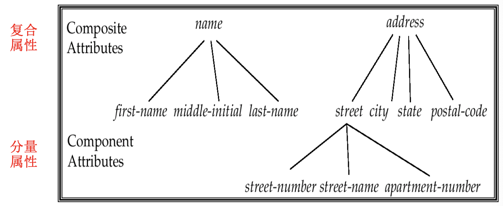</div>

---

## 5.2 Relationship Sets 

A ==relationship== is an association among several entities (是二个或多个不同类实体之间的关联). 

- A relationship set is a set of relationship of the same type. 
    - Example: `borrower(customer-name, loan-number)`
- 一个联系集包含多个同类联系 (或联系实例, relationship instance) 
- 一个联系集表示**二个或多个实体集之间的关联**
Formally, a *relationship set* is a mathematical relation among $n\geq 2$ entities, each taken from entity sets

$$
\{(e_1, e_2, \dots, e_n) | e_1 \in E_1, e_2 \in E_2, \dots, e_n \in E_n\}
$$

where $(e_1, e_2, \dots, e_n)$ is a relationship, $E_i$ is an entity set

!!! example "Relationship Set"

    <div style="text-align: center">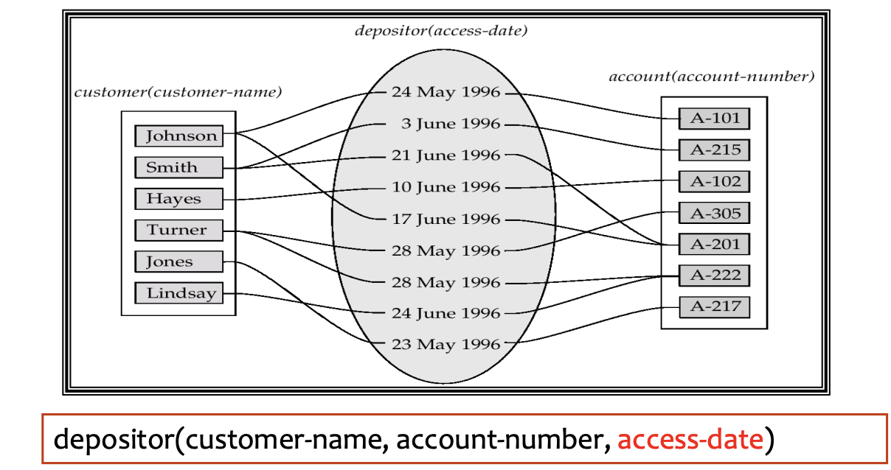</div>

    - An attribute can also be the <u>property of a relationship set</u>. 
    - For instance, the depositor relationship set between entity sets customer and account may have the attribute **access-date**.

### 5.2.1 Degree of a Relationship Set 

Refers to <u>the number of entity sets</u> that participate in a relationship set. 

- Relationship sets that <u>involve two entity sets</u> are *binary* (or degree two). 
- Relationship sets may involve **more than two** entity sets.  
- Relationships between more than two entity sets are **rare**. Most relationships are **binary**. (More on this later.)

### 5.2.2 Mapping Cardinalities

Express the **number** of entities to which another entity can be associated via a relationship set. (一个联系集中，一个实体可以与另一类实体相联系的实体数目。其中数目是指最多一个还是多个) 

- Most useful in <u>describing binary relationship sets</u>. 
- For a binary relationship set the mapping cardinality must be one of the following types: 
    - One to one $(1 : 1)$，如：就任总统（总统，国家） 
    - One to many $(1 : n)$，如：分班情况（班级，学生） 
    - Many to one $(n : 1)$，如：就医（病人，医生） 
    - Many to many $(n : m)$，如：选课（学生，课程）

---

## 5.3 Keys 

### 5.3.1 Keys for Entity Sets

- A **super key** of an entity set is a set of one or more attributes whose values <u>uniquely determine each entity</u>. 
- A **candidate key** of an entity set is a <u>minimal super key</u>. 
- Although several candidate keys may exist, one of the candidate keys is selected to be the **primary key**. 
- Example: customer(<u>cus-num</u>, cus-name, cus-street, cus-city) 
    - Candidate key: cus-num 
    - Super key: {cus-num}, {cus-num, cus-name}, {cus-num, …}

### 5.3.2 Keys for Relationship Sets

- **The combination of primary keys** of the participating entity sets forms <u>a super key of a relationship set</u> (参与一个联系集的各实体集的码的组合，构成该联系集的超码). 
- `(customer-id, loan-number)` is the **super key** of borrower 
    - `(sid, cid)` is the super key of enrolled 
    - Note: this means a pair of entity can have at most one relationship in a particular relationship set. 
- Must consider the mapping cardinality of the relationship set when deciding what are the **candidate keys** $(1:1, 1: n, m:n)$. 
    - 某些多对一的组合候选码只需要一个属性，有的需要两个组合在一起
- Need to consider <u>semantics(语意) of relationship set</u> in **selecting the primary key** in case of more than one candidate key
    - e.g. 作为码的属性不能为空，值不应常变.

---

## 5.4 E-R Diagram 

### 5.4.1 E-R Diagrams

<div style="text-align: center">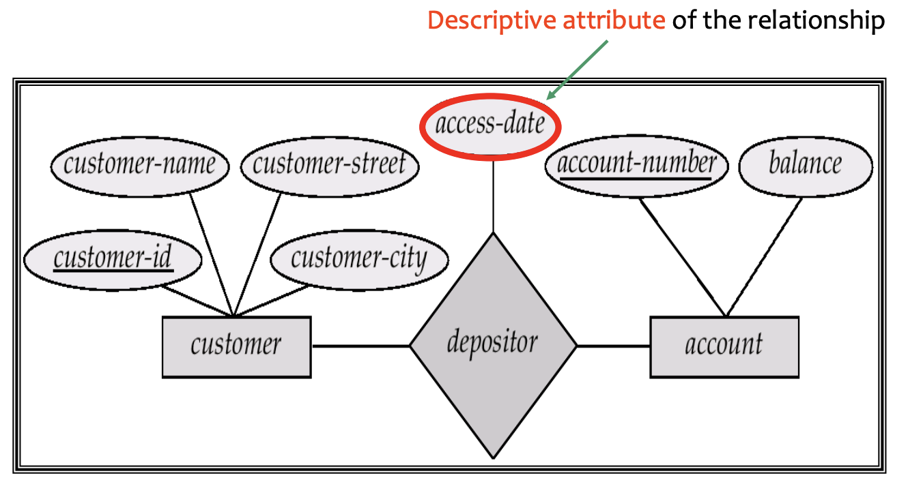</div>

- Rectangles represent entity sets. 
- Diamonds represent relationship sets. 
- Lines link attributes to entity sets and entity sets to relationship sets. 
- Ellipses represent attributes. 
    - **Double ellipses** represent <u>multivalued attributes</u>. 
    - **Dashed ellipses** denote <u>derived attributes</u>. 
- Underline indicates primary key attributes.

<div style="text-align: center">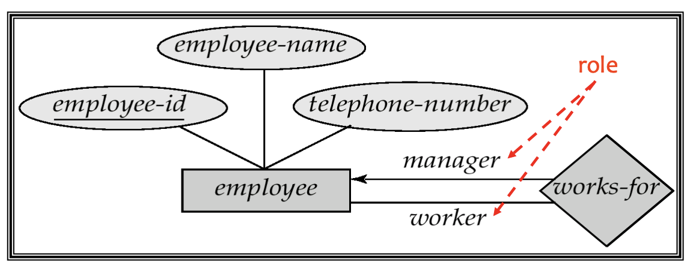</div>

- Entity sets of a relationship need not be distinct, e.g., **Recursive relationship set (自环联系集)**. 
- **Role**: the function that an entity plays in a relationship, e.g., the labels “manager” and “worker” are called roles; they specify how employee entities interact via the works-for relationship set. 
- Role labels are *optional*, and are used to clarify semantics of the relationship.

### 5.4.2 Express the Cardinality Constraints

- We express cardinality constraints by drawing either a **directed line** ($\rightarrow$), signifying “**one**”, or an **undirected line** ($—$), signifying “**many**”, between the relationship set and the entity set.

#### One-To-One Relationship 

<div style="text-align: center">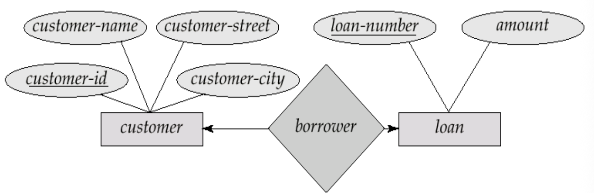</div>

- A *customer* is associated with **at most one loan** via the relationship *borrower*.
- A *loan* is associated with **at most one customer** via *borrower*.

#### One-To-Many Relationship 

<div style="text-align: center">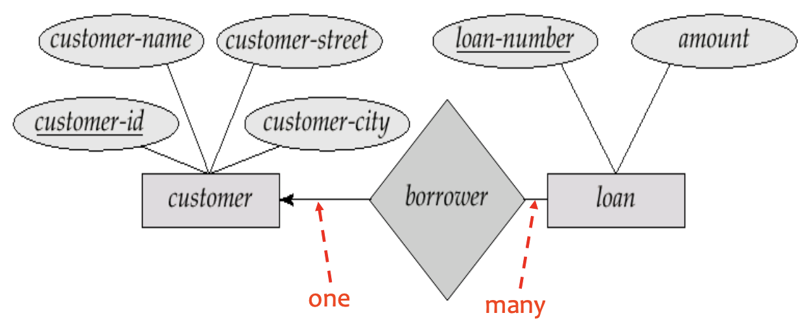</div>

- A loan is associated with at most one customer via borrower. 
- A customer is associated with several (including 0) loans via borrower.

#### Many-To-One Relationship 

<div style="text-align: center">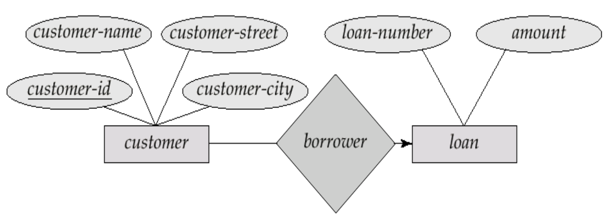</div>

- A loan is associated with several (including 0) customers via borrower. 
- A customer is associated with at most one loan via borrower.

#### Many-To-Many Relationship 

<div style="text-align: center">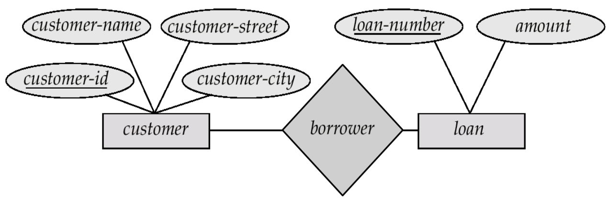</div>

- A customer is associated with several (possibly 0) loans via borrower. 
- A loan is associated with several (possibly 0) customers via borrower.

### 5.4.3 Participation of an Entity Set in a Relationship Set 

<div style="text-align: center">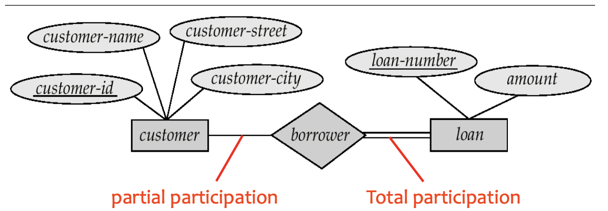</div>

- **Total participation (全参与) (indicated by double line)**: every entity in the entity set participates in <u>at least one</u> relationship in the relationship set. 
    - E.g., participation of loan in borrower is total. 
    - Every loan must have a customer associated to it via borrower. 
- **Partial participation (部分参与)**: some entities may not participate in any relationship in the relationship set. 
    - E.g., participation of customer in borrower is partial.

!!! tip "Alternative Notation for relationship Constraints"

    - Alternative notation for cardinality constraints and participation constraints.

    <div style="text-align: center">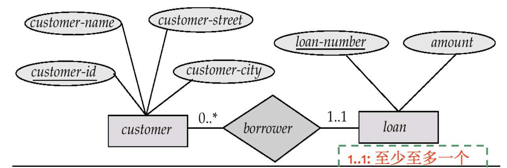</div>

### 5.4.4 Binary vs. Non-Binary Relationships

#### E-R Diagram with a Ternary Relationship

一个银行职员在多个支行兼职，并承担不同类型的工作。

 <div style="text-align: center">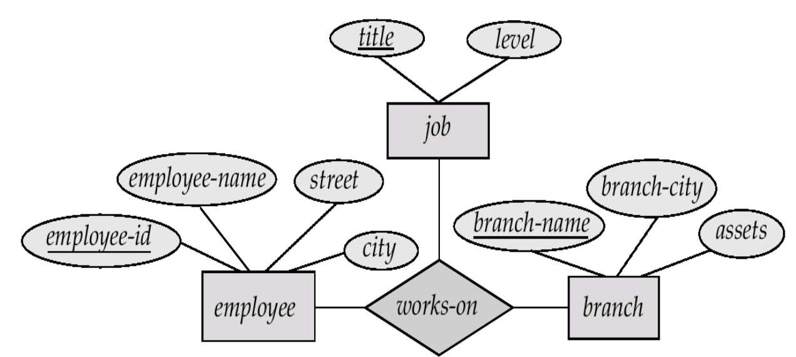</div>

- *Some* relationships that appear to be non-binary may be better represented using binary relationships. 
    - E.g., a ternary relationship parents, relating a child to his/her father and mother, is best replaced by two binary relationships, father and mother. 
      e.g., <font color="#ff0000">parents (he, she, child) => father (he, child), mother (she, child) </font>
    - Using two binary relationships allows partial information,
      e.g., only mother being know. 
    - But there are some relationships that are naturally non-binary, 
      e.g., <font color="#ff0000">works-on (employee, branch, job).</font>

#### Converting Non-Binary Relationships to Binary Form

- In general, any non-binary relationship can be represented using binary relationships by creating an <u>artificial entity set</u>. 
    - Replace non-binary relationship $R$ between entity sets $A$, $B$, and $C$ by an entity set $E$, and three new relationship sets. 
    - Create a special identifying attribute for $E$. 
    - Add any attributes of $R$ to $E$. 
    - For each relationship $(a_i , b_i , c_i )$ in $R$, create $R_A, R_B, R_C$.

 <div style="text-align: center">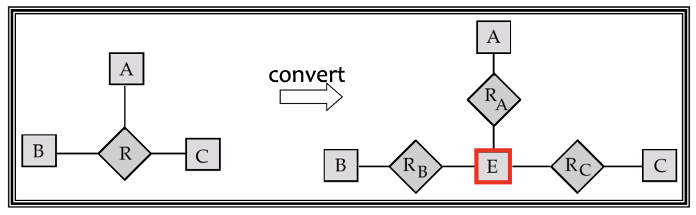</div>

  <div style="text-align: center">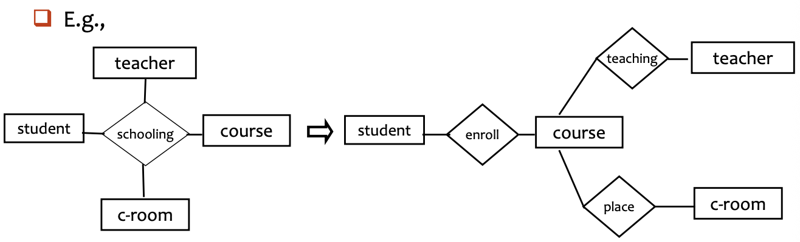</div>

---

## 5.5 Weak Entity Sets 

An entity set that does not have a primary key is referred to as a ==weak entity set.== 

- E.g., 还贷登记表 `payment (pay-num, pay-date, pay-amount)`. 
- 假设为了清楚起见，pay-num 按对应的每项贷款分别编号 (都从 $1, 2, 3,\dots$ 开始), 这样，pay-num 就不是码，并且该实体集没有码。故 payment 是弱实体集。 
- pay-num is ==discriminator or partial key (分辨符或部分码)==. 

<div style="text-align: center">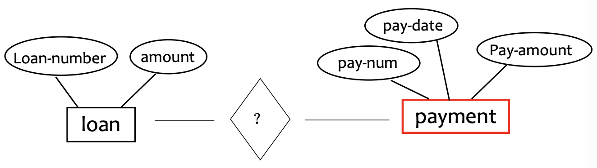</div>

- The existence of a weak entity set **depends on** the existence of <u>a identifying entity set or owner entity set (标识实体集或属主实体集)</u>. 
    - E.g., `loan (loan-num, amount)` is an identifying entity set. 
    - It must relate to the identifying entity set via a *total*, *one-to-many* relationship set from the identifying to the weak entity set. 
- The related relationship is called **identifying relationship (标识性联系)**  
    - E.g., loan-payment

!!! example

    <div style="text-align: center">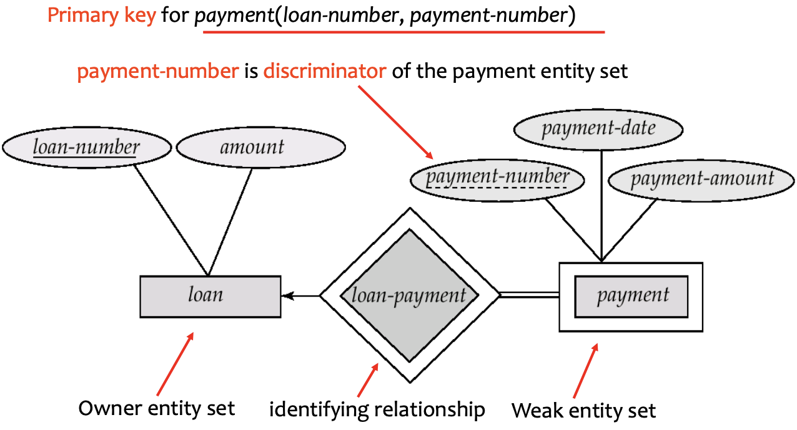</div>

    - The **discriminator or partial key (分辨符或部分码)** of a weak entity set is <u>the set of attributes</u> that distinguishes among all those entities in a weak entity set that depend on one particular strong entity (e.g., payment-number). 
    - The **primary key of a weak entity set** is formed by <u>the primary key of the strong entity set</u> on which the weak entity set is existence dependent, plus <u>the weak entity set’s discriminator</u>.

!!! note

    在进行概念设计（画E-R图）时，要保持模型的纯粹性。**弱实体集就应该保持“弱”的状态**，不要把强实体的主码塞给它，而是让它们纯粹依靠“标识性联系”来绑定。这样既表达了依赖关系，又避免了模型上的语义重复

    - Note: the primary key of the strong entity set is <u>not explicitly stored with the weak entity set</u>, since it is implicit in the identifying relationship. 
    - If loan-number were explicitly stored, payment could be made a strong entity, but then the relationship between payment and loan would be duplicated by an implicit relationship defined by the attribute loannumber common to payment and loan.

---

## 5.6 Extended E-R Features 

??? abstract "Summary of Symbols Used in E-R Notation"

    <div style="text-align: center">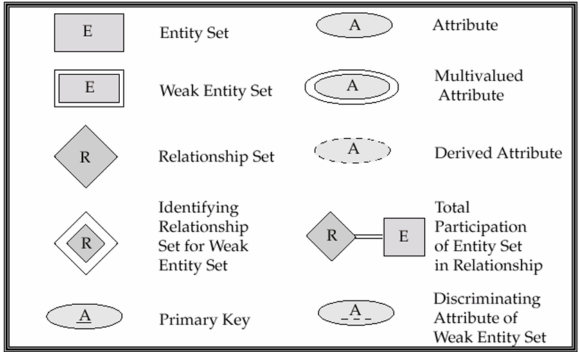</div>

    <div style="text-align: center">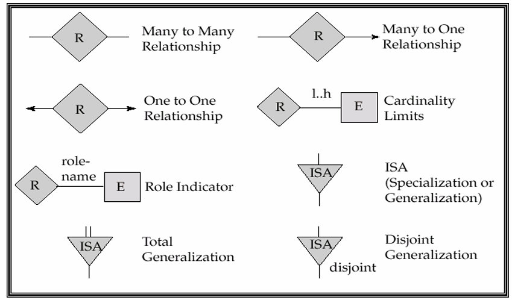</div>

    <div style="text-align: center">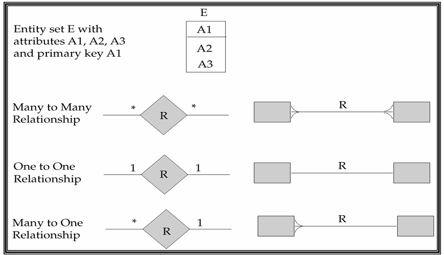</div>

### 5.6.1 Stratum of the entity set

- **Specialization** (特殊化、具体化) 
    - <u>Top-down design process</u>; 在一个已有的高层实体集中，划分出具有显著区别的**子分组（subgroup，即低层实体集）**。这些低层实体集拥有自己专属的属性，或者参与某些高层实体集并不适用的特定联系
    - ==Attribute inheritance== – 低层实体集会自动继承与之相连的高层实体集的所有属性，以及高层实体集所参与的所有联系

<div style="text-align: center">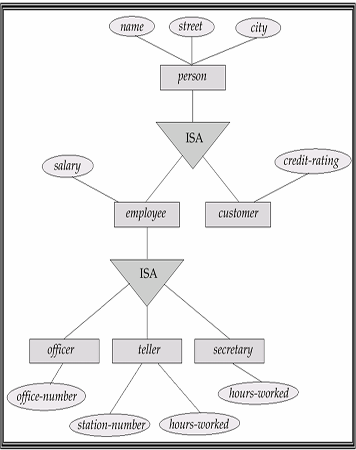</div>

- **Generalization** (泛化、普遍化) 
    - A <u>bottom-up design process</u> – 当设计者发现多个现存的实体集共享许多相同的特征（属性）时，可以将它们的共性提取出来，合并成一个更高层次的实体集
    - Specialization and generalization are simple inversions of each other; they are represented in an E-R diagram *in the same way*. 
    - The terms specialization and generalization are used interchangeably.

### 5.6.2 Design Constraints

- **成员资格约束(Constraint on membership)**：决定一个实体如何被划入某个特定的低层实体集（子分组）中
    - **Condition-defined**：取决于是否满足某个特定的客观条件
        - E.g., (1) All customers over 65 years are members of senior-citizen entity set; senior-citizen ISA  person; (2) account to saving account or saving accounts.  
    - **User-defined**：用户在业务层面人为指定
        - e.g., employee to teams  
- **重叠性约束(Constraint on overlapping)**：决定在同一个泛化/特殊化结构中，一个高层实体是否可以同时属于多个低层实体集
    - **Disjoint (不相交)**  
        - An entity can belong to only one lower-level entity set.  
        - Noted in E-R diagram by writing disjoint next to the ISA triangle.  
    - **Overlapping (可重叠)**  
        - An entity can belong to **more than one** lower-level entity set.  
        - E.g.,  

<div style="text-align: center">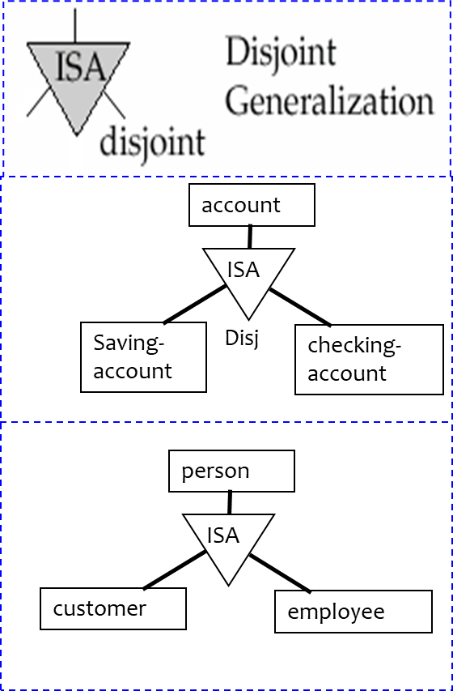</div>

- **完全性约束(Completeness constraint)**：明确了高层实体集中的每一个实体，是否必须从属于下方的某个子类
    - **Total**：高层实体集中的每一个实体，都必须属于**至少一个**低层实体集
    - **Partial**：高层实体集中的实体，**不一定**要属于任何低层实体集。这意味着系统允许存在只属于父类、但不具备任何子类独有特征的实体。

<div style="text-align: center">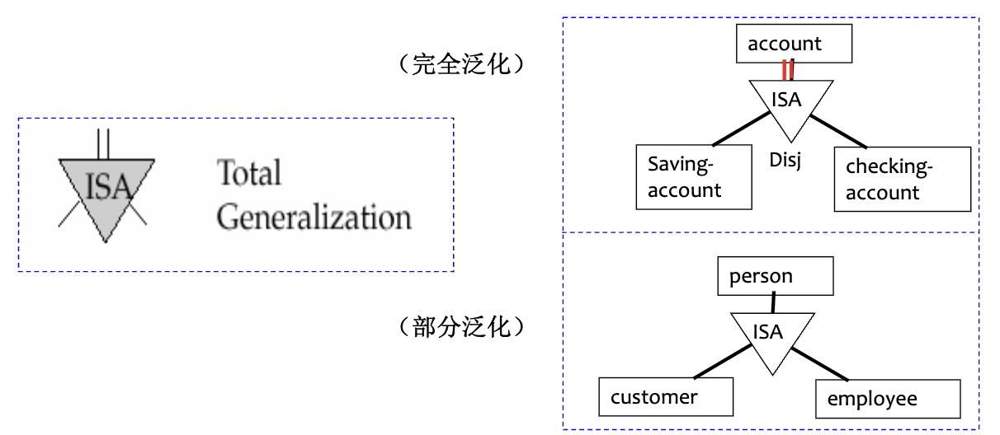</div>

### 5.6.3 Aggregation

<div style="text-align: center">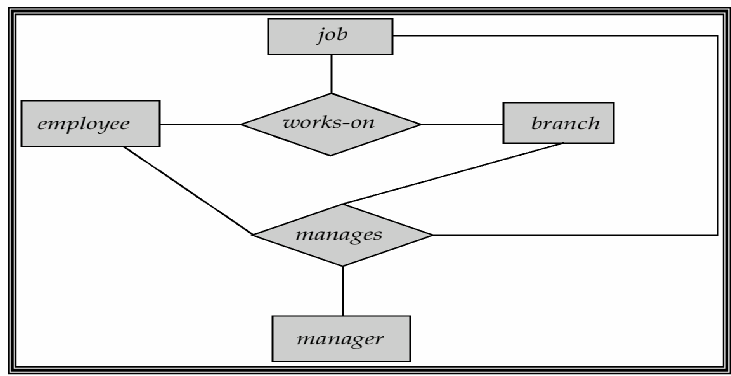</div>

- Relationship sets *works-on* and *manages* represent **overlapping information**. 
    - Every manages relationship corresponds to a works-on relationship. 
    - However, some works-on relationships may not correspond to any manages relationships. 
        - So we can’t discard the works-on relationship. 
- Eliminate this redundancy via **aggregation**. 
    - Treat relationship as <u>an abstract entity</u>. 
    - Allows **relationships** between **relationships**. 
    - Abstraction of relationship into new entity. 
- Without introducing redundancy, the following diagram represents: 
    - An employee works on a particular job at a particular branch. 
    - An employee, branch, job combination may have an associated manager.

<div style="text-align: center">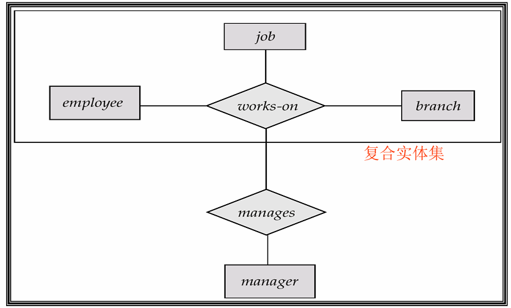</div>

---

## 5.7 Design of an E-R Database Schema 

<div style="text-align: center">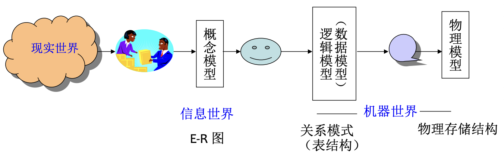</div>

**Requirment analysis** 

- What data, applications, and operations needed. 

**Conceptual database design**

- A high-level description of data, constraints using *E-R model* or a similar high level data model. 

**Logical database design** 

- Convert the conceptual design into DB schema --- *tables*
- Schema refinement: *Normalization of relations* --- Check relational schema for redundancies and related anomalies. 

**Physical database design** 

- Indexing, clustering and database tuning.

### E-R Design Decisions 

**(1) Use an attribute or entity set to represent an object?** 

- E.g.1: employee (emp-id, emp-name, …, <font color="#ff0000">phone</font>) 
    - 优点：简单
    - 缺点：多个电话怎么处理？电话的其他属性？ 
- E.g.2: employee (emp-id, emp-name, …); 
       phone (phone-num, location, type, color); 
       emp-phone (emp-id, phone-num) 
    - 若一个对象只对其名字及单值感兴趣，则可作为属性，如性别；若一个对象除名字外，本身还有其他属性需描述，则该对象应定义为实体集。如电话, 部门
    - 一个对象不能同时作为实体和属性
    - 一个**实体集**不能与另一实体集的**属性**相关联，只能实体与实体相联系

**(2) Use it as an entity set or a relationship set?** 

- E.g., enrolled, borrower, depositor 
- **Relationship set** --- to describe an <u>action</u> that occurs between entities (二个对象之间发生的动作 --- 用“relationship set”表示). 
- The mapping cardinality will effect the matter. 
  Considering the branch, loan, customer, …

**(3) Use it as an attribute of an entity or a relationship?**

- e.g., student (sid, name, sex, age, …, supervisor-id, supervisor-name, supervisor position, …, class, monitor) 
- 要从对象的语义独立性和减少数据冗余方面考虑 

```sql
student(sid, name, sex, age, ...); 
supervisor (sup-id, name, position, ...); 
class (classno, specialty, monitor, stu-num); 
stu-class (sid, classno); 
stu-sup (sid, sup-id, from, to);
```

(4) The use of a ternary or n-ary relationship versus a pair of binary relationships. 
\*(5) The use of a strong or weak entity set. 
\*(6) The use of specialization/generalization – contributes to modularity in the design (有助于模块化). 
\*(7) The use of aggregation – can group a part of E-R diagram into a single entity set, and treat it as a single unit without concern for the details of its internal structure.

---

## 5.8 Reduction of an E-R Schema to Table

- Converting an E-R diagram to a table format is the basis for deriving a relational database design from an E-R diagram. 
- **A database** which conforms to an E-R diagram can be represented by **a collection of tables**
- For each **entity set** and **relationship set**, there is **a unique table** which is assigned the name of the corresponding entity set or relationship set.

### 5.8.1 Representing Entity Sets as Tables

**强实体集 (Strong Entity Sets) 的转换**：A strong entity set => a table with the same attributes.

- <u>Composite attributes</u> are flattened out by creating a **separate attribute** for **each** component attribute.
- A <u>multivalued attribute</u> $M$ of an entity $E$ is represented by **a separate table** $EM$

**弱实体集 (Weak Entity Sets) 的转换**：A weak entity set becomes a table that includes a column for the <u>primary key of the identifying strong entity set</u>.

<div style="text-align: center">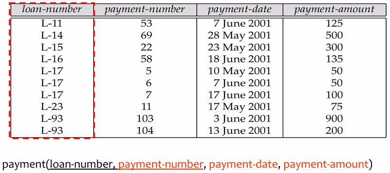</div>

**联系集 (Relationship Sets) 的转换**：A relationship set is represented as a table with columns for the primary keys of the two participating entity sets, (which are foreign keys here) and any descriptive attributes of the relationship set itself.

- Many-to-Many：生成的表的主码是参与联系的**所有实体集主码的组合**。
  例如 `borrower(customer-id, loan-number)`。
- Many-to-One / One-to-Many：生成的表的主码是**位于“多”（Many）那一端实体集的主码**
- One-to-One：参与联系的任何一端实体的主码都可以作为该表的候选码

### 5.8.2 Redundancy of Tables

1. **Many-to-one and one-to-many relationship sets** that are *total* on the many-side can be represented by <u>adding an extra attribute</u> to the “*many*” side, containing the primary key of the *one* side（对 $1: n$ 联系，可将“联系”所对应的表，合并到对应“多”端实体的表中）

<div style="text-align: center">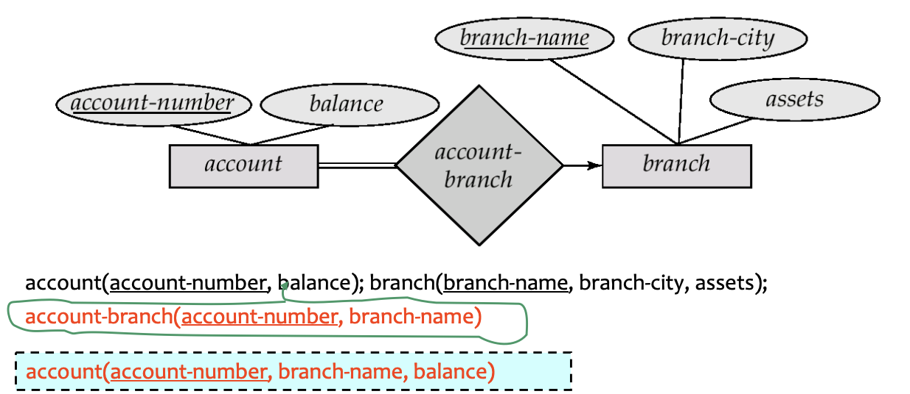</div>

2. If participation is **partial** on the many side, replacing a table by an extra attribute in the relation corresponding to the “many” side could result in *null values*. 
    - E.g., cust-banker(customer-id, employee-id, type); 但有的 customer 没有 banker, 则合并之后得：Customer(customer-id, cust-name, cust-street, cust-city, banker-id, type)，导致 Customer 中有些元组的 banker-id、 type 为 null)。
3. For **one-to-one relationship sets**, *either side* can be chosen to act as the “*many*” side 
    - That is, extra attribute can be added to either of the tables corresponding to the two entity sets.
4. The table corresponding to a relationship set linking a weak entity set to its identifying strong entity set is **redundant** (联系弱实体集及其标识性实体集的联系集对应的表是冗余的，即对应 *identifying relationship* 的表是多余的。). 
    - E.g., The payment table already contains the information that would appear in the loan-payment table (i.e., the columns loan-number and payment-number).

<div style="text-align: center">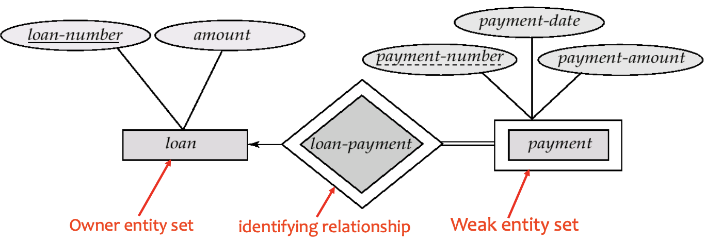</div>

### 5.8.3 Representing Specialization as Tables

<div style="text-align: center">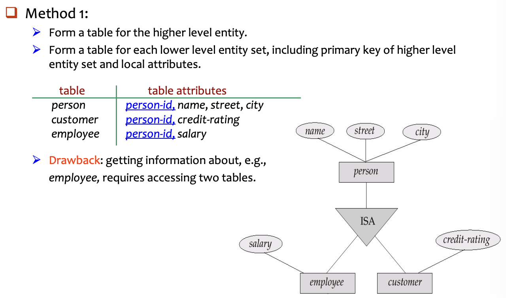</div>

<div style="text-align: center">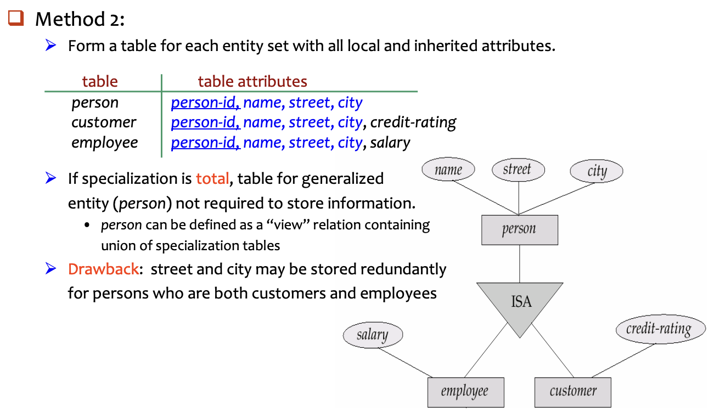</div>
