# Relational Database Design

## 6.1 First Normal Form

- Domain is **atomic** if its elements are considered to be *indivisible units*.
    - Atomicity is actually a property of how the elements of the domain are used.
- A relational schema $R$ is in ==first normal form (1NF)== if the domains of **all attributes** of $R$ are <u>atomic</u>. 
- For the relational database, it’s required that **all relations are in 1NF**.

**如何处理非原子性的值？How to deal with non-atomic values**

1. **Composite attributes**
    - 使用多个属性（use a number of attributes）
2. **Multi-value attributes**
    - 使用多个字段(Use multi fields)
      person(pname, ..., phon1, phon2, phon3, ...)
    - 使用独立的表(Use a separate table)
      phone(pname, phone)
    - 使用单个字段(Use a single field)
      person(pname, ..., phones, ...)

**Drawbacks of non-atomic strategy**

- Complicate storage
    - 数据库还要设计复杂的解析逻辑来识别分隔符，这增加了底层的复杂性
- Encourage redundant storage of data
    - 如果使用“多字段”方法，为了容纳可能的最大值，必须预留很多列，导致大量空位浪费；或者为了省事，在不同行里重复存储相同的一组数据。
- Complicated to query
    - 在非原子表里，必须使用模糊查询（Like）或者复杂的字符串解析函数，效率极低且容易出错。

---

## 6.2 Pitfalls in Relational Database Design

Relational database design requires that we find **a "good" collection of relation schemas**. 

- A bad design may lead to: <font color="#ff0000">Redundant storage, insert / delete / update anomalies</font> 
  --- inability to represent certain information.
Note: **There are two design methods**: 
1. Top-down 
2. Bottom-up: Universal relation (泛关系) -> decomposition -> good database

!!! example "Deficiencies for the Lending Relation"

    <div style="text-align: center">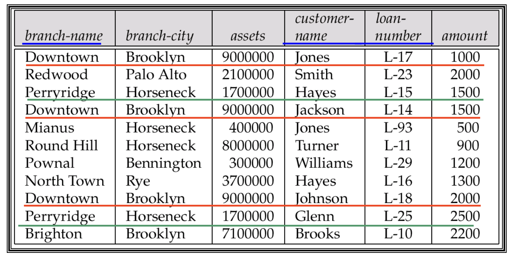</div>

    - **Redundancy**: 
        - 每当一个支行发放一笔新的贷款，这个支行的名字（branch-name）、所在城市（branch-city）和资产（assets）信息就会被重复记录一次
        - **wastes space**, may result in inconsistency. 
    - **Updating anomaly**: 
      Complicates updating, introducing possibility of inconsistency,e.g., modify assets value, many tuples need be changed. 
    - **Insert / delete anomalies**. (if have a key: (branch-name, customer-name, loan-number)) 
        - Or use **Null values**: (If have no key) 
            - To store information about a branch if no loans exist, can use null values, but they are difficult to handle

### Decomposition

Main refinement technique: ==decomposition==
**1. 属性覆盖（Attribute Preservation）**

- All attributes of an original schema ($R$) must appear in the decomposition ($R_1, R_2$), i.e., $R = R_1 \cup R_2$ 

**2. 无损连接分解（Lossless-Join Decomposition）**

- <font color="#ff0000">Lossless-join decomposition (无损连接分解)</font>, i.e., for all possible relations $r$ on schema $R$, 

$$
r = \Pi_{R_1} (r) \bowtie \Pi_{R_2}(r)
$$

!!! note "Goal: Devise a Theory for the Following"

    - Decide whether a particular relation R is in “<font color="#ff0000">good</font>” form. --- No redundant
    - In the case that a relation $R$ is not in “good” form, decompose it into a set of relations ${R_1, R_2, \dots, R_n}$ such that 
        - Each relation is in **good** form. 
        - The decomposition is a **lossless-join decomposition**.
    - Our theory is based on: 
        - Functional dependencies (函数依赖) 
        - Multivalued dependencies (多值依赖) 

---

## 6.3 Functional Dependencies

### 6.3.1 Definition

Let $R$ be a relation schema, $\alpha$ and $\beta$ be attributes, i.e., $\alpha \subseteq R$ and $\beta \subseteq R$ 

- The ==functional dependency== $\alpha \rightarrow \beta$ holds on $R$ if and only if for any legal relations $r(R)$, whenever any two tuples $t_1$ and $t_2$ of $r$ agree on the attributes $\alpha$, they also agree on the attributes $\beta$, i.e.,

$$
t_1[\alpha]=t_2[\alpha] \Rightarrow t_1[\beta]=t_2[\beta]
$$

- $\beta$ is **functionally dependent** on $\alpha$, $\alpha$ **functionally determines** $\beta$.

==Functional dependency 函数依赖==

- a kind of **integrity constraints**, which express the relationship of values on specific attributes, can be used to <u>judge schema normalization（判断范式）</u> and to <u>suggest refinements（指导分解）</u>.

### 6.3.2 Functional dependency & Key

A functional dependency is a **generalization** of the notion of a key. 

- $K$ is a superkey for the relation schema $R$ if and only if $K \rightarrow R$. 
- $K$ is a candidate key for $R$ if and only if 
    - $K \rightarrow R$, and 
    - No $\alpha \subset K, \alpha \rightarrow K$ (不存在 $K$ 的真子集 $\alpha$，使之满足 $\alpha \rightarrow R$) 
- Functional dependencies allow us to express constraints that <u>cannot be expressed using keys</u>.

> **键**是"确定整行"的最强约束，**函数依赖**则能描述任意属性间的确定关系——后者是前者的一般化，也是后续判断范式的推理基础。

### 6.3.3 The Use of Functional Dependencies

1. **检验关系的合法性**
    - If a relation instance $r$ is **legal** under a set $F$ of functional dependencies, we say that $r$ **satisfies** $F$.
2. **定义模式的约束**
    - We say that $F$ holds on relation schema $R$ ($F$ 在 $R$ 上成立) if all legal relations $r$ on $R$ satisfy the set of functional dependencies $F$.
    - Note: 容易判别一个 $r$ 是否满足给定的 $F$; 不易判别 $F$ 是否在 $R$ 上成立。不能仅由某个 $r$ 推断出 $F$。 $R$ 上的函数依赖 $F$, 通常由定义 $R$ 的**语义决定**

### 6.3.4 Trivial and Non-Trivial Dependency

A functional dependency is ==trivial (平凡的)== if it is satisfied by all relations 

- E.g., $A \rightarrow A, AB \rightarrow A$ 
- (customer-name, loan-number) $\rightarrow$ customer-name 
- customer-name $\rightarrow$ customer-name 
In general, $\alpha \rightarrow \beta$ is *trivial* if $\beta \subseteq \alpha$, otherwise, is *non-trivial*, i.e., 
- Trivial: $\alpha \rightarrow \beta$, if $\beta \subseteq \alpha$ (平凡的函数依赖) 
- Non-trivial: $\alpha \rightarrow \beta$, if $\beta \nsubseteq \alpha$ (非平凡的函数依赖) 

### 6.3.5 Closure of a Set of Functional Dependencies

!!! info "Definition"

    - The set of all functional dependencies logically implied by $F$ is the closure of $F$, denoted by $F^+$ (函数依赖集 $F$ 的闭包)
    - E.g., $F=\{A\rightarrow B, B \rightarrow C\}$, $F^+=\{A\rightarrow B,B\rightarrow C, A \rightarrow C, A \rightarrow A, AB \rightarrow A, AB \rightarrow B, AC \rightarrow C, A \rightarrow BC, \dots\}$

#### Armstrong’s Axioms

**Armstrong’s Axioms** provide inference rules to find $F^+$ :

- If $\beta \subseteq \alpha$, then $\alpha \rightarrow \beta$ (reflexivity, **自反律**) --- trivial 
-  If $\alpha \rightarrow \beta$, then $\gamma \alpha \rightarrow \gamma \beta$, $\gamma \alpha \rightarrow \beta$ (augmentation, **增补律**) 
-  If $\alpha \rightarrow \beta$, and $\beta \rightarrow \gamma$, then $\alpha \rightarrow \gamma$ (transitivity, **传递律**) 
We can further simplify manual computation of $F^+$ by using the following additional rules :
- If $\alpha \rightarrow \beta$ and $\alpha \rightarrow \gamma$ holds, then $\alpha \rightarrow \beta\gamma$ holds (union, **合并律**)
- If $\alpha \rightarrow \beta\gamma$ holds, then $\alpha \rightarrow \beta$ and $\alpha \rightarrow \gamma$ holds (decomposition, **分解律**)
- If $\alpha \rightarrow \beta$ and $\gamma\beta \rightarrow \delta$ holds, then $\alpha\gamma \rightarrow \delta$ holds (pseudotransitivity, **伪传递律**)
These rules are :
- Sound (保真的, generate only functional dependencies that actually hold). 
- Complete (完备的, generate all functional dependencies that hold).

!!! info "Procedure for Computing $F^+$"

    ```text
    开始
     ↓
    F+ = F（先放入原始依赖）
     ↓
    ┌─→ 对 F+ 中每个 f，用自反律 + 增广律推导 → 新依赖加入 F+
    │   ↓
    │  对 F+ 中每对 (f1, f2)，若能用传递律合并 → 新依赖加入 F+
    │   ↓
    │  F+ 还在变化吗？
    │   ├── 是 → 回到开头继续循环
    │   └── 否 → 结束，输出 F+
    └────────────────┘
    ```

    - The maximum number of possible Functional Dependencies (FDs) is $2^n \times 2^n$, for $n$ attributes. 
    - FD 的数量是有限的，因此上述的循环最终一定能停止。

#### Closure of Attribute Sets

!!! info "Definition"

    - Given a set of attributes $\alpha$, the closure of $\alpha$ under $F$, denoted by $\alpha^+$, is <u>the set of attributes</u> that are functionally determined by $\alpha$ under $F$ 
    - 在 $F$ 下由 $\alpha$ 所直接和间接函数决定的属性的集合称为 $\alpha^+$

- **The use of attribute set closure**:
    - To test $\alpha \rightarrow \beta$ is in $F^+ \Leftrightarrow \beta \subseteq \alpha^+$ 
    - To test $\alpha$ is a superkey: $\alpha \rightarrow R$ is in $F^+ \Leftrightarrow R \subseteq \alpha^+$

!!! question "How to get $a^+$"

    - Algorithm for computing $\alpha^+$, the closure of $\alpha$ under $F$

    ```
    result := a;
    while (changes to result) do
        for each β → γ in F do
            begin
                if β ⊆ result then result := result ∪ γ
            end;
    a⁺ := result
    ```

     Example

      <div style="text-align: center">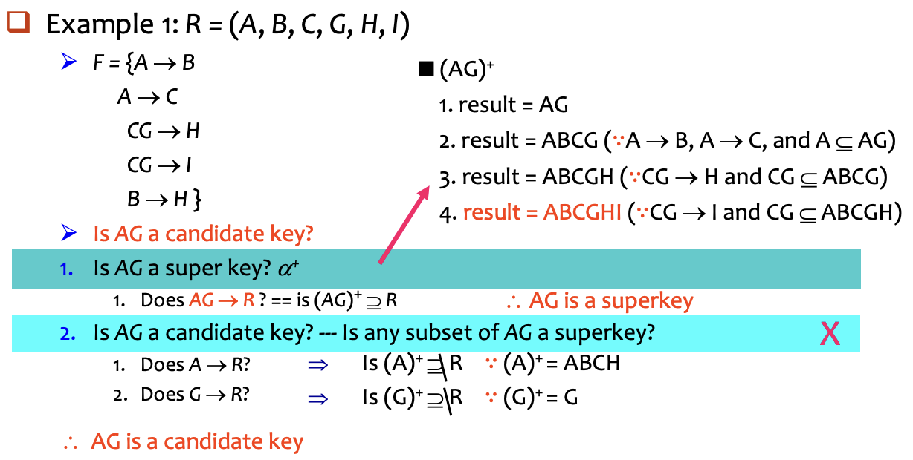</div>

There are 3 kind uses of the attribute set closure algorithm:

- **Testing for a superkey** ($\alpha \rightarrow R$?)
    - To test if $\alpha$ is a superkey, we compute $\alpha^+$ and then check if $\alpha^+$ contains all attributes of $R$, i.e., check if $R \subseteq \alpha^+$
- **Testing functional dependencies** ($\alpha \rightarrow \beta$?)
    - To check if a functional dependency $\alpha \rightarrow \beta$ holds (or, in other words, is in $F^+$), only check if $\beta \subseteq \alpha^+$.
    - It's a simple and cheap test, and very useful.
- **Computing the closure of F** ($F^+$ = ?)
    - For each $\gamma \subseteq R$, we find the closure $\gamma^+$, and for each $S \subseteq \gamma^+$, we output a functional dependency $\gamma \rightarrow S$, and all $\gamma \rightarrow S$ form $F^+$.

### 6.3.6 Canonical Cover

- DBMS 必须时刻检查数据更新是否违反了函数依赖 $F$（FD）
    - If the $F$ is too big, the check is costly. Thus, we need **simplify** the set of FDs.
- Intuitively, a ==canonical cover正则覆盖== of $F$, denoted by $F_c$, is a "minimal" set of FDs equivalent to $F$.
    - Having **no redundant FDs** and **no redundant parts of FDs**
      i.e., no functional dependency in $F_c$ contains an <u>extraneous attribute</u>.
    - Each left side is unique.
    - E.g., $\alpha_1 \rightarrow \beta_1$, $\alpha_1 \rightarrow \beta_2$, $\Rightarrow \alpha_1 \rightarrow \beta_1\beta_2$

**How to get $F_c$ $\Rightarrow$ delete extraneous attributes (多余属性)**
There are 3 cases for the extraneous attributes:

1. 整个依赖是多余的（Redundant Dependencies）

$$
F = \{A \rightarrow C, A \rightarrow B, B \rightarrow C\}\Rightarrow F_c = \{A \rightarrow B, B \rightarrow C\}
$$

2. 左边的属性是多余的（Extraneous Attributes on Left Side）

$$
\begin{align}
F &= \{A \rightarrow  B, B \rightarrow  C, AC \rightarrow  D\} \text{ can be inferred to } \\
& \Rightarrow \{A \rightarrow  B, B \rightarrow  C, AC \rightarrow  D, A \rightarrow  D\}, \Rightarrow  \{A \rightarrow  B, B \rightarrow  C, A \rightarrow  D\}
\end{align}
$$

    ∴ $F$ is simplified to $F' = \{A \rightarrow  B, B \rightarrow  C, A \rightarrow  D\}$, i.e., Attribute $C$ is extraneous (多余的）

3. 右边的属性是多余的（Extraneous Attributes on Right Side） 

$$
\begin{align}
F &= \{A \rightarrow  B, B \rightarrow  C, A \rightarrow  CD\} \text{ can be inferred to } \\
& \Rightarrow \{A \rightarrow  B, B \rightarrow  C, A \rightarrow  C, A \rightarrow  D\}, \\
&\text{but }A \rightarrow C \text{ is implied by }A \rightarrow  B, B \rightarrow  C
\end{align}
$$

    ∴ $F$ is simplified to: $F' = {A \rightarrow B, B \rightarrow C, A \rightarrow D}$, (即 $F'$ 蕴涵 $F$), i.e., Attribute $C$ is extraneous.

### 6.3.7 Extraneous Attributes

如果一个函数依赖中的某个属性被移除后，整个函数依赖集所表达的约束信息没有发生改变，那么这个属性就是“**多余的**”。

!!! info "Consider the functional dependency $\alpha \rightarrow \beta$ in $F$."

    - Attribute $A$ is extraneous in $\alpha$, if $A \in \alpha$ and $F$ logically implies $F' = (F - \{\alpha \rightarrow \beta\}) \cup \{(\alpha - A) \rightarrow \beta\}$.
        - E.g., $\alpha = \{A\alpha'\}$, $\{A\alpha'\} \rightarrow \beta$. 若 $F$ 蕴涵 $\alpha' \rightarrow \beta$, 则 $\{A\alpha'\} \rightarrow \beta$ 多余, 即 $A$ 多余.
        - Example: Given $F = \{A \rightarrow C, AB \rightarrow C\}$
          Because $F = \{A \rightarrow C, AB \rightarrow C\}$ logically implies $A \rightarrow C$, 
          $\therefore$ $B$ is extraneous in $AB \rightarrow C$, $F' = \{A \rightarrow C, A \rightarrow C\} = \{A \rightarrow C\}$
    - Attribute $A$ is extraneous in $\beta$, if $A \in \beta$ and the set of functional dependencies $F' = (F - \{\alpha \rightarrow \beta\}) \cup \{\alpha \rightarrow (\beta - A)\}$ logically implies $F$.
        - E.g., $\beta = A\beta'$, $\alpha \rightarrow \{A\beta'\}$, 有 $\{\alpha \rightarrow A, \alpha \rightarrow \beta'\}$. 若 $F'$ 蕴涵 $\alpha \rightarrow A$, 则 $\alpha \rightarrow A$ 多余, (即可用 $F'$ 代替 $F$).
        - Example: Given $F = \{A \rightarrow C, AB \rightarrow CD\}$
          Since $AB \rightarrow CD \Rightarrow \{AB \rightarrow C, AB \rightarrow D\}$, and $AB \rightarrow C$ can be inferred from $F' = \{A \rightarrow C, AB \rightarrow D\}$, 
          $\therefore$ $C$ is extraneous in $AB \rightarrow CD$

消去现有函数依赖 $\alpha \rightarrow \beta$ 中的 extraneous 属性，有 2 种情况：
(1) **Extraneous 属性在左边**

- To test if attribute $A \in \alpha$ is extraneous in $\alpha$:
    - Compute $(\alpha - A)^+$ using the dependencies in $F$
    - Check that $(\alpha - A)^+$ contains $\beta$; if it does, $A$ is extraneous.
(2) **Extraneous 属性在右边**
- To test if attribute $A \in \beta$ is extraneous in $\beta$:
    - Compute $\alpha^+$ using only the dependencies in $F'$
      $F' = (F - \{\alpha \rightarrow \beta\}) \cup \{\alpha \rightarrow (\beta - A)\}$
    - Check that $\alpha^+$ contains $A$; if it does, $A$ is extraneous.

!!! example

    ```text
    repeat 
    	Use the union rule to replace any dependencies in F 
    	        like a1 -> b1 and a1 -> b2 with a1 -> b1 b2 
    	Find a functional dependency a -> b 
    			with an extraneous attribute either in a or in b 
    	If an extraneous attribute is found, delete it from a -> b 
    until F does not change
    ```

    <div style="text-align: center">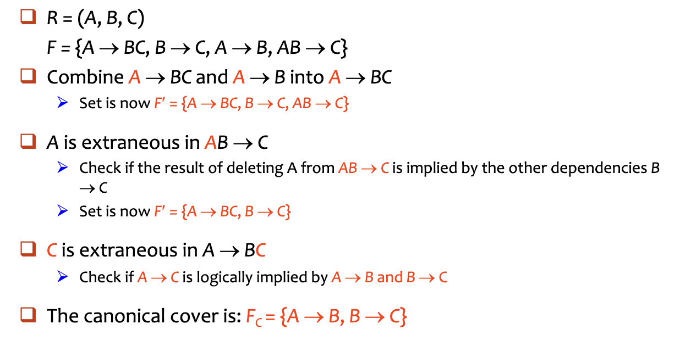</div>

---

## 6.4 Decomposition

!!! abstract "Goals of Normalization"

    - Judge whether a particular relation $R$ is in a "good" form 
      --- no redundant, no insert/delete/update anomalies. 
    - In the case that a relation $R$ is not in a “good” form, decompose it into a set of relations $\{R_1, R_2, \dots, R_n \}$ such that: 
        - The decomposition is a lossless-join decomposition (无损连接分解). 
        - The decomposition is dependency preservation (依赖保持). 
        - Each relation $R_i$ is in a good form --- BCNF or 3 NF.

**Desirable properties of decomposition**

- <u>All attributes</u> of an original schema must appear in the decomposition : $R=R_1 \cup R_2$
- ==Lossless-join decomposition==. 
  For all possible relations $r$ on schema $R$ 
    - $r = \Pi_{R_1}(r) \bowtie \Pi_{R_2}(r)$ 
    - A decomposition of $R$ into $R_1$ and $R_2$ is lossless-join if and only if <u>at least one of the following dependencies</u> are held in $F^+$ : 

$$
\{R_1 \cap R_2\} \rightarrow R_1 ,\{R_1 \cap R_2\} \rightarrow R_2
$$

    - 无损连接分解的条件：分解后的二个子模式的共同属性必须是 $R_1$ 或 $R_2$ 的码（适用于一分为二的分解）
- ==Dependency preservation（依赖保持）==
    - 在分解后的子关系（sub-relations $R_i$​）中，能够高效地检查更新操作，确保不违反任何函数依赖（FD），而**不需要**执行 Join 操作来重组整个关系
    - Restriction of $F$ to $R_i$ is: $F_i \subseteq F^+$, $F_i$ includes only attributes of $R_i$
    - $(F_1 \cup F_2 \cup \ldots \cup F_n)^+ = F^+$, where $F_i$ be the set of dependencies in $F^+$ that include only attributes in $R_i$.
- ==No redundancy==: 
  The relations $R_i$ preferably should be in either **Boyce-Codd Normal Form** or **Third Normal Form**, i.e., **BCNF** or **3 NF**.

**Testing for Dependency Preservation**：

<div style="text-align: center">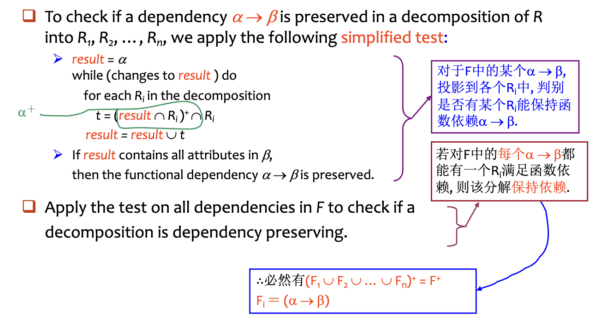</div>

---

## 6.5 Boyce-Codd Normal Form

**Definition**: A relation schema $R$ is in BCNF, with respect to a set $F$ of functional dependencies, if for <u>all functional dependencies</u> in $F^+$ of the form $\alpha \rightarrow \beta$, where $\alpha \subseteq R$ and $\beta \subseteq R$, at least one of the following holds:

1. $\alpha \rightarrow \beta$  is trivial ($\beta \subseteq \alpha$)
2. $\alpha$ is a superkey for $R$ （它意味着表中的任何非平凡依赖，都**必须是从“键”出发的**）

!!! example

    $R = (A, B, C) \quad F = {A \rightarrow B ,B \rightarrow C} \quad \text{Key} = \{A\}$

    - R is not in BCNF
        - 在这个例子中，存在一个函数依赖 $B \rightarrow C$，但 $B$ 并不是关系 $R$ 的候选键
    - Decomposition $R_1​=(A,B)$, $R_2 = (B, C)$
        - $R_1$ and $R_2$ in BCNF
            - 对于 $R_1(A,B)$ ：其函数依赖是 $A \rightarrow B$；这里 $A$ 是 $R_1$ ​ 的键，符合BCNF
            - 对于 $R_2(B,C)$ ：其函数依赖是 $B \rightarrow C$；这里 $B$ 是 $R_2$ ​ 的键，符合BCNF
        - Lossless-join decomposition
            - $R_1 \cap R_2 = \{B\} \rightarrow R_2$
        - Dependency preserving
            - $F_1 = \{A \rightarrow B\}$ holds on $R_1$, $F_2 = \{B \rightarrow C\}$ holds on $R_2$

    **Any relation schema with two attributes is in BCNF.**

### 6.5.1 Testing for BCNF

- To check if a non-trivial dependency $\alpha \rightarrow \beta$ causes a violation of BCNF
    - 计算 $\alpha$ 的属性闭包,检查 $\alpha^+$ 是否包含了关系模式 $R$ 的所有属性
    - 如果包含了所有属性，说明 $\alpha$ 是一个**超键（Superkey）**，不违反 BCNF
- **Simplied test**: 要检查关系模式 $R$ 是否满足 BCNF，我们只需要检查**给定的函数依赖集** $F$ 中是否存在违反 BCNF 的依赖，而不需要检查 $F$ 的闭包 $F^+$
    - 如果 $F$ 中的依赖都符合 BCNF，那么 $F^+$ 中的所有依赖也一定都符合 BCNF
    - $F^+$ 是由 Armstrong 公理从 $F$ 推出的, 而任何公理都不会使 FD 左边变小, 故如果 $F$ 中没有违反 BCNF 的 FD (即左边是 superkey), 则 $F^+$ 中也不会

!!! bug "简化检测法只适用于原始关系 $R$，但不一定适用于分解后的子关系 $R_i$"

    Consider $R (A, B, C, D)$, with $F = {A \rightarrow B, B \rightarrow C}$
    Decompose $R$ into $R_1 (A, B)$ and $R_2 (A, C, D)$, dependency $A \rightarrow C$ in $F^+$ shows $R_2$ is not in BCNF.

    - 可在 $F$ 下判别 $R$ 是否违反BCNF, 但必须在 $F^+$ 下判别 $R$ 的分解式是否违反BCNF.

### 6.5.2 BCNF Decomposition

!!! info "BCNF Decomposition Algorithm"

    <div style="text-align: center">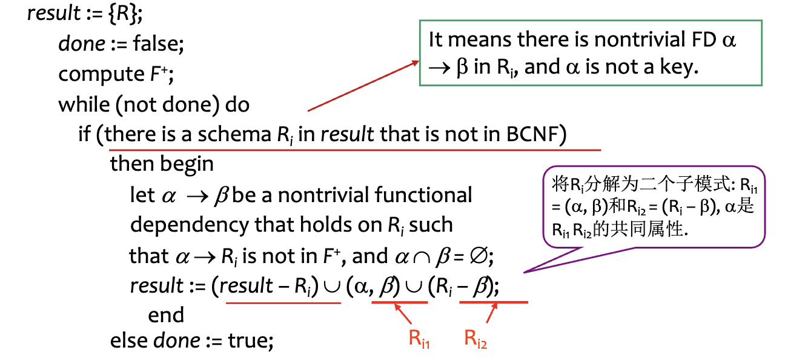</div>

    具体思路如下：

    - 假设目前 $R$ 被拆成 $R_1,R_2, \dots, R_n$, 其中 $R_i$ 不满足 BC 范式
    - 如果 $R_i$ 中的 $\alpha \rightarrow \beta$ 不满足条件（即 $\alpha$ 不是超键）
    - 把 $R_i$ 拆解成 $(\alpha, \beta) \cup (R_i-\beta)$，重复上述操作

 <div style="text-align: center">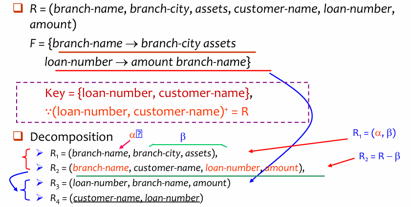</div>

- 只要发现一个表里有“坏”依赖（左边不是键），就把这个依赖单独拆出来成一个新表
- 剩下的属性放在另一个表里，然后重复这个过程

### 6.5.3 BCNF and Dependency Preservation

**并不是所有的 BCNF 分解都能保持函数依赖**
有时候为了达到 BCNF，我们不得不拆分表格，但这可能会导致某些函数依赖在拆分后无法被单独检查，必须通过表连接才能验证，从而增加了系统的维护成本

 <div style="text-align: center">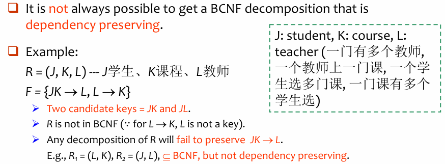</div>

!!! abstract "数据库设计的“不可能三角”"

    我们无法同时满足以下三个完美的设计目标：

    - **无损连接**：分解后能通过连接还原数据（这通常是必须的）
    - **BCNF**：彻底消除冗余
    - **依赖保持**：所有的规则都能在单表内被检查

---

## 6.6 Third Normal Form

!!! note "intro"

    - There are some situations where 
        - 将关系分解为 BCNF 并不总是能保持函数依赖（Dependency Preserving）
        - 在数据库的实际应用中，高效的更新检查非常重要
    - Solution: define a weaker normal form, called Third Normal Form (3NF). 
        - **允许一定的冗余（Allows some redundancy）**
        - **保持依赖（Dependency Preserving）**
        - **理论保证（The Guarantee）**：对于任何关系模式，总是存在一种分解方法，能够满足无损连接（Lossless-join）和依赖保持（Dependency-preserving），并达到3NF

**Definition**: A relation schema $R$ is in third normal form (3 NF) if for all $\alpha \rightarrow \beta$ in $F^+$, at least one of the following conditions holds: 

1.  $\alpha \rightarrow \beta$ is trivial
2. $\alpha$ is a superkey for $R$. 
3. Each attribute $A$ in $\beta -\alpha$ is contained in a candidate key for $R$ (即 $A \in \beta – \alpha$ 是主属性, 若 $\alpha \cap \beta = \emptyset$, 则 $A = \beta$ 是主属性). 
    - Note: each attribute may be in a different candidate key.

**BCNF $\subset$ 3NF**：如果一个关系属于 BCNF，那么它一定属于 3 NF

- 3NF 为了换取“依赖保持”造成的副作用：**数据冗余（Redundancy）**
- 可能会存在信息重复或者存在 null value 的情况

 <div style="text-align: center">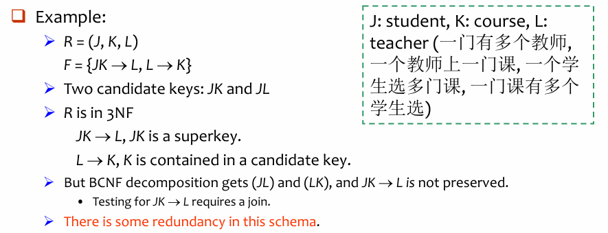</div>

### 6.6.1 Testing for 3NF

Need to check only FDs in $F$, need not check all FDs in $F^+$

- 3NF 测试是 NP-Hard，但把一个关系分解成 3NF 可以在多项式时间内完成

**对于一个给定的函数依赖 $\alpha \rightarrow \beta$，按以下两步进行判断**

1. 使用属性闭包（Attribute Closure）算法计算 $\alpha^+$
    - 如果 $\alpha^+$ 包含了关系 $R$ 的所有属性，说明 $\alpha$ 是 superkey
    - 如果是超键，该依赖满足 BCNF 条件，自然也满足 3NF
2. 如果 $\alpha$ 不是超键
    - 检查 $\beta$ 中的每一个属性
    - $\beta$ 中的每一个属性都必须是**主属性**（即包含在某个候选键中）

### 6.6.2 3NF Decomposition

1. 先求出正则覆盖 $F_c$
2. 为 $F_c$ 中的每个 FD （$\alpha \rightarrow \beta$）创建关系模式（$R_i =\alpha \cup \beta$），如果已经存在就不用建
3. 检查所有的关系模式中，是否**存在一个关系模式**包含了**原表的某个候选键**
4. 如果包含，分解完成；如果不包含，则需要额外添加一个只包含候选键的表
5. 删除冗余的关系表

 <div style="text-align: center">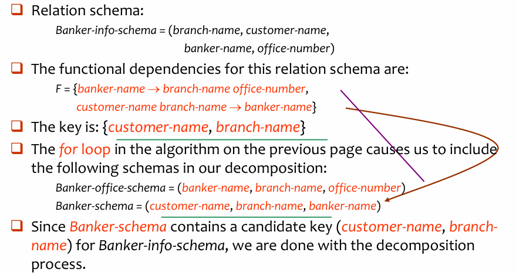</div>

### 6.6.3 Comparison of BCNF and 3NF

It is always possible to decompose a relation into relations in 3NF and 

- The decomposition is lossless. 
- The dependencies are preserved. 
It is always possible to decompose a relation into relations in BCNF and 
- The decomposition is lossless. 
- But it **may not be possible** to preserve dependencies.

### 6.6.4 Design Goals

- Goal for a relational database design is: 
    - BCNF. 
    - Lossless join. 
    - Dependency preservation.
- If we cannot achieve this, we accept one of 
    - Lack of dependency preservation. 
    - Redundancy due to use of 3NF.
- Interestingly, SQL does not provide a direct way of specifying functional dependencies other than **superkeys**. 
  Can specify FDs using assertions, but they are expensive to test.
- Even if we had a dependency preserving decomposition, using SQL we would not be able to efficiently test a functional dependency whose left hand side is not a key.

### 6.6.5 Testing for FDs Across Relations: Materialized View

- 如果分解的结果**没有保持依赖**，我们可以为 $F_c$ 中每一个在分解中未被保持的依赖 $\alpha \rightarrow \beta$，额外创建一个**物化视图（materialized view）**。
- 该物化视图定义为：将分解中的各关系进行连接（join），然后对 $\alpha, \beta$ 进行投影（projection）。
- 许多较新的数据库系统支持物化视图，当关系发生更新时，数据库系统会自动维护该视图。
    - 程序员无需额外编码。
- 函数依赖 $\alpha \rightarrow \beta$ 通过将 $\alpha$ 声明为物化视图上的**候选键**来表达
- 检查候选键比直接检查 $\alpha \rightarrow \beta$ 更便宜（代价更低）
- **但是（BUT）**：
    - **空间开销**：需要额外存储空间来保存物化视图。
    - **时间开销**：当关系更新时，需要同步更新物化视图，保持其一致性。
    - 某些数据库系统可能**不支持**在物化视图上声明候选键。

---

## 6.7 Multivalued Dependencies

### 6.7.1 Definitions

- **有些数据库模式虽然已经是 BCNF 了，但依然存在冗余**
- 这通常发生在两个或多个属性集相互独立，但都依赖于同一个主键的时候

!!! example

    - Consider a database *classes (course, teacher, book)*, we denote that $(c, t, b) \in \text{classes}$ means that $t$ is to teach $c$, and $b$ is a required textbook for $c$. 
    - The database is supposed to list for each course the set of teachers (any one of which can be the course’s instructor), and the set of books (all of which are required for the course no matter who teaches it). 
        - *Course: teacher = 1: n*, *course: book = 1:n* 
        - teacher and book are **multi-value attributes**
        - teacher and book are **independent**.

    <div style="text-align: center">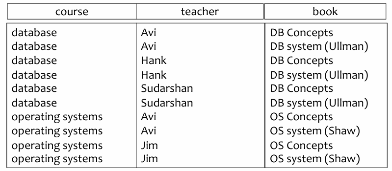</div>

    - 这里唯一的函数依赖（FD）是**平凡**的，即整个**主键决定所有属性**
    - 不存在“非主属性依赖于主键的一部分”或“非主属性传递依赖于主键”的情况
    - 分解策略：将原来的大表拆分为两个小表：
        1. **teaches (course, teacher)**：只记录谁教什么课
        2. **text (course, book)**：只记录什么课用什么书

**Definition**: Let $R$ be a relation schema and let $\alpha \subseteq R$ and $\beta \subseteq R$, the multivalued dependency $\alpha \rightarrow \rightarrow \beta$ holds on $R$, if in any legal relation $r(R)$, for **all pairs** of tuples $t_1$ and $t_2$ in $r$ such that $t_1[\alpha] = t_2[\alpha]$, there exist tuples $t_3$ and $t_4$ in $r$ such that:

$$
\begin{aligned}
&t_1[\alpha] = t_2[\alpha] = t_3[\alpha] = t_4[\alpha] \\
&t_3[\beta] = t_1[\beta] \\
&t_4[\beta] = t_2[\beta] \\
&t_3[R - \alpha - \beta] = t_2[R - \alpha - \beta] \\
&t_4[R - \alpha - \beta] = t_1[R - \alpha - \beta]
\end{aligned}
$$

- 如果 $\alpha \rightarrow \rightarrow \beta$ 成立，那么 $\beta$ 的取值只取决于 $\alpha$ ，而跟剩下的属性 $z$ 没有任何关系。因此， $\beta$ 的值和 $z$ 的值可以任意组合（笛卡尔积），并且这些组合都必须存在于数据库中

!!! tip

    假设找到了两行数据 $t_1$ 和 $t_2$，它们在 $\alpha$ 属性上的值是相同的（即 $t_1[\alpha] = t_2[\alpha]$）

    - 如果 $\alpha \twoheadrightarrow \beta$ 成立，那么我们在表中**必须**也能找到另外两行数据 $t_3$ 和 $t_4$
    - 可以把所有属性分成三部分来看：
        1. **$\alpha$**：决定因素（比如：课程）。
        2. **$\beta$**：多值依赖的属性（比如：老师）。
        3. **$z$**（即 $R - \alpha - \beta$）：剩下的其他属性（比如：教材）。
    - 具体操作：
        - **$t_3$ 的构成**：取 $t_1$ 的 $\alpha$（课程）+ 取 $t_1$ 的 $\beta$（老师）+ 取 $t_2$ 的 $z$（教材）
        - **$t_4$ 的构成**：取 $t_1$ 的 $\alpha$（课程）+ 取 $t_2$ 的 $\beta$（老师）+ 取 $t_1$ 的 $z$（教材）

    **简单来说就是：**
    如果在表中，对于同一个课程（$\alpha$），

    - 我们有一行记录了“DB + Avi + DB 书”（$t_1$），另一行记录了“DB + Hank + Ullman 书”（$t_2$）
    - 如果 `Course →→ Teacher` 成立，这就意味着老师和书是独立的
    - 那么，表中**必须**同时也存在“DB + Avi + Ullman”（$t_3$）和“DB + Hank + DB”（$t_4$）

**Tabular representation**

 <div style="text-align: center">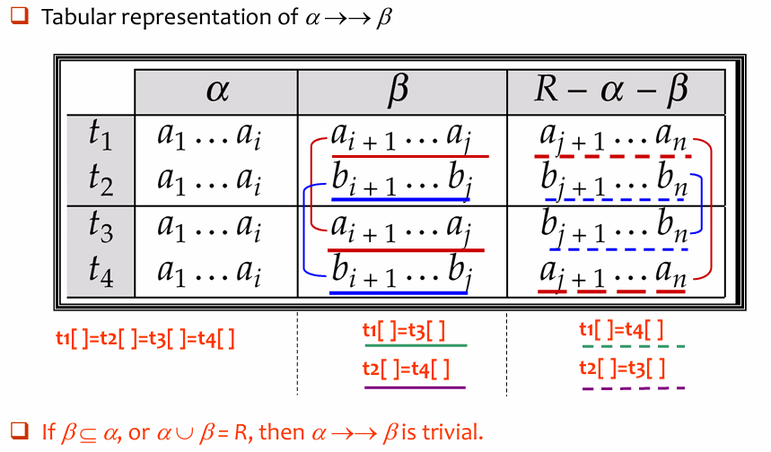</div>

### 6.7.2 Theory of MVDs

**所有的函数依赖本质上也是多值依赖**

- **规则陈述**：
    - 如果存在函数依赖 $\alpha \rightarrow \beta$，那么必然存在多值依赖 $\alpha \rightarrow\rightarrow \beta$。
    - 这里有一个前提条件：$\alpha \cup \beta = R$，也就是说，除了 $\alpha$ 和 $\beta$ 之外，表中没有其他属性了（或者说我们只关注这两个属性集）
- **逻辑推导**：
    - **函数依赖的定义**：如果两行数据的 $\alpha$ 值相同，那么它们的 $\beta$ 值**必须完全相同**
    - **多值依赖的定义**：如果 $t_1$ 和 $t_2$ 的 $\alpha$ 相同，我们需要找到 $t_3$ 和 $t_4$ 使得 $t_3[\beta] = t_1[\beta]$ 且 $t_4[\beta] = t_2[\beta]$
    - 在函数依赖的情况下，$t_1[\beta]$ 本来就等于 $t_2[\beta]$
    - 因此，满足函数依赖的数据集，天然就满足多值依赖的定义。

$D^+$ 是基于集合 $D$ 中的规则，通过逻辑推导能得出的**所有可能的函数依赖和多值依赖**的总和

- We can compute $D^+$ from $D$, using the formal definitions of functional dependencies and multivalued dependencies.
- We can manage with such reasoning for very simple multivalued dependencies, which seem to be most common in practice.
- For complex dependencies, it is better to reason about sets of dependencies using a system of inference rules (see Appendix C).

---

## 6.8 Fourth Normal Form

**Definition**: A relation schema $R$ is in **4 NF** with respect to a set $D$ of functional and multivalued dependencies if for all multivalued dependencies in $D^+$ of the form $\alpha \rightarrow\rightarrow \beta$, where $\alpha \subseteq R$ and $\beta \subseteq R$, at least one of the following hold:

1. $\alpha \rightarrow\rightarrow \beta$ is trivial (i.e., $\beta \subseteq \alpha$ or $\alpha \cup \beta = R$)
2. $\alpha$ is a superkey for schema $R$
- <u>If a relation is in 4 NF, it is in BCNF.</u>

### 6.8.1 Requirement for decomposition

Assume $R$ is decomposed into $R_1, R_2, \dots, R_n$, each $R_i$ is required to conform to 4NF.

每个小表 $R_i$ 上依然有效的依赖的集合被称为 $D$ 在 $R_i$ 上的**限制（Restriction）**
记作 $D_i$，包含两类依赖：

1. **函数依赖的限制**：
    - 所有在原始依赖集的闭包 $D^+$ 中，且**只包含 $R_i$ 中属性**的函数依赖
2. **多值依赖的限制**：
    - 指所有形如 $\alpha \rightarrow\rightarrow (\beta \cap R_i)$ 的多值依赖
        - $\alpha$ 必须是 $R_i$ 的子集（即决定因素完全在这个小表里）
        - 原始的多值依赖 $\alpha \rightarrow\rightarrow \beta$ 必须在 $D^+$ 中

### 6.8.2 Decomposition Steps   

1. 检查当前表中是否存在**非平凡多值依赖** $\alpha \rightarrow\rightarrow \beta$，且 $\alpha$ 不是超键。
2. 将该表一分为二：
    - 表 1：取 $\alpha \cup \beta$（把依赖关系单独剥离）。
    - 表 2：取 $\alpha \cup (R - \beta)$（保留剩下的属性，但必须**保留公共连接键 $\alpha$**）
3. 利用公共属性 $\alpha$ 将两张新表关联。因为 $\alpha$ 是公共的“桥梁”，所以这种分解是**无损连接**的

 <div style="text-align: center">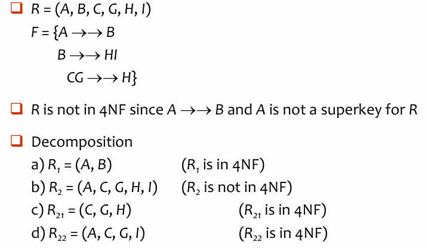</div>
