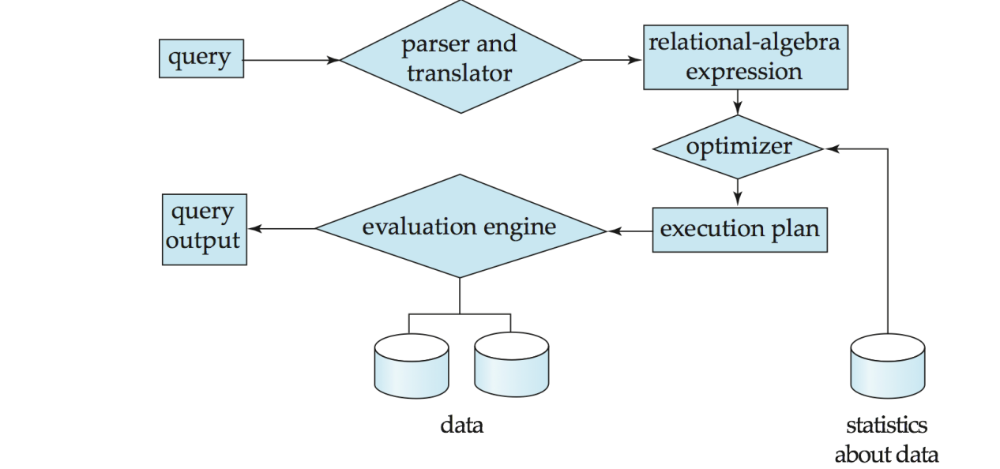
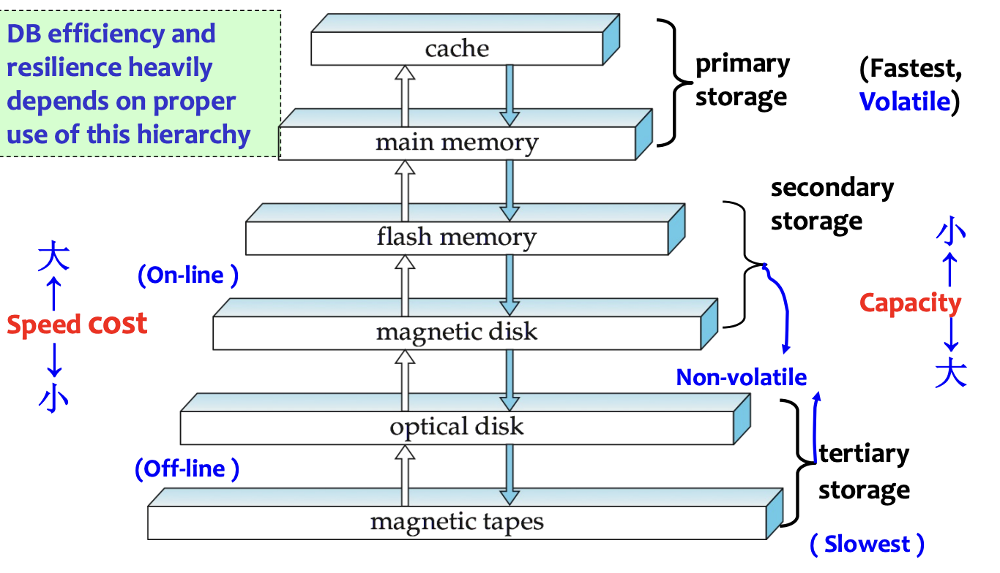
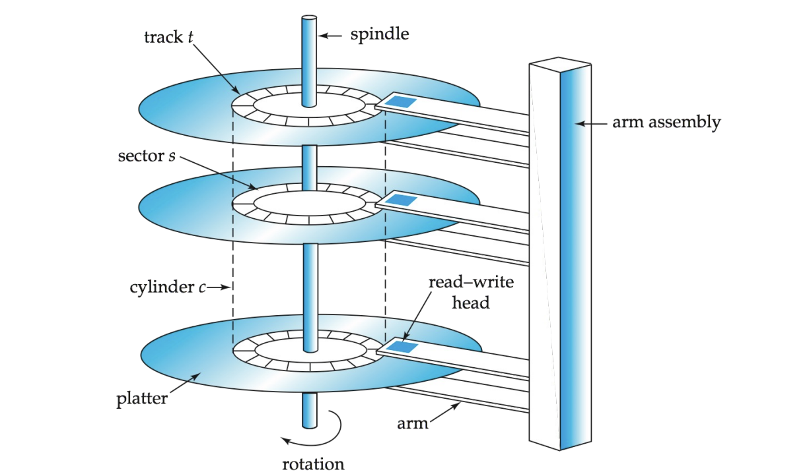
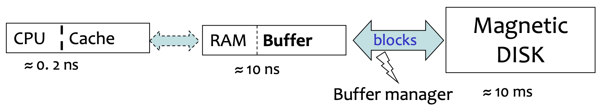
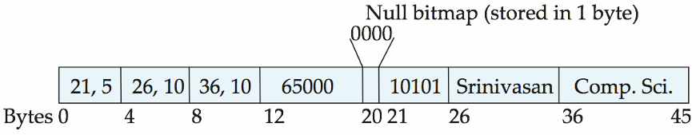
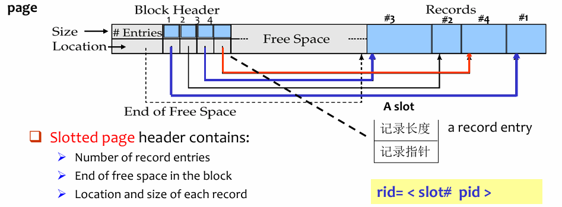
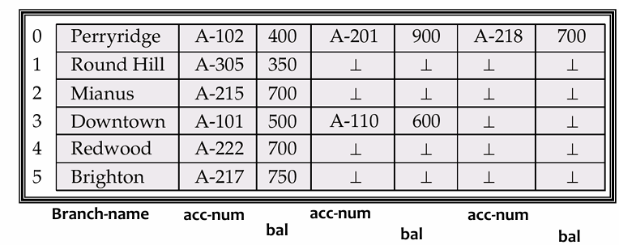
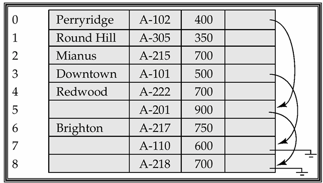

# Lec8.Storage and File Structure

## Review : Database System Internals

- ==Storage Manager== is a program module that provides the **interface** between <u>the low-level data stored in the database</u> and <u>the application programs and queries</u> submitted to the system.
- ==Query Processor== includes: DDL interpreter, DML compiler and Query processing

!!! abstract

    Storage manager 负责“数据如何落到物理存储上以及如何取回来”；
    query processor 负责“SQL 如何被解析、优化并执行”，两者在 DBMS 内部共同支撑上层查询

---

## 8.1 Overview of Physical Storage Media

### 8.1.1 Classification of Physical Storage Media

Storage media can be classified by:

- **Speed** with which data can be accessed.
- **Cost** per unit of data.
- **Reliability**
  - Data loss on power failure or system crash.
  - Physical failure of storage device.

!!! info "<u>Reliability Classification</u>"

    - Volatile storage(易失性存储器)
        - <u>Loses contents when power is switched off.</u>
        - E.g., DDR, SDR.
    - Non-volatile storage(非易失性存储器)
        - <u>Contents persist even when power is switched off.</u>
        - Includes secondary storage, tertiary storage, and battery-backed-up main memory.

### 8.1.2 Physical Storage Media

1. Cache
   - Fastest and most costly form of storage, but volatile
   - Managed by computer system hardware.
2. Main Memory
   - Fast access, but Volatile
   - Usually too small or too expensive to store the entire database.
3. Flash Memory(快闪存储器)
   - also known as EEPROM (Electrically Erasable Programmable Read-Only Memory)
   - Data survives power failure.
   - A location can be written only once before being erased.
     - A memory bank must be erased as a whole.
   - Reads are roughly as fast as main memory, writes are slower, erase is even slower.
   - Widely used in embedded devices, phones, cameras, USB keys.
4. Magnetic Disk
   - Data is stored on spinning disk and read/written magnetically.
   - Primary medium for long-term storage of data, typically stores the entire database.
   - Data must be moved from disk to main memory for access.
   - Direct-access: data can be read in any order.
5. Optical Storage
   - Non-volatile, data is read optically from a spinning disk using a laser.
   - Reads and writes are slower than magnetic disk.
6. Tape Storage
   - Non-volatile, used mainly for backup and archival data.
   - Sequential-access, much slower than disk,  but very high capacity.
   - Tape can be removed from drive, so storage cost is cheap, but drives are expensive.

!!! quote

    Jim Gray: Tape is Dead, Disk is Tape, Flash is Disk.

### 8.1.3 Storage Hierarchy

“存在即合理”

Storage hierarchy:

- **Primary storage**: Fastest, but volatile.
  - E.g., cache, main memory.
- **Secondary storage**(辅助存储器 / 联机存储器): Non-volatile, moderately fast access time.
  - Also called on-line storage.
  - E.g., flash memory, magnetic disks.
- **Tertiary storage**(三级存储器 / 脱机存储器): Non-volatile, slow access time.
  - Also called off-line storage.
  - E.g., magnetic tape, optical storage.

---

## 8.2 Magnetic Disks

### 8.2.1 Disk Structure

To read/write a sector:

1. Disk arm swings to position the head on the correct **track**.
2. Platter spins continually.
3. Data is read/written as the **sector** passes under the head.

!!! info "Disk Subsystem"

    

    Multiple disks can be connected to a computer system through a **controller**.

### 8.2.2 Performance Measures of Disks

**Access time**: time from issuing a read/write request to the beginning of data transfer.

$$
\text{Access time} = \text{Seek time} + \text{Rotational latency}
$$

- Seek time(寻道时间)
  - Time to reposition the arm over the correct track
- Rotational latency(旋转等待时间)
  - Time waiting for the desired sector to appear under the head.
  - Average latency is <u>half of the worst-case latency</u>. 即旋转半周需要的时间
- Data-transfer rate
  - Rate at which data can <u>be retrieved from or stored to disk</u>. 即数据传输速率

**Mean time to failure** (MTTF, 平均故障时间)

- Average time a disk is expected to run continuously without failure.
- Typically 3 to 5 years, new disks may have theoretical MTTF of $500,000$ to $1,200,000$ hours.

### 8.2.3 Optimization of Disk-Block Access

**Block**: <u>a contiguous sequence of sectors from a single track.</u>

- 数据传输的单位，Data is transferred between disk and main memory in blocks.
- Block sizes range from 512 bytes to several KB.

#### Disk-Arm Scheduling

**Elevator algorithm(电梯算法)**: move disk arm in one direction (from outer to inner tracks or vice versa), processing next request in that direction, till no more requests in that direction, then reverse direction and repeat.

#### File Organization

将相关数据尽量存放在同一或相邻磁道（柱面），以减少寻道时间

- 随着插入、删除或空闲空间分散，**会产生碎片化**
- 文件碎片化后，顺序读取时需要**频繁移动磁头**
- 可通过**磁盘碎片整理（defragmentation）** 提高访问速度，但执行期间系统通常较慢或不可用

#### Nonvolatile Write Buffers

利用Nonvolatile write buffer(非易失性写缓冲区)，把非顺序化的数据改成结构化的数据再写入

- Write blocks immediately to non-volatile RAM buffer (battery-backed RAM or flash memory)
- Controller later writes to disk when it has no other requests or when a request has waited long enough.

#### Log Disk

**日志磁盘（Log Disk）**：专门用于顺序记录数据块更新日志的磁盘

- 类似**非易失性内存（NV-RAM）**，因为是顺序写入，无需寻道，速度很快
- 不需要专门的 NV-RAM 硬件
  文件系统为了性能，可能会重排写入操作
- 日志文件系统（Journaling）会按安全顺序写入日志（先写日志再写数据），保证一致性
- 如果没有日志而进行重排，**可能导致文件系统损坏

---

## 8.3 \*RAID

RAID: ==Redundant Arrays of Independent Disks==(独立磁盘冗余阵列).
improves system performance from two aspects:

- Redundancy $\Rightarrow$ reliability
- Parallelism $\Rightarrow$ speed

### 8.3.1 Reliability Improvement

#### Redundancy

==Redundancy==: stores extra information that can rebuild data lost in a disk failure.
Mirroring or Shadowing：

- 在两块盘上存储数据，每次更新数据时都同时读写两块盘
- 只有两块盘同时损坏时，才会丢失数据

#### Parallelism

==Parallelism==: use **striping** to improve transfer rate by spreading data across multiple disks.

1. Load balance multiple small accesses to increase throughput.
2. Parallelize large accesses to reduce response time.

**Bit-level striping(比特级拆分)**: splits bits of each byte across multiple disks.

- Each access can read data faster, but seek/access time is worse than a single disk because every access involves all disks.
- Not used much anymore.

**Block-level striping(块级拆分)**: stores block $i$ on disk:

$$
(i \bmod n) + 1
$$

where $n$ is the number of disks.

- Requests for different blocks can run in parallel if blocks are on different disks.
- A request for a long sequence of blocks can use all disks in parallel.

### 8.3.2 RAID Levels

RAID levels combine striping and redundancy in different ways.

| RAID 级别 | 核心方式              | 冗余/容错      | 主要特点                             |
| --------- | --------------------- | -------------- | ------------------------------------ |
| RAID 0    | 条带化                | 无冗余         | 性能高，但磁盘坏了就容易丢数据       |
| RAID 1    | 镜像                  | 有冗余         | 数据安全，写性能较好，但空间利用率低 |
| RAID 2    | 位条带 + ECC          | 有纠错         | 已基本被 RAID 3 取代                 |
| RAID 3    | 位级条带 + 独立校验盘 | 可容忍单盘故障 | 传输快，但每次 I/O 都要用到所有磁盘  |
| RAID 4    | 块级条带 + 独立校验盘 | 可容忍单盘故障 | 读性能好，但校验盘写入瓶颈明显       |
| RAID 5    | 块级条带 + 分布式校验 | 可容忍单盘故障 | 比 RAID 4 更均衡，避免单一校验盘瓶颈 |
| RAID 6    | RAID 5 + P+Q/双重校验 | 可容忍多盘故障 | 可靠性更高，但成本和写入开销更大     |

### 8.3.3 Choice of RAID Level

Factors:

- Monetary cost.
- Performance in normal operation:
  - number of I/O operations per second,
  - bandwidth.
- Performance during failure.
- Performance during rebuild of failed disk.
- Time taken to rebuild failed disk.

其他方案基本已经不被采用，主要考虑 RAID1 和 RAID5

- **RAID 1（镜像）**
  - 写性能更好（只需写副本）
  - 适合高频更新场景（如日志）
- **RAID 5（分布式校验）**
  - 写入开销大（需读-改-写，多次 I/O）
  - 适合数据量大、更新少的场景

### 8.3.4 Hardware Issues

Software RAID

- Implemented entirely in software.
- No special hardware support.
  Hardware RAID
- Uses special hardware.
- May use non-volatile RAM to record writes being executed.

Potential problem:

- Power failure during write can corrupt disk.
- Example: failure after writing one block but before writing the second block in a mirrored system.
- Corrupted data must be detected after power restoration.

Related techniques:

- **Latent failure**: data successfully written earlier gets damaged.
- **Data scrubbing**: continually scan for latent failures and recover from copy/parity.
- **Hot swapping(热插拔)**: replace disk while system is running.
- Online spare disks can replace failed disks immediately.
- Redundant power supplies, controllers and interconnections reduce single points of failure.

---

## 8.4 \*Tertiary Storage

### Optical Disks

CD-ROM:

- Removable disk.
- About 640 MB.
- Seek time about 100 ms.
- Lower transfer rate than magnetic disk.

DVD:

- DVD-5: 4.7 GB.
- DVD-9: 8.5 GB.
- DVD-10 / DVD-18: 9.4 GB / 17 GB.
- Blu-ray DVD: about 27 GB, or 54 GB for double-sided disk.

Record-once versions:

- CD-R, DVD-R.
- Data can only be written once and cannot be erased.
- Used for archival storage.

Multi-write versions:

- CD-RW, DVD-RW, DVD+RW, DVD-RAM.

### Magnetic Tapes

Magnetic tapes:

- Hold large volumes of data.
- Provide high transfer rates.
- Cheap media, but drives are expensive.
- Very slow access time compared with magnetic and optical disks.
- Limited to sequential access.
- Used mainly for:
  - backup,
  - infrequently used information,
  - off-line data transfer between systems.

Tape jukeboxes can provide very large capacity, even multiple petabytes.

---

## 8.5 Storage Access

数据库把文件**逻辑划分成固定大小的块（block）**，block 是存储和传输的单位
Buffer 是 **主存（RAM）中的一块区域**，用来存放磁盘块的副本

- 核心优化目标：<u>reduce disk access</u>，但内存有限，放不下所有数据

**Buffer Manager（缓冲区管理器）**：分配 buffer 空间；管理内存和磁盘之间的数据交换

!!! note "Page / Block / Frame"

    

    - Page: a unit of data.
    - Block: a unit of disk space.
    - Frame: a unit of buffer pool.
    - In practice, block $\approx$ page.

If the block is already in buffer:

### 8.5.1 Buffer Manager

**当程序需要磁盘内的 block 时，需要调用 buffer manager**
如果 block 在 buffer 中：返回 block 在主存中的地址
如果 block 不在 buffer 中:

1. Allocate buffer space for the block.
2. If no free space exists, replace some old page.
3. If the old block was modified, write it back to disk.
4. Read the requested block from disk into buffer.
5. Return the address of the block in memory.

### 8.5.2 Buffer-Replacement Policies

**Pinned block(被钉住的块)**

- A memory block that is not allowed to be written back or replaced.
- Usually because it is currently being used.

**Dirty bit**

- Indicates whether a page has been modified.
- If a dirty page is replaced, it must be written back to disk.

**Pin count**

- A page may be requested by multiple transactions.
- A page is a replacement candidate only if $\text{pin count} = 0$

**Forced output of blocks**

- Forces pages to be written back to disk, useful for recovery.

**Toss-immediate strategy**

- Frees space occupied by a block as soon as the final tuple of that block has been processed.（用后立即丢弃）

#### LRU Strategy

- 淘汰**最久未被使用**的块
- 思想：过去很久没用的数据，将来可能也不会用
- 优点：符合一般访问局部性
- 缺点：对“循环扫描”等访问模式效果差（容易淘汰马上要用的数据）

#### MRU Strategy

- 淘汰**刚刚使用过**的块
- 思想：最近用过的可能短时间内不会再用
- 适用于：某些顺序扫描或特定访问模式

#### Mixed Strategy

**利用统计信息 + 查询提示动态调整替换策略**
Buffer manager can use statistical information.

- Example: data dictionary is frequently accessed.
- Heuristic: keep data-dictionary blocks in main memory buffer.
  Query optimizer may provide hints about replacement strategy.

---

## 8.6 File Organization

The database is stored as a collection of **files**.

- Each file is a sequence of **records**.
- A record is a sequence of **fields**.

Two kinds of records:

- Fixed-length records.
- Variable-length records.

### 8.6.1 Fixed-Length Records

Store record $i$ starting from byte:

$$
n \times (i - 1),\text{where $n$ is the size of each record.}
$$

- Advantage: record access is simple.
- Problem: records may cross block boundaries.
  - Modification: do not allow records to cross block boundaries.
    删除 record $i$ 有多种方法:

1. Move records $i+1,\dots,n$ to $i,\dots,n-1$.
2. Move record $n$ to position $i$.
3. Do not move records, but **link** all free records on a **free list**.

#### Free list

**Free list(空闲链表)**：用于管理数据库文件中已删除记录空间的数据结构

- 当一个记录被删除时，它的空间并不会立即归还给操作系统，而是被放入一个“空闲链表”中
- 当需要插入新记录时，系统会优先从这个链表中**寻找可用的空间**进行复用

**工作原理**：

- **文件头存储**：在文件的头部，会存储第一个被删除记录的地址。
- **链式连接**：这个被删除的记录空间本身，会被用来存储下一个被删除记录的地址。如此往复，形成一个链表。
- **指针概念**：这些存储的地址可以看作是“指针”，它们指向链表中下一个空闲记录的位置。

### 8.6.2 Variable-Length Records

Variable-length records arise because of:

- **混合存储**：在一个文件里存了多种不同类型的记录
- **变长字段**：variable-length field，比如 `varchar` 类型的字符串，有的长有的短
- **重复字段**：在一些数据模型中，允许一个字段重复出现多次（比如一个人有多个电话号码）

**存储策略**

- **顺序存储**：属性（字段）按照定义顺序存放
- **(offset, length)**：为了处理变长数据，采用混合布局
  - <u>固定部</u>分：头部不直接存数据，而是存一个固定大小的“指针”，包含两个信息：**偏移量**（数据从哪里开始）和**长度**（数据有多长）
  - <u>变动部分</u>：真正的数据（比如具体的字符串内容），通常被统一存放在记录尾部，也就是所有固定长度字段之后
  - _好处_：这样既保证了记录头部的结构是可控的，又能灵活容纳任意长度的数据。
- **空值的处理**：使用 **空值位图**。
  - 如果某个字段是 NULL，系统会用一个二进制位（0 或 1）来标记

#### Slotted Page Structure

==Slotted page（槽页）== is commonly used to store variable-length records inside a page.
**内部布局**

- Block Header：位于页的最左侧，是页的“目录”
- Records：位于页的最右侧，记录<u>从右向左</u>生长的
- Free Space：位于中间，这是未使用的区域

- **槽数组（Slot Array）**：Block Header包含一个数组，数组中的每一项被称为一个“槽”
- **槽的内容**：存储实际数据的**元数据**，通常包括：
  - 记录指针（Location/Offset）：指向实际记录在页内的起始位置
  - 记录长度（Size）：占用了多少字节
- **生长方向**：
  - 当插入新记录时，实际数据被放入空闲空间的**最右端**，并向左扩展
  - 同时，在块头中分配一个新的槽（从左向右），填入该记录的地址和长度

### 8.6.3 Fixed-Length Representation

A) **Reserved space**: 系统预先估算一个记录可能达到的最大长度，然后为每一条记录都分配这么大的固定空间。如果一个记录的数据很短，剩下的空间就用空值或结束符填充。

B) **Pointer method**:

- 将一个变长记录拆分成多个固定长度的小记录块，然后用指针把它们串成一个链表

Drawback: space is wasted in all records except the first record in a chain.

**Solution: use two kinds of blocks**

- **Anchor block(锚块)**: 存放链表的“头部”记录，即包含完整信息的第一个记录块
- **Overflow block(溢出块)**: 存放链表的“后续”记录，这些块只需要存储增量信息

---

## 8.7 \*Organization of Records in Files

Four common file organizations:

### Heap File

- A record can be placed anywhere in the file where there is space.
- Simple for insertion.
- Search may require scanning unless there is an index.

### Sequential File

- Store records in sequential order based on the value of a search key.
- Suitable for applications that require sequential processing of the entire file.

**Deletion**: use pointer chains.
**Insertion**:

1. Locate the position where the record should be inserted.
2. If there is free space, insert there.
3. If no free space exists, insert into an overflow block.
4. Update pointer chains.
   Need to reorganize the file from time to time to restore sequential order. (需要定期对文件重新排序)

### Hashing File

- A hash function is computed on some attribute of each record.
- The result specifies which block of the file should contain the record.

### Clustering File Organization

- Records of several different relations can be stored in the same file.
  Motivation:
- Store related records from different relations on the same block to minimize I/O.
  Example:
- Store `department` and its related `instructor` records together.
  Benefits:
- Good for queries involving `department` and `instructor`.
- Good for queries involving one single department and its instructors.
  Drawbacks:
- Bad for queries involving only `department`.
- Results in variable-size records.
- May need pointer chains to link records of a particular relation.

---

## 8.8 \*Data Dictionary Storage

Data dictionary (also called system catalog) stores **metadata**

- Metadata means <u>data about data</u>.
  Data dictionary stores:
- **Information about relations**
  - Names of relations.
  - Names and types of attributes of each relation.
  - Names and definitions of views.
  - Integrity constraints.
- **User and accounting information**, including passwords.
- **Statistical and descriptive data**
  - Number of tuples in each relation.
- **Physical file organization information**
  - How relation is stored: sequential, hash, etc.
  - Physical location of relation.
  - Operating system file name, or disk addresses of blocks containing records.
- **Information about indices**.
