# Lec9.Indexing and Hashing

## 9.1 Basic Concepts

**索引机制**是为了加快访问所需数据的速度
An **index file索引文件** consists of records(called **index entries索引项**), of the form:

$$
(\text{search-key},\ \text{pointer})
$$

- **Search key**: attribute or set of attributes used to look up records in a file.
- Index files are typically much smaller than the original data file.
  两种基本的索引方式:
- **Ordered indices**(顺序索引):
  search keys are stored in sorted order.
- **Hash indices**(散列索引):
  search keys are distributed uniformly across "buckets" by a "hash function".

### Index Evaluation Metrics

衡量索引技术时，主要关注时间效率和空间效率：

- **Access types** supported efficiently
  - 精确匹配查询：例如 `WHERE Col = v`，查找某个属性值等于特定值的记录。
  - 范围查询：例如 `WHERE Col BETWEEN v1 AND v2`，查找某个属性值落在指定区间的记录
  - 对比：Hash index 对精确匹配非常高效，但对范围查询支持很差；而 Ordered index 对范围查询非常友好
- **Access time**
- **Insertion time**
- **Deletion time**
- **Space overhead**

---

## 9.2 Ordered Indices

In an ordered index, index entries are stored sorted on the search-key value.

### Basic Concepts

**Sequentially ordered file(顺序排序文件)**

- The records in the data file are ordered by a search-key.
  ==Primary index(主索引)==
- 与对应的数据文件本身的排列顺序相同的索引称为**主索引**，也称为**clustering index(聚集索引)**
  - 主索引的搜索键通常是但并非一定是主码
  - 非顺序排序文件没有 primary index，但 relation 可以有 primary index
- **index-sequential file(索引顺序文件)**：Sequentially ordered file with a primary index.
  ==Secondary index(辅助索引)==
- 搜索键的指定顺序与文件记录的物理顺序不同的索引，也称为**non-clustering index(非聚集索引)**

Two types of ordered indices:

- Dense index(稠密索引)
- Sparse index(稀疏索引)

### 9.2.1 Dense Index Files

**Dense index（稠密索引）**：文件中的每一个搜索键值，都会在索引中出现对应的条目

<div style="text-align: center">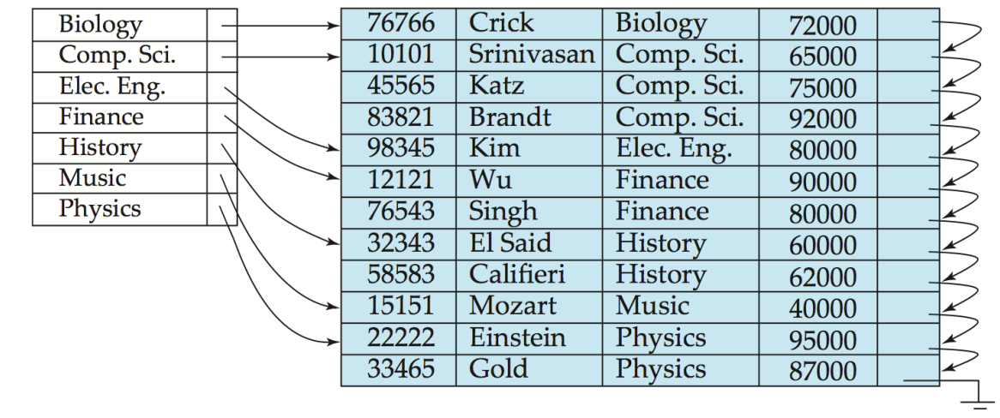</div>

- **如果搜索键是唯一的**（例如主键）
  那么每个索引条目会直接指向一条具体的数据记录
- **如果搜索键不是唯一的**（例如有重复值的列）
  一个索引条目可能会指向一个“桶”，桶里包含了所有具有该搜索键值的记录的指针
- **稠密索引既适用于顺序文件，也适用于非顺序文件。**

### 9.2.2 Sparse Index Files

**Sparse index（稀疏索引）**: contains index entries for only some search-key values.

- 通常是**一个数据块对应一个索引条目**，仅当数据文件中的记录是按照搜索键**顺序排列**时才适用
- 要查找搜索键值为 $K$ 的记录，步骤如下：
  1. 在索引中找到那个小于 $K$ 的最大搜索键值对应的索引记录
  2. 从该索引条目指向的记录开始，在数据文件中进行顺序查找
     Compared to dense indices:
- Less space overhead.
- Less maintenance overhead for insertions and deletions.
- Generally slower for locating records.

### 9.2.3 Secondary Indices

实际应用中常有多种属性作为查询条件，因此需要在非主排序属性上建立辅助索引。

<div style="text-align: center">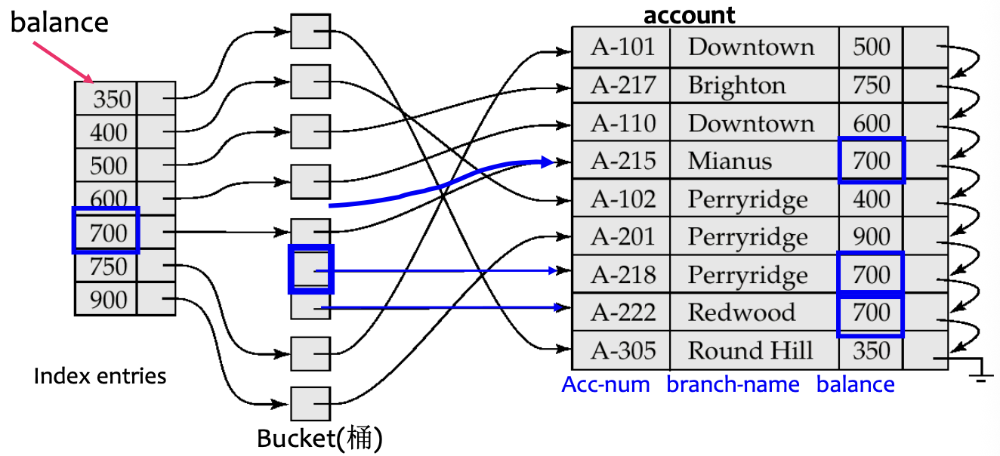</div>

Secondary index:

- 为每一个搜索键值都设有一个索引记录。
- 该索引记录指向一个“桶”。
- 桶中包含了指向所有具有该特定搜索键值的实际记录的指针。

!!! tip "Secondary index must be dense"

    辅助索引不能使用稀疏索引，因为数据文件本身不是按照该 search key 排序的。每条满足条件的记录都必须能够被指针找到。**最终还是需要主键来访问具体条目。**

### 9.2.4 Multilevel Index

If a primary index is too large to fit in memory, access becomes expensive.

- **为了减少磁盘访问次数**：
  将保存在磁盘上的主索引视为一个顺序文件，在此基础上构建一个稀疏索引。
- **Outer index**: 主索引的稀疏索引；**Inner index**: 主索引文件本身
  如果外层索引仍然太大，可以创建另一个层级。

<div style="text-align: center">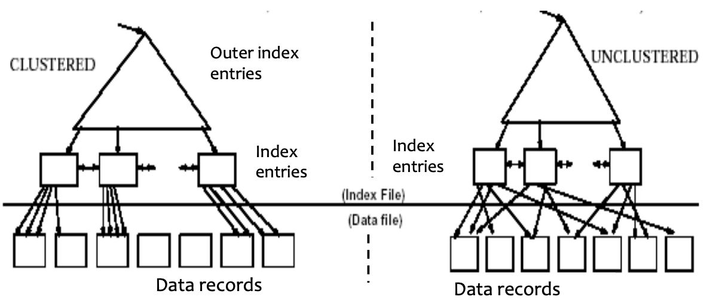</div>

- 这种技术既适用于聚簇索引，也适用于非聚簇索引。
- 在进行插入或删除操作时，所有层级的索引都必须进行更新。

### 9.2.5 Index Update: Deletion

General procedure:

1. Find and delete the record in the data file.
2. Update the index file.

**Dense index deletion**

- 如果被删除的记录是其搜索键值的**唯一**记录，则删除对应的索引条目（单记录, 即 search-key 有唯一性）
- 如果还有其他记录拥有相同的键值 (多条记录，即 search-key 无唯一性)：
  - 如果该索引条目包含多个指针，仅删除指向那条已删除记录的指针（对应辅助索引的情况）
  - 如果是**主索引**，且被删除的记录正是该条目指向的第一条记录，则将指针修改为指向下一条记录
  - 其他情况下，无需更改

**Sparse index deletion**

- 如果被删除记录的搜索键值没有出现在索引中，则无需执行任何操作
- 如果存在对应的索引条目：
  - 用数据文件中下一个搜索键值来替换该条目
  - 如果这个“下一个”搜索键值已经有了自己的索引条目，直接删除原来的条目即可

**For multilevel indices**: 由底层逐级向上层扩展，每一层的处理过程与上述单层索引情况下类似

### 9.2.6 Index Update: Insertion

1. 使用待插入记录中的搜索键值进行查找
2. 将记录插入数据文件
3. 根据索引类型更新索引

**Dense index insertion**

- 如果搜索键值在索引中**不存在**，则插入一条新的索引项
- 如果搜索键值在索引中**已经存在**：
  - 如果该索引项维护了多个指针，则添加一个指向新记录的指针
  - 其他情况下，无需更改

**Sparse index insertion**
（假设每个数据块对应一条索引项）

- 如果创建了新块，则将新块中的第一个搜索键值插入索引
- 如果新记录是其所在块中搜索键值最小的记录，则更新对应的索引项
- 否则无需更改

### 9.2.7 Secondary Indices

- 有时候需要筛选出所有数据中符合特定条件的数据，这个时候可以使用secondary index
  - We can have a secondary index with an index record for each search-key value

<div style="text-align: center">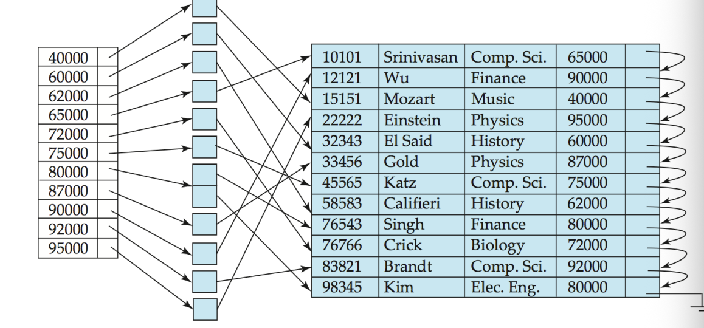</div>

- 索引记录指向一个桶（bucket），该桶包含了指向所有具有该特定搜索键值的实际记录的指针
- 辅助索引（secondary Indices）必须是**稠密的**

### 9.2.8 Primary and Secondary Indices

索引能显著提升查询效率，但每个索引都会带来更新开销

- 当文件被修改时，该文件上的每一个索引都必须更新
- 使用主索引进行顺序扫描是高效的
- 使用辅助索引进行顺序扫描代价高昂：
  - 每次记录访问都可能需要从磁盘读取一个新的数据块
  - 磁盘块读取可能耗时数毫秒，远慢于内存访问

---

## 9.3 B+ Tree Index Files

B+树索引是索引顺序文件的一种替代方案

- Disadvantage of indexed-sequential files：
  - 随着文件增长，性能会下降，因为可能产生大量溢出块
  - 需要定期对整个文件进行重组
- Advantage of $B^+$-tree index files：
  - 在插入和删除过程中，通过较小的局部调整自动重组自身
  - 无需对整个文件进行重组即可维持性能
- (Minor) disadvantage of $B^+$-trees：额外的插入和删除开销，以及空间开销

### 9.3.1 Definition

A $B^+$-tree is a rooted tree satisfying the following properties:

- 从根到叶的所有路径长度相同，即 B+ 树是**平衡的**
- 除根节点和叶节点外，每个节点有 $\lceil n/2 \rceil$ 到 $n$ 个子节点
- 叶节点有 $\lceil (n-1)/2 \rceil$ 到 $n-1$ 个值
- 特殊情况：
  - 如果根不是叶节点，则至少有 2 个子节点
  - 如果根是叶节点，则可以有 $0$ 到 $n-1$ 个值

### 9.3.2 Node Structure

<div style="text-align: center">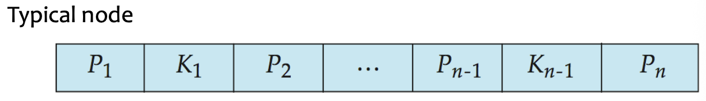</div>

- $K_i$ 是搜索键值，节点中的搜索键有序排列：

$$
K_1 < K_2 < \dots < K_{n-1}
$$

- $P_i$ 是指针
  - 在非叶节点中：指向子节点的指针。
  - 在叶节点中：指向记录或记录桶的指针。
- 通常一个节点对应一个 block

#### Leaf Nodes

对于 $i = 1,2,\dots,n-1$：

- 指针 $P_i$ 指向搜索键值为 $K_i$ 的文件记录，或指向一个包含文件记录指针的桶
- 仅当搜索键不是主键时才需要桶
- 每个搜索键都出现在叶节点中，类似于稠密索引

性质：

- 若 $L_i, L_j$ 是叶节点且 $i < j$，则 $L_i$ 中的所有搜索键值均小于 $L_j$ 中的值
- 每个叶节点包含 $\lceil (n-1)/2 \rceil$ 到 $n-1$ 个搜索键
- $P_n$ 指向按搜索键顺序排列的下一个叶节点，这便于顺序处理和范围查询

#### Non-Leaf Nodes

非叶节点构成叶节点之上的多层稀疏索引

对于具有指针 $P_1,\dots,P_n$ 和键 $K_1,\dots,K_{n-1}$ 的非叶节点：

- 子树 $P_1$ 中的所有搜索键均小于 $K_1$
- 对于 $2 \leq i \leq n-1$，子树 $P_i$ 中的所有搜索键满足：

$$
K_{i-1} \leq \text{key} < K_i
$$

- 子树 $P_n$ 中的所有搜索键大于或等于 $K_{n-1}$

!!! abstract "B+-树总结"

    - 非叶层级构成了一个稀疏索引的层级结构。
    - 树的高度很小，与主文件大小成对数关系。
    - 插入和删除可通过局部重构在对数时间内完成。
    - 逻辑上相邻的节点在物理上不必相邻，因为节点之间通过指针连接。

### 9.3.3 Queries

高度上界：

- 如果文件中有 $K$ 个搜索键值，树的高度不超过：

$$
\left\lceil \log_{\lceil n/2 \rceil}(K) \right\rceil
$$

- 一个 node 通常和一个 block 的大小相同，例如 4KB。
  - $n$ 通常在 100 左右。
- 当有 $1,000,000$ 个搜索键值且 $n=100$ 时，一次查找最多访问：

$$
\log_{50}(1,000,000) \approx 4 \text{ 个节点}
$$

### 9.3.4 Handling Duplicates

当存在重复搜索键时：无法保证 $K_1 < K_2 < \dots < K_{n-1}$

- 只能保证 $K_1 \leq K_2 \leq \dots \leq K_{n-1}$
  修改后的查找思路：
- 即使 $V = K_i$，也遍历 $P_i$
- 到达叶节点后，如果该叶节点只包含小于 $V$ 的值，则移动到右兄弟节点
- 要打印所有值为 $V$ 的记录，先找到第一个出现位置，然后遍历连续的叶节点

!!! info "Non-Unique Search Keys"

    处理非唯一搜索键的替代方案：

    1. 将桶放在单独的块上：不是好主意，因为会增加额外的块访问
    2. 每个键附带一个元组指针列表
        - 空间开销低，简单查询无额外开销
        - 如果存在大量重复，删除操作可能代价较高
    3. 通过添加记录标识符使搜索键唯一
        - 额外的存储开销，插入和删除更简单，被广泛采用

### 9.3.5 Insertion

1. 找到搜索键值应出现的叶节点
2. 如果搜索键值已存在于叶节点中：
   - 将记录添加到文件中；
   - 如有必要，向桶中添加指针
3. 如果搜索键值不存在：
   - 将记录添加到主文件中（如有必要，创建桶）
   - 如果叶节点中有空间，插入 `(key, pointer)` 对；
   - 否则分裂该节点

**叶节点的分裂**：

- 取 $n$ 个 `(search-key, pointer)` 对（包括新插入的），按顺序排列
- 将前 $\lceil n/2 \rceil$ 个对放入原节点，将剩余的对放入新节点
- 令新节点为 $p$，将 $(k, p)$ 插入父节点，其中$k$ 为 $p$ 中最小的键值
- 如果父节点已满，则分裂父节点并向上传播分裂

<div style="text-align: center">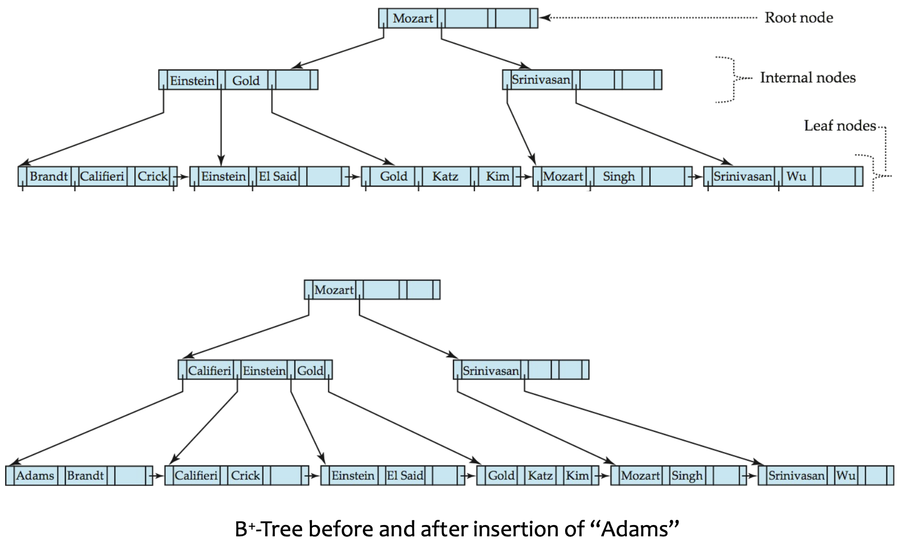</div>

**非叶节点的分裂**：

- 将新的 `(key, pointer)` 插入一个临时的内存节点中
- 将前半部分保留在原节点，后半部分移入新节点，中间的分离键推入父节点

<div style="text-align: center">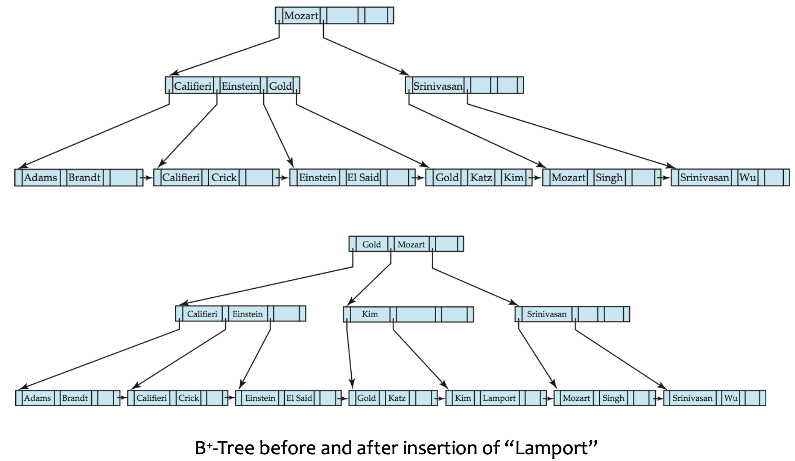</div>

### 9.3.6 Deletion

1. 找到待删除的记录，将其从主文件和桶（如果存在）中将其移除
2. 从叶节点中移除 `(search-key, pointer)`

如果节点中的条目过少：

- **合并兄弟节点**：如果该节点和兄弟节点的条目可以放入同一节点中
  - 将所有搜索键值放入左节点，并删除另一个节点
  - 从父节点中删除对应的指针对 $(K_{i-1},P_i)$，然后递归地改变上层结构
- **重新分配指针**：如果合并后放不下
  - 在该节点和兄弟节点之间重新分配条目
  - 更新父节点中对应的搜索键值
    如果删除后根节点只有一个指针：
- 删除根节点，其唯一子节点成为新的根

<div style="text-align: center">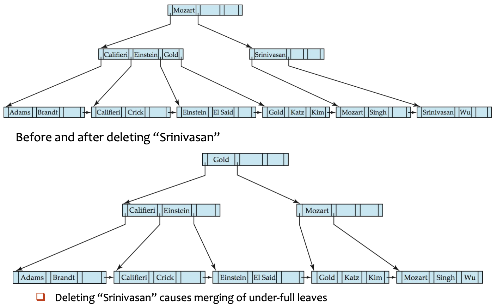</div>

### 9.3.7 File Organization

B+-树也可以直接组织数据记录，而不仅仅组织索引项。

<div style="text-align: center">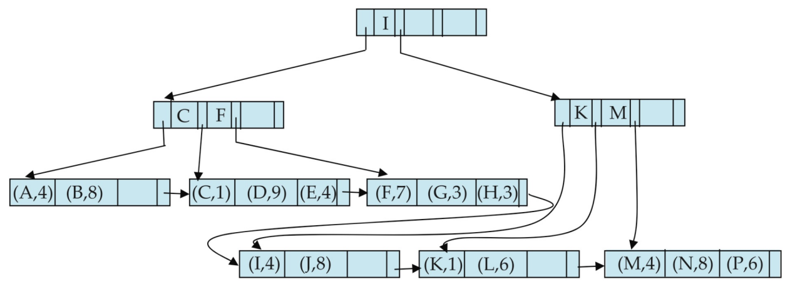</div>

- 良好的空间利用率很重要，因为数据记录比指针占用更多空间。
- 为提高利用率，分裂/合并时的重分配可以涉及更多兄弟节点。
- 涉及更多兄弟节点可以减少不必要的分裂/合并操作。

---

## 9.4 \*B Tree Index Files

$B-\text{Tree}$ 与 $B^+ - \text{Tree}$ 类似，但有一个重要区别：

- $B-\text{Tree}$ 中搜索键值只出现一次，非叶节点中的搜索键不会在叶节点中再次出现
- 因此，非叶节点中的每个搜索键需要一个额外的指针字段，指向对应的桶或文件记录。
- **所有节点都是广义的叶节点**

$B-\text{Tree}$ 索引的优点：

- 可能比对应的 B+-树使用更少的节点
- 有时在到达叶节点之前就能找到搜索键值
  $B-\text{Tree}$ 的缺点：
- 只有一小部分搜索键值能被提前找到
- 非叶节点更大，因此扇出减少
- B-树通常比对应的 B+-树更深
- 插入和删除更复杂，实现更困难

---

## 9.5 \*Static Hashing

==Bucket（桶）==是一个包含一条或多条记录的存储单元（一个桶通常是一个磁盘块）
在散列文件组织中：

- 记录的桶通过散列函数直接从其搜索键值获得
- 散列函数 $h$ 将搜索键值映射到桶地址：

$$
h: K \rightarrow B
$$

其中 $K$ 是所有搜索键值的集合，$B$ 是所有桶地址的集合

### 9.5.1 Hash Function

==Hash Function==用于：访问、插入、删除

- 具有不同搜索键值的记录可能被映射到同一个桶，因此可能需要顺序搜索整个桶

**Worst hash function**：

- 将所有搜索键值映射到同一个桶，访问时间与文件中搜索键值的数量成正比

**Ideal hash function**：

- 将搜索键值均匀分布到各个桶中。
- 每个桶接收的记录数大致相同。
- 分布应与搜索键值的实际分布无关。

**Typical hash function**：

- 基于搜索键的内部二进制表示进行计算。
- 示例：对于字符串，将各字符的二进制表示相加，然后对桶数取模。

### 9.5.2 Handling of Bucket Overflows

桶溢出可能由以下原因导致：

- 桶的数量不足
- 记录分布不均：多条记录具有相同的搜索键值；所选散列函数不够均匀
  虽然溢出概率可以降低，但无法完全消除

溢出链（Overflow chaining）

- 将某个桶的溢出桶通过链表链接在一起。
- 这种方案称为==闭散列（closed hashing）==
- 开散列不使用溢出桶，但不适用于数据库应用

### 9.5.3 Hash Indices

Hash 可用于文件组织、索引结构创建
==散列索引（Hash index）==：将搜索键及其关联的记录指针组织成散列文件结构

- 严格来说，散列索引始终是辅助索引，如果文件本身使用散列组织，则不需要使用相同搜索键的单独主散列索引
- 但在实践中 hash index 一词可能既指辅助散列索引结构，也指散列组织的文件

### 9.5.4 Deficiencies of Static Hashing

在静态散列中，$h$ 将搜索键值映射到一组固定的桶地址。

!!! bug

    - 数据库随时间增长。
        - 如果初始桶数太少，会产生大量溢出，性能下降。
    - 如果预先分配大量桶以应对未来文件大小，初期会浪费空间。
    - 如果数据库缩小，同样浪费空间。
    - 使用新散列函数进行定期重组的代价高昂。

    解决方向：使用动态散列，桶的数量可以动态调整。

---

## 9.6 \*Dynamic Hashing

动态散列适用于大小会增长和收缩的数据库,它允许动态修改散列函数。

### 9.6.1 Extendable Hashing

- Hash function 生成大范围内的值，通常是 $b$ 位整数，例如 $b=32$
- 使用散列值的前缀（前 $i$ 位，其中 $0 \leq i \leq 32$）来索引桶地址表
- 桶地址表大小：$2^i$，最初 $i=0$ 且 $i$ 随数据库的增长和收缩而增减。
- 桶地址表中的多个条目可能指向同一个桶
- 因此，实际桶数可以小于 $2^i$。

!!! info

    每个桶 $j$ 存储一个值 $i_j$：指向同一个桶的所有表条目具有相同的前 $i_j$ 位

    - $i$ 是**全局深度（global depth）**，表示桶的地址有 $i$ 位
    - $i_j$ 是桶 $j$ 的**局部深度（local depth）**，表示 bucket 中每个 entry 的前 $i_j$ 位（前缀）相同
    假设 $i=3$，有三个桶：

    ``    桶A：i_j = 2，前缀 "10"     桶B：i_j = 3，前缀 "011"     桶C：i_j = 1，前缀 "0"    ``

    映射关系：

    ```
    桶地址表（i=3，共 2^3=8 个格子）：

    索引    前缀匹配逻辑              指向
    ─────────────────────────────────────
    000     前1位是0 ✓ → 匹配桶C      → 桶C
    001     前1位是0 ✓ → 匹配桶C      → 桶C
    010     前1位是0 ✓ → 匹配桶C      → 桶C
    011     前3位是011 ✓ → 匹配桶B    → 桶B
    100     前2位是10 ✓ → 匹配桶A     → 桶A
    101     前2位是10 ✓ → 匹配桶A     → 桶A
    110     前1位是1 ✗, 前2位是10 ✗   → 无匹配（如果存在其他桶）
    111     ...
    ```

### Find

定位包含搜索键 $K_j$ 的桶：

1. 计算 $h(K_j) = X$，得到 32 位的整数
2. 使用 $X$ 的前 $i$ 个位，作为桶地址表的索引
3. 顺着该索引找到对应的桶。

### Insert

插入搜索键值为 $K_j$ 的记录：

1. 使用查找过程定位其桶
2. 如果桶中有空间，插入记录
3. 否则，分裂桶并重试插入

分裂桶 $j$：

**情况 1：$i > i_j$**（有多个表指针指向桶 $j$）

1. 分配一个新桶 $z$
2. 将 $i_j$ 和 $i_z$ 设为旧的 $i_j + 1$
3. 将指向 $j$ 的表条目的后一半改为指向 $z$
   - 原本可能 01 指向桶 X，现在 010 指向桶 X，011 指向桶 Y
4. 移除并重新插入桶 $j$ 中的每条记录
   - 根据前 $i_j+1$ 位区分放置的位置
5. 重新计算 $K_j$ 的新桶并插入记录，如果桶仍满，可能需要进一步分裂

**情况 2：$i = i_j$**（只有一个表指针指向桶 $j$）

1. 增加 $i$ 并将桶地址表大小翻倍
2. 将每个旧表条目替换为指向相同桶的两个条目
3. 重新计算 $K_j$ 的表条目
4. 此时 $i > i_j$，故应用情况 1

如果桶分裂达到最大散列前缀长度 $b$：创建溢出桶，而不是继续分裂

### Delete

删除键值：

1. 在其桶中定位
2. 将其移除
3. 如果桶变为空，可将其移除并做相应表更新
4. 可以合并桶
   - 只能与伙伴桶（buddy bucket）合并
   - 伙伴桶必须具有相同的局部深度 $i_j$ 和相同的 $(i_j - 1)$ 位前缀
5. 桶地址表大小可以减少
   - 这代价较高，仅当桶数远小于表大小时才应进行

---

## 9.7 \*Comparison of Ordered Indexing and Hashing

| 查询 / 需求    | 顺序索引      | 散列索引            |
| -------------- | ------------- | ------------------- |
| 等值查询       | 良好          | 通常更好            |
| 范围查询       | 良好          | 差                  |
| 顺序处理       | 良好          | 不适合              |
| 动态增长       | B+-树处理良好 | 动态散列处理良好    |
| 最坏情况保证   | 更好          | 可能受溢出/不均影响 |
| 需考虑的因素： |               |                     |

- 定期重组的代价。
- 插入和删除的相对频率。
- 是否应以最坏情况访问时间为代价来优化平均访问时间。
- 预期的查询类型。

---

## 9.8 Write-optimized indices

### 9.8.1 LSM Tree

==Log Structured Merge Tree（日志结构合并树）==旨在优化写密集型工作负载
仅考虑插入和查询：

- 记录首先插入内存中的树 $L_0$。
- 当内存中的树满时，记录被移动到磁盘，成为 $L_1$

  - $L_1$ 可以通过将现有 $L_1$ 树与 $L_0$ 中的记录合并，自底向上构建
  - 当 $L_1$ 超过某个阈值时，将其合并到 $L_2$
- 以此类推到更多层级， $L_{i+1}$ 的大小阈值是 $L_i$ 阈值的 $k$ 倍
- 优点：

  - 插入操作主要使用顺序 I/O
  - 叶节点是满的，避免空间浪费
  - 与普通 B+ 树相比，减少了每条插入记录的 I/O 操作次数（在一定规模内）
- 缺点：

  - 查询需要搜索多棵树
  - 每层的内容可能被整体复制多次

==步进合并索引（Stepped-merge index）==

- LSM 树的变体，每层有多棵树
- 相比 LSM 树降低了写代价
- 查询代价更高
- 布隆过滤器可以避免在大多数树中查找

LSM 中的删除：

- 通过添加特殊的删除条目来处理。
- 查找可能同时找到原始条目和删除条目；只应返回没有匹配删除条目的条目。
- 合并时，如果删除条目与原始条目匹配，二者都会被丢弃。
- 更新可以通过插入 + 删除来实现。

LSM 树适用于：

- 基于磁盘的索引
- 基于闪存的索引，因为减少了擦除操作
- 大数据存储系统，如 BigTable、Cassandra、MongoDB、LevelDB、MyRocks

### 9.8.2 Buffer Tree

核心思想：

- B+ 树的每个内部节点都有一个缓冲区用于存储插入，当缓冲区满时，插入被移动到下层
- 有了大缓冲区，每次可以将大量记录移动到下层，每条记录的 I/O 相应减少
- 优点：

  - 查询开销比 LSM 树小
  - 可用于任何树索引结构
  - 在 PostgreSQL 的 GiST 索引中使用
- 缺点：比 LSM 树有更多的随机 I/O

<div style="text-align: center">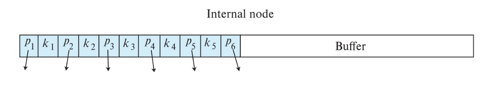</div>

---

## 9.9 Index Definition in SQL

创建索引：

```sql
CREATE INDEX <index-name> ON <table-name> (<attribute-list>);
# example
CREATE INDEX b_index ON branch(branch_name);
CREATE INDEX cust_strt_city_index ON customer(customer_city, customer_street);
```

创建唯一索引：

```sql
CREATE UNIQUE INDEX uni_acnt_index ON account(account_number);
```

- `CREATE UNIQUE INDEX` 间接指定并强制搜索键为候选键。
- 如果数据库支持 SQL 唯一完整性约束，这并非总是必要。
  删除索引：

```sql
DROP INDEX <index-name>;
```

---

## 9.10 \*Multiple-Key Access

有时查询包含多个搜索条件

```sql
SELECT account_number
FROM account
WHERE branch_name = 'Perryridge'
  AND balance = 1000;
```

使用单属性索引的可能策略：

1. 使用 `branch_name` 上的索引，找出 `Perryridge` 分行的账户，然后检查 `balance = 1000` 是否成立。
2. 使用 `balance` 上的索引，找出余额为 `1000` 的账户，然后检查 `branch_name = 'Perryridge'` 是否成立。
3. 使用两个索引分别获取两组记录指针，然后取交集

### 9.10.1 Indices on Multiple Attributes

假设在组合搜索键上建有索引：

$$
(\text{branch-name},\ \text{balance})
$$

对于：

```sql
WHERE branch_name = 'Perryridge' AND balance = 1000
```

组合索引可以直接获取同时满足两个条件的记录

它也可以高效处理：

```sql
WHERE branch_name = 'Perryridge' AND balance < 1000
```

但不能高效处理：

```sql
WHERE branch_name < 'Perryridge' AND balance = 1000
```

!!! tip "复合索引的前缀性质"

    联合索引通常对”从左到右的前缀条件”最有效。前面的属性如果不能有效缩小范围，后面的属性就难以被充分利用。

    - 组合键中的第一个属性决定了主排序。
    - 如果第一个条件是范围条件，可能会获取大量只满足第一个条件的记录。

### 9.10.2 Grid Files

网格文件用于加速**涉及比较运算符**的通用多搜索键查询

- 一个单一的网格数组
- 每个搜索键属性有一个线性刻度
- 维度数等于搜索键属性的数量
- 网格数组的多个单元格可以指向同一个桶

<div style="text-align: center">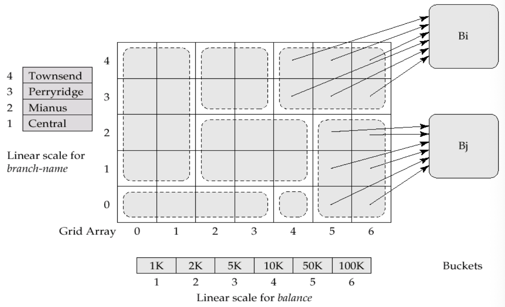</div>

查找：

- 使用线性刻度定位单元格的行和列
- 沿指针找到对应桶

插入：

- 如果桶满了且有多个单元格指向它，则创建新桶
- 这一思想类似于可扩展散列，但在多个维度上工作
- 如果只有一个单元格指向该桶：创建溢出桶，或增大网格大小

问题：

- 线性刻度必须选择得当，使记录均匀分布在各个单元格中。
- 否则可能出现过多溢出桶。
- 定期重组可能有帮助，但代价非常高。
- 网格数组的空间开销可能很大。
- R-树是一种替代方案。

### 9.10.3 Bitmap Indices

位图索引是专为多键高效查询而设计的特殊索引

- 假设：
  - 关系中的记录从 0 开始顺序编号
  - 给定记录号 $n$，应能轻松获取记录 $n$
  - 当记录为定长时尤其容易实现
- 适用属性：具有相对较少不同值的属性
- ==位图（Bitmap）==是一个位数组
- 对于属性值 $v$：
  - 每个 $v$ 有一个位图，位图的位数与记录数相同
  - 如果记录在该属性上取值为 $v$，则对应位为 1，否则为 0
- 位图索引适用于多属性查询，对单属性查询作用不大
- 查询通过位图操作来回答：
  - 交集：AND
  - 并集：OR
  - 取反：NOT

$$
100110\ \text{AND}\ 110011 = 100010
$$

$$
100110\ \text{OR}\ 110011 = 110111
$$

$$
\text{NOT}\ 100110 = 011001
$$

如果：

- 男性的位图为 `10010`
- 收入水平 $L_1$ 的位图为 `10100`
  则收入水平为 $L_1$ 的男性：

$$
10010\ \text{AND}\ 10100 = 10000
$$

优点：

- 位图索引通常远小于关系本身。
- 计数匹配元组非常快。
- 位图可以打包成机器字，一条 CPU 指令可处理 32 或 64 位。

删除与空值处理：

- 需要一个存在位图来指示有效的记录位置。
- 对于取反操作：

$$
\text{not}(A=v) = (\text{NOT bitmap-}A\text{-}v) \ \text{AND}\ \text{ExistenceBitmap}
$$

- 为正确处理 `NOT(A = v)` 的 SQL 空值语义，还需与以下位图取交集：

$$
\text{NOT bitmap-}A\text{-Null}
$$

!!! abstract "位图索引的适用场景"

    位图索引适合低基数属性、多条件组合查询和统计计数；不适合高基数属性上的普通单点查询。
