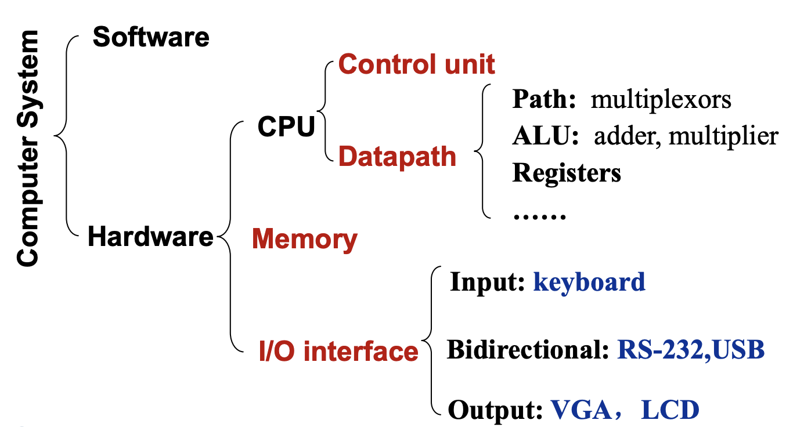

# Chap1.Computer Abstractions and Technology

!!!info Computer Organization
	

	
	- Decomposability of computer systems
## 1.1 Computer design: performance and idea
- **响应时间 / 执行时间**(response time/execution time)：执行任务所需的时间
- **吞吐率**(throughput/bandwidth)：单位时间内完成的工作量
### Relative Performance
【Definition】：

$$
\text{Performance}=\frac{1}{\text{Execution Time}}
$$

- X 的性能比 Y 快 n 倍: 

$$
\frac{\text{Performance}_X}{\text{Performance}_Y}=\frac{\text{Execution Time}_Y}{\text{Execution Time}_X}=n
$$

---
## 1.2 CPU Time

- Clock period: duration of a clock cycle
- Clock frequency (rate): cycles per second

!!!info Instruction Count and CPI

	$$ 
	\begin{aligned} \text{Clock Cycles} &= \text{Instruction Count} \times \text{Cycles per Instruction} \\ \\ \text{CPU Time} &= \text{Instruction Count} \times \text{CPI} \times \text{Clock Cycle Time} \\ &= \frac{\text{Instruction Count} \times \text{CPI}}{\text{Clock Rate}} \end{aligned} 
	$$

	To sum up,

	$$
	\text{CPU Time} = \frac{\text{Instructions}}{\text{Program}}\times\frac{\text{Clock cycles}}{\text{Instruction}}\times \frac{\text{Seconds}}{\text{Clock Cycles}}
	$$

Performance depends on
- Algorithm: affects IC, possibly CPI
- Programming language: affects IC, CPI
- Compiler: affects IC, CPI
- Instruction set architecture: affects IC, CPI, Tc (Clock Cycle Time)
**CPI in More Detail**

$$
\text{CPI}=\frac{\text{Clock Cycles}}{\text{Instruction Count}}=\sum_{i=1}^n(\text{CPI}_i\times\frac{\text{Instruction Count}_i}{\text{Instruction Count}})
$$

- CPI 的大小取决于硬件设计
- 不同的指令类别会产生不同的 CPI，所以 CPI 需要**加权计算**
---
## 1.3 Amdahl's Law
- 改善计算机的某一方面就能提升整体性能
- 阿姆达尔定律 / 边际收益递减规律：部分性能的提升对整体性能的提升是==有限==的
  
$$
T_{\text{improved}}=\frac{T_{\text{affected}}}{\text{improvement factor}}+T_{\text{unaffected}}
$$

【Corollary】：*Make the common case fast*

**MIPS: Millions of Instructions Per Second**
- Doesn’t account for
	- Differences in ISAs between computers
	- Differences in complexity between instructions
  
$$
\text{MIPS}=\frac{\text{Instruction count}}{\text{Execution time}\times 10^6}= \frac{\text{Instruction count}}{\frac{\text{Instruction count}\times \text{CPI}}{\text{Clock rate}}\times 10^6}=\frac{\text{Clock rate}}{\text{CPI}\times 10^6}
$$

## 1.4 Eight Great Ideas
- 设计紧跟**摩尔定律**(Design for Moore's Law)
	- **Moore's Law**: Integrated circuit resources double every 18-24 months.
	- Design for where it will be when finishes rather than design for where it starts.
- 采用**抽象**简化设计 (Use abstraction to simplify design)
	- 层次化、模块化的设计
- 加速大概率事件 (Make the common case fast)
- 通过**并行**提高性能 (Performance via parallelism)
- 通过**流水线**提高性能 (Performance via pipelining)
	- 每个流程同时进行，只不过每一个流程工作的对象是时间上相邻的若干产品
- 通过**预测**提高性能 (Performance via prediction)
- **存储器分层**(Hierarchy of memories)
	- Disk / Tape -> Main Memory(DRAM) -> L2-Cache(SRAM) -> L1-Cache(On-Chip) -> Registers
- 通过**冗余**提高可靠性 (Dependability via redundancy)

---
## 1.5 Unit Conversion

| 单位      | 全称       | 换算关系                                                  | 说明     |
| ------- | -------- | ----------------------------------------------------- | ------ |
| **KiB** | Kibibyte | $1\ \text{KiB} = 1024\ \text{B} = 2^{10}\ \text{B}$   | 二进制千字节 |
| **MiB** | Mebibyte | $1\ \text{MiB} = 1024\ \text{KiB} = 2^{20}\ \text{B}$ | 二进制兆字节 |
| **GiB** | Gibibyte | $1\ \text{GiB} = 1024\ \text{MiB} = 2^{30}\ \text{B}$ | 二进制吉字节 |

| 单位 | 全称 | 换算关系 | 说明 |
|------|------|----------|------|
| **KB** | Kilobyte | $1\ \text{KB} = 1000\ \text{B} = 10^3\ \text{B}$ | 十进制千字节 |
| **MB** | Megabyte | $1\ \text{MB} = 1000\ \text{KB} = 10^6\ \text{B}$ | 十进制兆字节 |
| **GB** | Gigabyte | $1\ \text{GB} = 1000\ \text{MB} = 10^9\ \text{B}$ | 十进制吉字节 |
