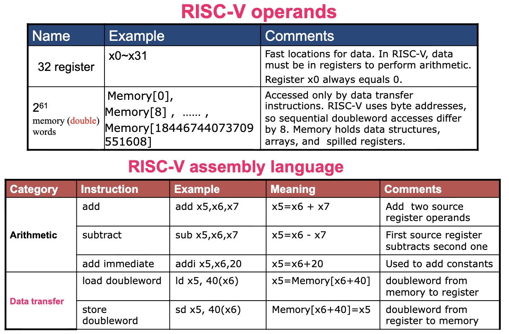
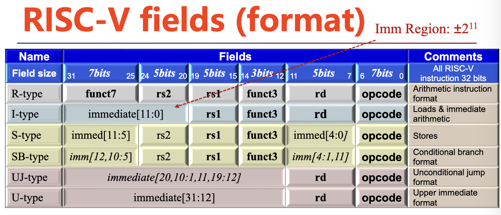
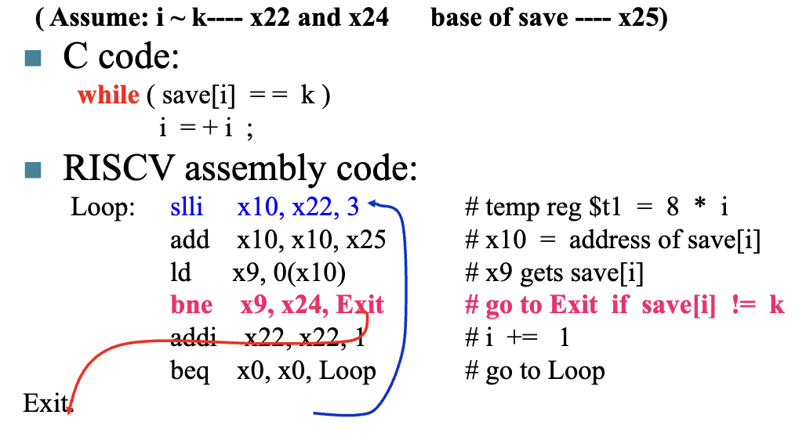
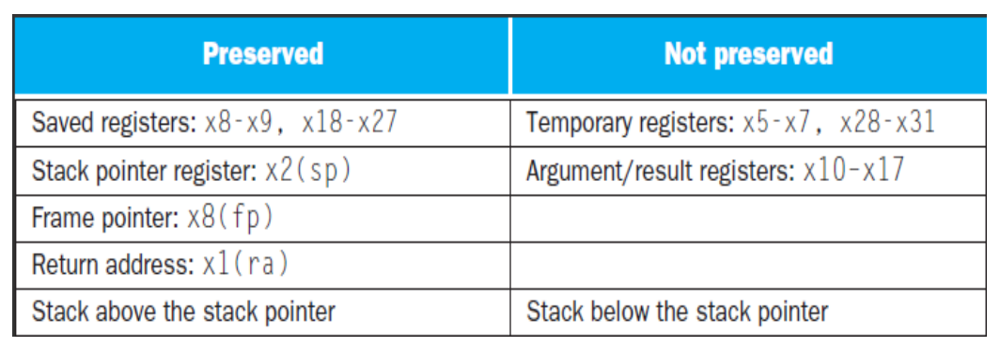
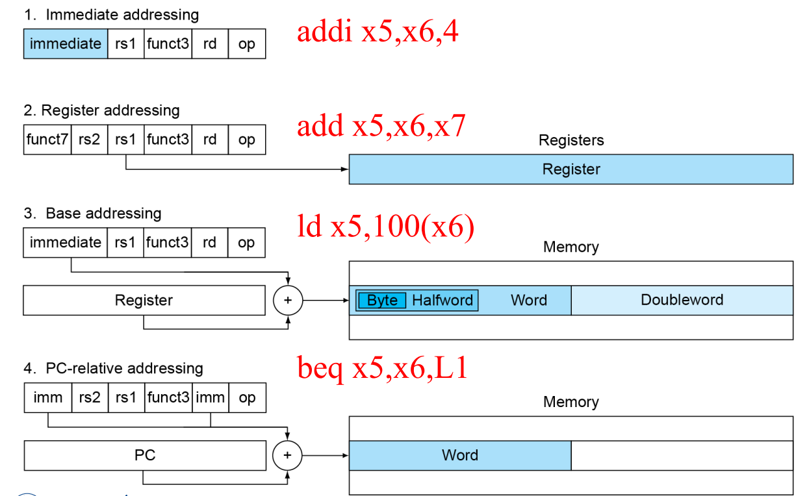

# Chap2.Language of the Machine

## 2.1 Introduction

**Language of the machine**

- Instructions → Word  
- Instruction set → Vocabulary  

**Instruction formats**

<div style="text-align: center"></div>

- Type of internal storage in <u>processor</u>  
- The number of memory operands in the instruction  

---
## 2.2 Arithmetic Operations

- Only one operation per instruction  
- Add and subtract, three operands (two sources and one destination)  
	- `add a,b,c // a gets b + c`  
此处简单略过，下面有具体介绍  

---
## 2.3 Operands

RISC-V has a 32 × **64-bit register** file（32 个 64 bit 的寄存器）

- Used for frequently accessed data  
- 64-bit data is called a "doubleword"  
	- 32 × 64-bit general purpose registers x0 to x31  
- 32-bit data is called a **"word"**

### 1. RISC-V Registers

==寄存器（register）==：CPU 用来暂存指令、数据、地址的内部存储器，可被简单理解为 CPU 的全局变量  
- 寄存器存储空间有限，大规模数据存储在计算机的内存（memory）中  

| Name    | Register Name | Usage                         | Preserved On Call? |
| ------- | ------------- | ----------------------------- | ------------------ |
| x0      | 0             | The constant value 0          | n.a.               |
| x1(ra)  | 1             | Return address(link register) | yes                |
| x2(sp)  | 2             | Stack pointer                 | yes                |
| x3(gp)  | 3             | Global pointer                | yes                |
| x4(tp)  | 4             | Thread pointer                | yes                |
| x5-x7   | 5-7           | Temporaries 临时寄存器        | no                 |
| x8-x9   | 8-9           | Saved 保存寄存器              | yes                |
| x10-x17 | 10-17         | Arguments/results             | no                 |
| x18-x27 | 18-27         | Saved 保存寄存器              | yes                |
| x28-x31 | 28-31         | Temporaries 临时寄存器        | no                 |

**Preserved on call**（调用时保留）是函数调用约定中的一个核心概念。它规定了在进行函数调用时，<u>哪些寄存器的值必须由被调用的函数负责恢复到调用前的状态</u>。

!!! note "Register vs. Memory"
    - Registers are faster to access than memory  
    - Operating on memory data requires loads and stores  
    	- More instructions to be executed  
    - Compiler must use registers for variables as much as possible  
    	- Only spill to memory for less frequently used variables  
    	- Register optimization is important!

### 2. Memory Operands 

**Main memory used for composite data**

- 主内存用于复合数据  
- Arrays, structures, dynamic data   

**To apply arithmetic operations**

- Load values from memory into registers   
- Store result from register to memory   

**Memory is byte addressed**

- Each address identifies an ==8-bit byte==   

**RISC-V is Little Endian**

- 当计算机从 0x1000 这个地址读出一个 doubleword 时，实际读取的是 0x1000~0x1007 这 8 个字节，并将 0x1000 存入低位  

!!! info "Endianness"
	<div style="text-align: center"></div> 

	- Little Endian: 低位字节存储在低地址  
	- Big Endian: 低位字节存储在高地址  

**RISC-V does not require words to be aligned in memory**

!!! info "Memory Alignment"
	<div style="text-align: center"></div>
    
    - Unlike some other ISAs  
    - 读取速度更快&内存占用更多  

### 3. Brief Summary

<div style="text-align: center"></div>

---
## 2.4 Signed and unsigned numbers

### 1. Unsigned Binary Integers

$$
x = x_{n-1}2^{n-1}+x_{n-2}2^{n-2}+\dots+x_12^1+x_02^0
$$

- Range：$0$ to $+ 2^n-1$

### 2. Signed Binary Integers

**2s-Complement Signed Integers**

- 正数的补码是它本身  
- 负数的补码是<u>源码取反+1（第一位作符号位）</u>  

Bit 63 is **sign bit 符号位**

- 1 for negative numbers  
- 0 for non-negative numbers  

Bit Extension：

- 当将一个数扩展到更多位时，**在高位（左边）填充与原符号位相同的值**  

---
## 2.5 Representing Instructions

Instructions are encoded in binary 

- Called ==machine code==  

### 1. R-Format Instructions 
- **寄存器-寄存器格式**：主要用于*算数*（add, sub, and, or, xor...）  
<div style="text-align: center"></div>

Instruction fields

- rs1: the first source register number  
- rs2: the second source register number   
- rd: destination register number（存放结果）  
- opcode: 操作码，定义指令的基本类别  
- funct3: 3-bit function code (additional opcode)  
- funct7: 7-bit function code (additional opcode)  

==根据 opcode、funct3、funct7 确定具体操作，从 rs1、rs2 读取操作数，将结果写入 rd==  

### 2. I-Format Instructions
- **立即数格式**：*寄存器与常数的算术和逻辑运算*以及 *load 指令*  
<div style="text-align: center"></div> 

- rs1: source or base address register number  
   - 对于 `addi` 类指令，它是第一个操作数；对于 `lw` 类指令，它是基地址   
- rd: destination register number（存放结果）  
- immediate: 12-bit constant operand, or offset added to base address  
   - 2 s-complement, sign extended  

==根据 opcode、funct3 确定具体操作，从 rs1 读取值，并和 immediate 计算，将结果写入 rd==  

### 3. S-Format Instructions
- **存储格式**：用于*存储*操作，即将寄存器中的数据写入到内存中  
<div style="text-align: center"></div> 

Different immediate format for store instructions

- rs1（基址寄存器）: **base address** register number  
- rs2（源操作数寄存器）: **source** operand register number  
- immediate（立即数偏移量）: **offset** added to base address  
	- Split so that rs1 and rs2 fields always in the same place  

==根据 opcode、funct3 确定具体操作，读取 rs2 中存储的值，存入 rs1 + immediate 指向的地址==  

!!! note
	<div style="text-align: center"></div>

---
## 2.6 Logical Operations

**Shift Operations**

- `sll, srl, slli, srli`  
<div style="text-align: center"></div> 

immed: 偏移量  

- Shift left logical  
	- Shift left and fill with 0 bits  
	- `slli` by $i$ bits ：multiplies by $2^i$  
- Shift right logical  
	- Shift right and fill with 0 bits  
	- `srli` by $i$ bits ：divides by $2^i$ (unsigned only)  

==根据 opcode、funct3、funct7 确定具体操作，从 rs1、immed 读取值，将结果写入 rd==  

**And Operations, Or Operations, Xor Operation, etc...**

!!! note "RISC-V operands"
	<div style="text-align: center"></div>

---
## 2.7 Instructions for making decisions

**Branch instructions**  
- Branch to a labeled instruction if a condition is true  
- Otherwise, continue sequentially  

**常见指令**：

- `beq rs1, rs2, L1` // if (rs1 == rs2) branch to instruction labeled L1  
- `bne rs1, rs2, L1 ` // if (rs1 != rs2) branch to instruction labeled L1  
- `blt rs1, rs2, L1` // if (rs1 < rs2) branch to instruction labeled L1  
- `bge rs1, rs2, L1 ` // if (rs1 >= rs2) branch to instruction labeled L  

!!! note
	Signed comparision: `blt`, `bge`  
	Unsigned comparison: `bltu`, `bgeu`  

| If                                                                          | If-then-else                                                                |
| --------------------------------------------------------------------------- | --------------------------------------------------------------------------- |
| <div style="text-align: center"></div> | <div style="text-align: center"></div> |
| **LOOPs**                                                                   | **While**                                                                   |
| <div style="text-align: center"></div> | <div style="text-align: center"></div> |

**Hold out Case/Switch** 

- Compiling a switch using <u>jump address table</u>  

!!! example
	 Assume: f~k -- x20~x25，x5 contains 4/8  
	 ```c
	 switch(k){
	 	case 0: f = i + j; break; 
	 	case 1: f = g + h; break;
	 	case 2: f = g - h; break;
	 	case 3: f = i - j; break;
	 }
	 ```
	 如下图，根据 k 跳转到对应情况：  
	 <div style="text-align: center"></div> 
	 最终流程：  
	 <div style="text-align: center"></div> 
	
   - `jalr x1, 0(x7)` 表示跳转到 `x7` 指向的地址，并把返回地址存入 `x1`  
	 - `jalr x0, 0(x1)` 相当于返回，因为它把 `x1` 中的地址作为跳转目标，而 `x1` 是之前 `jalr` 保存的返回地址  

---
## 2.8 Supporting Procedures

Procedure/function be used to structure programs  

- 一个存储的子程序能够根据提供的参数执行特定任务  
	- 程序更容易理解，并允许代码重用  

实现过程分为六个步骤：  
1. **传递参数**：将参数放在子程序可以访问的位置  
2. **转移控制权**：跳转到子程序的起始地址  
3. **获取资源**：为子程序分配所需的存储资源（如栈空间）  
4. **执行任务**：执行子程序所需的功能或计算  
5. **返回结果**：将结果存放到调用程序能够访问的位置（如寄存器或内存）  
6. **返回控制权**：将控制权返回到调用点（即原程序继续执行的位置）  

### 1. Procedure Call Instructions

#### **Instruction for procedures**: <u>jal</u> (jump-and-link) 

==Caller==：<u>jal rd, ProcedureAddress</u> 

- `rd`: 目标寄存器 (Destination Register)，用于存储返回地址  
- `ProcedureAddress`: 要跳转到的目标地址（立即数偏移）  
	- 是一个**有符号的立即数偏移量 (signed immediate offset)**  
	- `imm[0]` 被省略了（隐含为 0），所以实际的偏移量是 `imm << 1`  
	- 目标地址 = PC + (sign_extend(ProcedureAddress) << 1)  

实际操作：  
```c
rd = PC + 4 
PC = PC + sign_extend(imm[20] | imm[10:1] | imm[11] | imm[19:12] << 1)
```
1. **保存返回地址**：将下一条指令的地址（当前 PC 值 + 4）写入寄存器 `rd`  
2. **跳转**：将程序计数器 (PC) 更新为计算出的目标地址  

#### **Procedure return**: <u>jalr</u> (jump and link register)  
==Callee==：<u>jalr x0, 0(x1)</u> 

- Like jal, but jumps to *0+address* in x1  
- Use x0 as rd (x0 cannot be changed)  
- Can also be used for computed jumps (for case/switch statements)  

**实际操作**：  
1. **获取返回地址**：CPU 从 `x1` 寄存器中读取地址（即 `jal` 指令之前保存的返回地址）  
2. **跳转**：CPU 将程序计数器（PC）设置为 `x1` 中的地址，从而跳转回调用者  
3. **特殊处理**：`x0` 是固定为 0 的特殊寄存器，`jalr` 指令将 `x0` 作为目标寄存器，意味着它不会改变任何寄存器的值，但仍然可以完成跳转  

### 2. Using More Registers

**More Registers for procedure calling**  

- a0 ~ a7(x10-x17): 参数寄存器  
	- 用于传递函数的**参数**（arguments）和**返回值**（return values）  
- ra/x1：返回地址寄存器  
	- 保存当前函数调用后需要返回的地址（即调用点）  

**Stack**  

- ideal data structure for spilling registers  
	- Push, pop  
	- Stack pointer(sp)  
- 在RISC-V中，`sp` 是 `x2` 寄存器  

临时寄存器&保留寄存器：  
<div style="text-align: center"></div> 

**Stack grow from higher address to lower**  
在 RISC-V 中，栈是*向下生长*的  

- Push: 先 `sp = sp - 8`，然后写入数据  
- Pop: 先读取数据，然后 `sp = sp + 8`  

!!! example
    C code:
    ```c
    long long int leaf_example(
    	long long int g, long long int h,
    	long long int i, long long int j){
    		 long long int f;
    		 f = (g + h) - (i + j);
    		 return f;
    }
    ```
    
    RISC-V code:
    ```nasm
    addi sp, sp - 24        # adjust stack to make room for 3 items
    sd   x5, 16(sp)         # These three instructions save three
    sd   x6,  8(sp)         # register x5,x6,x20
    sd   x20, 0(sp)         # Let's consider why it need to be done.
    add  x5,  x10, x11      # register x5 contains g + h 
    add  x6,  x12, x1       # register x6 contains i + j 
    sub  x20, x5, x6        # f = x5 - x6, which is (g + h) - (i + j) 
    addi x10, x20, 0        # copy f to return register (x10 = x20 + 0)
    ld   x20, 0(sp)         # restore register x20 for caller 
    ld   x6,  8(sp)         # restore register x6 for caller 
    ld   x5, 16(sp)         # restore register x5 for caller 
    addi sp,  sp+24         # adjust stack to delete 3 items 
    jalr x0,  0(x1)         # jump back to calling routine
    ```
    但这种方式并不高效，可采用多种寄存器提高效率 

    - t0 ~ t6: 7 temporary registers, by the callee not preserved  
    - s0 ~ s11: 12 saved registers, must be preserved If used  
    
**Calling convention（调用约定）** 

- Caller 负责保存临时寄存器（temporary registers）  
	- 如 t0~t6 & a0 ~ a7 —— 参数/返回值寄存器  
	- caller 在调用函数前如果要把重要数据放在 t0 或 a0 等寄存器里，必须**自己先保存它们到栈上**，因为被调用函数（callee）可以自由使用这些寄存器而不必恢复它们  
- Callee（被调用者）负责保存“被调用者保存”的寄存器  
	- s0~s11 —— saved registers  
	- ra（x1）—— 返回地址寄存器  
	- 函数（callee）如果要使用 s0~s11 中的任意寄存器，或者函数会再次调用别的函数（从而改变 ra），必须：  
		1. 在函数开始时将这些寄存器的原始值**压入栈**  
		2. 使用完毕后，在返回前从栈中**恢复它们**  

### 3. Nested Procedures

假设某个程序调用过程 A，过程 A 又调用过程 B。由于只有一个寄存器 `x1` 用于保存返回地址，而 A 和 B 都需要用到 `x1`，此时通过利用栈解决冲突：  

- 在调用过程 B 之前先将`x1`的值压入栈内，这样就保存了 A 的返回地址。现在`x1`就可以用来存储过程 B 的返回地址  
- 过程 A 返回前，从栈中取回 `x1` 原来的值（A 的返回地址）  

C Code  
```c
int fact(int n)
{
	if (n < 1) return (1);
		else return (n * fact(n - 1));
}
```

RISC-V assembly code  
!!! example
    ```nasm
    fact: 
    	  addi sp, sp, -16  # adjust stack for 2 items 
    	  sd   ra, 8(sp)    # save the return address: x1 
    	  sd   a0, 0(sp)    # save the argument n: x10 
    	  addi t0, a0, -1   # x5 = n - 1 
    	  bge  t0, x0, L1   # if n >= 1, go to L1 (else) 
    	  addi a0, x0, 1    # return 1 if n < 1 
    	  addi sp, sp, 16   # recover sp (Why not recover x1 and x10?) 
    	  jalr x0, 0(ra)    # return to caller 
    	  
    L1:   
    	  addi a0, a0, -1   # n >= 1: argument gets (n - 1) 
    	  jal  ra, fact     # call fact with (n - 1) 
    	  add  t1, a0, x0   # move result of fact(n-1) to x6(t1) 
    	  ld   a0, 0(sp)    # return from jal: restore argument n 
    	  ld   ra, 8(sp)    # restore the return address 
    	  addi sp, sp, 16   # adjust stack pointer to pop 2 items 
    	  mul  a0, a0, t1   # return n * fact(n - 1) 
    	  jalr x0, 0(ra)    # return to the caller
    ```

### 4. Memory Layout

!!! note
    <div style="text-align: center"></div> 

**Text**  
• 存储机器指令，即编译后的可执行代码   
• 通常只读，防止程序意外修改自身指令   
• PC（程序计数器）指向当前执行的指令地址  

**Static data**  
• 包含全局变量、常量数组和字符串等  
- C语言中对应static变量和const声明的内容   
• x3寄存器（全局指针）初始化为该段起始地址，允许通过±偏移访问其中数据  

**Dynamic data**（动态数据 - 堆）  
• 运行时动态分配的内存  
• 图中显示位于栈下方，与栈形成上下增长的结构  

**Stack**（栈 - 自动存储）  
• 存储局部变量、函数参数和返回地址等自动变量   
• 栈向低地址方向生长（向下增长），SP（栈指针）指示当前栈顶位置   
• 函数调用时自动压入栈帧，返回时弹出，实现自动内存管理  

## 2.9 Communicating with People 

### 1. Character Data

Byte-encoded character sets 

- ASCII ( American Standard Code for Information Interchange )  
	- 128 characters：95 graphic, 33 control  
- Latin-1: 256 characters  
	- ASCII, +96 more graphic characters  

Unicode: 32-bit character set  

- Used in Java, C++ wide characters, …  
- Most of the world’s alphabets, plus symbols  
- UTF-8, UTF-16: variable-length encodings  

### 2. Byte/Halfword/Word Operations

**Load byte/halfword/word**: Sign extend to 64 bits in rd  

- `lb rd, offset(rs1)`, `lh rd, offset(rs1) `, `lw rd, offset(rs1)`  
- 如果最高位为1（负数），则高位补1；如果为0，则高位补0  

**Load byte/halfword/word unsigned**: 0 extend to 64 bits in rd  

- `lbu rd, offset(rs1)`, `lhu rd, offset(rs1)`, `lwu rd, offset(rs1) `  
- 补 0 拓展  

**Store byte/halfword/word**: Store rightmost 8/16/32 bits  

- `sb rs2, offset(rs1)`, 存低 8 位  
- `sh rs2, offset(rs1)`, 存低 16 位  
- `sw rs2, offset(rs1)`, 存低 32 位  

!!! example
    C code
    ```c
    void strcpy(char x[], char y[]) { 
    	int i = 0; 
    	while (y[i] != '\0') { 
    		x[i] = y[i]; 
    		i++; 
    	} 
    	x[i] = '\0'; 
    }
    ```
    RISC-V
    ```nasm
    strcpy:
    	addi sp,  sp, -8   # adjust stack for 1 doubleword
    	sd   x19, 0(sp)    # save x19 (s3)
    	add  x19, x0, x0   # i = 0
    L1:
    	add  x5,  x19, x11 # x5 = address of y[i]
    	lbu  x6,  0(x5)    # x6 = y[i] (unsigned byte load)
    	add  x7,  x19, x10 # x7 = address of x[i]
    	sb   x6,  0(x7)    # x[i] = y[i]
    	beq  x6,  x0,  L2  # if y[i] == 0 then exit
    	addi x19, x19, 1   # i = i + 1
    	jal  x0,  L1       # next iteration of loop
    L2:
    	ld   x19, 0(sp)    # restore saved old s3
    	addi sp,  sp, 8    # pop 1 double word from stack
    	jalr zero, 0(x1)   # return to caller
    ```

## 2.10 Addressing for 32-Bit Immediate and Addresses

!!! note
    <div style="text-align: center"></div> 
    
    - `lui` （Load Upper Immediate）：  
      将 20 位的立即数加载到寄存器的高 20 位，并将寄存器的低 12 位清零  

### 1. 32-bit Constants

- 32-bit 的常数无法直接直接用 12 位立即数表示，需要通过多步操作表示  

!!! example
    <div style="text-align: center"></div> 
    
    - 2304 的二进制数为 1001 0000 0000，由于最高位为 1，会被识别为负数，因此 $s3+2304 \Rightarrow s3-1792$，可通过再加上 $4096(2^{12})$ 来修正  

### 2. Branch Addressing

分支指令包含：  

- 操作码（Opcode）  
- 两个寄存器（rs1, rs2）  
- 目标地址（通过偏移量计算）  

分支目标的特点  

- 大多数分支目标位于当前指令附近  
- 可以是向前跳转（forward）或向后跳转（backward）  
- 使用 PC 相对寻址方式，提高效率  

!!! example
    <div style="text-align: center"></div> 
    
    - 立即数由多个字段拼接而成：这些字段在指令中不是连续的，需要**重新组合**  
    - 偏移量 = 立即数 × 2  
    	- 因为 RISC-V 指令是 32 位对齐，每条指令占 4 字节  

!!! note
    RISC-V 使用“半字（halfword）”为单位来表示偏移量  

    - `bne x10, x11, 2000` 中的 2000 并不是指 2000 个字节，而是 2000 个“半字”，即 1/2 个 double word  

### 3. Jump Addressing

- Jump and link（jal）  
	- 采用 20 bit 的立即数来扩大跳转范围  
- UJ format：  
<div style="text-align: center"></div> 
 
- 对于更远的转跳  
	- 使用 `lui` 加载高 20 位地址到临时寄存器  
	- 使用 `jalr` 将低 12 位地址与临时寄存器相加并跳转  

```python
lui  x1, 0x12345 # 加载高 20 位地址 
jalr x0, 0(x1) # 跳转到 x1 + 0
```

!!! note "Show branch offset in machine language"
    C code
    ```c
    while(save[i] == k){
    	i = i + 1
    }
    ```
    RISC-V code
    ```nasm
    Loop: slli x10, x22, 3
    	   add  x10, x10, x25
    	   ld   x9,  0(x10)
    	   bne  x9,  x24, Exit
    	   addi x22, x22, 1
    	   beq  x0,  x0,  Loop
    Exit:
    ```
    <div style="text-align: center"></div> 
    
    - All RISC-V instructions are 4 bytes long  
    - PC-relative addressing refers to the number of halfwords  

### 4. While branch target is far away

> 插入无条件跳转  

#### Step1：反转条件判断 

- 原始分支：`beq x10, x0, L1`  
    → 若 `x10 == 0`，则跳转到 L1  
- 改写为：`bne x10, x0, L2`  
    → 若 `x10 != 0`，则跳转到 L2（即“跳过”原目标）  

#### Step2 ：添加无条件跳转 

- 在 L2 处插入：`jal x0, L1`  
    → 无论条件如何，都跳转到 L1  

!!! example
    ```nasm
    beq  x10, x0, L1     # 原始分支（假设太远）
    ```
    - jal 使用 20 位立即数，可扩大跳转范围  
    ```nasm
    bne  x10, x0, L2     # 如果 x10 ≠ 0，则跳过 jal（不跳转到 L1）
    jal  x0,  L1         # 否则，无条件跳转到 L1
    L2:
    ```

### 5. Summary

- 总结了各种指令的形式  

!!! summary
    RISC-V Instruction Format and Their Operands  
    <div style="text-align: center"></div>
    
    RISC-V Addressing Summary  
    - 多种不同的寻址形式一般统称为 **寻址模式**（addressing mode）  
     <div style="text-align: center"></div>

---
## 2.11 Synchronization in RISC-V

### Load Reserved

```nasm
lr.d rd, (rs1)
```

- **功能**：  
    - 从 `rs1` 指向的内存地址加载数据到寄存器 `rd`。  
    - 同时在该内存地址上“**保留一个独占访问权**”（reservation），即标记该地址为当前处理器正在尝试修改的状态  
- **关键点**：    
    - 保留是硬件层面的，其他处理器**不能**对该地址进行写操作  
    - 不是原子读写，而是“**预准备阶段**”，为后续的条件写入做准备  

### Store Conditional 

```nasm
sc.d rd, (rs1), rs2
```

- **功能**：  
    - 尝试将寄存器 `rs2` 中的数据写入 `rs1` 指向的内存地址。  
    - 写入是否成功取决于：**自上次 `lr.d` 操作以来，该内存地址是否被其他处理器修改过**  
		- **成功（未被修改）**：`rd` 寄存器返回 `0`（表示成功）。  
		- **失败（已被修改）**：`rd` 返回一个**非零值**（通常为1或特定错误码），表示冲突发生  

!!! example
    #### atomic swap（原子交换）
    ```nasm
    again:  lr.d  x10, (x20)        // 从内存地址 x20 加载数据到 x10，并保留该地址
            sc.d  x11, (x20), x23   // 尝试将 x23 写入 x20，结果存入 x11
            bne   x11, x0, again    // 如果写失败（x11 ≠ 0），跳转回 again 重试
            addi  x23, x10, 0       // x23 = x10（即加载的旧值）
    ```
    这个操作的作用是：**返回旧值**，实现了“原子交换”——即“读取旧值 + 写入新值”  
    
    #### lock （获取锁）
    
    ```nasm
            addi  x12, x0, 1          // x12 = 1 （准备上锁）
    again:  lr.d  x10, (x20)         // 读取锁变量（并保留）
            bne   x10, x0, again     // 如果锁已被占用（x10 ≠ 0），循环等待
            sc.d  x11, (x20), x12    // 尝试将 1 写入锁变量
            bne   x11, x0, again     // 如果失败，重试
    ```
    
    - `addi x12, x0, 1`  
        → 设置要写入的值为 `1`（表示“已上锁”）    
    - `lr.d x10, (x20)`  
        → 读取锁变量的当前值，同时建立保留  
    - `bne x10, x0, again`  
        → 如果锁变量不为 0（已被占用），就跳转回去重试，直到它为 0  
    - `sc.d x11, (x20), x12`  
        → 尝试将 `1` 写入锁变量。如果自 `lr.d` 以来没有被改写，则成功；否则失败  
    - `bne x11, x0, again`  
        → 如果失败（如其他线程抢到了锁），就重试整个过程  
        
    只有当锁为空（0）且没有其他处理器干扰时，才能成功将锁设为 1，从而获得锁  
    
    #### Unlock（释放锁）
    ```nasm
    sd    x0, 0(x20)         // 写入 0 到锁变量，释放锁
    ```
    
    - `sd x0, 0(x20)`  
        → 将寄存器 `x0`（值为 0）写入地址 `x20`，表示解锁  

## 2.12 Translating and starting a program

<div style="text-align: center"></div>

### Producing an Object Module

- Assembler (or compiler) translates program into **machine instructions**  
	- 输出结果是一个**目标文件（Object File）**，也叫**目标模块（Object Module）**  
	- 这个文件不是可以直接运行的程序，而是中间产物，需要后续链接才能变成可执行程序  
- Provides information for building a complete program from the pieces  
	- 目标模块不仅包含机器码，还提供了**辅助信息**，帮助链接器（Linker）把多个模块拼接成完整程序  

| 组件                  | 作用                                                  |
| ------------------- | --------------------------------------------------- |
| Header              | 描述目标模块的整体内容，比如：模块大小、段（segment）数量、入口点等               |
| Text segment        | **已翻译的机器指令**（即程序代码）                                 |
| Static data segment | 存放**程序运行期间不会改变的数据**，如全局变量                           |
| Relocation info     | 提供关于哪些地址需要在链接时进行调整的信息                               |
| Symbol table        | 记录程序中定义的**全局变量、函数名**（符号）及其地址；对外部符号的引用               |
| Debug info          | 包含源代码与机器码之间的映射关系（如行号、变量名），供调试器（如GDB）使用，以便在调试时显示原始代码 |

### Linker

- Object modules(including library routine) → executable program  

过程：  
1. Place code and data modules symbolically in  
 
	- 分配虚拟地址空间，规划布局  
2. Determine the addresses of data and instruction labels  

	- 确定最终地址   
3. Patch both the internal and external references (Address of invoke)  

	- 把原来占位符或相对地址替换为真实的绝对地址  

<div style="text-align: center"></div>

- 经链接器加工后，最终生成一个可执行文件 (executable file)，它与目标文件的区别在于后者存在不确定 (unresolved) 的引用  

### Loader

将可执行文件放入内存或磁盘中，工作流程为：  
1. 读取可执行文件头，得到文本段和数据段的大小  
2. 创建一个指向足够容纳文本和数据的空间的地址  
3. 将可执行文件的指令和数据拷贝到内存中  
4. 将主程序的参数（如果有的话）放入栈中  
5. 对寄存器进行初始化操作，并将栈指针指向第一个空闲的位置上  
6. 跳转到启动例程，将参数拷贝到参数寄存器中，并调用程序的主例程。让主例程返回时，启动例程中止整个程序，附带 `exit` 系统调用  

### Dynamic Linking

前面介绍的链接方法属于**静态链接**，虽然它能快速调用库函数，但它具有以下缺陷：不能及时更新库函数，且会一次性加载所有库函数。因此通常会更多地使用**动态链接库**(dynamically linked libraries, DLL)，它可以在程序**运行时**被链接到程序里。  

#### 懒过程链接(lazy procedure linkage)

- 它能保证只有当程序调用库函数时，对应的库才会被链接到程序里  

<div style="text-align: center"></div>

---
## 2.13 A C Sort Example To Put it All Together

Three general steps for translating C procedures 

- Allocate registers to program variables  
- Produce code for the body of the procedures  
- Preserve registers across the procedures invocation  

!!! example "Swap"
    ```nasm
    swap: slli x6, x11, 3  // x6 = k * 8
    	  add  x6, x10, x6 // x6 = v + ( k * 8 )
    	  ld   x5, 0(x6)   // x5 ← v[ k ]
    	  ld   x7, 8(x6)   // x7 ← v[ k + 1 ]
    	  sd   x7, 0(x6)   // v[k+1] → v[ k ]
    	  sd   x5, 8(x6)   // v[k] → v[ k + 1 ]
    	  
    	  jalr x0, 0(x1)   // return to calling routine
    ```

---
## 2.14 Arrays versus Pointers

Array indexing involves 

- Multiplying index by element size  
- Adding to array base address  

Pointers correspond directly to memory  

- addresses  
- Can avoid indexing complexity  

!!! example
    指针是可以改变的，但是数组首地址不能改变，因此翻译成汇编的结果也有所不同  
    <div style="text-align: center"></div>

!!! info "RISC-V 指令大全"
    <div style="text-align: center"></div>