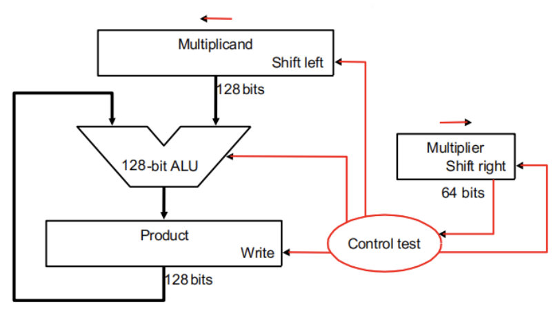

# Chap3.Arithmetic for Computer
> [!note]
> 考试的时候 $1\text{ word}=32\text{bit}$ !！
## 3.1 Signed and Unsigned Numbers
**Number systems**

 **Signed Number Representation**
 采用补码
 - 正数的补码是它本身
 - 负数的补码是它的绝对值<u>各位取反再加 1</u>，并确保最高位是 1
> [!example]
> $100=-4,101=-3,110=-2,111=-1,000=0,001=1,010=2,011=3$
> 即 n-bit 的数可以表示的范围是 $-2^{n-1}$~$2^{n-1}-1$

---
## 3.2 Addition, subtraction and ALU
### 1. Overflow
- General overflow conditions

- 对于**无符号数**，将“溢出”看作**进位**(carry) 或**借位**(borrow)，计算机会将其视为一般情况而不做特殊处理
- 对于**符号数**，有以下应对**溢出**的处理方式：
    - ALU 检测到溢出问题
    - 处理器会抛出**异常(exception)** 或**中断 (interrupt)**，将指令地址保存在特定的寄存器 EPC 上
    - 跳转到操作系统的特定例程：纠正程序、返回错误代码、或者中止程序
### 2. Constructing an ALU
#### A 1-bit ALU
> 注：中间这个圆角矩形代表多路选择器，Operation 表示选择输入

#### A 64-bit ALU
> [!Ripple carry adder]
> 

#### Fast adders
- Carry look-ahead adder (CLA)
	- Calculating the carries before the sum is ready
- Carry skip adder
	- Accelerating the carry calculation by skipping some blocks
- Carry select adder
	- Calculate two results and use the correct one

---
## 3.3 Multiplication
- 如果当前乘数 (multiplier) 位置上的数字为 $1$，那么就将被乘数 (multiplicand)（乘积就是被乘数）复制到正确的位置上（因为乘数数位每上升一位，这个乘积就要往右移一位）
- 如果数字为 $0$，那么就将 $0$ 放在正确的位置上
- 如果被乘数为 $n$ 位，乘数为 $m$ 位，那么乘积的位数最多为 $n+m$ 位
### 1. Multipliers
#### 1.1 Multiplier V1
> [!Diagram]
> 

> 
> - 其中乘数寄存器是 64 位，被乘数寄存器、ALU、乘积寄存器都是 128 位
> - 在每一步的计算后，被乘数都需要向左移一位。因此在 64 次计算后，64 位的被乘数被移动了 64 位，所以被乘数寄存器需要 128 位

#### 1.2 Multiplier V2
- 改进方案：不移动被乘数，改为**移动乘积**
> [!Diagram]
> 

> 
> - 被乘数寄存器和 ALU 可以只用 64 位，而乘积寄存器需要扩展到 128+1 位
> 	- 寄存器多出的 1 位用来存储进位
> - 此时的中间计算就是 64 位加法运算，有效提升了乘法运算速度

####  1.3 Multiplier V3
V2 的问题
 - 初始状态下，乘积寄存器只有左半边保存数值，右半边在刚开始没有什么意义，乘积寄存器的**空间利用率太低**
 - 每一趟循环中，乘数寄存器和乘积寄存器都需要往右移 1 位
> [!Diagram]
> 

> 
> Solution:**将乘数放在乘积寄存器的右半边**
> - 每一趟循环中，乘积寄存器里的所有位整体向右移一位，中间结果和乘数同时向右移一位。这样做的好处在于：
> 	  - 节省存储空间：少用一个 64 位的寄存器
> 	  - 加快运算速度：每趟循环中少了一次右移操作，提升了速度

### 2. Signed multiplication
基础的解决方法：
- 先存储两个操作数的符号位
- 将这两个操作数暂时转化为无符号数（令它们的最高位为 0）
- 执行乘法运算
- 对两个符号位进行异或运算，得到乘积符号位（相同为 0，不同为 1）
#### Booth Algorithm
- An improved method
> [!Examples]
> 

> 
> - Less additions and More shifts
> 
> **原理**：乘数中存在一连串 "1" 的部分（形如 `00..00111..1100..000`）
> - 假设连续的 $1$ 出现在第 $i$ 位和第 $j$ 位之间（包括这两位）
> - 转为形如 $1000...000 - 100...00$ 的减法（前者为 $i+1$ 位，后者为 $j$ 位）
>   
> 结果：
> - less addition and more shifts
> - 这样乘数与被乘数相乘，分别对应一个加法和一个减法，原本 $O(n)$ 次加法运算降为 $O(1)$ 次

计算机通过判别相邻两位的数字来判断：
- $10$：发现（可能）一连串 $1$ 的开端（低位），做**减法**
- $11、00$：移位
- $01$：发现（可能）一连串 $1$ 的末端（高位），做**加法**
- 预留一个 $-1$ 位且初始化为 $\text{Bit}_{−1}=0$，便于最低位的判别
	- 当进行右移运算时，原本最右边的数保留在 $-1$ 位上，直至下一次右移运算

> [!Example]
> - Booth 算法可用上述的乘法器来实现
> - Booth 算法可以用于处理负数的乘法，且无需改变规则
> 

### 3. Faster Multiplication
**Unrolls the loop**
- 另一种方法是**提升加法的速度**，利用大量的 ALU 分层进行加法运算。

- 对于 64 位乘法，第 1 层用到 32 个 ALU，每个 ALU 计算相邻 2 位的乘数分别与被乘数的乘积之和；得到的 32 个和在第二层的 16 个 ALU 中再一次汇总，最终得到总和
- 原本需要 64 次的加法时间，就缩短到 $log_2​(64)=6$ 次
> [!Multiplications in RISC-V]
> - `mul rd, rs1, rs2`：64 位乘法，`rd`保存 128 位乘积的低 64 位
> - `mulh rd, rs1, rs2`：64 位乘法，`rd`保存 128 位**符号数**之间的乘积的高 64 位
> - `mulhu rd, rs1, rs2`：64 位乘法，`rd`保存 128 位**无符号数**之间的乘积的高 64 位
> - `mulhsu rd, rs1, rs2`：64 位乘法，`rd`保存 128 位**无符号数与符号数**的乘积的高 64 位

---
## 3.4 Division
### 1. Divisions
#### 1.1 Division V1
> [!Examples]
> 

> 
> - Component：
>   - 128 位除数 (divisor) 寄存器：初始状态下，64 位的除数被存储在除数寄存器的**左半边**
>    - 64 位商 (quotient) 寄存器
>    - 128 位余数 (remainder) 寄存器：初始状态下，64 位的**被除数**(dividend) 被存储在余数寄存器的**右半边**（从低位开始存储）
>    - 128 位 ALU
>    - 控制器
> - Steps：
> 1. 用余数寄存器的值减去除数寄存器的值，并将结果放在余数寄存器
> 2. 将商寄存器里的值左移一位，然后检查余数寄存器内的值
>    - 若其值 ≥0（看符号位（最高位）的数字），则将商寄存器最右端的位设成 1
>    - 若其值 <0，则将除数寄存器的值加到余数寄存器的值以撤销上一步的减法操作，并将商寄存器最右端的位设成 0
> 3. 将除数寄存器的值右移一位
> 4. 如果上面的步骤已经重复了**65 次**，中止整个流程，否则返回第一步

#### 1.2 Division V3
> [!Examples]
> 

> 
> 计算步骤为（仍是以 64 位除法器为例）：
>  1. 将**被除数**放在余数寄存器的右半边，然后将余数寄存器左移一位
>  2. ALU 计算（余数寄存器的高 64 位 - 除数寄存器），将结果放在与余数寄存器的高 64 位上
>     - 如果计算结果 >0，余数寄存器左移一位，将 1 放入余数寄存器的最右端
>     - 如果计算结果 <0，则加上除数以撤销前面的减法操作，然后余数寄存器左移一位，将 0 放入余数寄存器的最右端
>  3. 若第 2 步已经执行过 64 次，则结束循环，否则继续执行第 2 步
>  4. 将余数寄存器的左半边右移一位，此时左半边存的是余数，右半边存的是商

### 2. Signed Division
1. 先将被除数和除数的符号位提取出来
2. 然后计算无符号除法
3. 最后根据两个符号位决定商的符号位
	- 如果两者相同，商的符号位为 0，否则为 1。

余数的值遵循以下规则：
- 余数的符号位同被除数的符号位
- 余数的绝对值不超过除数的绝对值

### 3. Fast Division
- RISC-V 会忽视除法运算过程中出现的溢出和除以 0 的问题，一般由软件决定怎么处置这两类异常情况
> [!Divisions in RISC-V]
> - `div rd, rs1, rs2`：`rd`保存符号数除法的商
> - `divu rd, rs1, rs2`：`rd` 保存无符号数除法的商
> - `rem rd, rs1, rs2`：`rd`保存符号数除法的余数
> - `remu rd, rs1, rs2`：`rd` 保存无符号数除法的余数

---
## 3.5 Floating point numbers
### 1. Standardised format IEEE 754
浮点数表示法由三部分组成：符号 $S$、**指数**(exponent)$E$、**尾数**(fraction)$F$。其中指数和尾数分别指定了浮点数的范围和精度。用符号化的语言可以将浮点数表示为：
$$
x = (-1)^s \times (1+\text{Fraction}) \times 2^{\text{Exponent}-\text{Bias}}
$$
- $S$ (1 bit) 代表==符号位 (sign bit)==, $0$ 为表示非负数, $1$ 为表示负数
- 有效位数 ($\text{Significand}=1+\text{Fraction}$) 中 $1$ 是默认的，只存储小数点后面的位数 (即 Fraction)
> [!Note]
> 单精度（float）
> 

> 
> - 指数取值范围为 $[−126,127]$（最低的 $-127$ 和最高的 $128$ 被保留了无法使用）
> - 表示范围为 $(-2.0\times 2^{127},2.0 \times 2^{127})$
>   
>  双精度（double）
> 

> 
> - 指数取值范围为 $[−1022,1023]$（最低的 $-1023$ 和最高的 $1024$ 无法使用）
> - 表示范围为 $(-2.0\times 2^{1023},2.0 \times 2^{1023})$

-  **Fraction** 代表==尾数==部分 (也称作**mantissa**)
    - Single: 23 bits & Double: 52 bits
-  **Exponent** 表示==指数==部分 (也称作**characteristic**)
    - Single: 8 bits & Double: 11 bits
    - **excess representation**(偏移表示法) 
	    - $\text{Exponent }= \text{actual exponent} +\text{bias}$
        - Single:  bias = 127 bits & Double:  bias = 1023 bits
    - 指数为全 $0$ 和全 $1$ 时保留，用作**特殊值**处理

**Infinites and NaNs**
- $\text{Exponent}=111\dots1,\text{Fraction}=000\dots0$
	- $\pm \infty$
- $\text{Exponent}=111\dots1,\text{Fraction}\ne000\dots0$
	- Not-a-Number (NaN)
	- Indicates illegal or undefined result
> [!info] 异常情况的处理
> **NaN**(Not a Number)：表示**未定义的**(undefined) 或**非法的**(illegal) 结果
> - 任何涉及 NaN 的运算结果
> - 不定式（无穷之间的运算、无穷与 0 的运算）：
> 	- 除法运算：$0/0$、$\infty / \infty$、$\infty / (-\infty)$、$(-\infty) / \infty$、$(-\infty) / (-\infty)$
> 	- 求余运算：任意值 % $0$、$\infty$ % 任意值
> 	- 乘法运算：$0\times \infty$、$0 \times -\infty$
> 	- 加法运算：$\infty+(-\infty)$、$(-\infty)+\infty$
> 	- 减法运算：$\infty-\infty$、$(-\infty)-(-\infty)$
> 	- 指数运算：$0^0$、$\infty^0$、$1^{\infty}$、$\infty^{-\infty}$
> - 产生复数结果或无意义的实数运算
>   
> 在 IEEE 754 标准下，非零数除以 0 的结果被定义为 $\infty$ 或 $-\infty$
### 2. Floating point addition
1. **对齐**(alignment)：比较两个数的指数部分，将**指数较小的数**的尾数部分往右移，直到两个数指数部分相同
	- 这样可以减小截断误差
2. **相加**(addition)：将两个数的有效数字 (significand) 相加
3. **规范化**(normalization)：使结果规范化
    > 注：前往下一步之前要判断数字是否溢出，如果是的话抛出异常，否则继续
4. **舍入**(rounding)：如果舍入后结果变得不规范，则需要返回到第 3 步再做调整，否则的话计算完成
> [!流程图]
> 

### 3. Floating point multiplication
1. Add exponents：将两个带偏移量的指数相加，并减去多算的一个 bias
2. Multiply the significands：有效位数相乘
3. Normalise：如有必要，使乘积规范化
4. Over-underflow：如果有溢出，抛出异常并中止程序，否则继续下一步
5. Rounding：对有效数字四舍五入，如果结果不规范，需要回到第 3 步再次调整，否则继续下一步
6. Sign：如果两个操作数的符号位相同，乘积的符号位为正；否则乘积的符号位为负

### 4. Accurate Arithmetic 
为了提高舍入的精度，IEEE 754 标准规定为浮点数额外添加低 2 位，从左到右分别称为==guard==和==round==，这两位数字保留了浮点数计算的中间过程
> 还可以再额外添加第 3 位，称为**sticky**

- **Units in the last place** (ulp，最低有效位单位): The number of bits in error in the least significant bits of the significant between the actual number and the number that can be represented.
> [!Note]
>  Ulp：**在某个数值附近，浮点数格式所能表示的最小变化量**
> - 假设只能表示到小数点后两位（如 0.01 精度）：
> - 想要表示 0.123。
> - 最接近的可表示数是 0.12 或 0.13
> 	- 则ulp = 0.01（因为最后一位是百分之一位）。
> - 0.123 和 0.12 的误差是 0.003，也就是 0.3 ulp
> ulp 不是直接的绝对误差，而是一个**相对精度的度量**
> 
> 
> 

IEEE 754 标准提供了四种舍入模式 (rounding mode)：
- Always round up 向上取整
- Always round down 向下取整
- Truncate 截断取整
- Round to nearest even 舍入至最近的偶数

