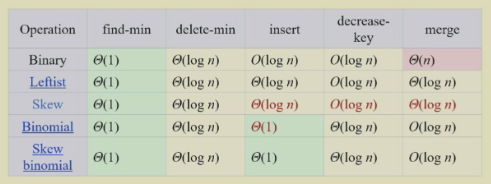

# Binomial Queue
## 5.1 Definition
> [!Note]
> <div style="text-align: center"></div>
> 
> - 红色是 amortized time

==二项队列(binomial queue)== 不是单个的满足堆序（即根节点的值是整棵树的最值）的树，而是一个满足堆序的树的集合，即**森林**(forest)；其中每棵满足堆序的树被称为==二项树(binomial tree)==
- 高度为 0 的二项树是一棵单节点的树
- 高度为 $k$ 的二项树 $B_k$ 由两棵高度为 $k-1$ 的二项树 $B_{k-1}$ 构成，且其中一棵树附着在另一棵树的根节点上
<div style="text-align: center">
    
</div>
**性质**：
- $B_k$ 的根节点有 $k$ 个孩子，分别为 $B_0, B_1, \dots, B_{k-1}$
- $B_k$ 一共有 $2^k$ 个节点
- 深度为 $d$ 的一层上有 $\begin{pmatrix}k \\ d \end{pmatrix}$ 个节点
> [!note] 可以用二项堆唯一表示任意大小（节点个数）的堆
> - 用一个**二进制数**表示二项堆，二项树 $B_k$ 用于表示第 $k$ 位上的数
> - 如果第 $k$ 位为0，表明二项堆中没有二项树 $B_k$；若为1，则 $B_k$ 存在
> <div style="text-align: center"></div>    
> - 在一个二项队列中，在偶数深度的节点数**不小于**在奇数深度的节点数（假定根节点的深度为0）

---
## 5.2 Operations
> [!caution]
> 合并两个堆为一个更大的堆时，选择**根较小的那个堆的根**作为新构成的堆的根
> - 确保 result root 为堆的最小值
### 1. FindMin
- 二项堆中的最小元素位于<u>其中一棵二项树的根节点</u>
- 二项堆至多有 $\lceil \log N \rceil$ 个根节点 $\Rightarrow$ 时间复杂度 $T_p = O(\log N)$
- 可以让程序存储最小值并随时更新，**时间复杂度降为** $O(1)$ 
### 2. Merge
- 本质上是一个二进制加法：
	- 将二项堆内的树按**高度**排列
	- 从最小的二项树开始合并相同规模的二项树（从低位到高位）
		- 根节点大的树附加在根节点小的树上
    - 合并得到的新的二项树可能会被再次合并（进位）   
- 时间复杂度：$T_p = O(\log N)$
<div style="text-align: center"></div>  
### 3. Insert
- 插入是一种特殊的合并操作 
- 用二进制表示二项堆，若最小的非零位为 $B_i$，那么时间复杂度为 $T_p = \text{Const} \cdot (i + 1)$
- 对空的二项堆执行 $N$ 次插入操作，最坏情况下时间复杂度为 $O(N)$，因此**平均**时间为**常数**

> [!Example]
> 将 1,2,3,4,5,6,7 一共7个节点插入空的二项堆内：
> <div style="text-align: center"></div> 

### 4. DeleteMin
**Steps**：
1. `FindMin` （找到最小值）$\Rightarrow\ O(\log N)$
2. 将 $B_k$ 从二项堆 $H$ 中移除，剩下的二项堆记作 $H'$ $\Rightarrow\ O(1)$
3. 将 $B_k$ 的根节点从 $B_k$ 中移除，留下二项树 $B_0, \dots, B_{k-1}$，记作 $H''$ $\Rightarrow\ O(\log N)$
4. 合并 $H'$ 和 $H''$，即 `Merge(H', H'')` $\Rightarrow\ O(\log N)$

---
## 5.3 Implementation
-  $\text{Binomial queue }=\text{ array of binomial trees}$

|     操作      | 性质        | 解决方案                                                            |
| :---------: | :-------- | :-------------------------------------------------------------- |
| `DeleteMin` | 快速找到所有的子树 | 所有子树的根节点存在数组中（索引为树高）<br>并使用**Left-child-next-sibling**（链表）维护二项树 |
|   `Merge`   | 孩子需按大小排序  | 新的树是最大的树，因此按**降序**维护子树                                          |

<div style="text-align: center">
    
</div>  

### Code Implementation   
- 声明部分
```c
typedef struct BinNode * Position;
typedef struct Collection * BinQueue;
typedef struct BinNode * BinTree;

struct BinNode {
    ElementType Element;
    Position    LeftChild;
    Position    NextSibling;
};

struct Collection {
    int     CurrentSize; // total number of nodes
    BinTree TheTrees[MaxTrees];
}
```

- 合并树
```c
BinTree CombineTrees(BinTree T1, BinTree T2) {
    // merge equal-sized T1 and T2
    if (T1->Element > T2->Element)
        // attach the larger one to the smaller one
        return CombineTrees(T2, T1);
    // insert T2 to the front of the children list of T1
    T2->NextSibling = T1->LeftChild;
    T1->LeftChild = T2;
    return T1;
}
// Time Complexity: O(1)
```

- 合并堆
```c
BinQueue Merge(BinQueue H1, BinQueue H2) {
    BinTree T1, T2, Carry = NULL;
    int i, j;
    if (H1->CurrentSize + H2->CurrentSize > Capacity)
        ErrorMessage();
    H1->CurrentSize += H2->CurrentSize;
    for (i = 0, j = 1; j <= H1->CurrentSize; i++, j*=2) {
        T1 = H1->TheTrees[i];
        T2 = H2->TheTrees[i]; // current trees
        // assign each digit to a tree:
        // | Carry | T2 | T1 |
        switch (4 * !!Carry + 2 * !!T2 + !!T1) {
            case 0:  // 000
            case 1:  // 001
                break;
            case 2:  // 010
                H1->TheTrees[i] = T2;
                H2->TheTrees[i] = NULL;
                break;
            case 4:  // 100
                H1->TheTrees[i] = Carry;
                Carry = NULL;
                break;
            case 3:  // 011
                Carry = CombineTrees(T1, T2);
                H1->TheTrees[i] = H2->TheTrees[i] = NULL;
                break;
            case 5:  // 101
                Carry = CombineTrees(T1, Carry);
                H1->TheTrees[i] = NULL;
                break;
            case 6:  // 110
                Carry = CombineTrees(T2, Carry);
                H2->TheTrees[i] = NULL;
                break;
            case 7:  // 111
                H1->TheTrees[i] = Carry;
                Carry = CombineTrees(T1, T2);
                H2->TheTrees[i] = NULL;
                break;
        } // end switch
    }  // end for-loop
    return H1;
}
```

- 删除元素
```c
ElementType DeleteMin(BinQueue H) {
    BinQueue DeletedQueue;
    Position DeletedTree, OldRoot;
    // the minimum item to be returned
    ElementType MinItem = Infinity;
    // MinTree is the index of the tree with the minimum item
    int i, j, MinTree;

    if (IsEmpty(H)) {
        PrintErrorMessage();
        return -Infinity;
    }

    // Step 1: find the minimum item
    // MaxTrees can be replaced by the actual number of roots
    for (i = 0; i < MaxTrees; i++) {
        if (H->TheTrees[i] && H->TheTrees[i]->Element < MinItem) {
            MinItem = H->TheTrees[i]->Element;
            MinTree = i;
        } // end if
    } // end for-i-loop
    DeletedTree = H->TheTrees[MinTree];

    // Step 2: remove the MinTree form H => H' 
    H->TheTrees[MinTree] = NULL;

    // Step 3.1: remove the root
    OldRoot = DeletedTree;
    DeletedTree = DeletedTree->LeftChild;
    free(OldRoot);
    // Step 3.2: create H
    DeletedQueue = Initialize();
    DeletedQueue->CurrentSize = (1 << MinTree) - 1; // 2^MinTree - 1
    for (j = MinTree - 1; j >= 0; j--) {
        DeletedQueue->TheTrees[j] = DeletedTree;
        DeletedTree = DeletedTree->NextSibling;
        DeletedQueue->TheTrees[j]->NextSibling = NULL; 
    } // end for-j-loop
    H->CurrentSize -= DeletedQueue->CurrentSize + 1;

    // Step 4: merge H' and H
    H = Merge(H, DeletedQueue);
    return MinItem;
}
```

- 插入元素
```c
BinQueue Insert(ElementType X, BinQueue H) {
    BinTree Carry; 
    int i; 

    H->CurrentSize++;
    Carry = malloc(sizeof(struct BinNode));
    Carry->Element = X;
    Carry->LeftChild = Carry->NextSibling = NULL;

    i = 0;
    while (H->TheTrees[i]) { 
        Carry = CombineTrees(Carry, H->TheTrees[i]); 
        //combine two equal-sized trees
        H->TheTrees[i++] = NULL;
    }

    H->TheTrees[i] = Carry;
    return H;
}
```

- 查找元素
```c
BinTree Find(BinQueue H, ElementType X)
{
    BinTree T, result = NULL;
    int i, j; 

    for(i = 0, j = 1; j <= H->CurrentSize; i++, j *= 2) {  
    /* for each tree in H */
        T = H->TheTrees[i];
        if (X >= T->Element){  /* if need to search inside this tree */
            result = Recur_Find(T, X);
            if (result != NULL) return result;
        } 
    }
    return result;
}
BinTree Recur_Find(BinTree T, ElementType X)
{
    BinTree result = NULL;
    if (X == T->Element) 
        return T;
    if (T->LeftChild != NULL){
        result = Recur_Find(T->LeftChild, X);
        if (result != NULL) 
            return result;
    } 
    if (T->NextSibling != NULL)
        result = Recur_Find(T->NextSibling, X);
    return result;
}
```
---

## 5.4 Analysis
- 通过 N 次连续插入来创建一个有 N 个元素的二项堆所需要的时间为 $O(N)$

> [!note] 法1：聚合(aggregate)分析法
> | 序号      | 二项堆                        | 操作        |
> | :------ | :------------------------- | :-------- |
> | 0001(1) | $\quad\ \quad\ \quad\ B_0$ | 插入1次      |
> | 0010(2) | $\quad\ \quad\ B_1$        | 插入1次，合并1次 |
> | 0011(3) | $\quad\ \quad\ B_1\ B_0$   | 插入1次      |
> | 0100(4) | $\quad\ B_2$               | 插入1次，合并2次 |
> | 0101(5) | $\quad\ B_2\ \quad\ B_0$   | 插入1次      |
> | 0110(6) | $\quad\ B_2\ B_1$          | 插入1次，合并1次 |
> | 0111(7) | $\quad\ B_2\ B_1\ B_0$     | 插入1次      |
> | 1000(8) | $B_3$                      | 插入1次，合并3次 |
> | 1001(9) | $B_3\ \quad\ \quad\ B_0$   | 插入1次      |
> | ...     | ...                        | ...       |
> 
> 可以总结以下规律：
> - 每一步都有“插入1次”的操作
> - 从低到高第 $i$ 位，每插入 $2^i$ 次，比特位翻转 $1$ 次 $\Rightarrow$ 对应 $1$ 次合并
> 
> 我们规定一次插入消耗的成本(cost)为“1个时间单元 + 合并时额外产生的时间单元（不是每次插入都有）”，这个成本对应的就是二进制数的比特翻转
> 
> 插入N个元素对应的值为N，它的二进制位数为$\lfloor \log N \rfloor + 1$，因此N次插入所需时间即为所有成本之和：
> 
>    $$ N + \dfrac{N}{2} + \dfrac{N}{4} + \dots + \dfrac{N}{2^{\lfloor \log N \rfloor + 1}}$$
> 
> 当$N \rightarrow \infty$时，该值趋近$2N$，因此总体时间复杂度为$O(N)$

> [! note] 法2：势能分析法
> 如果某次操作花费的成本为 $c$，则对应<u> 1 次插入</u>以及 <u> c-1 次合并(减少 c-2 颗树)</u>
> - 令 $C_i$ 为第 $i$ 次插入所耗费的成本
> - 令 $\Phi_i$ 为 $i$ 次插入后二项堆内树的棵数（$\Phi_0 = 0$）
> 
> 满足下列关系：        $$
>         C_i + (\Phi_i - \Phi_{i-1}) = 2 \quad \text{for all } i = 1, 2, \dots, N
>         $$累加得：
>         $$
>         \sum\limits_{i=1}^N C_i + \Phi_N - \Phi_0 = 2N
>         $$
> 所以：
>        $$
>          \sum_{i=1}^{N} C_i  = 2N - \Phi_N \le 2N = O(N)
>         $$
> 因此尽管最坏情况下插入的时间复杂度 $T_{\text{worst}} = O(\log N)$，但摊还时间复杂度 $T_{\text{amortized}} = 2$
> 
